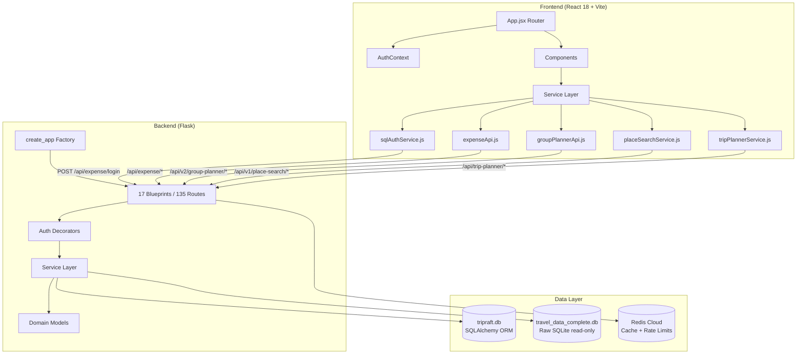
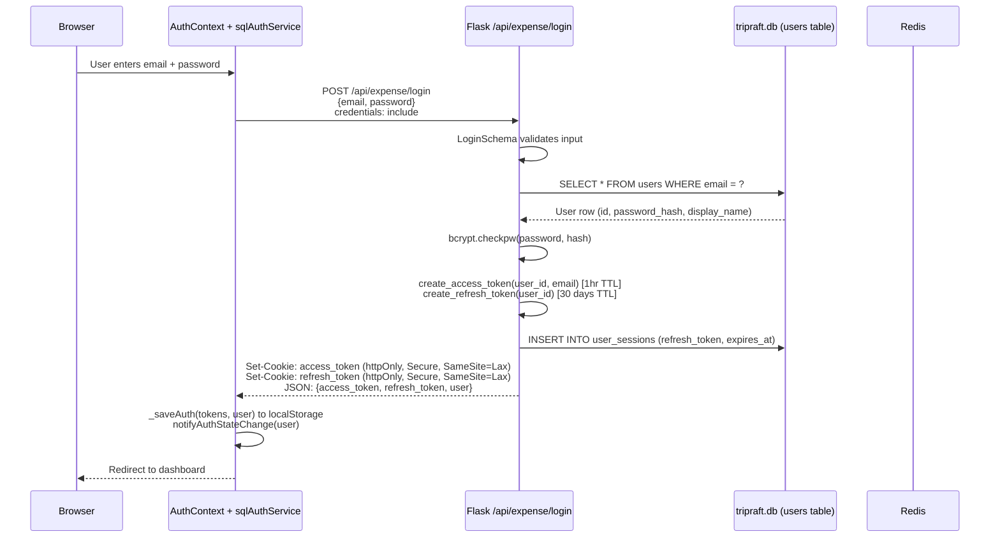
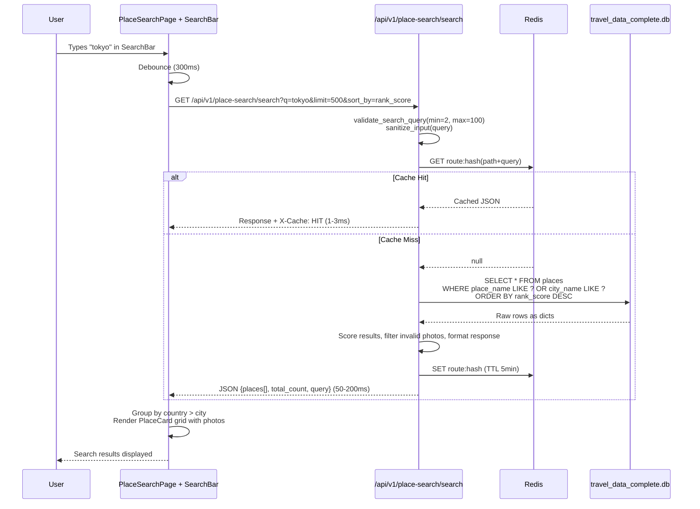
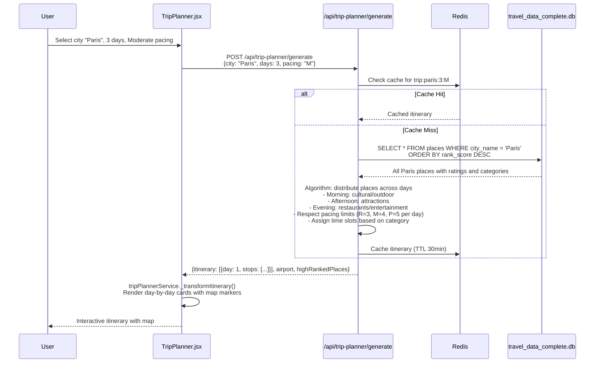
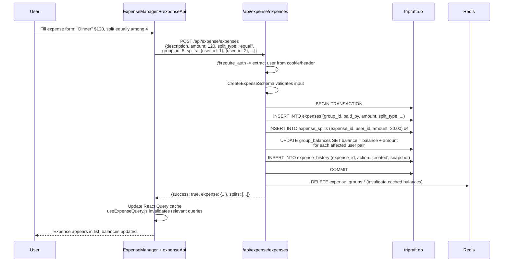
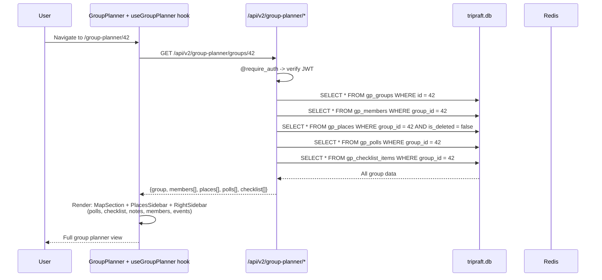
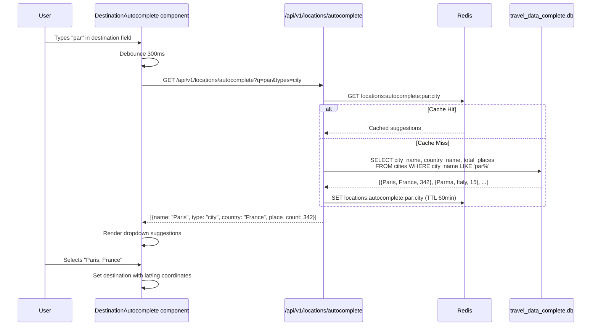
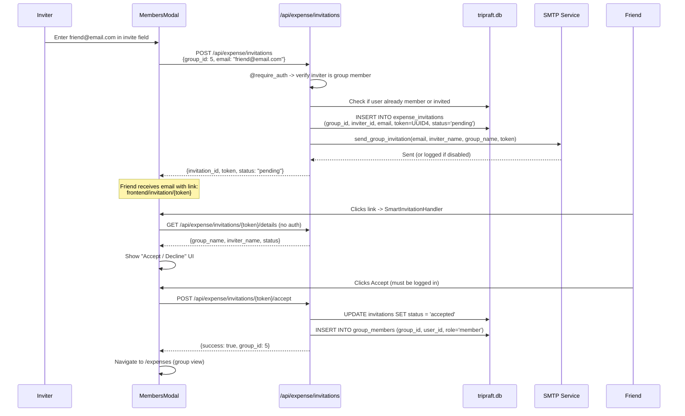
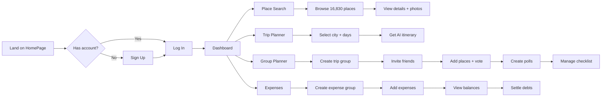

# TripRaft -- Product Overview

TripRaft is an AI-powered group travel planning and expense management platform. This document explains every live feature, how the frontend and backend connect for each one, which databases and cache layers are involved, and what the complete request lifecycle looks like.

---

## Tech Stack

| Layer | Technology | Role |
|-------|-----------|------|
| Frontend | React 18, Vite 5, React Router 7 | SPA with hot-reload dev server |
| State | React Query 5, Context API | Server cache + global auth state |
| UI | CSS Modules, Lucide icons, Leaflet maps, Recharts | Styling and visualization |
| Backend | Python 3.11, Flask | REST API with factory pattern |
| ORM | SQLAlchemy | App database access (tripraft.db) |
| App Database | SQLite (tripraft.db) | Users, expenses, groups, settlements |
| Travel Database | SQLite (travel_data_complete.db) | 16,830 places, 82 countries, 888 cities |
| Cache | Redis Cloud (30MB free tier) | Response caching, rate limiter state |
| Auth | PyJWT, bcrypt | JWT access/refresh tokens, httpOnly cookies |
| Email | SMTP (Gmail) | Invitation and password reset emails |
| Compression | Flask-Compress | Gzip responses over 500 bytes |
| Validation | Marshmallow + Pydantic | Input validation across all endpoints |

---

## System Overview

---

## Feature 1: Authentication

Users register and log in with email/password. The backend issues JWT tokens delivered as httpOnly cookies (primary) with Bearer header fallback.

### How It Works End-to-End

**Frontend:** `sqlAuthService.js` manages all auth state. On load, `_loadStoredAuth()` checks localStorage for existing tokens. `onAuthStateChanged()` verifies tokens with backend via `GET /api/expense/me`. Token refresh uses a lock (`_isRefreshing`) to prevent concurrent refresh race conditions.

**Backend:** Two auth systems coexist:
- `AuthService` (expense engine) -- direct ORM queries for `/api/expense/*` routes
- `UserService` (v1 users) -- repository pattern for `/api/v1/users/*` routes
- Firebase fallback exists for legacy clients (`_verify_firebase_token()`)

**Database:** `users` table (SQLAlchemy ORM) stores email, bcrypt password_hash, display_name, photo_url, phone, default_currency, timestamps. `user_sessions` table tracks refresh tokens with device_info and expiry.

**Cache:** No Redis caching on auth endpoints. Rate limiter (5/minute on login) uses Redis for state storage.

### Token Lifecycle

| Token | TTL | Storage | Refresh |
|-------|-----|---------|---------|
| Access token | 1 hour | httpOnly cookie + Bearer header | Auto-refresh when < 60s remaining |
| Refresh token | 30 days | httpOnly cookie + localStorage | New pair issued on refresh |

Frontend `getIdToken()` decodes the JWT payload client-side, checks `exp`, and auto-refreshes if expiring within 60 seconds.

---

## Feature 2: Place Search

A public (no auth required) search engine across 16,830 curated tourist places. Users search, filter, sort, and view detailed place information.

### How It Works End-to-End

**Frontend:** `placeSearchService.js` makes direct `fetch()` calls (no auth needed). `PlaceSearchPage.jsx` manages search state, filter panel (cost, rating, sort), and results display. `PlaceCard.jsx` renders individual cards with photos, rating bars, category tags. `PlaceDetailModal.jsx` shows expanded details with map (Leaflet).

**Backend:** `place_search_service.py` queries `travel_data_complete.db` via raw `sqlite3`. The `@cache_response(key_prefix='places', ttl=300)` decorator on the route handles Redis caching automatically. Search supports LIKE matching on place_name, city_name, country_name, and tags.

**Database:** `travel_data_complete.db` (read-only, raw sqlite3 -- NOT SQLAlchemy). Tables: `countries` (82), `states`, `cities` (888), `places` (16,830). Each place has: place_name, city_name, country_name, lat/lng, rating, category, tags, summary, photo_url, rank_score, cost_indicator, best_time_to_visit.

**Cache:** Redis caches search results with 5-minute TTL. Cache key is MD5 hash of path + query string. Hit rate: ~97%. Autocomplete also cached at 5-minute TTL.

### Additional Endpoints

| Endpoint | Purpose | Cache TTL |
|----------|---------|-----------|
| `GET /api/v1/place-search/autocomplete?q=` | Type-ahead suggestions | 5 min |
| `GET /api/v1/place-search/place/<id>` | Single place details | 5 min |
| `GET /api/v1/place-search/stats` | DB statistics (total places, countries) | 30 min |

---

## Feature 3: Trip Planner

Generates multi-day AI-powered itineraries from the travel database. Users pick a city, set the number of days and pacing, and get a complete day-by-day plan.

### How It Works End-to-End

**Frontend:** `tripPlannerService.js` uses `apiClient` (centralized fetch wrapper) for API calls. `TripPlanner.jsx` (2,547 lines of CSS alone) renders the full planner UI with city search, pacing selector, and day-by-day itinerary cards. Each stop shows time, place name, description, category, and rating.

**Backend:** `trips.py` blueprint handles route. The trip generation algorithm queries all places for the selected city, scores them by `rank_score`, then distributes them across days respecting the pacing limit. It also finds the nearest airport and identifies sunrise/sunset-worthy places.

**Database:** Reads from `travel_data_complete.db` only. No writes to any database.

**Cache:** Redis caches generated itineraries. Each unique combination of city + days + pacing gets its own cache key.

---

## Feature 4: Expense Engine

Full group expense tracking with multi-currency support, 4 split modes, balance calculation, debt simplification, and settlement tracking.

### How It Works End-to-End (Creating an Expense)

**Frontend:** `expenseApi.js` is the singleton service class. `ExpenseManager.jsx` is the main component (1,416 lines of CSS). `useExpenseQuery.js` (1,556 lines) wraps all expense operations in React Query hooks with optimistic updates. The mega-bootstrap endpoint (`GET /api/expense/mega-bootstrap`) loads all user data in a single API call on page load.

**Backend:** 6 blueprints handle expense routes:
- `auth.py` -- `/api/expense/login`, `/api/expense/signup`, `/api/expense/me`
- `expense_groups.py` -- `/api/expense/groups`, `/api/expense/groups/<id>/full`
- `expenses.py` -- `/api/expense/expenses`, `/api/expense/expenses/<id>/history`
- `settlements.py` -- `/api/expense/settlements`
- `expense_invitations.py` -- `/api/expense/invitations`
- Plus balance and analytics endpoints

**Database:** SQLAlchemy ORM tables in `tripraft.db`:
- `expense_groups` -- group metadata + currency
- `group_members` -- user-group membership with roles
- `expenses` -- amount, split_type, paid_by, category, dates
- `expense_splits` -- per-user split amounts
- `group_balances` -- denormalized balance ledger for O(1) reads
- `settlements` -- payment records with status state machine
- `expense_invitations` -- email-based invites with UUID tokens
- `expense_history` -- field-by-field diff tracking

**Cache:** Redis caches group data and balances. Invalidated on every write operation via `invalidate_cache("expense_groups:*")`. Balance TTL: 30 seconds. Group details TTL: 1 minute.

### Split Modes

| Mode | How It Works | Validation |
|------|-------------|-----------|
| Equal | `amount / member_count`, rounded to 2 decimals | Auto-calculated |
| Exact | Each user gets a specific amount | Sum must equal total |
| Percentage | Each user gets a percentage | Must sum to 100% |
| Shares | Each user gets N shares of total | Auto-calculated from ratios |

### Debt Simplification

The backend uses a greedy algorithm: sort all members by net balance, then repeatedly match the largest debtor with the largest creditor. This minimizes the number of transactions needed to settle all debts (e.g., 6 people with 15 possible debts reduced to 5 or fewer transactions).

---

## Feature 5: Group Planner

Collaborative trip planning with places, polls, checklists, events, itinerary documents, and invitation-based membership.

### How It Works End-to-End (Viewing a Group)

**Frontend:** `groupPlannerApi.js` is the service class. The group planner UI is split across 18 component files and 18 CSS files. Main components: `GroupPlannerPage.jsx` (dashboard), `GroupPlanner` (individual group view with map), `SidebarComponent`, `PlacesSidebar`, `RightSidebar`, modal components for creating/editing polls, checklists, budget, itinerary.

**Backend:** 7 blueprints:
- `gp_groups.py` -- `/api/v2/group-planner/groups`
- `gp_places.py` -- `/api/v2/group-planner/groups/<id>/places`
- `gp_polls.py` -- `/api/v2/group-planner/groups/<id>/polls`
- `gp_checklist.py` -- `/api/v2/group-planner/checklist`
- `gp_invitations.py` -- `/api/v2/group-planner/invitations`
- `gp_events.py` -- `/api/v2/group-planner/events` (Ticketmaster API)
- `gp_destinations.py` -- `/api/v2/group-planner/destination-search`

**Database:** SQLAlchemy ORM tables prefixed `gp_` in `tripraft.db`:
- `gp_groups` -- group name, destination, dates, budget, status, invite_code
- `gp_members` -- user_id, role (owner/admin/member)
- `gp_places` -- places added by members with coordinates, photos, votes
- `gp_place_votes` -- upvote/downvote per user per place
- `gp_polls` -- voting polls with multiple choice support
- `gp_poll_options` + `gp_poll_votes` -- poll options and votes
- `gp_checklist_items` -- task items with assignee and completion status
- `gp_activities` -- activity log (entity_type, entity_id, details JSON)
- `gp_invitations` -- email invitations with token and status

**Cache:** Group data is not heavily cached due to frequent writes. The focus is on correct invalidation rather than aggressive caching.

---

## Feature 6: Location Autocomplete

Powers the destination search across the group planner, trip planner, and place search. Queries the travel database for hierarchical location data.

### How It Works End-to-End

**Frontend:** `DestinationAutocomplete.jsx` component used across group planner and trip planner. Supports type filtering (city, country, state).

**Backend:** `locations.py` blueprint with `location_repository.py` singleton for travel DB queries. `@cache_response(ttl=3600)` on list endpoints, `@cache_response(ttl=300)` on autocomplete.

**Database:** `travel_data_complete.db` -- queries `cities`, `states`, `countries` tables.

**Cache:** Redis caches location lists (60 min TTL) and autocomplete results (5 min TTL). Hit rate: ~90%.

---

## Feature 7: Invitation System

Two separate invitation systems: one for expense groups and one for travel groups. Both use email-based invitations with unique tokens.

### How It Works End-to-End

**Frontend:** `SmartInvitationHandler.jsx` handles the `/invitation/:id` route. Works for both logged-in and anonymous users. If anonymous, shows login/signup before accepting. `MembersModal.jsx` and `MembersPanel.jsx` handle sending invitations.

**Backend:** Separate invitation blueprints for expenses (`expense_invitations.py`) and group planner (`gp_invitations.py`). Both generate UUID4 tokens, send emails via SMTP, and track status (pending/accepted/declined/expired).

**Database:** `expense_invitations` and `gp_invitations` tables with: group_id, inviter_id, invitee_email, token (unique), status, created_at, expires_at.

**Cache:** No Redis caching on invitation endpoints (low volume, mutation-heavy).

---

## Feature 8: Analytics

Expense analytics dashboard showing spending patterns, category breakdowns, and trends.

### How It Works

**Frontend:** `Analytics.jsx` and `ExpenseAnalytics.jsx` pages use Recharts for visualization. `expenseApi.getGroupAnalytics(groupId)` and `expenseApi.getExpenseTrends(groupId, period)` fetch data.

**Backend:** Analytics endpoints aggregate expense data with SQL queries: SUM by category, GROUP BY month, per-user spending totals. No dedicated analytics tables -- computed from `expenses` and `expense_splits` at query time.

**Database:** Read-only queries against `expenses`, `expense_splits`, `group_members` tables in `tripraft.db`.

**Cache:** Analytics responses are not cached (data changes frequently, low request volume).

---

## User Journey (Complete Flow)

---

## What is NOT Built Yet

| Feature | Status | Notes |
|---------|--------|-------|
| Flight booking | Planned | Amadeus API integration |
| Hotel booking | Planned | Booking.com API |
| Real-time collaboration | Planned | WebSocket via Socket.io |
| AI trip recommendations | Planned | LLM-based itinerary generation |
| Push notifications | Planned | Firebase Cloud Messaging |
| Multi-language support | Not started | i18n framework |
| Native mobile app | Not started | React Native |
| Payment processing | Not started | Stripe integration |

---

## Performance Metrics

| Metric | Value |
|--------|-------|
| Place search response (cached) | 1-3ms |
| Place search response (uncached) | 50-200ms |
| Expense creation | 30-80ms |
| Trip generation | 100-400ms |
| Auth login | 50-100ms |
| API routes | 135 |
| Blueprints | 17 |
| Frontend components | 73+ JSX files |
| CSS files | 49 |
| Total places in DB | 16,830 |
| Countries covered | 82 |
| Cities covered | 888 |
| Redis cache hit rate (places) | ~97% |
| Redis memory usage | 8-12MB / 30MB |
