# TripRaft -- System Architecture

This document maps every layer of the system: how the frontend talks to the backend, how requests flow through the middleware stack, which databases and caches are hit, and how each API section is organized.

---

## Big Picture

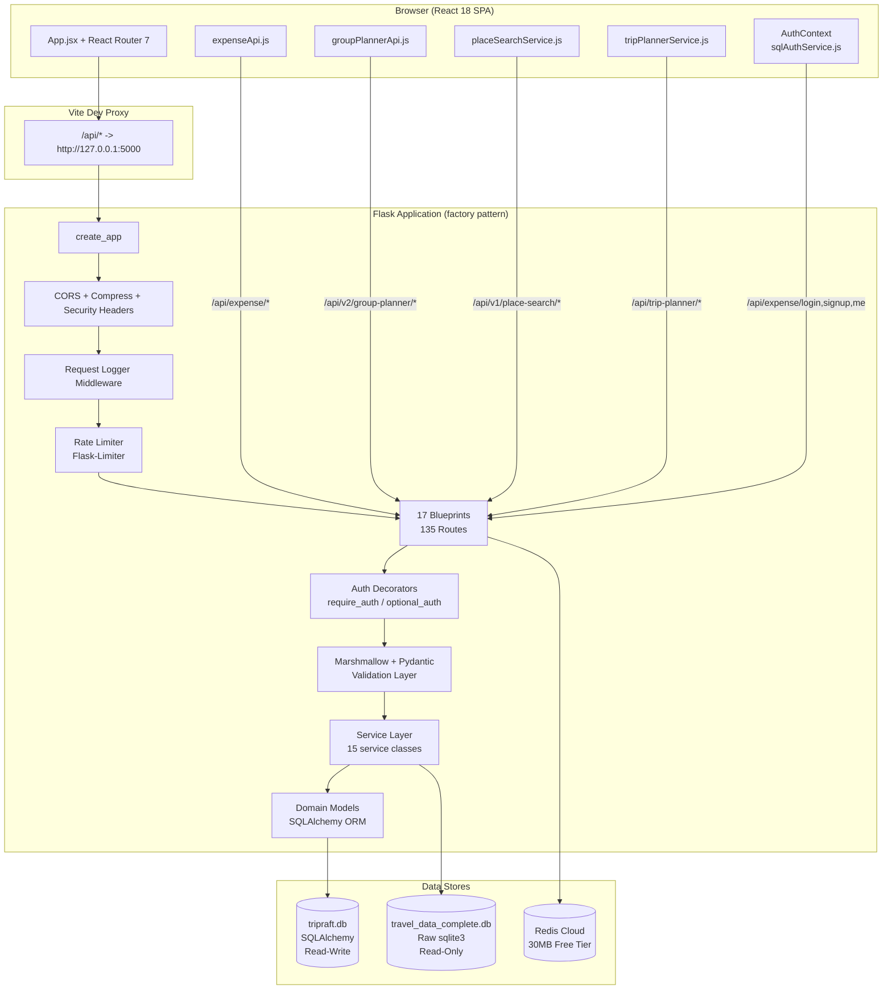

---

## Request Lifecycle (Step by Step)

Every API request passes through this exact sequence:

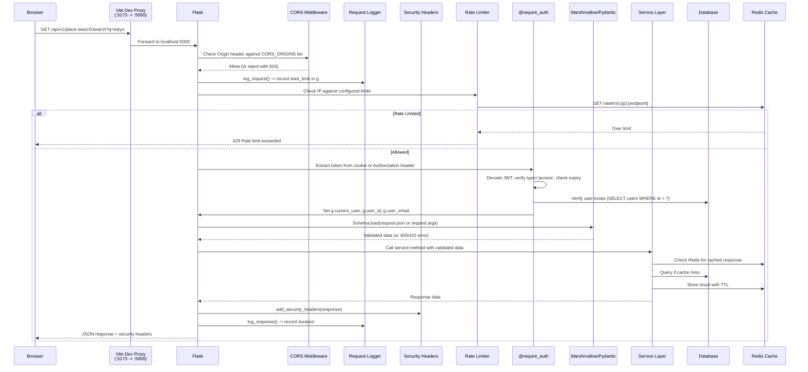

---

## Application Factory (`create_app()`)

The Flask app is built in `app/api/factory.py` using the factory pattern. The initialization order matters:

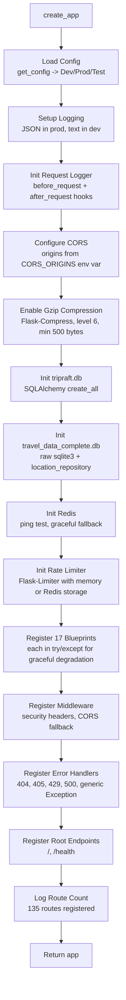

Each blueprint registration is wrapped in `try/except` so a broken module does not prevent the rest of the app from starting.

---

## Blueprint Map (All 17)

The backend has three distinct API sections, each with its own URL prefix and service layer:

### Expense Engine (`/api/expense/*`)

| Blueprint | File | Prefix | Routes | Purpose |
|-----------|------|--------|--------|---------|
| auth_bp | `v1/auth.py` | `/api/expense` | signup, login, logout, me, refresh, check-email | User authentication |
| groups_sql_bp | `v1/expense_groups.py` | `/api/expense` | groups CRUD, groups/:id/full, mega-bootstrap, extreme-dashboard | Expense groups |
| expenses_sql_bp | `v1/expenses.py` | `/api/expense` | expenses CRUD, expenses/:id/history, expenses/:id/splits | Expense records |
| settlements_sql_bp | `v1/settlements.py` | `/api/expense` | settlements CRUD, confirm, cancel, simplified debts | Debt settlements |
| invitations_sql_bp | `v1/expense_invitations.py` | `/api/expense` | invitations CRUD, accept, decline, group invitations | Email invitations |

### Group Planner (`/api/v2/group-planner/*`)

| Blueprint | File | Prefix | Routes | Purpose |
|-----------|------|--------|--------|---------|
| groups_bp | `v1/gp_groups.py` | `/api/v2/group-planner` | groups CRUD, members, budget, itinerary-document | Travel groups |
| places_bp | `v1/gp_places.py` | `/api/v2/group-planner` | places CRUD, vote, remarks | Group places + voting |
| polls_bp | `v1/gp_polls.py` | `/api/v2/group-planner` | polls CRUD, vote | Group polls |
| checklist_bp | `v1/gp_checklist.py` | `/api/v2/group-planner` | checklist items CRUD, toggle | Task checklists |
| invitations_bp | `v1/gp_invitations.py` | `/api/v2/group-planner` | invitations CRUD, accept, resend | Trip invitations |
| events_bp | `v1/gp_events.py` | `/api/v2/group-planner` | destination events | Ticketmaster integration |
| group_planner_v2 | `v1/gp_destinations.py` | `/api/v2/group-planner` | destination-search | Destination search |

### Platform Services (`/api/v1/*` and others)

| Blueprint | File | Prefix | Routes | Purpose |
|-----------|------|--------|--------|---------|
| users_bp | `v1/users.py` | `/api/v1/users` | register, login, profile, sessions | Clean auth (v1) |
| locations_bp | `v1/locations.py` | `/api/v1/locations` | countries, states, cities, autocomplete | Hierarchical location data |
| place_search_bp | `v1/places.py` | `/api/v1/place-search` | search, autocomplete, stats, place/:id | Place search engine |
| trip_planner_bp | `v1/trips.py` | `/api/trip-planner` | generate, cities, pacing-options | AI trip generation |
| health_bp | `health.py` | `/api/health` | health, detailed | Health checks |
| route_viewer_bp | `route_viewer.py` | `/api/routes` | list all registered routes | Debug |

---

## Four-Layer Architecture

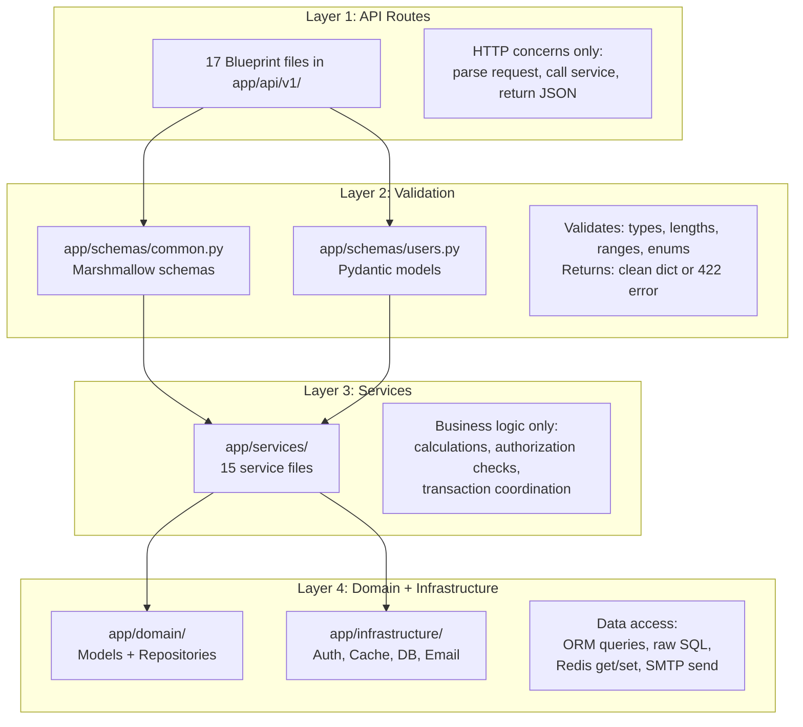

### Layer Responsibilities

| Layer | Files | Does | Does NOT |
|-------|-------|------|----------|
| Routes | `app/api/v1/*.py` | Parse HTTP, call schema, call service, format response | Query DB, contain business logic, access Redis directly |
| Schemas | `app/schemas/*.py` | Validate types, enforce constraints, sanitize input | Access any external system |
| Services | `app/services/*.py` | Business logic, authorization, transaction coordination | Know about HTTP, parse request objects |
| Domain | `app/domain/*/models.py` | Define table structure, relationships, `to_dict()` | Contain business logic |
| Infrastructure | `app/infrastructure/*` | DB connections, auth, cache, email | Contain business logic |

---

## Two Database Architecture

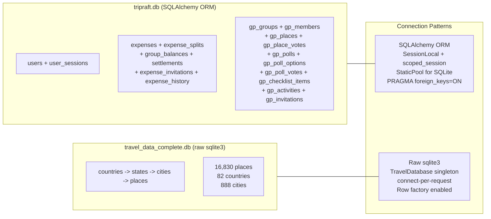

**Why two databases:**
- `tripraft.db` is read-write, holds user-generated data, uses ORM for relationships and migrations
- `travel_data_complete.db` is read-only reference data, uses raw sqlite3 for performance, no ORM overhead

**Connection management:**
- App DB: `scoped_session` (thread-safe), `StaticPool` (single connection for SQLite), `PRAGMA foreign_keys=ON` enforced on every connection
- Travel DB: `TravelDatabase` singleton class, opens/closes connection per request, `Row factory = sqlite3.Row` for dict-like access

---

## Cache Architecture

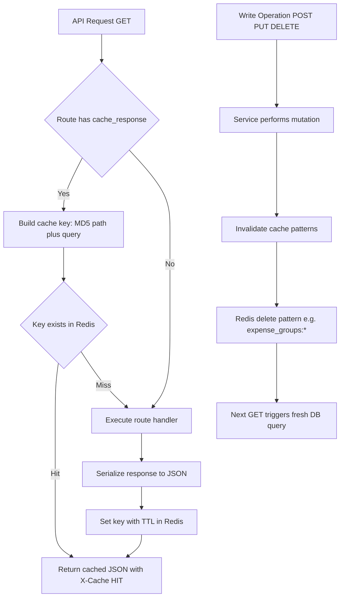

### Cache Key Strategy

| Prefix | Source | TTL | Example Key |
|--------|--------|-----|-------------|
| `route:` | `@cache_response` decorator | Varies | `route:a3f8b2c1d4e5` |
| `places:` | Place search results | 5 min | `places:search:tokyo:500` |
| `locations:` | Autocomplete + lists | 5-60 min | `locations:autocomplete:par:city` |
| `expense_groups:` | Group balances/data | 30s-1min | `expense_groups:5:balances` |

### Redis Client Architecture

`RedisClient` is a singleton (`redis_client`) initialized in `app/infrastructure/cache/redis.py`:

- **Lazy import:** Redis package imported only when needed
- **Graceful fallback:** If Redis unavailable, all get/set/delete return None/False/0 (no crashes)
- **JSON serialization:** `get_json()` / `set_json()` methods handle JSON encoding/decoding
- **Pattern delete:** `delete_pattern("prefix:*")` for bulk invalidation using KEYS + DELETE
- **Properties:** `redis_client.available` to check if Redis is connected

---

## Auth Architecture

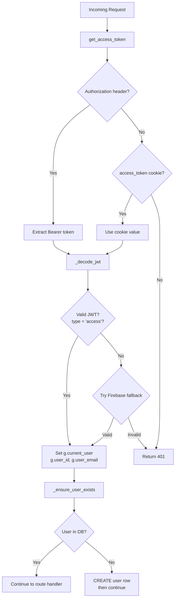

### Three Auth Decorators

| Decorator | Used By | Behavior |
|-----------|---------|----------|
| `@require_auth` | All protected routes | 401 if no valid token. Sets `g.current_user` |
| `@require_refresh_token` | `/api/expense/refresh` | Expects refresh token in cookie or body |
| `@optional_auth` | Some read endpoints | Sets `g.current_user` if token present, continues either way |

### Dual Token Delivery

The backend sends tokens both as httpOnly cookies AND in the JSON response body:

```
Set-Cookie: access_token=eyJ...; HttpOnly; Secure; SameSite=Lax; Max-Age=3600
Set-Cookie: refresh_token=eyJ...; HttpOnly; Secure; SameSite=Lax; Max-Age=2592000
Body: { "access_token": "eyJ...", "refresh_token": "eyJ..." }
```

Web clients use cookies (XSS-safe). Mobile/API clients use Bearer header from the body.

---

## Security Layers

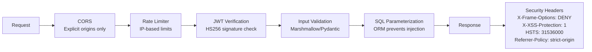

### Security Headers (every response)

| Header | Value | Purpose |
|--------|-------|---------|
| X-Content-Type-Options | nosniff | Prevent MIME sniffing |
| X-Frame-Options | DENY | Prevent clickjacking |
| X-XSS-Protection | 1; mode=block | Browser XSS filter |
| Referrer-Policy | strict-origin-when-cross-origin | Control referer leaking |
| Permissions-Policy | camera=(), microphone=(), geolocation=(self) | Restrict browser APIs |
| Strict-Transport-Security | max-age=31536000; includeSubDomains | Force HTTPS |

### Rate Limits

| Endpoint Type | Limit | Window |
|--------------|-------|--------|
| Auth (login, signup) | 5 | per minute |
| Search | 30 | per minute |
| Write (create, update) | 20 | per minute |
| Delete | 10 | per minute |
| General read | 100 | per minute |

Rate limit state is stored in Redis (or in-memory fallback). Key pattern: `ratelimit:{ip}:{endpoint}`.

---

## Error Handling

### Exception Hierarchy

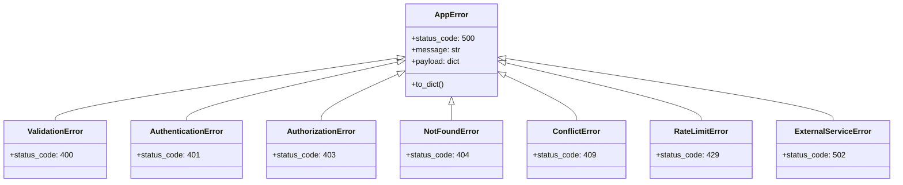

### Standardized Response Format

Every API response follows this structure:

```json
// Success
{
    "success": true,
    "message": "Success",
    "data": { ... },
    "pagination": { "total": 100, "limit": 50, "offset": 0, "has_more": true }
}

// Error
{
    "success": false,
    "message": "Validation failed",
    "data": null,
    "errors": { "email": ["Not a valid email address"] }
}
```

Response helpers in `app/api/utils/responses.py`: `success_response()`, `error_response()`, `paginated_response()`, `not_found_response()`.

---

## Frontend-Backend Data Flow Summary

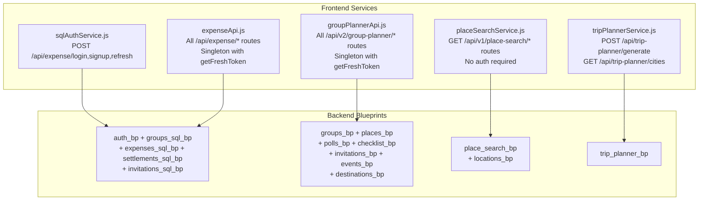

Each frontend service class:
1. Gets a fresh JWT token via `sqlAuthService.getIdToken()`
2. Attaches it as `Authorization: Bearer {token}` header
3. Sets `credentials: 'include'` to send httpOnly cookies
4. Uses `handleResponse()` to parse JSON and throw on HTTP errors

---

## Deployment Architecture (Current)

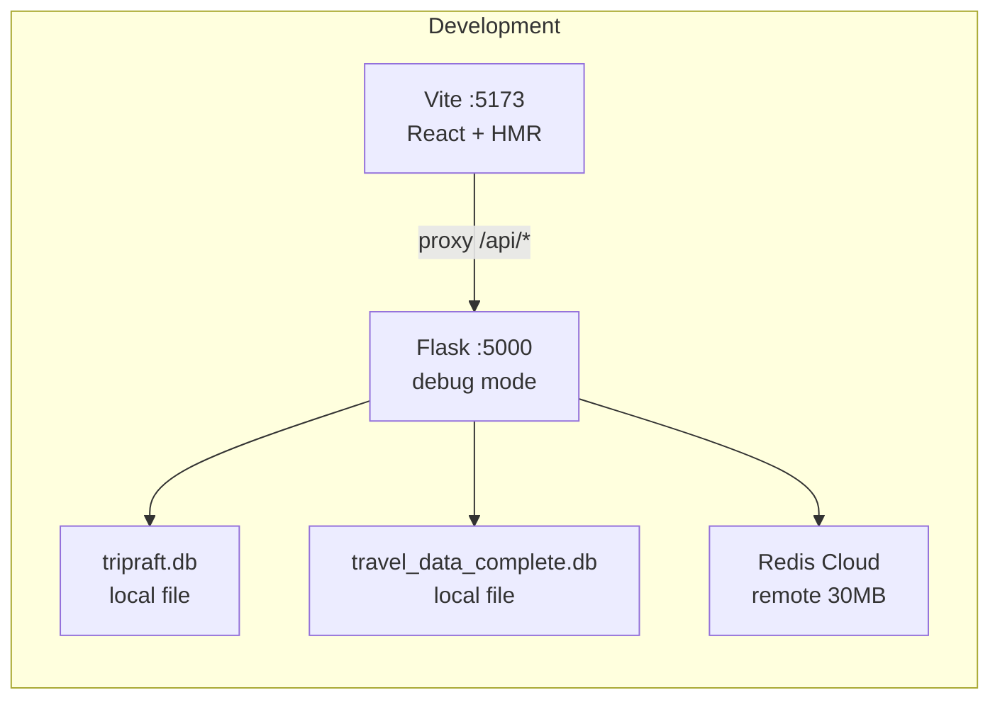

| Component | Dev | Production Target |
|-----------|-----|-------------------|
| Frontend | Vite dev server :5173 | Vercel static hosting |
| Backend | Flask dev server :5000 | Docker + Gunicorn (4 workers) |
| App DB | SQLite local file | PostgreSQL (planned) |
| Travel DB | SQLite local file | Keep as-is or Meilisearch |
| Cache | Redis Cloud 30MB | Redis Cloud or self-hosted |
| Proxy | Vite dev proxy | Nginx reverse proxy |
