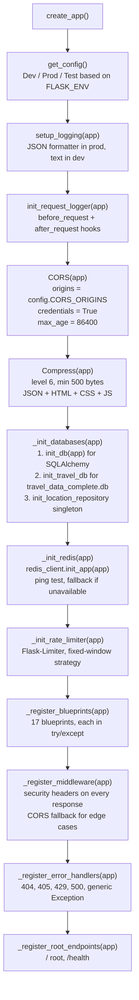
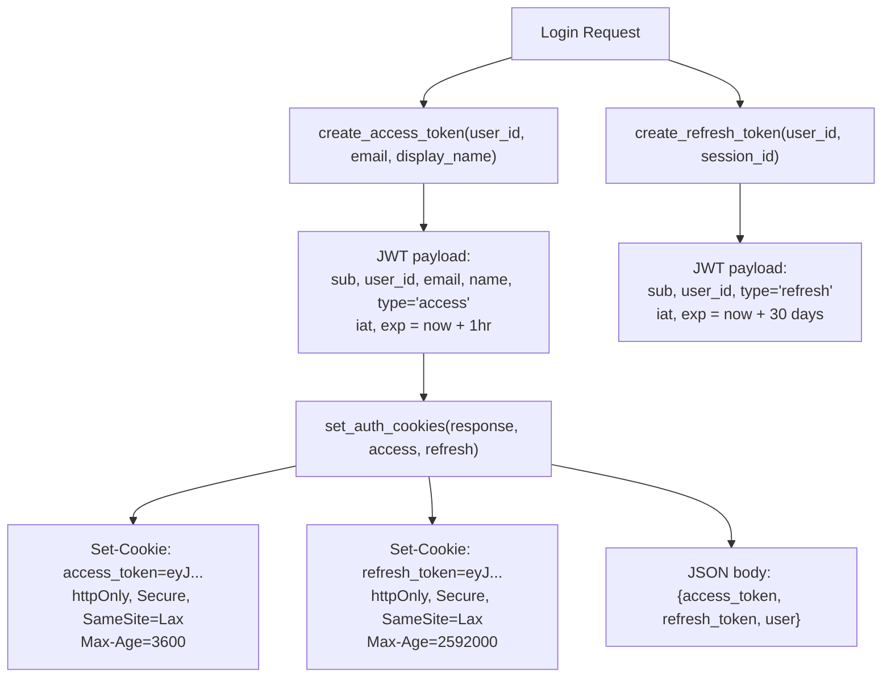
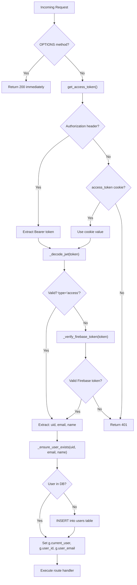
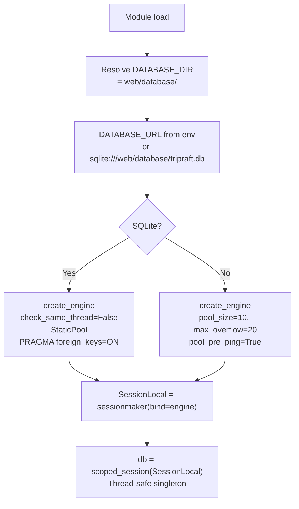
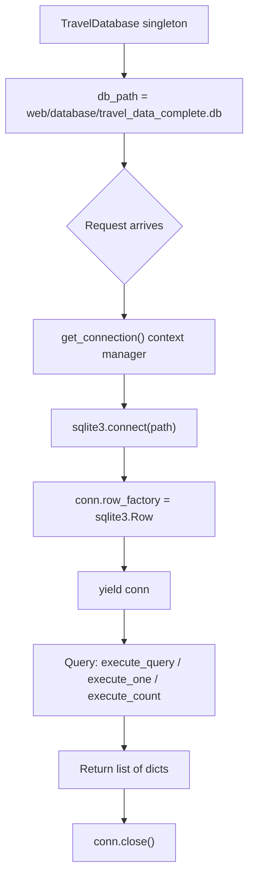
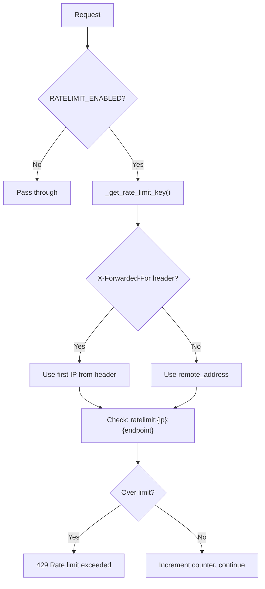
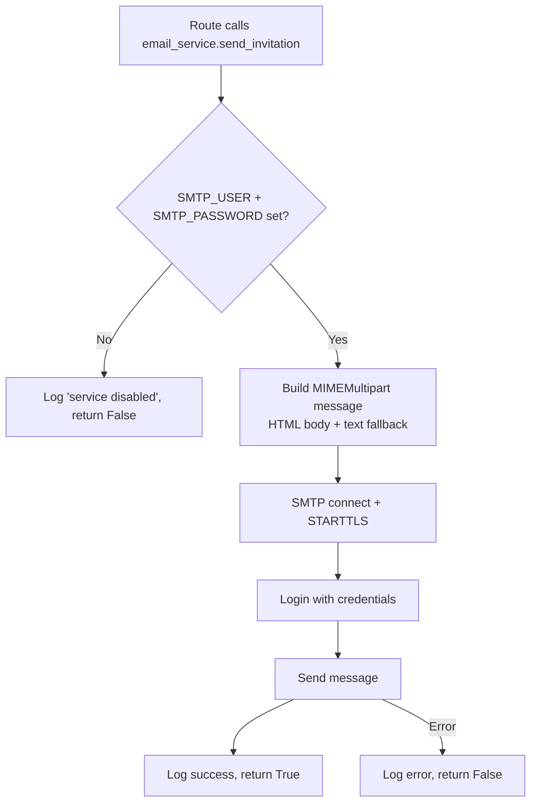
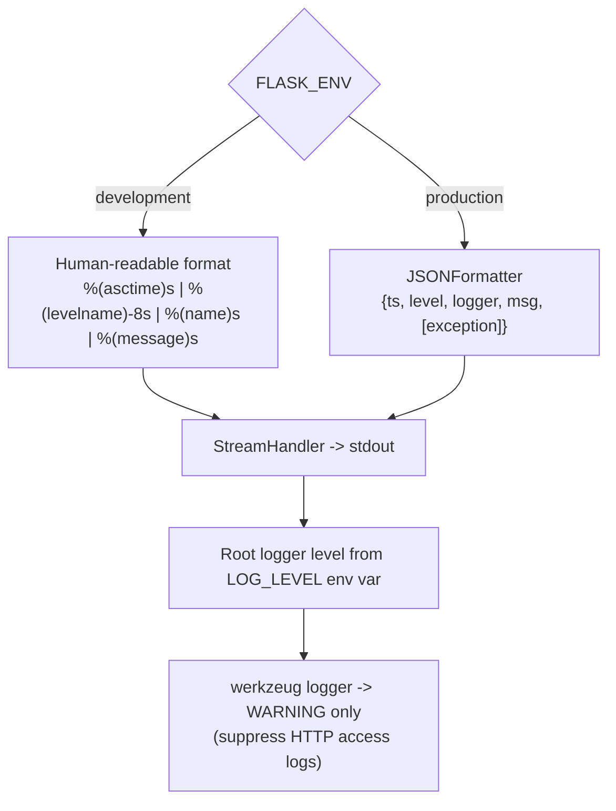

# TripRaft -- Backend Deep Dive

Every backend component explained: the factory, configuration, authentication, database connections, caching, rate limiting, validation, error handling, email, logging, and middleware. All code references point to actual files in `web/backend/app/`.

---

## Directory Structure

```
web/backend/
  run.py                          # Entry point: from app.api.factory import create_app
  requirements.txt                # Python dependencies
  Dockerfile                      # Multi-stage Docker build
  migrate.py                      # 11-phase migration script (1606 lines)
  app/
    api/
      factory.py                  # Application factory (create_app)
      health.py                   # Health check blueprint
      middleware.py               # Request/response logger
      route_viewer.py             # Debug: list all routes
      utils/
        responses.py              # success_response, error_response, paginated_response
        validators.py             # validate_pagination, validate_search_query, sanitize_input
        database.py               # Travel DB init helper
      v1/
        auth.py                   # Expense auth: login, signup, logout, me, refresh
        expense_groups.py         # Expense groups CRUD, mega-bootstrap, extreme-dashboard
        expenses.py               # Expense CRUD, history, splits
        settlements.py            # Settlement CRUD, confirm, cancel, simplified debts
        expense_invitations.py    # Expense invitation CRUD, accept, decline
        gp_groups.py              # Group planner groups, members, budget, itinerary
        gp_places.py              # Group places, voting, remarks
        gp_polls.py               # Group polls, voting
        gp_checklist.py           # Checklist items CRUD, toggle
        gp_invitations.py         # Trip invitations, accept, resend
        gp_events.py              # Ticketmaster events integration
        gp_destinations.py        # Destination search
        locations.py              # Hierarchical location autocomplete
        places.py                 # Place search engine
        trips.py                  # Trip itinerary generator
        users.py                  # Clean user auth (v1)
    core/
      config.py                   # All config in one place
      exceptions.py               # Custom exception hierarchy
      logging.py                  # Structured logging setup
      rate_limiter.py             # Flask-Limiter configuration
      security.py                 # Security headers
    domain/
      users/models.py             # User + UserSession ORM models
      users/repository.py         # UserRepository + UserSessionRepository
      expenses/models.py          # 8 expense ORM models
      group_planner/models.py     # 10 group planner ORM models
      places/models.py            # Place search models (none ORM)
      places/location_models.py   # Location data classes
      places/location_repository.py  # Location DB queries
      places/repository.py        # Place search DB queries
    infrastructure/
      auth/decorators.py          # @require_auth, @optional_auth, @require_refresh_token
      auth/jwt.py                 # JWT create/verify/decode, cookie helpers
      auth/password.py            # bcrypt hash/verify
      cache/redis.py              # RedisClient singleton, @cache_response decorator
      db/base.py                  # SQLAlchemy Base class
      db/connection.py            # SQLAlchemy engine + session factory
      db/travel_db.py             # TravelDatabase singleton (raw sqlite3)
      email/smtp.py               # SMTP email service
      email/config.py             # Email configuration
    schemas/
      common.py                   # Marshmallow schemas (18 schemas)
      users.py                    # Pydantic models (8 models)
    services/
      auth_service.py             # Expense auth logic
      user_service.py             # User CRUD via repository
      expense_service.py          # Expense business logic
      expense_group_service.py    # Expense group logic
      settlement_service.py       # Settlement + debt simplification
      expense_invite_service.py   # Expense invitation logic
      travel_group_service.py     # Group planner group logic
      travel_place_service.py     # Group place + voting logic
      poll_service.py             # Poll + voting logic
      trip_invite_service.py      # Trip invitation logic
      checklist_service.py        # Checklist item logic
      destination_service.py      # Destination search logic
      events_service.py           # Ticketmaster API integration
      email_service.py            # Simple invitation emails
      place_search_service.py     # Place search query logic
```

---

## Application Factory

`app/api/factory.py` -- `create_app()` builds the Flask app in a specific order:



### Configuration System

`app/core/config.py` -- Single source of truth for all settings:

```python
class Config:
    # Application
    SECRET_KEY = os.getenv('SECRET_KEY', 'dev-secret-key-change-in-production')
    
    # Database paths
    DATABASE_DIR = Path('web/database/')
    DATABASE_URL = f'sqlite:///{DATABASE_DIR}/tripraft.db'
    TRAVEL_DATABASE_PATH = DATABASE_DIR / 'travel_data_complete.db'
    
    # Redis
    REDIS_URL = os.getenv('REDIS_URL', 'redis://localhost:6379/0')
    REDIS_MAX_CONNECTIONS = 50
    REDIS_SOCKET_TIMEOUT = 5
    
    # JWT
    JWT_ACCESS_TOKEN_EXPIRES = 3600   # 1 hour
    JWT_REFRESH_TOKEN_EXPIRES = 2592000  # 30 days
    JWT_ALGORITHM = 'HS256'
    
    # CORS
    CORS_ORIGINS = ['http://localhost:5173', 'http://localhost:5174']
    
    # Cache TTLs
    CACHE_DEFAULT_TIMEOUT = 300       # 5 minutes
    CACHE_USER_TIMEOUT = 3600         # 1 hour
    CACHE_GROUP_TIMEOUT = 1800        # 30 minutes
    CACHE_BALANCE_TIMEOUT = 300       # 5 minutes
    
    # Rate Limiting
    RATELIMIT_ENABLED = False         # Enabled in ProductionConfig
    RATELIMIT_DEFAULT = '100 per hour'
```

Three config classes inherit from `Config`:
- `DevelopmentConfig` -- DEBUG=True, LOG_LEVEL=DEBUG
- `ProductionConfig` -- rate limiting enabled, secret key validation
- `TestingConfig` -- in-memory SQLite

`PlaceSearchConfig` is a separate class for search-specific settings (min/max query length, sort fields, debounce).

---

## Authentication System

### Two Parallel Auth Systems

The backend has two auth implementations that coexist:

| System | Files | Used By | Pattern |
|--------|-------|---------|---------|
| AuthService | `services/auth_service.py` | Expense engine routes (`/api/expense/*`) | Direct ORM queries |
| UserService | `services/user_service.py` + `domain/users/repository.py` | V1 user routes (`/api/v1/users/*`) | Repository pattern |

Both systems share:
- The same `users` table
- The same JWT tokens (`infrastructure/auth/jwt.py`)
- The same auth decorators (`infrastructure/auth/decorators.py`)
- The same password hashing (`infrastructure/auth/password.py` -- bcrypt, 12 rounds)

### JWT Token Flow



### Auth Decorator Internals (`@require_auth`)



Key detail: `_ensure_user_exists()` creates a User row if one doesn't exist. This handles the case where a Firebase user accesses the system for the first time.

---

## Database Layer

### App Database (SQLAlchemy ORM)

`app/infrastructure/db/connection.py`:



**Session management patterns used across the codebase:**

| Pattern | Usage | Code |
|---------|-------|------|
| `db` (scoped_session) | Most route handlers | `from app.infrastructure.db.connection import db` |
| `get_db()` context manager | Service layer | `with get_db() as session: ...` |
| `get_db_session()` | Manual session control | `session = get_db_session(); try: ... finally: session.close()` |
| Teardown | Auto-cleanup | `app.teardown_appcontext(lambda _: db.remove())` |

`init_db()` imports all domain models to register their table metadata with `Base`, then calls `Base.metadata.create_all(bind=engine)`.

### Travel Database (Raw sqlite3)

`app/infrastructure/db/travel_db.py`:



**Why raw sqlite3 instead of SQLAlchemy?**
- Read-only data -- no ORM overhead needed
- Row factory gives dict-like access
- Connection-per-request is fine for read-only patterns
- Simpler query patterns (mainly SELECT with LIKE)

---

## Caching System (Redis)

`app/infrastructure/cache/redis.py`:

### RedisClient Singleton

```python
class RedisClient:
    def init_app(self, app):     # Connect using REDIS_URL, ping, set _available
    def get(self, key) -> str    # GET, returns None if unavailable
    def set(self, key, value, ex=None) -> bool  # SET with optional TTL
    def delete(self, *keys) -> int               # DEL one or more keys
    def exists(self, key) -> bool                 # EXISTS check
    def delete_pattern(self, pattern) -> int      # KEYS + DELETE for glob patterns
    def get_json(self, key) -> Any               # GET + json.loads
    def set_json(self, key, value, ex=None) -> bool  # json.dumps + SET

redis_client = RedisClient()  # Singleton, imported everywhere
```

Every method wraps operations in `try/except` and returns a safe default if Redis is down. The app never crashes due to cache failures.

### `@cache_response` Decorator

Applied to Flask route functions:

```python
@cache_response(key_prefix='places', ttl=300, vary_on_query=True)
def search_places():
    # This function only runs on cache miss
    ...
```

How it works:
1. Build cache key: `{prefix}:{md5(path + query_string)[:12]}`
2. `redis_client.get(key)` -- if found, return cached JSON with `X-Cache: HIT` header
3. If miss, execute the wrapped function
4. If response has `get_data()` method, cache the response body with TTL
5. Return response

### Cache Invalidation Strategy

| Event | Action | Pattern |
|-------|--------|---------|
| Expense created/updated/deleted | `invalidate_cache("expense_groups:*")` | Wipe all expense group caches |
| Settlement created/confirmed | `invalidate_cache("expense_groups:*")` | Balances changed |
| Group member added/removed | `invalidate_cache("expense_groups:*")` | Group composition changed |
| Place search data (read-only) | TTL expiry only | Data doesn't change |
| Location data (read-only) | TTL expiry only | Data doesn't change |

---

## Rate Limiting

`app/core/rate_limiter.py`:



### Per-Operation Limits

```python
RATE_LIMITS = {
    'read_light':  '100 per minute',
    'read_heavy':  '30 per minute',
    'create':      '20 per minute',
    'update':      '30 per minute',
    'delete':      '10 per minute',
    'settle':      '10 per minute',
    'invitation':  '10 per minute',
    'auth':        '5 per minute',
}
```

Helper decorators: `limit_auth()` (5/min), `limit_search()` (30/min), `limit_write()` (20/min).

Storage: Redis (production) or in-memory (development). Strategy: fixed-window.

---

## Validation Layer

### Marshmallow Schemas (Expense + Group Planner)

`app/schemas/common.py` -- 18 schemas for all mutation endpoints:

| Schema | Validates | Key Rules |
|--------|----------|-----------|
| `SignupSchema` | email, password, display_name | Email format, password 8-128 chars, not all digits, must have number |
| `LoginSchema` | email, password | Email format, password min 1 char |
| `ChangePasswordSchema` | current_password, new_password | New password 8-128 chars |
| `CreateExpenseGroupSchema` | name, description, currency | Name 1-200 chars, currency max 10 chars |
| `CreateExpenseSchema` | description, amount, split_type, splits | Amount 0.01-1M, split_type in [equal, exact, percentage, shares] |
| `CreateSettlementSchema` | group_id, from/to user, amount, method | Amount > 0, method in [cash, bank_transfer, upi, paypal, other] |
| `CreateTravelGroupSchema` | name, destination, dates, budget | Name 1-200 chars, budget 0-100M |
| `UpdateBudgetSchema` | estimated_budget, budget_currency | Budget 0-100M |
| `InviteMemberSchema` | email | Valid email format |
| `CreatePollSchema` | name/question, options, is_multiple_choice | 2-10 options, no duplicates |
| `VotePollSchema` | option or option_index | Index >= 0 |
| `CreateChecklistItemSchema` | text, category, priority, due_date | Text 1-500 chars, priority in [low, medium, high] |
| `AddPlaceSchema` | name, description, address, lat/lng, category | Name 1-300 chars, rating 0-5, category in [attraction, restaurant, hotel, event, other] |
| `CheckEmailSchema` | email | Valid email |

Usage pattern in routes:
```python
data, errors = validate_request(CreateExpenseSchema, request.json)
if errors:
    return error_response("Validation failed", 422, errors)
```

### Pydantic Models (V1 Users)

`app/schemas/users.py` -- 8 Pydantic models for the clean user API:

| Model | Purpose |
|-------|---------|
| `UserRegisterRequest` | Registration: email (EmailStr), password (8-128), display_name, phone |
| `UserLoginRequest` | Login: email, password |
| `UserUpdateRequest` | Profile update: display_name, phone, photo_url, default_currency (3 chars) |
| `PasswordChangeRequest` | Password change: current_password, new_password (8-128) |
| `RefreshTokenRequest` | Token refresh: refresh_token string |
| `UserResponse` | Response: all user fields, `from_attributes = True` for ORM |
| `AuthResponse` | Login/signup response: user + tokens |
| `TokenResponse` | Refresh response: new tokens |

---

## Error Handling

`app/core/exceptions.py`:

```python
class AppError(Exception):           # Base: 500, to_dict() -> {success: false, message}
class ValidationError(AppError):     # 400
class AuthenticationError(AppError): # 401
class AuthorizationError(AppError):  # 403
class NotFoundError(AppError):       # 404
class ConflictError(AppError):       # 409 (duplicate email, existing member)
class RateLimitError(AppError):      # 429
class ExternalServiceError(AppError): # 502 (Ticketmaster API down)
```

Flask error handlers registered in `factory.py`:
- `404` -- `{"success": false, "error": "Endpoint not found"}`
- `405` -- `{"success": false, "error": "Method not allowed"}`
- `429` -- `{"success": false, "error": "Rate limit exceeded"}`
- `500` -- `{"success": false, "error": "Internal server error"}` (exception logged)
- `Exception` -- catch-all, logs exception, returns 500

### Response Helpers

`app/api/utils/responses.py`:

```python
success_response(data, message="Success", status_code=200, pagination=None)
error_response(message, status_code=400, errors=None)
paginated_response(data, total, limit, offset, message="Success")
not_found_response(resource="Resource")
```

All responses follow the structure: `{success, message, data, [pagination], [errors]}`.

---

## Email System

Two separate email implementations exist:

### 1. SMTP Service (`infrastructure/email/smtp.py`)

Used by the v1 user system and group planner:



Methods: `send_email()`, `send_invitation()`, `send_password_reset()`, `send_verification()`.

All emails use styled HTML templates with plain text fallbacks. The frontend URL is configured via `FRONTEND_URL` env var for generating links.

### 2. Simple Email Service (`services/email_service.py`)

Used by the expense engine:

Same SMTP approach but with different HTML templates focused on expense group invitations. Includes a styled email with "Accept Invitation" button linking to `{FRONTEND_URL}/invitations?id={invitation_id}`.

Both are singletons (`email_service = EmailService()`). Neither blocks the request -- emails are sent synchronously but failures are caught and logged (fire-and-forget pattern).

---

## Logging

`app/core/logging.py`:



### Request Logger (`app/api/middleware.py`)

Controlled by `DISABLE_REQUEST_LOGS` env var (default: `true` -- disabled).

When enabled:
- `before_request`: Logs `=> GET /api/v1/place-search/search ?q=tokyo origin=http://localhost:5173`
- `after_request`: Logs `<= GET /api/v1/place-search/search 200 45.2ms`
- Skips `/health` and `/api/health` to avoid spam
- Records `g.start_time` for duration calculation

---

## Service Layer Details

15 service files in `app/services/`, each handling business logic for a specific domain:

### Expense Services

| Service | Key Methods | Database Tables |
|---------|------------|-----------------|
| `auth_service.py` | signup, login, get_me, refresh_token | users, user_sessions |
| `expense_service.py` | create_expense, update_expense, delete_expense, get_history | expenses, expense_splits, expense_history, group_balances |
| `expense_group_service.py` | create_group, get_group_full, mega_bootstrap, extreme_dashboard | expense_groups, group_members |
| `settlement_service.py` | create_settlement, confirm, cancel, get_simplified_debts | settlements, group_balances |
| `expense_invite_service.py` | send_invitation, accept, decline, get_pending | expense_invitations, group_members |

### Group Planner Services

| Service | Key Methods | Database Tables |
|---------|------------|-----------------|
| `travel_group_service.py` | create_group, update_group, manage_members | gp_groups, gp_members, gp_activities |
| `travel_place_service.py` | add_place, vote, delete_place, update_remarks | gp_places, gp_place_votes |
| `poll_service.py` | create_poll, vote, delete_poll | gp_polls, gp_poll_options, gp_poll_votes |
| `checklist_service.py` | add_item, toggle, update, delete | gp_checklist_items |
| `trip_invite_service.py` | send_invitation, accept, resend, delete | gp_invitations, gp_members |

### Platform Services

| Service | Key Methods | Database |
|---------|------------|----------|
| `user_service.py` | register, login, update_profile, change_password | tripraft.db (via UserRepository) |
| `place_search_service.py` | search, autocomplete, get_place, get_stats | travel_data_complete.db |
| `destination_service.py` | search_destinations | travel_data_complete.db |
| `events_service.py` | get_events (Ticketmaster API) | External API |
| `email_service.py` | send_group_invitation | SMTP |

---

## Running the Backend

### Development

```bash
cd web/backend
pip install -r requirements.txt
python run.py
# Server starts on http://localhost:5000
```

### Docker

```bash
docker build -t tripraft-backend .
docker run -p 5000:5000 \
  -e REDIS_URL=redis://... \
  -e SECRET_KEY=... \
  -v ./database:/app/database \
  tripraft-backend
```

The Dockerfile:
- Base: `python:3.11-slim`
- Installs dependencies
- Copies application code
- Runs with Gunicorn (4 workers)
- Exposes port 5000
- Health check at `/health`

### Environment Variables

| Variable | Required | Default | Purpose |
|----------|----------|---------|---------|
| `SECRET_KEY` | Production | dev key | JWT signing + Flask secret |
| `FLASK_ENV` | No | development | Config class selection |
| `DATABASE_URL` | No | sqlite:///database/tripraft.db | App database URL |
| `REDIS_URL` | No | redis://localhost:6379/0 | Cache connection |
| `CORS_ORIGINS` | No | localhost:5173,5174,3000 | Allowed frontend origins |
| `FRONTEND_URL` | No | http://localhost:5173 | Email link base URL |
| `SMTP_HOST` | No | smtp.gmail.com | Email server |
| `SMTP_PORT` | No | 587 | Email port |
| `SMTP_USER` | For email | empty | Email username |
| `SMTP_PASSWORD` | For email | empty | Email password |
| `TICKETMASTER_API_KEY` | For events | empty | Ticketmaster integration |
| `LOG_LEVEL` | No | INFO | Logging level |
| `DISABLE_REQUEST_LOGS` | No | true | Request/response logging |
