# TripRaft -- Frontend Deep Dive

Every frontend component, service, context, hook, routing decision, and state management pattern explained. All code lives in `web/frontend/src/`.

---

## Directory Structure

```
web/frontend/
  package.json                        # React 18, Vite 5, React Query 5, Leaflet, Recharts
  vite.config.js                      # Dev server :5173, proxy /api/* -> :5000
  src/
    App.jsx                           # Root component: Router + Providers
    main.jsx                          # Entry: ReactDOM.createRoot + BrowserRouter
    config/
      globalConfig.js                 # API base URL from env
    context/
      AuthContext.jsx                 # Auth state, signIn/signUp/signOut
      GroupPlannerContext.jsx          # Group planner global state (reserved)
    hooks/
      useExpenseQuery.js              # 1,556 lines. React Query hooks for all expense ops
    services/
      sqlAuthService.js               # JWT auth: login, signup, refresh, token management
      expenseApi.js                   # All /api/expense/* calls
      groupPlannerApi.js              # All /api/v2/group-planner/* calls
      placeSearchService.js           # All /api/v1/place-search/* calls (no auth)
      tripPlannerService.js           # All /api/trip-planner/* calls
    utils/
      apiClient.js                    # Fetch wrapper used by tripPlannerService
      apiLogger.js                    # Console logging for API calls
    components/
      auth/jsx/
        Login.jsx                     # Login page
        Signup.jsx                    # Signup page
        AuthPage.jsx                  # Combined auth page
        ProtectedRoute.jsx            # Route guard: redirects to /login if not authenticated
        InactivityTracker.jsx         # 15-minute inactivity auto-logout
      common/
        AnimatedBackground.jsx        # Background animation
        DestinationAutocomplete.jsx   # Location search dropdown
        ErrorBoundary.jsx             # Error boundary wrapper
        Toast.jsx                     # Notification toasts
        UserAvatar.jsx                # User avatar with initials fallback
      layout/
        Header.jsx                    # Navigation header
        Footer.jsx                    # Footer
      pages/jsx/
        HomePage.jsx                  # Landing page (1,160 lines of CSS)
        About.jsx                     # About page
        Contact.jsx                   # Contact page
        Pricing.jsx                   # Pricing page
        Analytics.jsx                 # Analytics dashboard
        ExpensePage.jsx               # Expense management page
        ExpenseAnalytics.jsx          # Expense analytics page
        TripPlanner.jsx               # Trip planner page (2,547 lines of CSS)
        SmartInvitationHandler.jsx    # Universal invitation handler
      expenses/
        ExpenseManager.jsx            # Main expense component (1,416 lines of CSS)
        SettlementModal.jsx           # Create/confirm settlements
        SettlementHistoryModal.jsx    # Settlement history
        ExpenseHistoryModal.jsx       # Expense edit history
        ExpenseAnalytics.jsx          # Analytics charts (614 lines of CSS)
      placeSearch/
        PlaceSearchPage.jsx           # Main search page
        SearchBar.jsx                 # Search input with suggestions
        SearchSuggestions.jsx          # Autocomplete dropdown
        PlaceCard.jsx                 # Place result card
        PlaceGrid.jsx                 # Grid layout for results
        GroupedPlaceGrid.jsx          # Grouped by country/city
        PlaceDetailModal.jsx          # Full place details with map
      groupPlanner/
        GroupPlannerPage.jsx          # Dashboard: list all groups
        GroupPlanner.jsx              # Individual group view (map + sidebars)
        SidebarComponent.jsx          # Left sidebar navigation
        TripPlannerHeader.jsx         # Group header with destination
        MapSection.jsx                # Leaflet map with place markers
        PlacesSidebar.jsx             # Place list + voting
        RightSidebar.jsx              # Polls, checklist, notes, members, events
        NotesSection.jsx              # Itinerary document editor
        MembersModal.jsx              # View/invite members (418 lines CSS)
        MembersPanel.jsx              # Compact members list
        PendingModal.jsx              # Pending invitation list
        CreateGroupModal.jsx          # New group form
        CreatePollModal.jsx           # New poll form
        CreateChecklistModal.jsx      # New checklist item form
        EditItineraryModal.jsx        # Edit itinerary
        EditChecklistModal.jsx        # Edit checklist item
        EditPollModal.jsx             # Edit poll
        EditBudgetModal.jsx           # Edit budget
        InvitationAcceptPage.jsx      # Invitation acceptance flow
      tripPlanner/
        (TripPlanner.jsx in pages)
```

---

## Application Entry Point

### `App.jsx` -- Routing

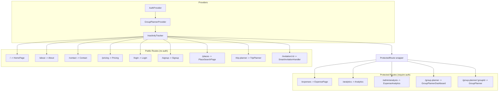

**ProtectedRoute:** Checks `useAuth().isAuthenticated`. If false, redirects to `/login`. Renders children if authenticated.

**InactivityTracker:** Monitors mouse, keyboard, scroll, and touch events. If no activity for 15 minutes, calls `signOut()` and redirects to `/login`.

---

## State Management

### AuthContext (`context/AuthContext.jsx`)

The single source of auth truth for the entire app:

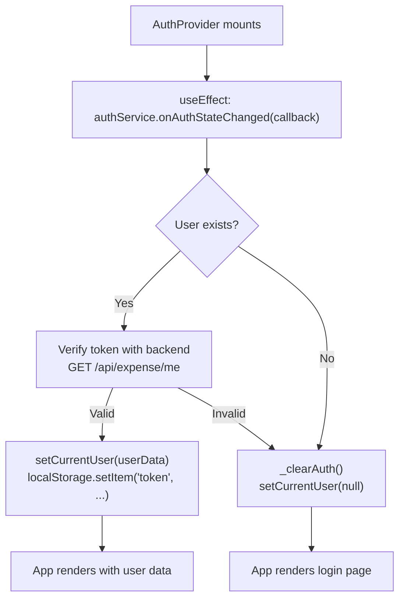

**What AuthContext provides:**

| Property/Method | Type | Purpose |
|----------------|------|---------|
| `currentUser` | object | `{uid, email, displayName, photoURL, _sqlUser, token}` |
| `loading` | boolean | True during initial auth check |
| `error` | string | Last auth error message |
| `isAuthenticated` | boolean | `!!currentUser` |
| `signIn(email, password)` | async function | Login via sqlAuthService |
| `signUp(email, password, displayName)` | async function | Register |
| `signOut()` | async function | Logout, clear all caches |
| `updateProfile(updates)` | async function | Update display name, photo |
| `getUserInitials()` | function | Returns initials for avatar |

**On signOut:** Clears localStorage tokens, nulls currentUser, calls `groupPlannerApi.clearAllCache()`, calls `authService.signOut()`.

### GroupPlannerContext (`context/GroupPlannerContext.jsx`)

Reserved for cross-component state sharing. Currently, each GroupPlanner component manages its own local state. The context provides:

| Property/Method | Purpose |
|----------------|---------|
| `selectedGroupId` | Currently active group |
| `groups` | All user's groups |
| `currentTrip` | Active trip details |
| `selectGroup(id)` | Set active group |
| `addGroup(group)` | Add to list |
| `removeGroup(id)` | Remove from list |
| `updateGroup(id, updates)` | Partial update |
| `clearState()` | Reset on logout |

### React Query (Server State)

React Query 5 (`@tanstack/react-query`) handles all server state caching, background refetching, and optimistic updates. The `useExpenseQuery.js` hook (1,556 lines) wraps every expense operation:

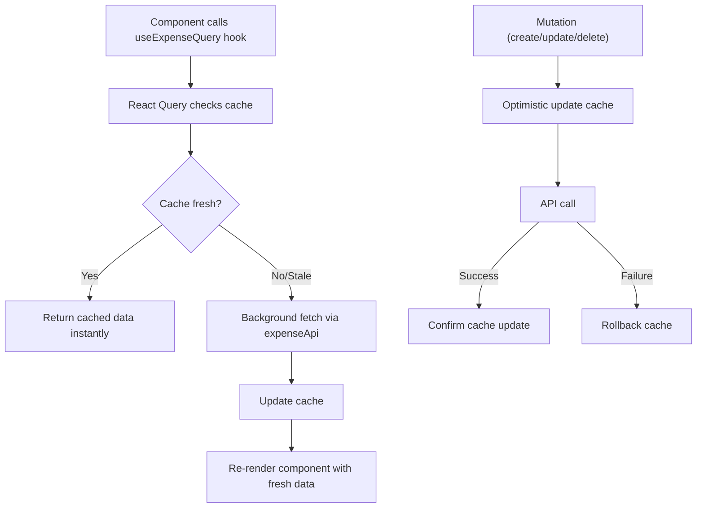

**Key patterns in useExpenseQuery.js:**
- `useQuery(['groups'], () => expenseApi.getUserGroups())` -- fetch all groups
- `useQuery(['group', groupId, 'full'], () => expenseApi.getGroupFull(groupId))` -- fetch single group with all data
- `useMutation(() => expenseApi.createExpense(data), { onSuccess: invalidate(['expenses']) })` -- create + invalidate
- Mega-bootstrap: single query that loads all user data at once

---

## Service Layer (Frontend)

### `sqlAuthService.js` -- Authentication

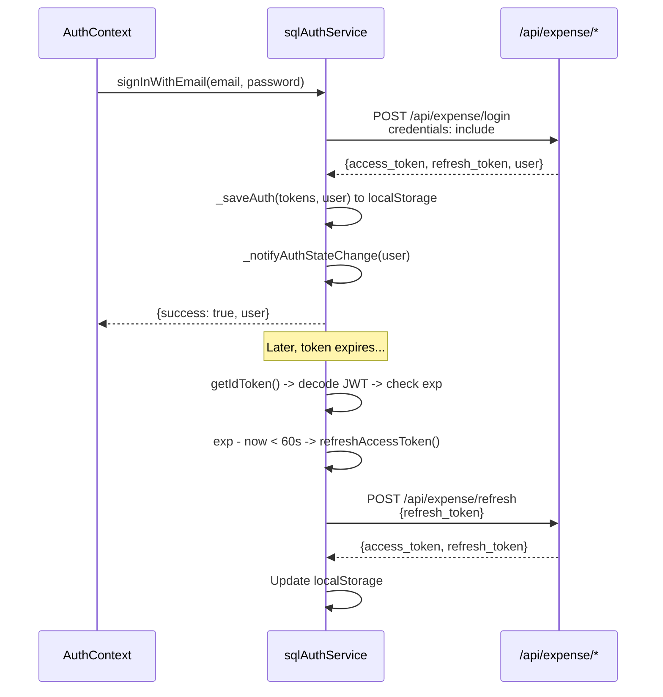

**Token storage:** `accessToken`, `refreshToken`, `currentUser` (JSON), and `token` (legacy alias) all in localStorage. httpOnly cookies are also set by the backend for dual delivery.

**Race condition handling:** `_isRefreshing` lock prevents concurrent refresh calls. If a refresh is in progress, subsequent calls await the existing `_refreshPromise`.

**Auth state listeners:** `onAuthStateChanged(callback)` registers listeners. On initial call, immediately verifies token with backend via `GET /api/expense/me`.

### `expenseApi.js` -- Expense Operations

Singleton class with centralized fetch wrapper:

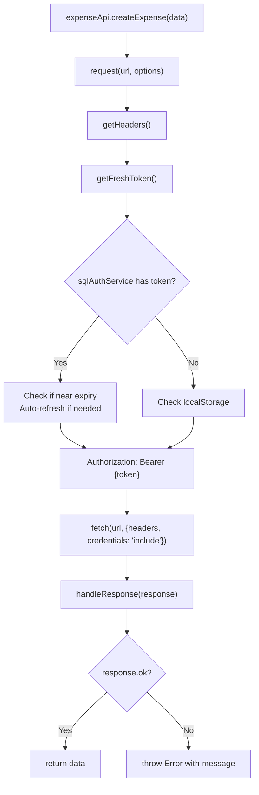

**Key endpoints called:**

| Method | Endpoint | Purpose |
|--------|----------|---------|
| `getMegaBootstrap()` | `GET /api/expense/mega-bootstrap` | Load all user data in one call |
| `getExtremeDashboard()` | `GET /api/expense/extreme-dashboard` | Complete dashboard with embedded data |
| `getGroupFull(id)` | `GET /api/expense/groups/{id}/full` | Group + members + expenses + balances + settlements |
| `createExpense(data)` | `POST /api/expense/expenses` | Create expense with splits |
| `updateExpense(id, data)` | `PUT /api/expense/expenses/{id}` | Update expense |
| `deleteExpense(id)` | `DELETE /api/expense/expenses/{id}` | Soft delete expense |
| `createSettlement(data)` | `POST /api/expense/settlements` | Record a payment |
| `getSimplifiedDebts(groupId)` | `GET /api/expense/balances/group/{id}/simplified` | Minimum transactions to settle |

### `groupPlannerApi.js` -- Group Planner Operations

Same singleton pattern as expenseApi, targeting `/api/v2/group-planner/*`:

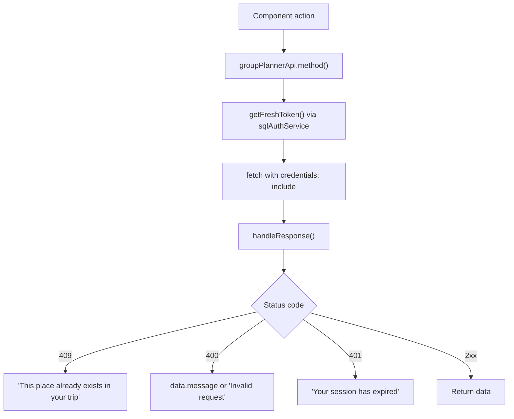

**Key methods:**

| Method | Endpoint | Purpose |
|--------|----------|---------|
| `getUserGroups()` | `GET /groups/user/groups` | List all trip groups |
| `getGroup(id)` | `GET /groups/{id}` | Group details + members + places + polls + checklist |
| `createGroup(data)` | `POST /groups` | Create travel group |
| `addPlace(groupId, place)` | `POST /groups/{id}/places` | Add place (handles both string and object formats) |
| `voteOnPlace(groupId, placeId)` | `POST /groups/{id}/places/{pid}/vote` | Toggle upvote |
| `createPoll(groupId, data)` | `POST /groups/{id}/polls` | Create voting poll |
| `voteOnPoll(groupId, pollId, option)` | `POST /groups/{id}/polls/{pid}/vote` | Cast vote |
| `addChecklistItem(groupId, text)` | `POST /groups/{id}/checklist` | Create task |
| `toggleChecklistItem(groupId, itemId)` | `POST /checklist/{id}/toggle` | Toggle done |
| `createInvitation(groupId, email)` | `POST /invitations` | Send email invitation |
| `getDestinationEvents(dest)` | `GET /events?destination=` | Ticketmaster events |

Note: `clearAllCache()` is a no-op -- caching is handled by React Query, not in-memory maps.

### `placeSearchService.js` -- Place Search

Stateless module with exported functions (not a class). No auth required:

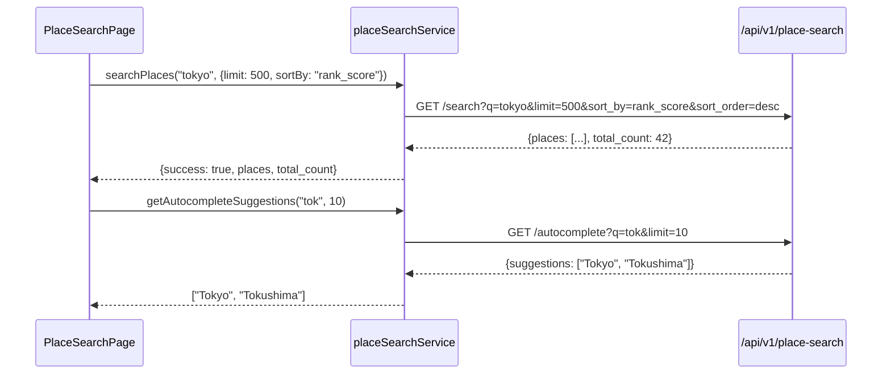

**Exported functions:** `searchPlaces()`, `getAutocompleteSuggestions()`, `getPlaceDetails()`, `getStats()`.

All functions catch errors and return safe defaults (`{places: [], total_count: 0}` on failure).

### `tripPlannerService.js` -- Trip Generation

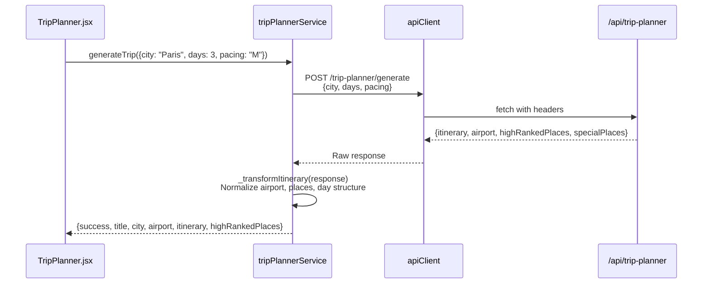

Uses `apiClient` (from `utils/apiClient.js`) instead of direct `fetch`. Includes `apiLogger` for development logging with `performance.now()` timing.

---

## Key Component Flows

### Flow 1: Expense Page Load

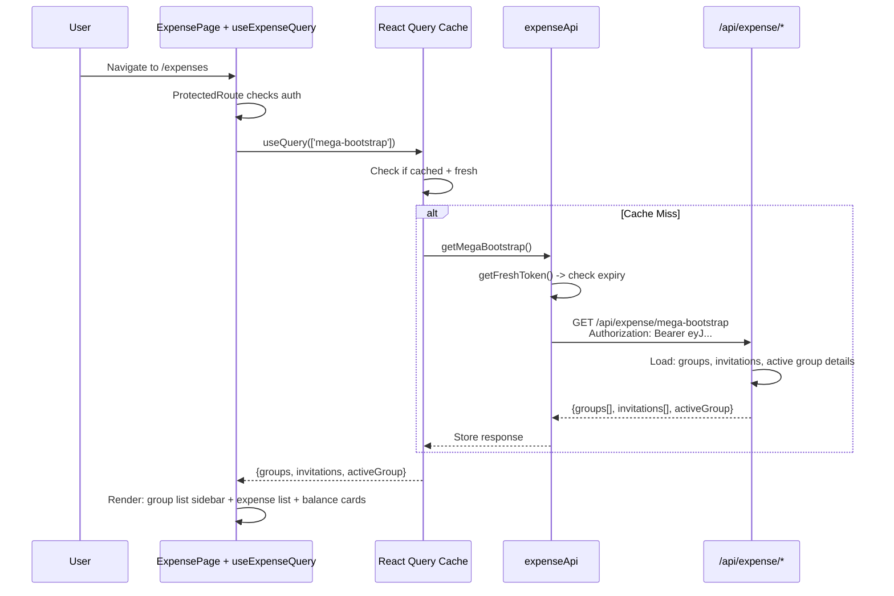

### Flow 2: Place Search with Filters

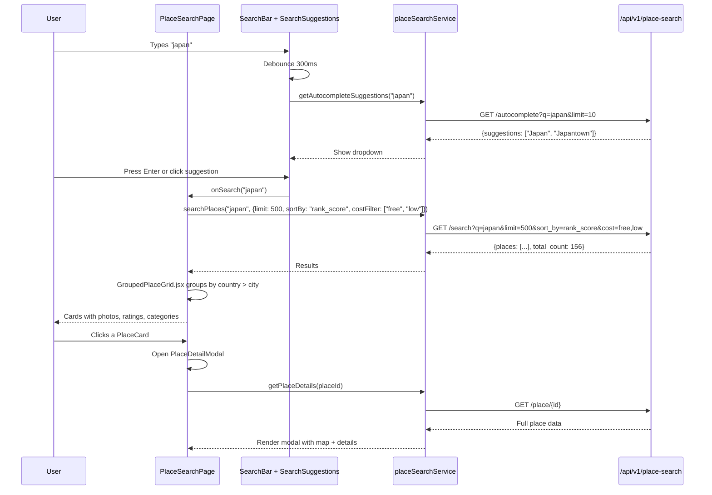

### Flow 3: Group Planner Place Voting

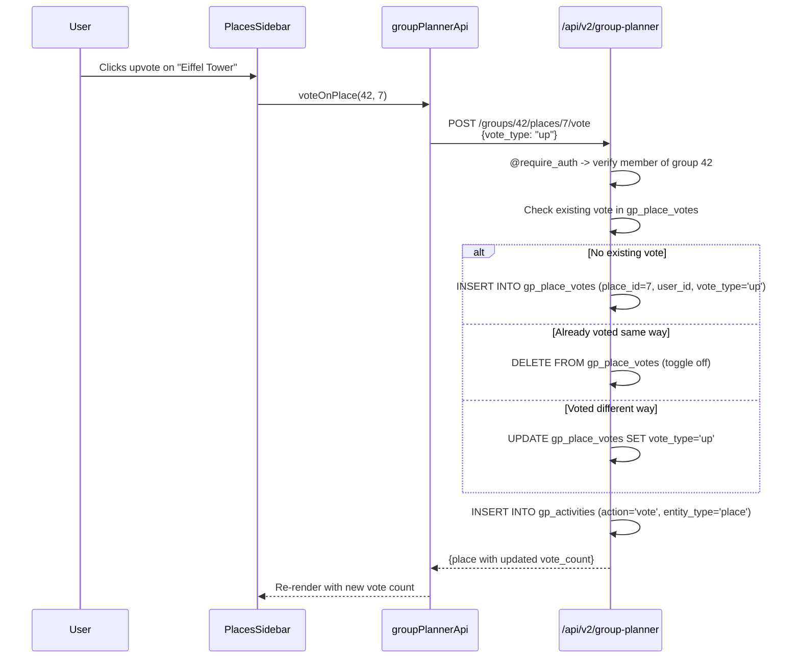

### Flow 4: Invitation Accept (Anonymous User)

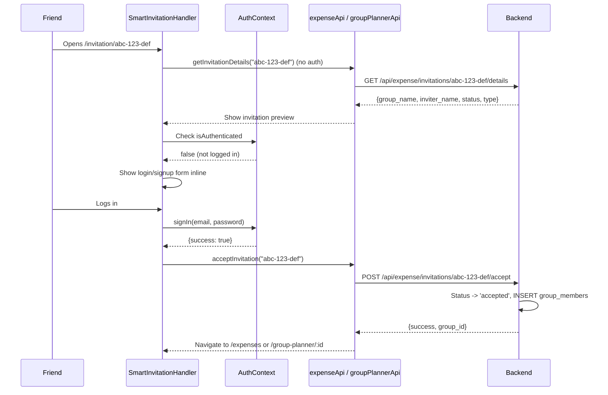

### Flow 5: Trip Planner Generation

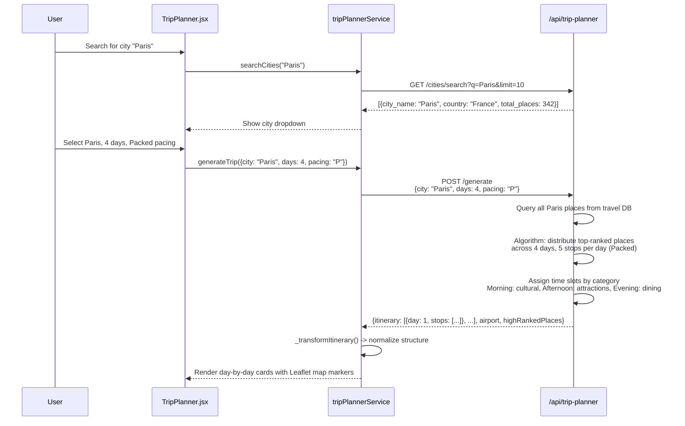

---

## Styling Approach

| Aspect | Implementation |
|--------|---------------|
| Method | CSS files per component (not CSS Modules, despite convention -- actual `.css` imports) |
| Font | Inter (Google Fonts) |
| Icons | Lucide React (`lucide-react` package) |
| Maps | Leaflet + React-Leaflet |
| Charts | Recharts |
| Colors | CSS custom properties (`:root` variables) |
| Responsive | Media queries in each CSS file |
| Total CSS files | 49 |
| Largest CSS | TripPlanner.css (2,547 lines), ExpenseManager.css (1,416 lines), HomePage.css (1,160 lines) |

### Global Styles

`styles.css` + `styles/global.css` (583 lines combined):
- Font imports
- CSS reset
- Color palette variables
- Common utility classes
- Animation keyframes

---

## Build Configuration

### `vite.config.js`

```javascript
export default defineConfig(({ mode }) => ({
  plugins: [react()],
  server: {
    port: 5173,
    proxy: {
      '/api': {
        target: 'http://127.0.0.1:5000',
        changeOrigin: true,
      },
    },
  },
  esbuild: {
    // Strip console.* and debugger in production
    ...(mode === 'production' && { drop: ['console', 'debugger'] }),
  },
}))
```

**Dev proxy:** All `/api/*` requests from React (port 5173) are proxied to Flask (port 5000). This avoids CORS issues in development.

**Production build:** `console.*` and `debugger` statements are stripped. Output goes to `dist/` for static hosting.

### Key Dependencies

| Package | Version | Purpose |
|---------|---------|---------|
| react | 18.2 | UI framework |
| react-dom | 18.2 | DOM rendering |
| react-router-dom | 7.9 | Client-side routing |
| @tanstack/react-query | 5.90 | Server state management |
| @tanstack/react-query-devtools | 5.90 | Dev tools (dev only) |
| @tanstack/react-query-persist-client | 5.90 | Offline cache persistence |
| @tanstack/query-sync-storage-persister | 5.90 | localStorage sync for React Query |
| leaflet | 1.9 | Map rendering |
| react-leaflet | 4.2 | React Leaflet bindings |
| lucide-react | 0.545 | Icon library |
| recharts | 3.6 | Chart library |
| jspdf + jspdf-autotable | 4.0 / 5.0 | PDF export |
| qrcode | 1.5 | QR code generation |
| vite | 5.0 | Build tool + dev server |

### Environment Variables

| Variable | Default | Purpose |
|----------|---------|---------|
| `VITE_API_BASE_URL` | (from globalConfig) | Backend API URL |
| `VITE_SHOW_DEVTOOLS` | false | Show React Query DevTools in dev |

---

## Running the Frontend

### Development

```bash
cd web/frontend
npm install
npm run dev
# Starts on http://localhost:5173
# Proxies /api/* to http://127.0.0.1:5000
```

### Production Build

```bash
npm run build
# Output: dist/
# Console.* and debugger stripped
npm run preview  # Preview production build locally
```
