# TripRaft -- Database and Data

Every table, every column, every relationship, every cache key. Two databases, one cache layer, zero guesswork.

---

## The Two Database Architecture

TripRaft runs two completely separate SQLite databases with different purposes, access patterns, and connection strategies:

| Property | Application Database | Travel Reference Database |
|----------|---------------------|--------------------------|
| File | `web/database/tripraft.db` | `web/backend/data/travel_data_complete.db` |
| Engine | SQLAlchemy ORM (`create_engine`) | Raw `sqlite3` (standard library) |
| Access | Read-Write | Read-Only |
| Connection | Scoped session, `StaticPool` | Per-request open/close |
| Tables | 19 tables across 3 domains | 4 tables (countries, states, cities, places) |
| Data | User-generated (expenses, groups, votes) | Pre-curated travel reference (16,830 places) |
| Schema management | `Base.metadata.create_all()` | None (shipped as-is) |
| Connection file | `infrastructure/db/connection.py` | `infrastructure/db/travel_db.py` |

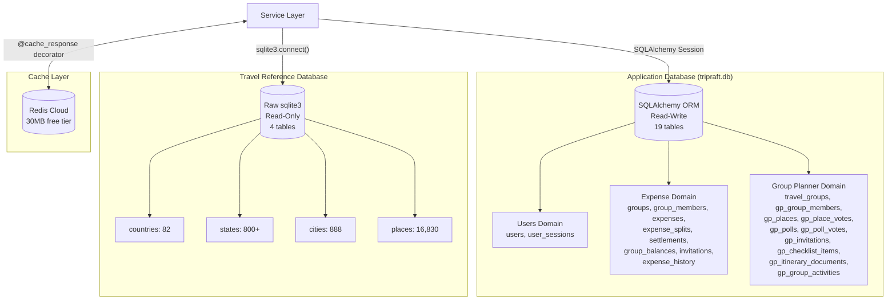

### Why Two Databases?

1. **Travel data never changes at runtime.** It was curated offline, scored, and exported. No ORM overhead needed -- raw SQL is faster.
2. **App data changes constantly.** Every expense, vote, and invitation needs transaction management (`session.commit()` / `session.rollback()`).
3. **They scale independently.** The travel DB can be swapped for PostgreSQL full-text search or Meilisearch. The app DB migrates to PostgreSQL when concurrent writes matter.

---

## Application Database Connection (`infrastructure/db/connection.py`)

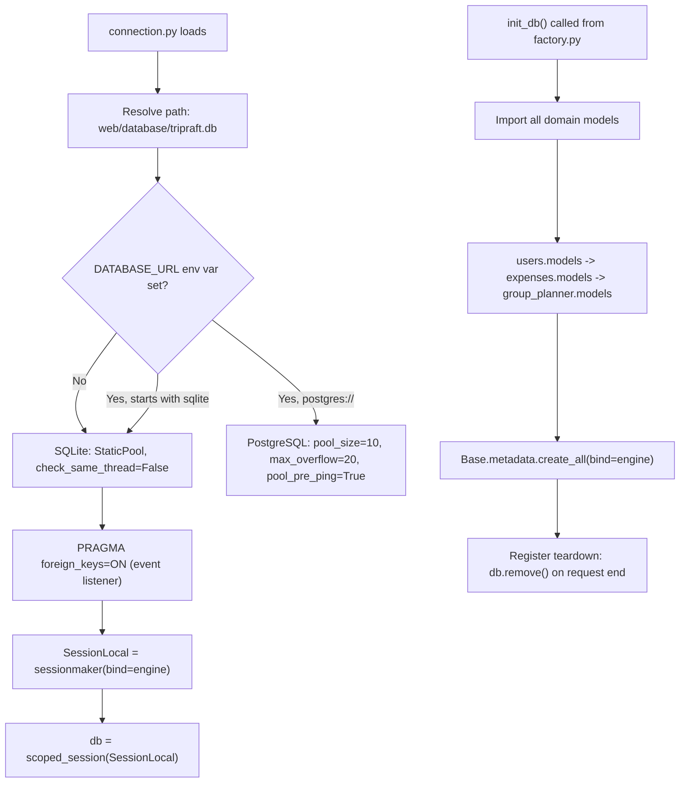

**Key implementation details:**
- `StaticPool` reuses a single connection for SQLite (thread-safe with `check_same_thread=False`)
- `PRAGMA foreign_keys=ON` enforced via SQLAlchemy event listener on every new connection
- `scoped_session` provides thread-local sessions (one session per request)
- `get_db()` context manager: auto-commits on success, auto-rollbacks on exception
- `init_db()` eagerly imports all 3 domain model modules so `create_all()` knows every table

### Session lifecycle per request:

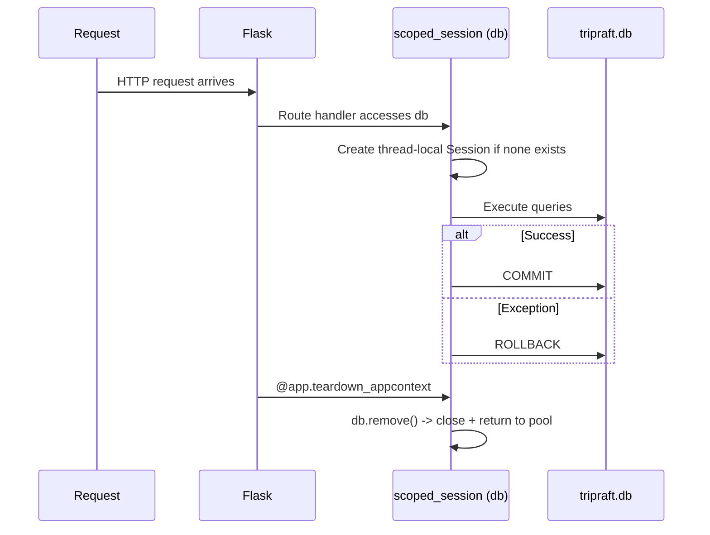

---

## Application Database Schema

### Users Domain (2 tables)

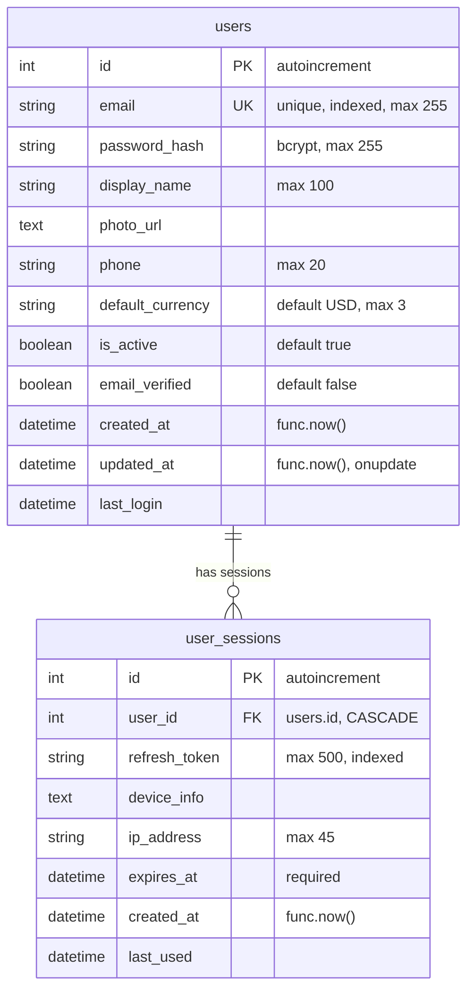

**Indexes:** `idx_user_sessions_token` on `refresh_token`, `idx_user_sessions_user` on `user_id`.

### Expense Domain (8 tables)

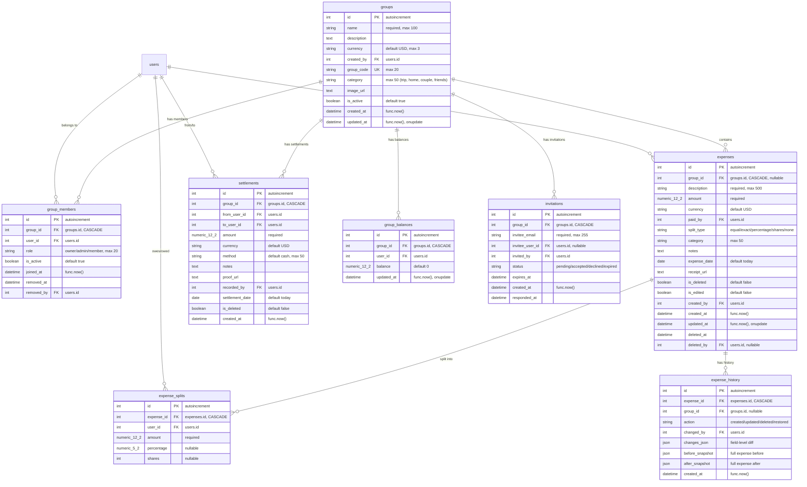

**Key indexes:**
- `idx_expenses_group` on `(group_id, is_deleted, expense_date)`
- `idx_expenses_paid_by` on `(paid_by)`
- `idx_settlements_group` on `(group_id, is_deleted)`
- `idx_settlements_users` on `(from_user_id, to_user_id)`
- `idx_balances_group` on `(group_id)`
- `idx_balances_user` on `(user_id)`
- `idx_invitations_email` on `(invitee_email, status)`
- `idx_invitations_group` on `(group_id, status)`

**Unique constraints:**
- `uq_group_member` on `(group_id, user_id)`
- `uq_expense_split` on `(expense_id, user_id)`
- `uq_group_balance` on `(group_id, user_id)`
- `uq_invitation` on `(group_id, invitee_email)`

**Special patterns:**
- **Soft deletes:** `expenses.is_deleted` and `settlements.is_deleted` flag records as deleted without removing rows
- **Denormalized balances:** `group_balances` stores pre-computed balance per user per group, updated on every expense/settlement write. Enables O(1) balance reads instead of recomputing from all expenses
- **Audit trail:** `expense_history` stores field-by-field `changes_json` diffs plus full `before_snapshot` and `after_snapshot` for every create/update/delete

### Group Planner Domain (10 tables)

All Group Planner tables use the `gp_` prefix to avoid name collisions with Expense Engine tables.

```mermaid
erDiagram
    travel_groups {
        int id PK "autoincrement"
        string name "required, max 100"
        text description
        string destination "max 255"
        float destination_lat
        float destination_lng
        string destination_type "country/state/city"
        string destination_id "max 50"
        string group_code UK "max 20, indexed"
        text group_image
        int created_by FK "users.id"
        date start_date
        date end_date
        numeric_12_2 estimated_budget
        string budget_currency "default USD"
        int expense_group_id "link to expense groups.id"
        boolean is_active "default true"
        datetime created_at "func.now()"
        datetime updated_at "func.now(), onupdate"
    }

    gp_group_members {
        int id PK "autoincrement"
        int group_id FK "travel_groups.id, CASCADE"
        int user_id FK "users.id"
        string role "creator/admin/member"
        boolean is_active "default true"
        datetime joined_at "func.now()"
        datetime removed_at
        int removed_by FK "users.id"
    }

    gp_places {
        int id PK "autoincrement"
        int group_id FK "travel_groups.id, CASCADE"
        string name "required, max 255"
        text description
        text address
        float latitude
        float longitude
        string category "restaurant/attraction/hotel/activity"
        date visit_date
        string suggested_duration "max 50"
        text remarks
        text photo_url
        text website
        float rating
        int added_by FK "users.id"
        boolean is_deleted "default false"
        datetime created_at "func.now()"
        datetime updated_at "func.now(), onupdate"
    }

    gp_place_votes {
        int id PK "autoincrement"
        int place_id FK "gp_places.id, CASCADE"
        int user_id FK "users.id"
        datetime created_at "func.now()"
    }

    gp_polls {
        int id PK "autoincrement"
        int group_id FK "travel_groups.id, CASCADE"
        string name "required, max 255"
        json options "list of option strings"
        boolean is_multiple_choice "default false"
        datetime expires_at
        int created_by FK "users.id"
        boolean is_deleted "default false"
        datetime created_at "func.now()"
    }

    gp_poll_votes {
        int id PK "autoincrement"
        int poll_id FK "gp_polls.id, CASCADE"
        int user_id FK "users.id"
        string option "max 255, the selected option text"
        datetime created_at "func.now()"
    }

    gp_invitations {
        int id PK "autoincrement"
        int group_id FK "travel_groups.id, CASCADE"
        string invitee_email "required, max 255"
        int invitee_user_id FK "users.id, nullable"
        int invited_by FK "users.id"
        string status "pending/accepted/declined/expired"
        datetime expires_at
        datetime created_at "func.now()"
        datetime responded_at
    }

    gp_checklist_items {
        int id PK "autoincrement"
        int group_id FK "travel_groups.id, CASCADE"
        string item "required, max 500"
        boolean completed "default false"
        int completed_by FK "users.id, nullable"
        datetime completed_at
        int author_id FK "users.id"
        boolean is_deleted "default false"
        datetime created_at "func.now()"
    }

    gp_itinerary_documents {
        int id PK "autoincrement"
        int group_id FK "travel_groups.id, CASCADE, unique"
        text content "Markdown, default empty"
        int last_edited_by FK "users.id"
        int version "default 1"
        datetime created_at "func.now()"
        datetime updated_at "func.now(), onupdate"
    }

    gp_group_activities {
        int id PK "autoincrement"
        int group_id FK "travel_groups.id, CASCADE"
        int user_id FK "users.id"
        string action "place_added/poll_created/member_joined/etc"
        string entity_type "place/poll/member/checklist"
        int entity_id
        json details
        datetime created_at "func.now()"
    }

    travel_groups ||--o{ gp_group_members : "has members"
    travel_groups ||--o{ gp_places : "has places"
    travel_groups ||--o{ gp_polls : "has polls"
    travel_groups ||--o{ gp_invitations : "has invitations"
    travel_groups ||--o{ gp_checklist_items : "has checklist"
    travel_groups ||--|| gp_itinerary_documents : "has itinerary"
    travel_groups ||--o{ gp_group_activities : "has activity log"
    gp_places ||--o{ gp_place_votes : "has votes"
    gp_polls ||--o{ gp_poll_votes : "has votes"
    users ||--o{ gp_group_members : "belongs to"
    users ||--o{ gp_places : "added_by"
    users ||--o{ gp_place_votes : "voted"
```

**Key indexes:**
- `idx_gp_group_members_user` on `(user_id, is_active)`
- `idx_gp_group_members_group` on `(group_id, is_active)`
- `idx_gp_places_group` on `(group_id, is_deleted)`
- `idx_gp_polls_group` on `(group_id, is_deleted)`
- `idx_gp_poll_votes` on `(poll_id, user_id)`
- `idx_gp_invitations_email` on `(invitee_email, status)`
- `idx_gp_invitations_group` on `(group_id, status)`
- `idx_gp_checklist_group` on `(group_id, is_deleted)`
- `idx_gp_activities_group` on `(group_id, created_at)`

**Unique constraints:**
- `uq_gp_group_member` on `(group_id, user_id)`
- `uq_gp_place_vote` on `(place_id, user_id)` -- one vote per user per place
- `uq_gp_poll_vote` on `(poll_id, user_id, option)` -- one vote per option per user
- `uq_gp_invitation` on `(group_id, invitee_email)`

**Cross-domain link:** `travel_groups.expense_group_id` references `groups.id` (expense engine). This is an integer field, not a foreign key constraint -- allowing the two domains to be loosely coupled. A travel group can optionally link to an expense group for budget tracking.

---

## Travel Reference Database (`infrastructure/db/travel_db.py`)

### Connection Pattern

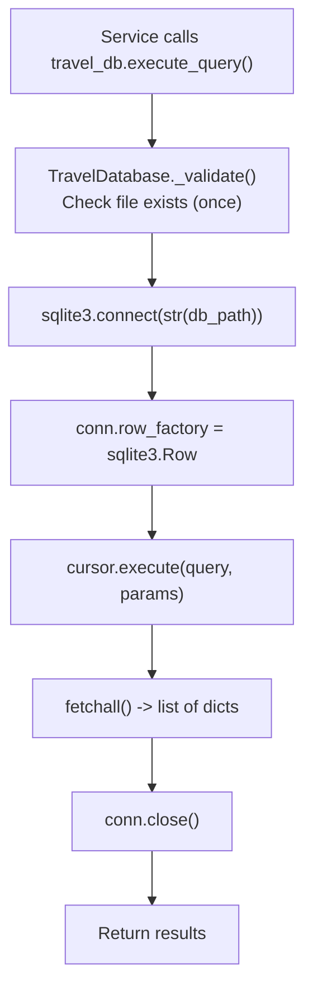

**Key design:** Each call opens and closes its own connection. No connection pooling. This is safe because:
- The database is read-only (no write contention)
- SQLite read operations are very fast
- The `TravelDatabase` singleton validates the file path once (lazy `_validated` flag)

### Schema

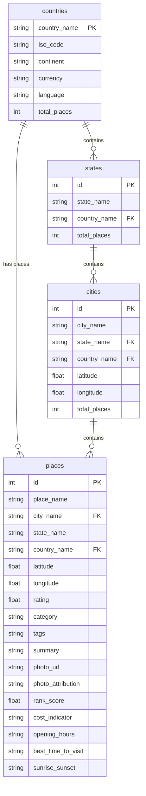

### Data Quality

| Metric | Value |
|--------|-------|
| Total countries | 82 |
| Total states | 800+ |
| Total cities | 888 |
| Total places | 16,830 |
| Places with photos | ~70% (11,781) |
| Places with ratings | ~85% |
| Places with coordinates | ~95% |
| Places with descriptions | ~90% |

### How the Travel DB is Queried

The `TravelDatabase` class provides three methods:

| Method | Returns | Use Case |
|--------|---------|----------|
| `execute_query(sql, params)` | `List[Dict]` | Multi-row results (search, list) |
| `execute_one(sql, params)` | `Optional[Dict]` | Single-row lookup (place details) |
| `execute_count(sql, params)` | `int` | Count queries (stats, pagination) |

**Example: Place search query path:**

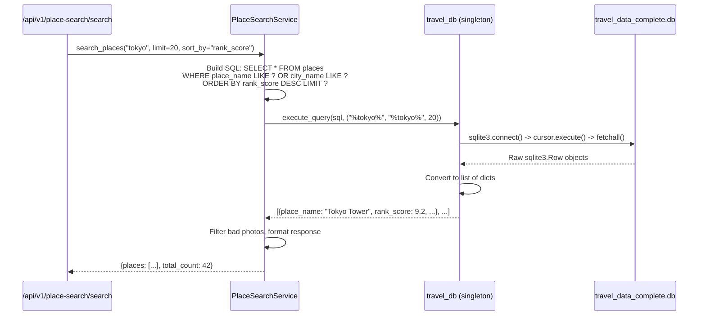

---

## Caching Architecture (`infrastructure/cache/redis.py`)

### Redis Client Implementation

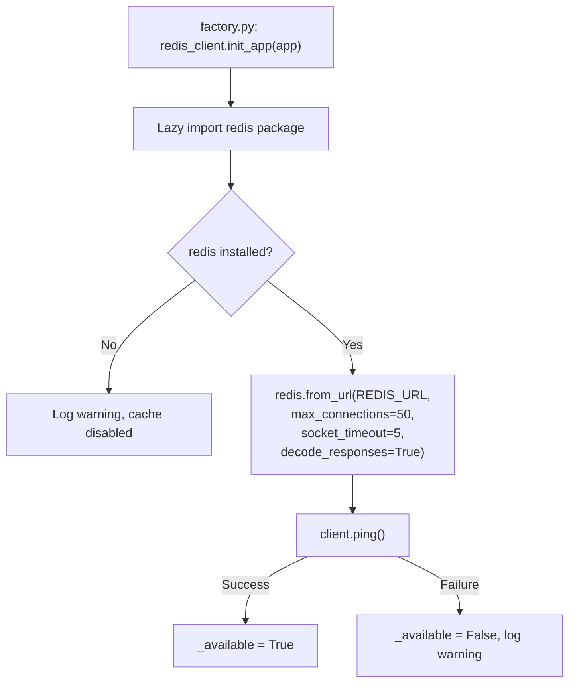

**Graceful fallback:** Every `get`, `set`, `delete`, `exists` method checks `self.available` first. If Redis is down, all operations return safe defaults (`None`, `False`, `0`). No exceptions ever bubble up from cache operations.

### The `@cache_response` Decorator

This is the primary caching mechanism, applied to Flask route functions:

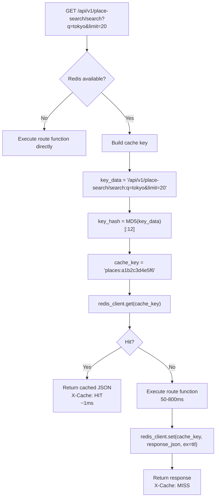

**Key generation:** `MD5(request.path + ":" + query_string)[:12]` -- first 12 hex characters of the MD5 hash. The `key_prefix` argument is prepended (e.g., `places:`, `locations:`, `groups:`).

### Cache TTLs by Data Type

| Data Type | Key Prefix | TTL | Rationale |
|-----------|-----------|-----|-----------|
| Place search results | `places:` | 300s (5 min) | Travel data is static; short TTL for variety |
| Autocomplete suggestions | `autocomplete:` | 300s (5 min) | Same static data |
| Country/state/city lists | `locations:` | 1800-3600s (30-60 min) | Hierarchical data rarely changes |
| Group details | `groups:` | 60s (1 min) | Changes with member actions |
| Expense balances | `balances:` | 30s | Changes with every expense/settlement |
| Destination events | `events:` | 300s (5 min) | External API data |

### Cache Invalidation

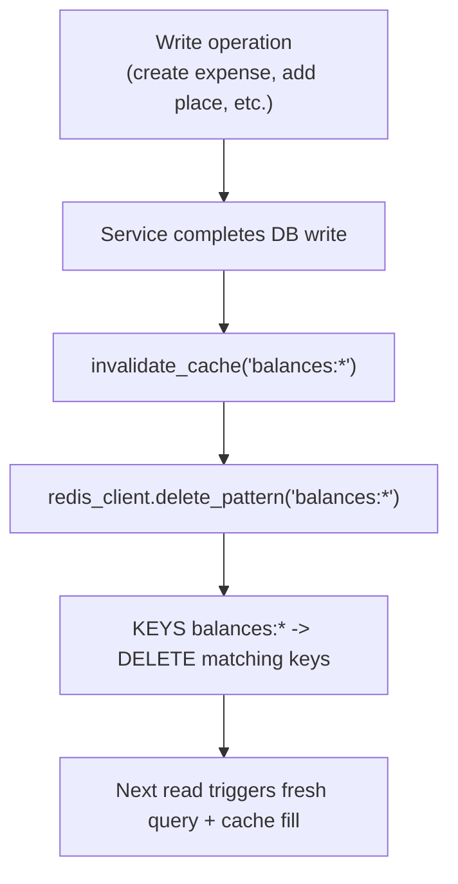

`invalidate_cache(pattern)` calls `redis_client.delete_pattern(pattern)` which uses `KEYS pattern` + `DELETE`. This is acceptable for a small dataset but would need `SCAN` at scale.

### Redis Memory Usage

| Category | Approx. Size |
|----------|-------------|
| Place search results (cached JSON) | 4-6 MB |
| Location hierarchies | 1-2 MB |
| Rate limiter state (Flask-Limiter) | 0.5-1 MB |
| Session-related data | 0.5-1 MB |
| **Total** | **~8-12 MB of 30 MB** |

---

## End-to-End Data Flows

### Flow 1: Creating an Expense

Shows how data moves through all layers -- frontend, backend, database, and cache:

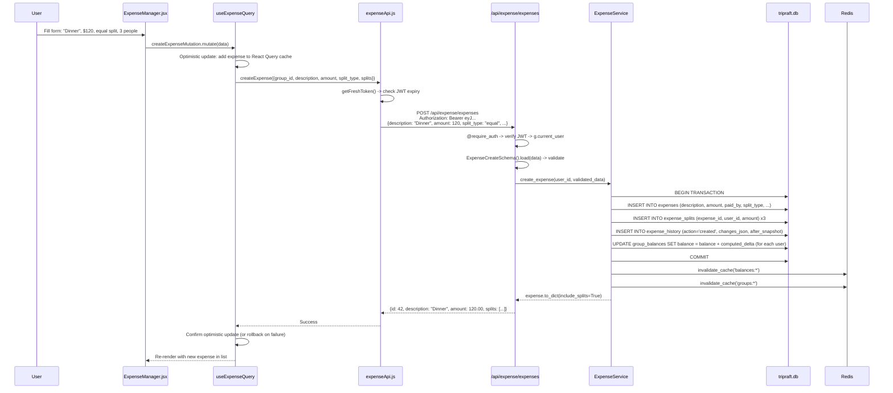

### Flow 2: Place Search with Cache

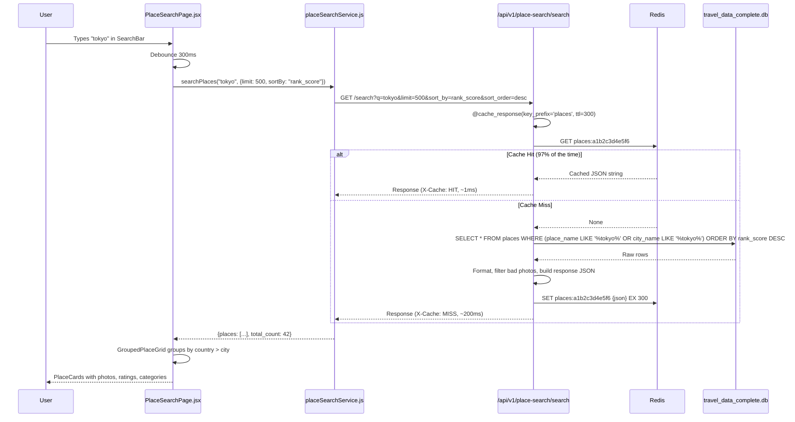

### Flow 3: Group Planner Load with All Data

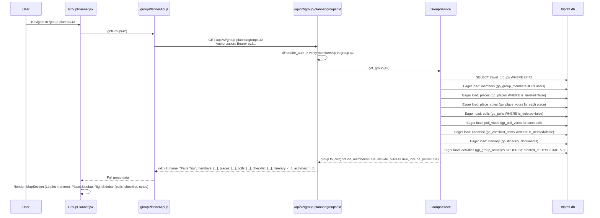

### Flow 4: Balance Recalculation on Expense Update

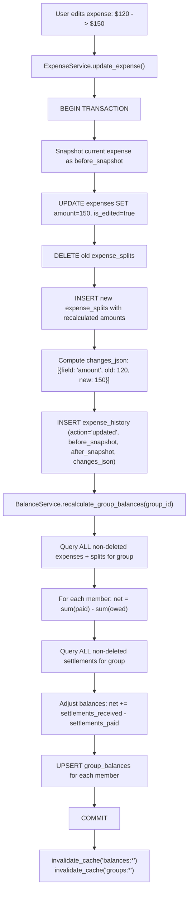

The `group_balances` table stores the **net position** of each member:
- **Positive balance** = this person is owed money (they paid more than their share)
- **Negative balance** = this person owes money (they were covered by others)
- **Zero balance** = fully settled

---

## Migration Plan: SQLite to PostgreSQL

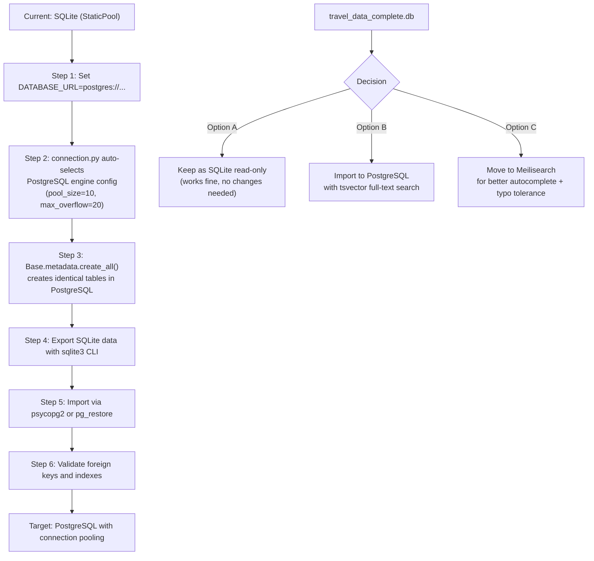

The SQLAlchemy ORM means the migration is mostly a config change. `connection.py` already has the PostgreSQL branch:

```python
# Already in connection.py:
if DATABASE_URL.startswith('sqlite'):
    engine = create_engine(DATABASE_URL, poolclass=StaticPool, ...)
else:
    engine = create_engine(DATABASE_URL, pool_size=10, max_overflow=20, pool_pre_ping=True)
```

The travel database is a separate decision. It works fine as read-only SQLite. PostgreSQL `tsvector` or Meilisearch would only be needed for fuzzy search and typo tolerance -- features not yet required.
