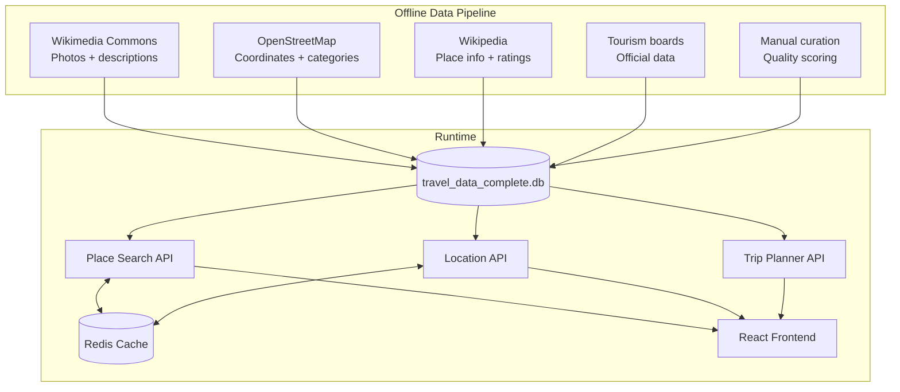
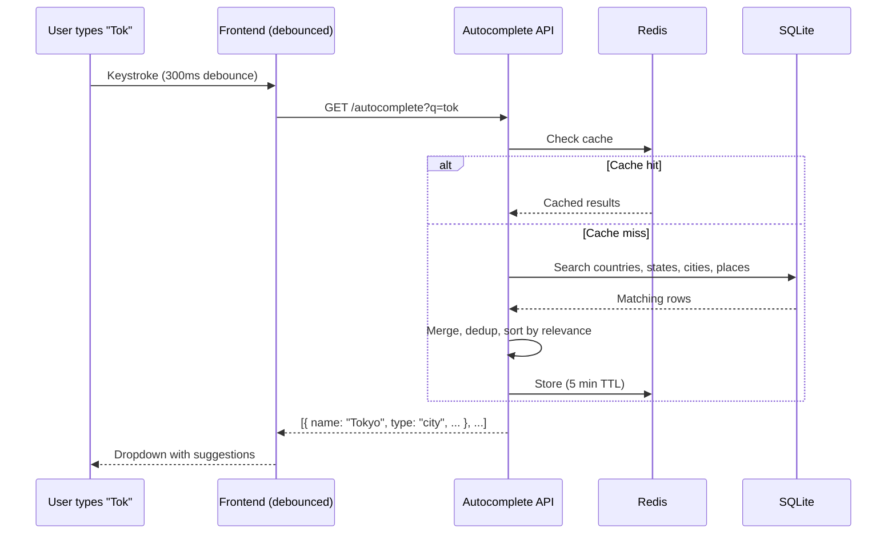
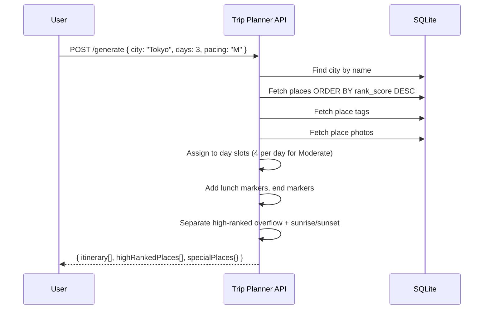
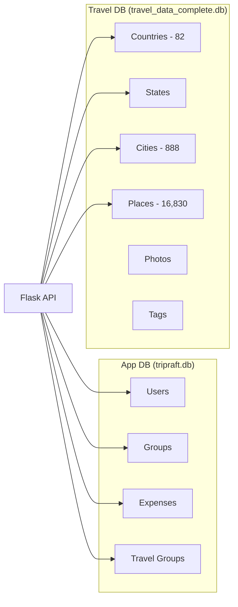

# TripRaft -- Places Engine & Trip Planner

## What It Does

The Places Engine is our core content asset. It powers place search, autocomplete, destination browsing, and trip itinerary generation. Unlike competitors who rely on Google Places API ($17 per 1,000 requests), we own our data outright.

16,830 curated places. 82 countries. 888 cities. Zero API costs for basic lookups.

The Trip Planner sits on top of the places data and generates day-by-day itineraries from it.

---

## Architecture Overview

The places system is split across two domains and three API blueprints:

| Component | Location | Database | Purpose |
|-----------|----------|----------|---------|
| Places Search | `domain/places/` | `travel_data_complete.db` | Full-text search + autocomplete |
| Location Hierarchy | `api/v1/locations.py` | `travel_data_complete.db` | Country > State > City > Places browsing |
| Trip Planner | `api/v1/trips.py` | `travel_data_complete.db` | Rank-based itinerary generation |

All three read from the same SQLite database (`travel_data_complete.db`). This database is **read-only at runtime** -- it was populated offline by scraping and curating data from multiple sources.



---

## The Data: What One Place Looks Like

Every place in the database has rich metadata. This comes from the `Place` dataclass in `domain/places/models.py`:

| Field | Type | What It Is |
|-------|------|-----------|
| `place_name` | string | Local language name |
| `name_english` | string | English name (used for display) |
| `ai_summary` | text | Description of the place |
| `suggested_duration` | string | How long to spend ("2-3 hours") |
| `best_time_to_visit` | string | Season or time recommendation |
| `place_tip` | text | Practical tips for visitors |
| `advanced_booking` | string | Whether you need to book ahead |
| `sunrise_view` | boolean | Good for sunrise? |
| `sunset_view` | boolean | Good for sunset? |
| `sunrise_time` | string | Local sunrise time |
| `sunset_time` | string | Local sunset time |
| `cost` | string | free / low / medium / high |
| `rating_tourist_priority` | float | How important for first-time tourists (1-5) |
| `rating_traveler_experience` | float | How good for experienced travelers (1-5) |
| `latitude` / `longitude` | float | Coordinates |
| `address` | string | Full address |
| `official_website` | string | Website URL |
| `rank_score` | float | Composite ranking (used for search + itinerary) |
| `tags` | JSON | Category tags |
| `opening_hours` | JSON | Per-day hours (Monday through Sunday + notes) |

**Photos** are stored separately with licensing info:

| Field | What It Is |
|-------|-----------|
| `thumbnail_url` | Image URL |
| `photo_title` | Title/description |
| `author` | Photographer name |
| `license` | License type |
| `credit` | Attribution text |
| `usage_terms` | How we can use it |

### Location Hierarchy

Places are organized into:

```
Countries (82)
  └── States
       └── Cities (888)
            └── Places (16,830)
```

Each level has its own table: `countries`, `states`, `cities`, `places`.

The location models in `domain/places/location_models.py` provide query methods for each level: `CountriesModel`, `StatesModel`, `CitiesModel`, `PlacesModel`.

---

## Complete Flows

### Flow 1: Autocomplete (What Happens When You Type)

**What the user does:** Starts typing "Tok..." in the search bar.

**What happens:**

1. Frontend debounces (300ms) then calls `GET /api/v1/place-search/autocomplete?q=tok`
2. Minimum query length enforced (from config)
3. `PlaceSearchService` queries the database for matching places
4. Returns `AutocompleteSuggestion` objects: { id, name, type, parent }
5. Response cached in Redis for 5 minutes

**The Location API has its own autocomplete** at `GET /autocomplete?q=tok` that's more comprehensive:

1. Searches ALL four entity types in parallel: Countries, States, Cities, Places
2. Results merged, deduplicated by display_name
3. Sorted by relevance: exact match > starts_with > contains
4. Then by type priority: city > state > country > place
5. Cached 5 minutes



### Flow 2: Full-Text Search

**What the user does:** Types a destination and hits search.

**What happens (Place Search -- `/api/v1/place-search/search`):**

1. `GET /search?q=tokyo&limit=20&offset=0`
2. Optional filters: `sort_by` (rank_score / name / rating_tourist_priority), `sort_order`, `cost` (comma-separated: free,low,medium,high), `rating` (minimum 1-5)
3. Searches `place_name`, `name_english`, `tags`, and `ai_summary` columns
4. Results ranked by relevance score: name match (3) > tag match (2) > summary match (1)
5. Paginated, cached 5 minutes

**What happens (Location Search -- `GET /search?q=tokyo`):**

This is the more sophisticated search with a 7-level priority cascade:

1. Exact city name match
2. Exact state name match
3. Exact country name match
4. Partial city name match
5. Partial state name match
6. Partial country name match
7. Place name search (fallback)

For a **country match**, the response is structured differently -- it returns the country info plus its states, and each state includes its top 5 places. This gives a "explore Japan" experience without multiple API calls.

Cached for 5 minutes.

### Flow 3: Browsing by Location

**What the user does:** Picks a country, then a city, then browses places.

**API calls:**

```
GET /countries                          → all 82 countries (cached 1 hour)
GET /countries/<id>/states              → states in country (cached 1 hour)
GET /states/<id>/cities                 → cities in state
GET /cities/<id>/places?limit=50        → places in city (cached 5 min)
                                          returns total_count + has_more
GET /places/<id>                        → single place with full details
```

Each level returns the parent info too, so you always know the bread crumb trail (e.g., city response includes state_name and country_name).

**Results are sorted by `rating_tourist_priority DESC` then `place_name ASC`** -- important places first, alphabetical within same rating.

### Flow 4: Getting Place Details

`GET /places/<id>` returns everything about a single place:

- All the fields from the table above
- Joined city, state, and country names
- Parsed JSON fields (photos, coordinates, tags, opening_hours)
- `name` field populated from `name_english` (fallback to `place_name`)
- `summary` from `ai_summary`
- `coordinates` as `{ lat, lng }` object

### Flow 5: Trip Itinerary Generation

**What the user does:** Goes to Trip Planner, picks a city and number of days.

**What happens:**

1. `POST /api/trip-planner/generate` with:
   - `city` or `destination` (required)
   - `days` (1-14, default 3)
   - `pacing`: R = Relaxed (3 stops/day), M = Moderate (4), P = Packed (6)
2. Backend finds the city in SQLite
3. Fetches all places in that city, ranked by `rank_score`
4. Assignment algorithm:
   - Places sorted by rank (best first)
   - Assigned to day slots with **2-hour intervals starting at 9:00 AM**
   - Lunch marker inserted at stop 3
   - End-of-day marker at last stop
5. Tags loaded separately via `place_tags` join
6. Each place includes its first `thumbnail_url` from the photos table

**Response structure:**

```json
{
  "itinerary": [
    {
      "day": 1,
      "stops": [
        {
          "name": "Senso-ji Temple",
          "time": "09:00",
          "rank_score": 95,
          "photo": "https://...",
          "tags": ["temple", "historic"],
          "is_lunch": false,
          "is_end": false
        }
      ]
    }
  ],
  "highRankedPlaces": [...],
  "specialPlaces": {
    "sunrise": [...],
    "sunset": [...]
  },
  "response_time_ms": 142
}
```

- `highRankedPlaces`: top-ranked places that didn't fit into the itinerary (so users know what they're missing)
- `specialPlaces`: places with `sunrise_view` or `sunset_view` flags, so users can plan golden hour visits
- `response_time_ms`: performance tracking



### Flow 6: Destination Discovery (Group Planner Integration)

The group planner has its own destination endpoints:

1. `GET /api/v2/group-planner/destinations/autocomplete?q=par` -- searches cities → states → countries directly against SQLite (raw `sqlite3`, not ORM, for speed)
2. `GET /destinations/<destination>/places` -- places at a named destination via `PlacesService`
3. `GET /destinations/<destination>/top-places` -- top-rated subset (max 20)

These are separate from the place search API because they're optimized for the group planner's "pick a destination" workflow.

---

## The Ranking Algorithm

Every place has a `rank_score` that determines its position in search results and trip itineraries. This isn't just a rating -- it's a composite score based on multiple signals.

**Scoring factors:**
- **Rating** (40%): Community ratings from source data
- **Photo quality** (20%): Whether we have a valid, high-resolution photo
- **Description completeness** (15%): Places with good descriptions rank higher
- **Category importance** (15%): Major landmarks rank above niche spots
- **Data completeness** (10%): Opening hours, coordinates, cost indicators

---

## Photo Strategy

Photos are the most visible part of the places engine, and our biggest data quality challenge.

**Current Coverage:**
- Good quality: ~55%
- Acceptable: ~15%
- Low quality (logos, maps): ~10%
- No photo: ~20%

**Filtering Pipeline:** We exclude bad images by pattern matching on URLs:
- `commons-logo.svg`, `airplane_silhouette.svg`, `flag_of_*`, `coat_of_arms`
- `logo_*`, `icon-*`, `placeholder`, `no_image`, `default_*`, `blank.svg`
- `*_location_map.svg`, `*_map.svg`, `symbol_*`, `pictogram`

**Future Plan (Multi-Source Cascade):**
Our DB cache → Wikimedia Commons → Unsplash API → Flickr geotagged → Pexels → Google Places (last resort) → Placeholder

This keeps photo costs at nearly zero while maintaining decent coverage.

---

## Caching Strategy

Redis caching is used heavily across the location and search APIs via the `@cached` decorator.

| What | TTL | Why |
|------|-----|-----|
| Country list | 1 hour | Changes maybe once a year |
| State/city lists | 1 hour | Same -- very static |
| City details | 30 min | Slightly more dynamic |
| Search results | 5 min | Someone might search the same thing again soon |
| Autocomplete | 5 min | Same prefix typed by different users |
| Place detail | Not cached | Relatively rare individual lookups |

The trip planner doesn't use caching -- every generation is unique based on the parameters.

---

## API Reference

### Place Search (`/api/v1/place-search`) -- No auth required

| Method | Path | What It Does |
|--------|------|-------------|
| GET | `/search` | Full text search (filters: `q`, `limit`, `offset`, `sort_by`, `sort_order`, `cost`, `rating`) |
| GET | `/autocomplete` | Type-ahead suggestions |
| GET | `/place/<id>` | Single place details |
| GET | `/stats` | DB statistics (countries, states, cities, places, photos, tags counts) |

### Locations (`/api/v1/locations`) -- No auth required

| Method | Path | What It Does |
|--------|------|-------------|
| GET | `/search` | Unified search with 7-level priority cascade |
| GET | `/countries` | All countries |
| GET | `/countries/<id>` | Single country |
| GET | `/countries/search` | Search countries by name |
| GET | `/countries/<id>/states` | States in country |
| GET | `/states/<id>` | Single state |
| GET | `/countries/<id>/cities` | Cities in country |
| GET | `/states/<id>/cities` | Cities in state |
| GET | `/cities/<id>` | Single city |
| GET | `/cities/search` | Search cities (optional `country`/`state` filters) |
| GET | `/cities/<id>/places` | Places in city (paginated, returns `total_count` + `has_more`) |
| GET | `/places/<id>` | Single place |
| GET | `/places/search` | Search places (optional `city`/`country` filters) |
| GET | `/autocomplete` | Unified autocomplete (countries + states + cities + places) |
| GET | `/suggested-places` | Suggested places by destination type + id |

### Trip Planner (`/api/trip-planner`) -- No auth required

| Method | Path | What It Does |
|--------|------|-------------|
| POST | `/generate` | Generate day-by-day itinerary |
| GET | `/cities` | List available cities (limit, country filter) |
| GET | `/cities/search` | Search cities by name |

---

## Database Architecture

Two separate database connections:

1. **App database** (`tripraft.db`) -- managed by SQLAlchemy ORM. Used by the expense engine and group planner for user data, groups, expenses, etc.
2. **Travel database** (`travel_data_complete.db`) -- managed by raw `sqlite3` via `DatabaseConnection` / `DatabaseManager` singletons. Read-only. Contains all place data.

The places domain uses **dataclasses** (not SQLAlchemy models) because the travel database is read-only and doesn't need ORM features. This also keeps things lightweight -- no session management, no migration tracking, just fast reads.



---

## What's Not Built Yet

| Feature | Current State | Planned |
|---------|--------------|---------|
| AI itinerary generation | Rank-based assignment | Phase 2 -- consider proximity, opening hours, interests |
| Live data from APIs | Static SQLite only | Phase 3 -- Google Places, weather, pricing |
| Map view | Coordinates stored | Phase 2 -- visual itinerary on a map |
| Weather overlay | Not built | Phase 2 -- show weather for each day |
| User reviews/ratings | Not built | Phase 3 -- community contributions |
| Photo uploads | Not built | Phase 3 -- user-submitted photos |
| Offline access | Not built | Phase 4 -- downloadable trip data |
