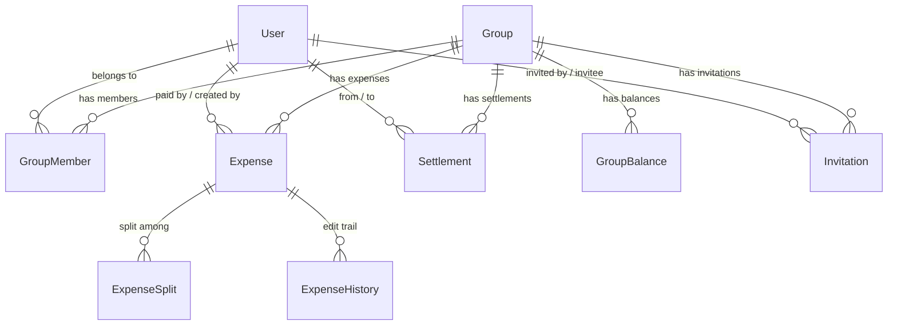
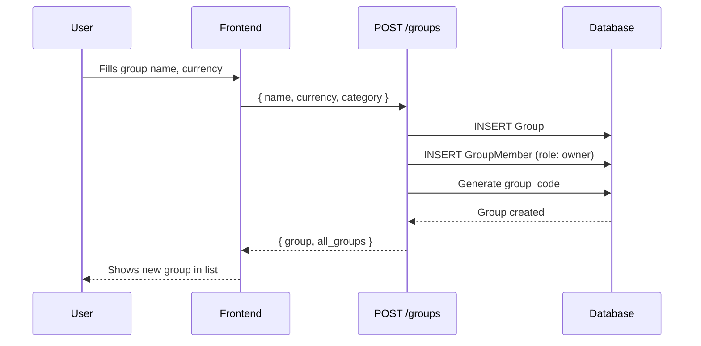
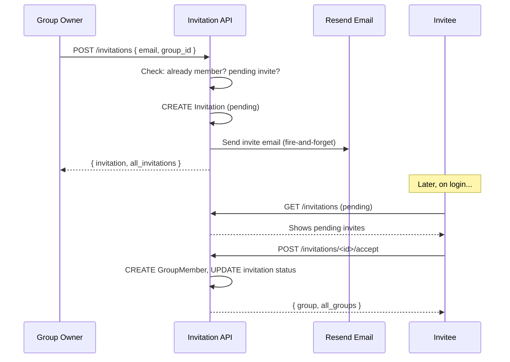
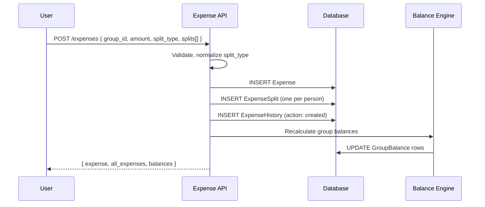
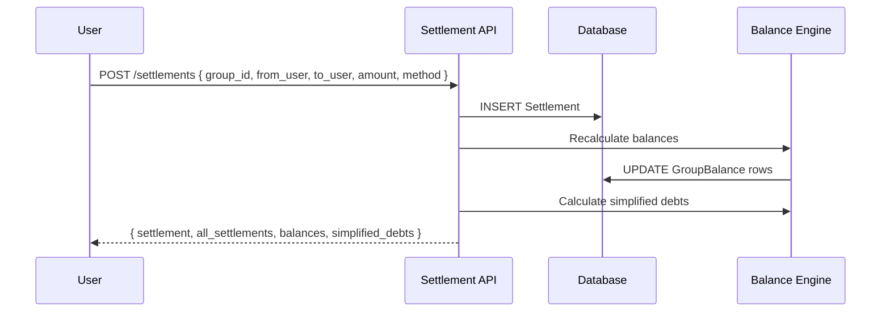
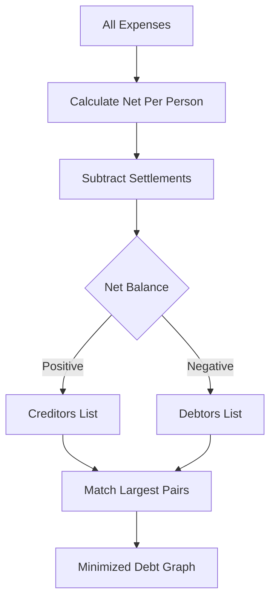

# TripRaft -- Expense Engine

## What Problem Does This Solve

Group trips always end with the same headache: who paid for what, who owes whom, and how do we settle up without making it awkward.

Our expense engine handles all of it -- group expenses with multiple split types, personal expense tracking, real-time balance calculation, settlement management, and a full edit history trail. Think of it as Splitwise, but built right into the trip planning workflow.

---

## Core Concepts

The expense engine lives in `web/backend/app/domain/expenses/` and is served through four API blueprints under `/api/expense/`.

- **Expense Group** (`groups` table): A container for shared expenses. Has a name, currency, category (trip / home / couple / friends), and a unique `group_code` for joining via link.
- **Group Member** (`group_members` table): Links users to groups with roles (owner / admin / member). Soft-deleted when removed -- keeps `removed_at` and `removed_by` so balances stay intact.
- **Expense** (`expenses` table): Something someone paid for. Can belong to a group OR be personal (`group_id` is nullable). Tracks who paid, how to split, category, notes, receipt URL, and whether it's been edited or deleted.
- **Expense Split** (`expense_splits` table): One row per person per expense. Records the exact amount each person owes, plus optional percentage and shares.
- **Settlement** (`settlements` table): An actual payment between two people. Records method (cash / upi / bank_transfer), proof URL, and who recorded it.
- **Group Balance** (`group_balances` table): Denormalized net balance per member per group. Recalculated after every expense or settlement change.
- **Invitation** (`invitations` table): Invite someone by email. Status goes through pending → accepted / declined / expired.
- **Expense History** (`expense_history` table): Full audit trail. Every create, update, delete, and restore is logged with before/after snapshots and a `changes_json` diff.

---

## How It All Connects

---

## Complete Flows (Start to End)

### Flow 1: Creating an Expense Group

**What the user does:** Taps "Create Group," fills in name, picks a currency.

**What happens in the backend:**

1. `POST /api/expense/groups` hits `create_group()` in `expense_groups.py`
2. Request validated against `CreateExpenseGroupSchema` -- name is required, currency defaults to INR, category is optional
3. New `Group` row created. The creator is automatically added as a `GroupMember` with role `owner`
4. A unique `group_code` is generated (for invite-by-link)
5. Response returns the new group AND all the user's groups (so the frontend list updates immediately)

### Flow 2: Inviting Someone to a Group

**What the user does:** Opens group settings, types an email, hits "Invite."

**What happens:**

1. `POST /api/expense/invitations` hits `send_invitation()`
2. Backend accepts `invitee_email`, `invited_email`, or just `email` (three field names for frontend compatibility)
3. Checks: is this email already a member? Is there already a pending invite?
4. Creates `Invitation` row with status `pending` and an `expires_at` timestamp
5. Sends email notification via Resend API (async -- failure doesn't block the response)
6. Response returns the invitation plus ALL group invitations

**What the invitee sees:**

1. `GET /api/expense/invitations` (called on login/homepage) returns their pending invites
2. They tap "Accept" → `POST /api/expense/invitations/<id>/accept`
3. Backend creates a new `GroupMember` row with role `member`, sets invitation status to `accepted`, records `responded_at` timestamp
4. Response returns the full group details plus ALL the user's groups

Declining works the same way but sets status to `declined` instead.

### Flow 3: Adding an Expense (Group)

**What the user does:** Opens a group, taps "Add Expense," fills the form.

**What happens:**

1. `POST /api/expense/expenses` with `group_id`, `description`, `amount`, `split_type`, and `splits[]` array
2. Validated against `CreateExpenseSchema`
3. `paid_by` defaults to the current user if not specified
4. `split_type` is normalized to lowercase (frontend might send "Equal")
5. Frontend sends `date`; backend maps it to `expense_date`
6. `Expense` row created, then `ExpenseSplit` rows for each person
7. `ExpenseHistory` row created with action `created` and an `after_snapshot`
8. **Group balances recalculated** -- the engine walks all expenses and settlements, sums up each member's net position
9. Response returns: the new expense, ALL user expenses, AND current group balances

This "return everything" pattern is intentional. The frontend replaces its entire local state on each mutation, so it's always in sync with the server.

### Flow 4: Adding a Personal Expense

Same endpoint (`POST /api/expense/expenses`), but `group_id` is null (or omitted). No splits needed. `split_type` is `none`. It's just for personal tracking -- no balance calculations happen.

`GET /api/expense/expenses/personal` returns only personal (non-group) expenses.

### Flow 5: Editing an Expense

**What the user does:** Opens an expense, changes the amount or description.

**What happens:**

1. `PUT /api/expense/expenses/<id>` with whatever fields changed
2. Permission check: you must be the creator, the payer, or a group admin. Otherwise 403.
3. If `paid_by` is sent, it's converted to int (frontend sometimes sends string)
4. The expense's `is_edited` flag is set to `true`
5. `ExpenseHistory` row created with action `updated`, `before_snapshot`, `after_snapshot`, and `changes_json` (the diff of what changed)
6. If splits changed, old splits are deleted and new ones created
7. Group balances recalculated
8. Response: updated expense + all expenses + balances

### Flow 6: Deleting an Expense

**What happens:**

1. `DELETE /api/expense/expenses/<id>`
2. Permission check (same as edit)
3. Soft delete: `is_deleted = true`, `deleted_at` = now, `deleted_by` = current user
4. `ExpenseHistory` row with action `deleted`
5. Group balances recalculated (the deleted expense no longer counts)
6. Response: remaining expenses + balances

The expense row stays in the database forever. You can pass `include_deleted=true` when fetching group expenses to see deleted ones too.

### Flow 7: Viewing Expense History

`GET /api/expense/expenses/<id>/history` returns every change ever made to that expense -- who changed what, when, with full before/after snapshots.

Each history entry includes:
- `action`: created / updated / deleted / restored
- `changed_by` + `changed_by_name`
- `changes`: the diff (which fields changed, old value vs new value)
- `before_snapshot`: full expense state before the change
- `after_snapshot`: full expense state after the change
- `created_at`: when the change happened

This is how we handle disputes. If someone says "I didn't change that," we can pull up the exact edit trail.

### Flow 8: Settlements (Paying Someone Back)

**What the user does:** Opens "Settle Up," picks who they're paying, enters amount.

**What happens:**

1. `POST /api/expense/settlements` with `group_id`, `from_user_id` (or `from_user`), `to_user_id` (or `to_user`), `amount`, `method`
2. Validated against `CreateSettlementSchema`
3. `Settlement` row created with `method` (cash / upi / bank_transfer), optional `notes` and `proof_url`
4. `recorded_by` set to current user (might be a third party recording it for someone else)
5. Group balances recalculated
6. Response: the settlement + ALL group settlements + updated balances + simplified debts

### Flow 9: Deleting a Settlement

`DELETE /api/expense/settlements/<id>` -- sets `is_deleted = true` and recalculates balances. Returns updated balances and the new simplified debt graph.

### Flow 10: Checking Balances

Three levels of balance information:

| Endpoint | What It Returns |
|----------|-----------------|
| `GET /settlements/group/<id>/balances` | Raw balance per member (who's up, who's down) |
| `GET /settlements/group/<id>/simplified` | Minimized debt graph (fewest transactions to settle) |
| `GET /settlements/me/balance` | Cross-group summary: total owed to you, total you owe, net |

### Flow 11: The Full Group Dashboard

`GET /api/expense/groups/<id>/full` is the mega-endpoint. One call returns:

- Group details + member list
- All expenses (non-deleted)
- All balances per member
- Simplified debt graph (who pays whom, how much)
- All settlements
- Pending invitations

This powers the group dashboard screen. Everything in one round trip.

---

## Split Types (Five Total)

| Type | How It Works | Example |
|------|-------------|---------|
| **equal** | Total / number of people | $120 dinner, 4 people = $30 each |
| **exact** | You specify each person's amount | Alice $50, Bob $30, Carol $40 |
| **percentage** | Each person gets a percentage (must sum to 100%) | Alice 50%, Bob 25%, Carol 25% |
| **shares** | Proportional to shares assigned | Couple gets 2 shares, single gets 1 |
| **none** | No split at all | Personal expenses -- just tracking |

The `none` type is specifically for personal expenses that aren't shared with anyone. The `group_id` is null and there are no `ExpenseSplit` rows.

---

## Balance Calculation Engine

This is the heart of the system. Every time an expense or settlement is created, edited, or deleted, this runs.

**Algorithm:**
1. Fetch all non-deleted expenses in the group
2. For each expense, look at who paid and how it was split
3. Calculate net per person: if you paid $100 and your split is $25, you're owed $75
4. Sum up all expense nets per person
5. Subtract settlements already made
6. Store result in `group_balances` table (denormalized for fast reads)

**Debt Simplification:**

Without simplification, a group of 4 might need 6 separate payments. With simplification, it's usually 2-3.

1. Calculate net balance for each person
2. Sort into creditors (positive balance) and debtors (negative balance)
3. Match the largest debtor with the largest creditor
4. Transfer the minimum of the two amounts
5. Repeat until all balances are zero

---

## Member Roles and Permissions

| Role | Create Expense | Edit Any Expense | Delete Any Expense | Invite | Remove Members |
|------|---------------|-----------------|-------------------|--------|---------------|
| **owner** | Yes | Yes | Yes | Yes | Yes |
| **admin** | Yes | Yes | Yes | Yes | Members only |
| **member** | Yes | Own only | Own only | No | No |

When a member is removed, they're soft-deleted (`is_active = false`, `removed_at` set, `removed_by` recorded). Their expenses and splits stay in the system so balances remain accurate.

---

## Expense Categories

| Category | Examples |
|----------|----------|
| Food & Drink | Restaurants, groceries, coffee |
| Transport | Taxi, bus, train, fuel |
| Accommodation | Hotels, Airbnb, hostels |
| Activities | Museums, tours, adventures |
| Shopping | Souvenirs, clothes |
| Entertainment | Nightlife, shows, events |
| Utilities | Internet, phone, laundry |
| Other | Anything else |

---

## API Reference

All routes are under `/api/expense/` and require authentication (JWT).

### Expenses (`/api/expense/expenses`)

| Method | Path | What It Does |
|--------|------|-------------|
| GET | `/` | List user's expenses (filter by `group_id`, `limit`, `offset`) |
| POST | `/` | Create expense (group or personal) |
| GET | `/<id>` | Get single expense |
| PUT | `/<id>` | Update expense |
| DELETE | `/<id>` | Delete expense (soft) |
| GET | `/group/<group_id>` | Get group's expenses (`include_deleted` param available) |
| GET | `/personal` | Get personal expenses only |
| GET | `/user` | Flexible filter (`personal_only` param) |
| GET | `/<id>/history` | Get edit history for an expense |
| GET | `/me` | All expenses involving current user |

### Groups (`/api/expense/groups`)

| Method | Path | What It Does |
|--------|------|-------------|
| POST | `/` | Create group |
| GET | `/` | List user's groups |
| GET | `/<id>` | Get group details |
| GET | `/<id>/full` | Full dashboard (members + expenses + balances + debts + settlements + invitations) |
| PUT | `/<id>` | Update group (admin+) |
| DELETE | `/<id>` | Delete group (admin+) |
| GET | `/<id>/members` | List members |
| POST | `/<id>/members` | Add member by email (admin+) |
| DELETE | `/<id>/members/<member_id>` | Remove member |
| POST | `/<id>/leave` | Leave group |
| POST | `/join` | Join via invitation code |

### Invitations (`/api/expense/invitations`)

| Method | Path | What It Does |
|--------|------|-------------|
| POST | `/` | Send invitation |
| GET | `/` | Get pending invitations for current user |
| GET | `/my` | Get all invitations for current user |
| GET | `/group/<group_id>` | Get group's invitations |
| POST | `/<id>/accept` | Accept invitation |
| POST | `/<id>/decline` | Decline invitation |

### Settlements (`/api/expense/settlements`)

| Method | Path | What It Does |
|--------|------|-------------|
| POST | `/` | Record settlement (payment between two people) |
| GET | `/<id>` | Get settlement details |
| DELETE | `/<id>` | Delete settlement |
| GET | `/group/<group_id>` | Get group settlements (paginated) |
| GET | `/group/<group_id>/balances` | Get member balances |
| GET | `/group/<group_id>/simplified` | Get simplified debt graph |
| GET | `/me/balance` | Cross-group balance summary |

---

## The "Return Everything" Pattern

Every write operation in the expense engine returns more than just the affected entity. Create an expense? You get back ALL expenses plus updated balances. Record a settlement? You get ALL settlements, updated balances, AND the simplified debt graph.

This is deliberate. The frontend replaces its entire local state after each mutation. No stale data, no sync issues, no "refresh to see changes." The tradeoff is slightly larger response payloads, but for expense groups (which rarely exceed a dozen members), the data is small enough that it doesn't matter.

---

## Email Notifications

| Event | Who Gets Notified | Content |
|-------|------------------|---------|
| Expense added | All group members except payer | "Alice added $100 for dinner" |
| Settlement created | Payee | "Bob sent you $45" |
| Invitation sent | Invitee | "Alice invited you to Trip Group" |
| Invitation accepted | Group owner | "Bob joined your group" |

Sent via Resend API. Email failures are caught and logged but never block the main operation.

---

## Integration with Group Planner

The expense engine doesn't know about the group planner. But the group planner can create and link an expense group to a travel group:

1. User creates a travel group in the group planner
2. User hits "Link Expenses" which calls `POST /api/v2/group-planner/groups/<id>/link-expense`
3. Group planner creates a new expense group, copies all travel group members into it, and stores the `expense_group_id` on the travel group
4. From that point, expenses show up in both contexts

This keeps the two engines loosely coupled. The expense engine is a standalone service that the planner happens to use.

---

## Edge Cases We Handle

1. **Zero-amount expenses**: Rejected by validation
2. **Splits that don't add up**: Validated to equal the total amount
3. **Deleted member with outstanding balance**: Soft-delete preserves all their expense data and balances
4. **Currency rounding**: All amounts stored as `Numeric(12, 2)` -- always 2 decimal places
5. **Personal expenses in group context**: `group_id` is nullable, `split_type` is `none`
6. **Who deleted what**: `deleted_by` on the expense, plus `ExpenseHistory` logs every action
7. **Frontend field name mismatches**: Backend accepts multiple field names (`date` / `expense_date`, `from_user` / `from_user_id`, `email` / `invitee_email` / `invited_email`)
