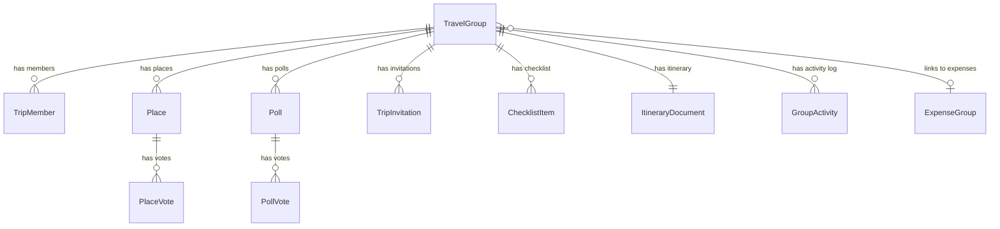
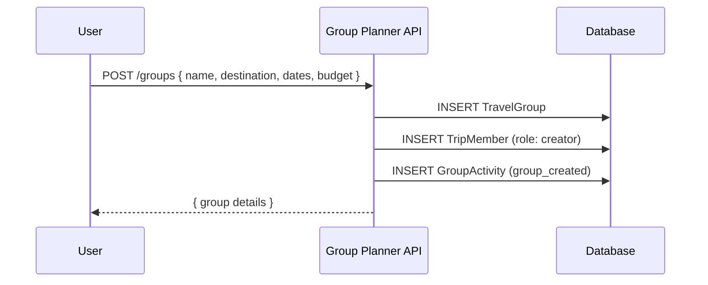
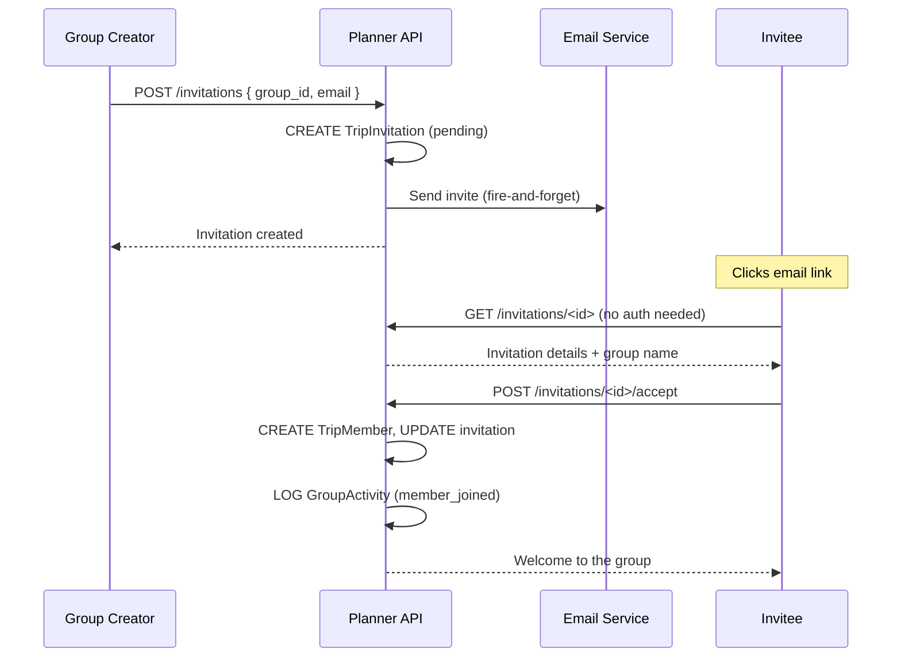
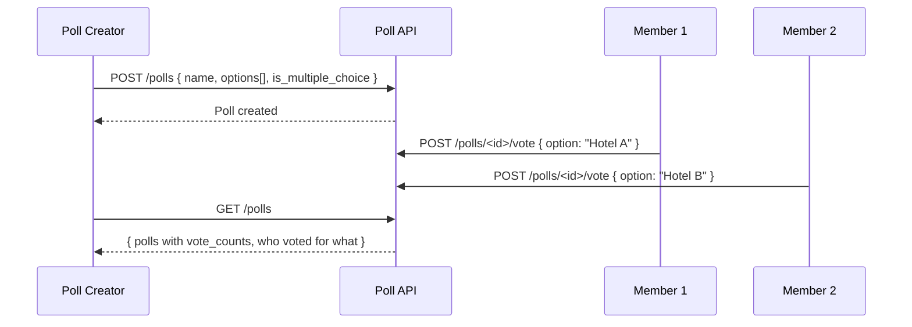
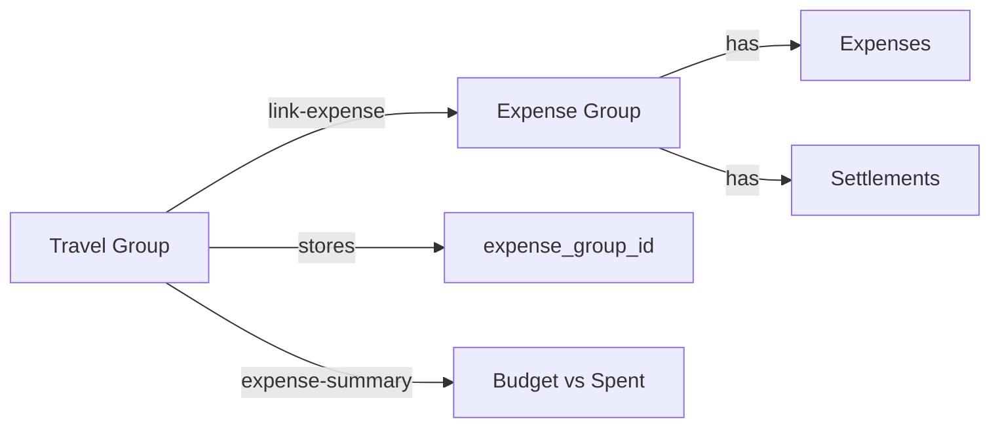

# TripRaft -- Group Planner

## What This Does

The group planner is where collaborative trip planning actually happens. Create a group, invite friends, add places you want to visit, vote on them, create polls for decisions, build a shared itinerary, track preparation with checklists, and link it all to the expense engine when money comes into play. It's the social layer of TripRaft.

---

## How It's Organized

The group planner is a separate domain from the expense engine. Lives in `web/backend/app/domain/group_planner/`. All database tables are prefixed with `gp_` to avoid name collisions with the expense engine tables (both have "groups," "members," and "invitations" concepts).

Served through multiple blueprints under `/api/v2/group-planner/`.

### The Ten Tables

| Table | What It Stores |
|-------|---------------|
| `travel_groups` | The group itself -- destination, dates, budget, link to expense group |
| `gp_group_members` | Who's in the group and their role |
| `gp_places` | Places the group is considering visiting |
| `gp_place_votes` | Who voted for which place |
| `gp_polls` | Group decisions (where to eat, which hotel, etc.) |
| `gp_poll_votes` | Individual votes on poll options |
| `gp_invitations` | Pending invitations to join the trip |
| `gp_checklist_items` | Shared to-do list (packing, bookings, documents) |
| `gp_itinerary_documents` | Collaborative markdown itinerary (one per group) |
| `gp_group_activities` | Activity feed (who did what, when) |

---

## Complete Flows (Start to End)

### Flow 1: Creating a Travel Group

**What the user does:** Taps "Plan a Trip," fills in destination, dates, budget.

**What happens:**

1. `POST /api/v2/group-planner/groups` hits `create_group()`
2. Validated against `CreateTravelGroupSchema`
3. Creates `TravelGroup` row with:
   - `name`, `description`
   - `destination` (text), `destination_lat`, `destination_lng`, `destination_type` (country / state / city), `destination_id` (links to our places database)
   - `start_date`, `end_date`
   - `estimated_budget`, `budget_currency`
   - `group_code` (unique, for invite-by-link)
   - `group_image` (optional)
4. Creator automatically added as `TripMember` with role `creator`
5. `GroupActivity` entry logged: "created the group"
6. Response returns the new group

### Flow 2: Inviting Friends

**What the user does:** Opens group settings, types an email.

**What happens:**

1. `POST /api/v2/group-planner/invitations` with `group_id` and `email`
2. Creates `TripInvitation` (table: `gp_invitations`) with status `pending`
3. Sends email via `GroupPlannerEmailService` (fire-and-forget -- if email fails, the invitation still exists)
4. `GroupActivity` logged

**Invitee receives the email:**

1. Clicks link → lands on invitation page
2. `GET /api/v2/group-planner/invitations/<id>` -- this is the ONLY unauthenticated endpoint (so the link works before login)
3. Invitee logs in (or signs up)
4. `POST /api/v2/group-planner/invitations/<id>/accept`
5. Creates `TripMember` row, updates invitation status, logs activity
6. Invitee now sees the group in their dashboard

**Other invitation actions:**
- Decline: `POST /invitations/<id>/decline`
- Resend email: `POST /invitations/<id>/resend`
- Cancel: `DELETE /invitations/<id>`
- View pending: `GET /user/invitations` (by email + user_id)
- Group's invitations: `GET /groups/<id>/invitations`

### Flow 3: Adding Places to Consider

**What the user does:** Browses destinations or searches, finds a place, taps "Add to Trip."

**What happens:**

1. `POST /api/v2/group-planner/groups/<id>/places` with place details
2. Validated against `AddPlaceSchema`
3. Duplicate check: if a place with the same name already exists in the group, returns 409 Conflict
4. Creates `Place` row (table: `gp_places`) with:
   - `name`, `description`, `address`
   - `latitude`, `longitude` (coordinates from our places DB or geocoded)
   - `category`: restaurant / attraction / hotel / activity
   - `visit_date`, `suggested_duration`
   - `photo_url`, `website`, `rating`
   - `added_by` (the user who suggested it)
5. `GroupActivity` logged: "added [place name]"
6. Other members see it when they open the group

**Geocoding:** If the frontend doesn't have coordinates, it can call `POST /api/v2/group-planner/geocode` with a `place_name`. This proxies to Nominatim (OpenStreetMap) and returns lat/lng for free. No Google API needed.

### Flow 4: Voting on Places

**What the user does:** Sees a list of suggested places, taps the heart/upvote on ones they like.

**What happens:**

1. `POST /api/v2/group-planner/groups/<id>/places/<place_id>/vote`
2. This is a **toggle** -- if you haven't voted, it adds your vote. If you already voted, it removes it.
3. `PlaceVote` row created or deleted (table: `gp_place_votes`)
4. Each place's `to_dict()` includes the current `vote_count` and list of `votes` (user IDs) so the frontend can show who voted for what

No separate "results" endpoint needed -- the place list includes vote data.

### Flow 5: Creating Polls

**What the user does:** Wants the group to decide something. Creates a poll like "Which hotel should we book?"

**What happens:**

1. `POST /api/v2/group-planner/groups/<id>/polls` with poll details
2. Validated against `CreatePollSchema`
3. Accepts `name` or `question` for the poll title (frontend flexibility)
4. `options` is a JSON array of strings (the choices)
5. `is_multiple_choice`: if true, members can vote for multiple options
6. `expires_at`: optional deadline
7. Creates `Poll` row (table: `gp_polls`)
8. `GroupActivity` logged

**Voting on a poll:**

1. `POST /api/v2/group-planner/groups/<id>/polls/<poll_id>/vote`
2. Validated against `VotePollSchema`
3. Accepts `option` (string) or `option_index` (int) -- both work
4. Creates `PollVote` row (table: `gp_poll_votes`)
5. Constraint: one vote per user per option (unless multiple choice)

**Poll results** are computed on the fly in `Poll.to_dict()`:
- `votes`: count per option
- `votes_detail`: which users voted for each option
- `voted_by`: list of all users who participated

**Deleting a poll:** `DELETE /groups/<id>/polls/<poll_id>` -- only the creator can delete. Returns 403 for others.

### Flow 6: Managing Checklists

**What the user does:** Creates a packing list, to-do items, booking reminders.

**Creating an item:**

1. `POST /api/v2/group-planner/groups/<id>/checklist`
2. Validated against `CreateChecklistItemSchema`
3. Fields: `text` (the item), `category`, `priority` (high / medium / low), `due_date`, `assigned_to_id`
4. Creates `ChecklistItem` row (table: `gp_checklist_items`) with `author_id` = current user

**Toggling completion:**

1. `POST /api/v2/group-planner/checklist/<item_id>/toggle` (or `/groups/<id>/checklist/<item_id>/toggle`)
2. Flips `completed` boolean
3. If now completed: sets `completed_by` and `completed_at`
4. If uncompleted: clears those fields

The toggle endpoint has smart `group_id` resolution -- it checks the URL param first, then the request body, then looks up the item in the database to find the group. So the frontend can call it with or without the group ID in the URL.

**Other checklist operations:**
- Update item: `PUT /checklist/<item_id>` (text, category, priority, due_date, assigned_to_id, completed)
- Delete item: `DELETE /checklist/<item_id>`
- Assign to someone: `POST /checklist/<item_id>/assign`
- Stats: `GET /groups/<id>/checklist/stats` → total, completed, pending, completion_rate, breakdown by category and priority

### Flow 7: Collaborative Itinerary

**What the user does:** Opens the itinerary tab, writes or edits the trip plan.

**What happens:**

1. Each group has exactly ONE `ItineraryDocument` (table: `gp_itinerary_documents`, one-to-one with group)
2. Content is stored as **Markdown text**
3. `PUT /api/v2/group-planner/groups/<id>/itinerary-document` (or `/itinerary`) to update
4. Tracks `last_edited_by`, `version` (incremented on each save), `updated_at`
5. Members write the day-by-day plan in markdown, and it renders in the frontend

Currently manual editing. AI-generated itineraries are a planned future feature.

### Flow 8: Linking to Expense Engine

**What the user does:** Taps "Link Expenses" in the trip group.

**What happens:**

1. `POST /api/v2/group-planner/groups/<id>/link-expense`
2. This is the cross-engine bridge. It:
   - Creates a new expense group (via the expense engine)
   - Iterates all travel group members and adds them to the expense group
   - Stores the `expense_group_id` on the `TravelGroup` row
3. **Idempotent**: if already linked, returns the existing link
4. From this point, the group planner can show expense summaries

**Expense summary:**
`GET /groups/<id>/expense-summary` returns: total spent, per-person average, budget remaining (compared to `estimated_budget`).

**Unlinking:** `POST /groups/<id>/unlink-expense` removes the link but doesn't delete the expense group.

### Flow 9: Activity Feed

Every meaningful action in a group gets logged to `gp_group_activities`:

| Action | Entity Type | When |
|--------|------------|------|
| `place_added` | place | Someone adds a place |
| `place_deleted` | place | Someone removes a place |
| `poll_created` | poll | New poll created |
| `member_joined` | member | Someone accepts invitation |
| `member_left` | member | Someone leaves |
| `checklist_added` | checklist | New checklist item |
| `itinerary_updated` | itinerary | Itinerary edited |
| `group_updated` | group | Settings changed |

Each entry includes `user_id`, `entity_type`, `entity_id`, and `details` (JSON with extra context).

`GET /groups/<id>/activities` returns recent activities. Supports a `since` timestamp parameter for polling-based "real-time" updates (the frontend polls every few seconds and only fetches new activities).

### Flow 10: Leaving / Removing Members

**Leaving:** `POST /groups/<id>/leave` -- anyone except the creator can leave. The creator gets a 403 (you can't abandon your own group -- delete it instead).

**Removing:** `DELETE /groups/<id>/members/<member_id>` -- creator only. Removes the member from the group.

### Flow 11: Events Discovery

Members can browse local events at their destination:

1. `GET /api/v2/group-planner/events?destination=Tokyo` (or `/groups/<id>/events` which auto-resolves the destination from the group)
2. Backend calls Ticketmaster API
3. Filters by `start_date`, `end_date`, `category` (music / sports / arts / family)
4. Returns event list with links

`GET /events/categories` returns the static list of supported categories.

---

## Member Roles

| Role | Invite | Remove Members | Create Poll | Edit Itinerary | Delete Group | Update Settings |
|------|--------|---------------|-------------|----------------|-------------|----------------|
| **creator** | Yes | Yes | Yes | Yes | Yes | Yes |
| **admin** | Yes | Members | Yes | Yes | No | Yes |
| **member** | No | No | No | Yes | No | No |

Note: Roles are `creator` / `admin` / `member` here (not `owner` like in the expense engine). The creator is the one who made the group and is the only one who can delete it.

---

## API Reference

All routes under `/api/v2/group-planner/` require authentication unless noted.

### Groups

| Method | Path | What It Does |
|--------|------|-------------|
| POST | `/groups` | Create travel group |
| GET | `/user/groups` | List user's groups |
| GET | `/groups/<id>` | Get group details (403 if not member) |
| PUT | `/groups/<id>` | Update group (whitelisted fields only) |
| DELETE | `/groups/<id>` | Delete group (creator only) |
| GET | `/groups/<id>/members` | List members with owner indicator |
| DELETE | `/groups/<id>/members/<member_id>` | Remove member (creator only) |
| POST | `/groups/<id>/leave` | Leave group (non-creator only) |
| PUT | `/groups/<id>/budget` | Update budget |
| PUT | `/groups/<id>/itinerary-document` | Update itinerary (markdown) |
| PUT | `/groups/<id>/itinerary` | Alias for above |
| POST | `/groups/<id>/link-expense` | Create + link expense group |
| POST | `/groups/<id>/unlink-expense` | Unlink expense group |
| GET | `/groups/<id>/expense-summary` | Budget vs. actual spending |
| GET | `/groups/<id>/activities` | Activity feed (supports `since` param) |

### Places

| Method | Path | What It Does |
|--------|------|-------------|
| POST | `/groups/<id>/places` | Add place (409 if duplicate) |
| GET | `/groups/<id>/places` | List group's places (with vote data) |
| PATCH | `/groups/<id>/places/<place_id>` | Update place |
| DELETE | `/groups/<id>/places/<place_id>` | Delete place |
| POST | `/groups/<id>/places/<place_id>/vote` | Toggle vote on place |
| PUT | `/groups/<id>/places/<place_id>/remarks` | Update remarks only |
| POST | `/geocode` | Geocode a place name (Nominatim proxy, no auth) |

### Polls

| Method | Path | What It Does |
|--------|------|-------------|
| POST | `/groups/<id>/polls` | Create poll |
| GET | `/groups/<id>/polls` | List polls (returns 200 with empty array on error) |
| POST | `/groups/<id>/polls/<poll_id>/vote` | Vote on poll |
| DELETE | `/groups/<id>/polls/<poll_id>` | Delete poll (creator only) |

### Invitations

| Method | Path | What It Does |
|--------|------|-------------|
| POST | `/invitations` | Create invitation + send email |
| GET | `/invitations/<id>` | Get invitation (NO AUTH -- for email links) |
| POST | `/invitations/<id>/accept` | Accept invitation |
| POST | `/invitations/<id>/decline` | Decline invitation |
| GET | `/user/invitations` | Get user's invitations |
| GET | `/groups/<id>/invitations` | Get group's pending invitations |
| POST | `/invitations/<id>/resend` | Resend invitation email |
| DELETE | `/invitations/<id>` | Cancel invitation |

### Checklist

| Method | Path | What It Does |
|--------|------|-------------|
| POST | `/groups/<id>/checklist` | Add checklist item |
| GET | `/groups/<id>/checklist` | Get all items |
| POST | `/checklist/<item_id>/toggle` | Toggle completion |
| PUT | `/checklist/<item_id>` | Update item |
| DELETE | `/checklist/<item_id>` | Delete item |
| POST | `/checklist/<item_id>/assign` | Assign to member |
| GET | `/groups/<id>/checklist/stats` | Completion stats |

### Events & Destinations

| Method | Path | What It Does |
|--------|------|-------------|
| GET | `/events` | Search events (Ticketmaster) |
| GET | `/groups/<id>/events` | Events for group's destination |
| GET | `/events/categories` | List event categories |
| GET | `/destinations/autocomplete` | Autocomplete destinations (no auth) |
| GET | `/destinations/<name>/places` | Places at a destination |
| GET | `/destinations/<name>/top-places` | Top-rated places at destination |
| GET | `/dashboard` | User dashboard (groups + invitations) |
| GET | `/health` | Service health (no auth) |
| POST | `/auth/verify` | Verify JWT token |

---

## Key Design Decisions

**Why separate from the expense engine?** The two serve different purposes. Not every travel group needs expense tracking, and not every expense group is about travel. They connect via `expense_group_id` when needed, but operate independently.

**Why the `gp_` table prefix?** Both engines share the same SQLite database (`tripraft.db`). Without prefixes, we'd have name collisions on `groups`, `group_members`, and `invitations`.

**Why polling for activities instead of WebSocket?** WebSocket is planned for a future phase. Right now, the frontend polls `GET /activities?since=<timestamp>` every few seconds. It's simple and works well enough for small groups.

**Why markdown for the itinerary?** Flexible formatting without building a custom rich text editor. Users can paste in booking confirmations, add links, create tables -- whatever they need. Rendering happens in the frontend.

---

## What's Not Built Yet

| Feature | Current State | Planned For |
|---------|--------------|-------------|
| Real-time (WebSocket) | Polling-based | Phase 4 |
| AI itinerary generation | Manual only | Phase 2 |
| Group chat | Not built | Phase 4 |
| Map view of group places | Coordinates stored, no map UI | Phase 2 |
| Trip timeline with photos | Not built | Phase 3 |
| Weather integration | Not built | Phase 2 |
| Shared file uploads | Not built | Phase 3 |
