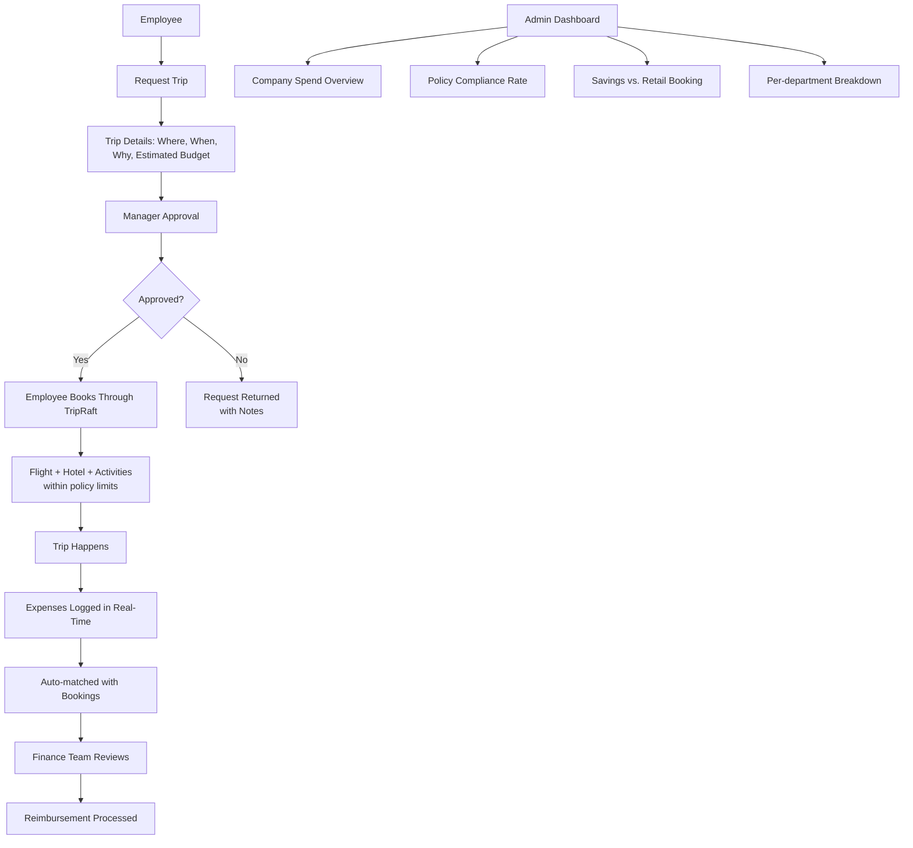
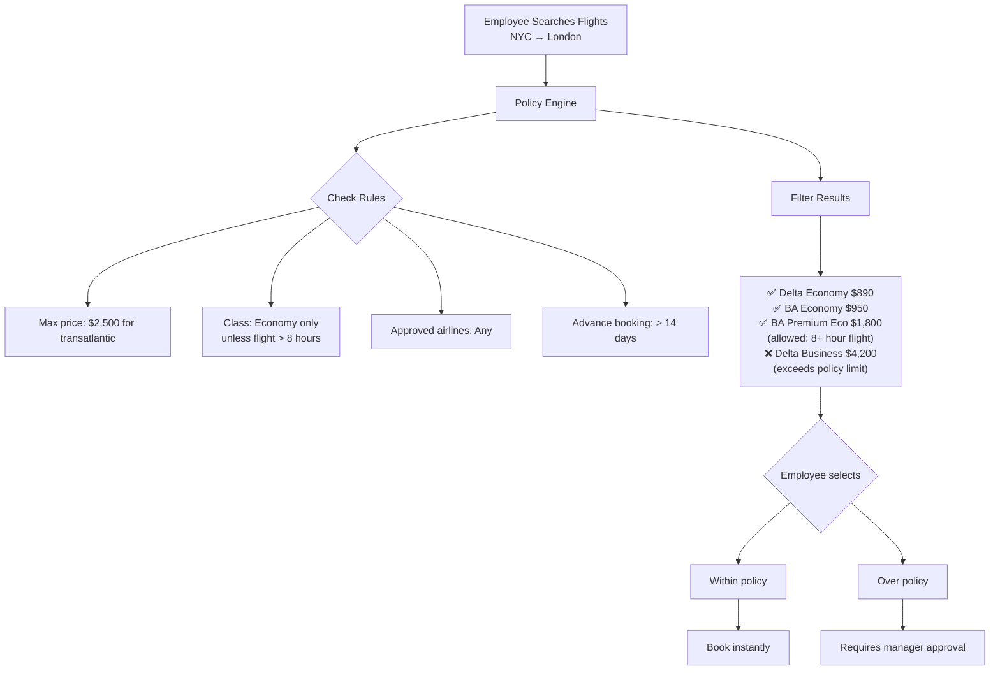
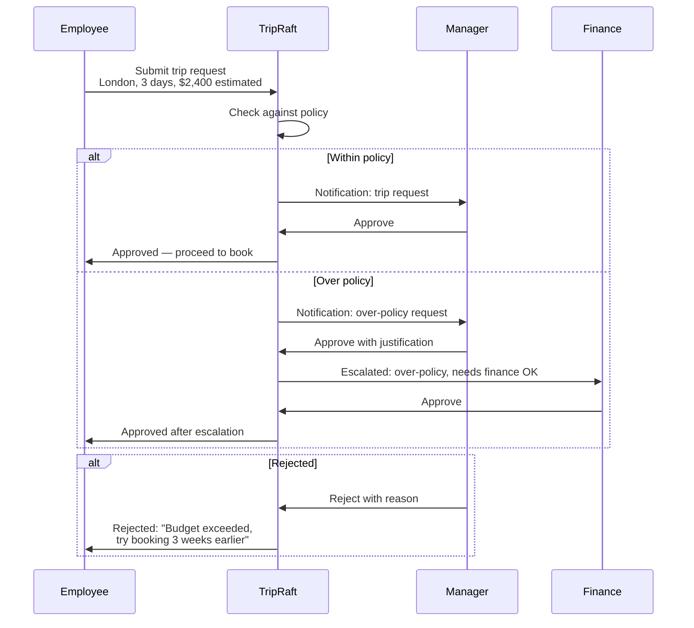
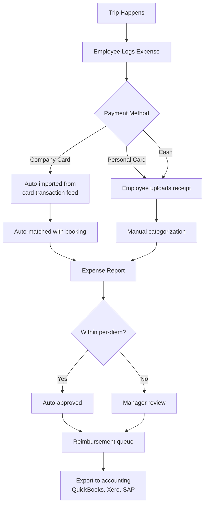
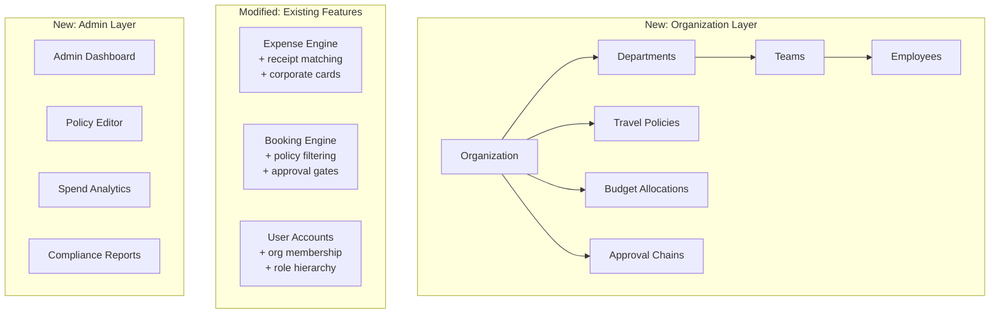
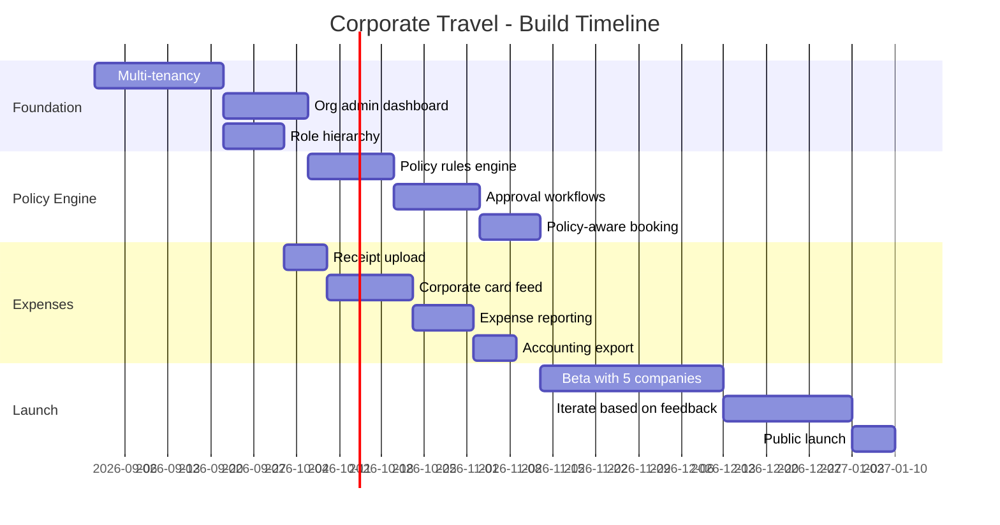

# B2B: Corporate Travel Management

## The Opportunity

Every company with more than 20 employees has people traveling for work. Most use a mix of email, spreadsheets, and whoever's credit card is available. The corporate travel management market is worth $1.4 trillion globally, with the software segment alone worth $4.5 billion.

We're not going after SAP Concur or Navan (that's a $100M+ game). We're targeting the underserved middle: companies with 50-500 employees who need structure but can't afford enterprise tools at $150/user/month.

---

## Product Vision



---

## What Corporate Adds to B2C

| B2C Feature | Corporate Version |
|-------------|------------------|
| Trip groups | Department-organized trips |
| Expense splitting | Company card + receipt matching |
| Place search | Approved hotel/airline lists |
| Itinerary builder | With policy guardrails |
| Polls & voting | Approval workflows |
| AI recommendations | Policy-aware suggestions |

### Key Corporate Features

```mermaid
graph TD
    A[Corporate Features] --> B[Travel Policy Engine]
    A --> C[Approval Workflows]
    A --> D[Budget Controls]
    A --> E[Expense Reporting]
    A --> F[Admin Dashboard]
    A --> G[SSO / SAML]
    
    B --> B1[Max flight cost by route]
    B --> B2[Approved airlines/hotels]
    B --> B3[Advance booking rules]
    B --> B4[Per-diem limits by city]
    
    C --> C1[Manager approves trips]
    C --> C2[Finance approves over-budget]
    C --> C3[Auto-approve under threshold]
    
    D --> D1[Department budgets]
    D --> D2[Per-trip limits]
    D --> D3[Real-time spend tracking]
    
    E --> E1[Receipt upload (photo)]
    E --> E2[Auto-categorization]
    E --> E3[CSV/PDF export]
    E --> E4[Accounting integration]
    
    F --> F1[Company-wide spend view]
    F --> F2[Employee compliance]
    F --> F3[Savings reports]
```

---

## Travel Policy Engine

This is the core differentiator. Without policy enforcement, it's just a consumer app with a business skin.



### Policy Configuration

Admins set rules through a dashboard:

| Rule Category | Examples |
|--------------|---------|
| Flight policy | Max price by route, class restrictions, preferred airlines |
| Hotel policy | Max rate by city, star rating limits, approved chains |
| Meal policy | Per-diem by city ($50/day NYC, $30/day Des Moines) |
| Transport policy | Taxi vs. public transit thresholds |
| Advance booking | Minimum days before travel |
| Approval thresholds | Auto-approve under $500, manager for $500-2000, VP for $2000+ |

---

## Approval Workflow



---

## Corporate Expense Flow



### Receipt Processing

| Method | How It Works | Accuracy |
|--------|-------------|----------|
| Photo upload | Employee takes photo of receipt | Manual entry |
| OCR (future) | AI reads receipt, extracts amount/date/vendor | 85-95% |
| Card feed | API pulls transactions from corporate card | 100% |
| Email forwarding | Forward booking confirmations, auto-parsed | 90% |

Phase 1: Manual upload + card feed
Phase 2: OCR + email parsing

---

## Admin Dashboard

```mermaid
graph TD
    A[Admin Dashboard] --> B[Travel Spend Overview]
    A --> C[Policy Compliance]
    A --> D[Department Budgets]
    A --> E[Employee Reports]
    A --> F[Settings & Policies]
    
    B --> B1[Total spend this month: $45,200]
    B --> B2[vs. Budget: $50,000 (90%)]
    B --> B3[vs. Last month: +12%]
    B --> B4[Top categories: Flights 45%,<br/>Hotels 35%, Meals 15%]
    
    C --> C1[92% of bookings within policy]
    C --> C2[8% required approval]
    C --> C3[2% rejected]
    
    D --> D1[Engineering: $15,000 / $20,000]
    D --> D2[Sales: $22,000 / $25,000]
    D --> D3[Marketing: $8,200 / $10,000]
    
    E --> E1[Most traveled: [employee list]]
    E --> E2[Highest spend: [employee list]]
    E --> E3[Best compliance: [employee list]]
```

---

## Pricing

| Plan | Price | Target Company Size | Includes |
|------|-------|--------------------|----|
| Business | $29.99/user/mo | 10-50 employees | Policy engine, approvals, basic reporting |
| Enterprise | Custom ($15-25/user/mo) | 50-500 employees | SSO, API, dedicated support, custom policies |
| Enterprise Plus | Custom | 500+ employees | White-glove onboarding, SLA, custom integrations |

### Volume Discounts

| Users | Discount |
|-------|----------|
| 10-49 | 0% (standard) |
| 50-99 | 10% |
| 100-249 | 15% |
| 250-499 | 20% |
| 500+ | Custom |

### Revenue per Customer

| Company Size | Users | Monthly | Annual |
|-------------|-------|---------|--------|
| Small (20 users) | 20 | $600 | $7,200 |
| Medium (100 users) | 100 | $2,550 | $30,600 |
| Large (300 users) | 300 | $6,000 | $72,000 |

Even 10 medium-sized clients = $306K ARR. B2B doesn't need millions of users to make money.

---

## Technical Requirements

| Component | New or Modify |
|-----------|--------------|
| Multi-tenancy (org accounts) | New |
| Role-based access (admin, manager, employee) | Modify existing |
| Policy rules engine | New |
| Approval workflow state machine | New |
| Corporate card integration (Plaid) | New |
| SSO / SAML (Auth0 or WorkOS) | New |
| Admin dashboard | New |
| Accounting export (CSV, QuickBooks API) | New |
| Audit logging | New |

### Architecture Changes



---

## Go-to-Market

### Target Customers

| Segment | Why They Need Us | How to Reach Them |
|---------|-----------------|-------------------|
| Startups (50-100) | No travel tool, using spreadsheets | Product Hunt, SaaS directories, LinkedIn |
| SMBs (100-300) | Concur is too expensive | Google Ads, content marketing |
| Remote-first companies | Travel for offsites, need coordination | Remote work communities, podcasts |
| Agencies (creative, consulting) | Frequent client travel | Industry events, partnerships |

### Implementation Timeline



**Total: approximately 6 months** from start to public launch.
