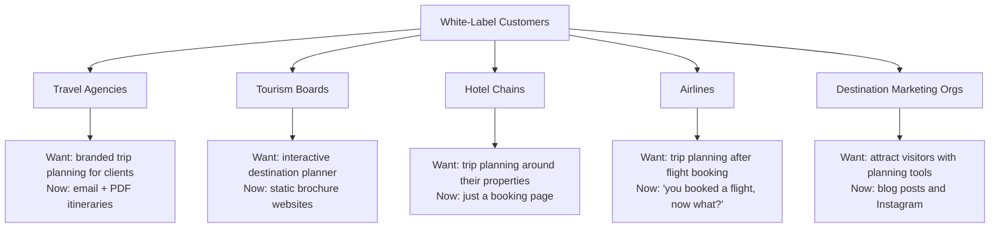
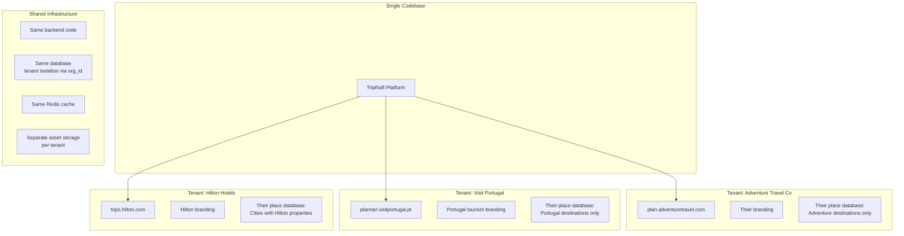
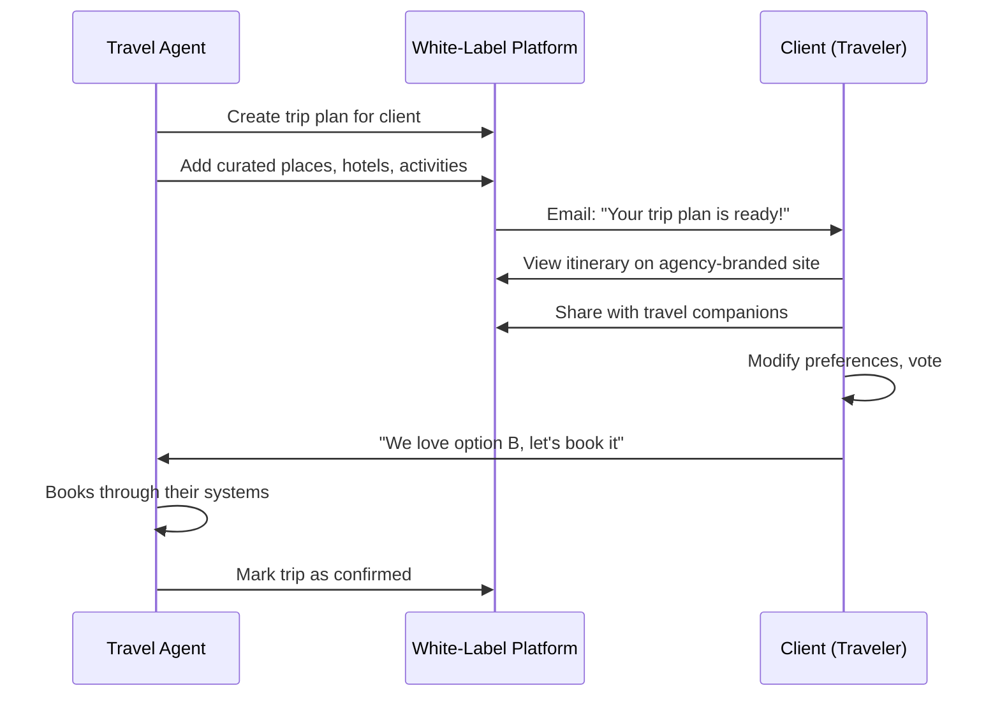
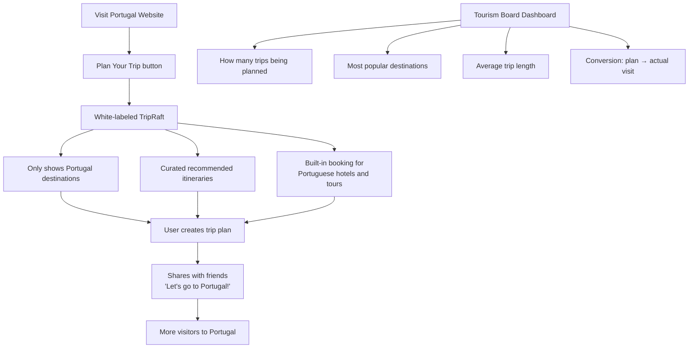
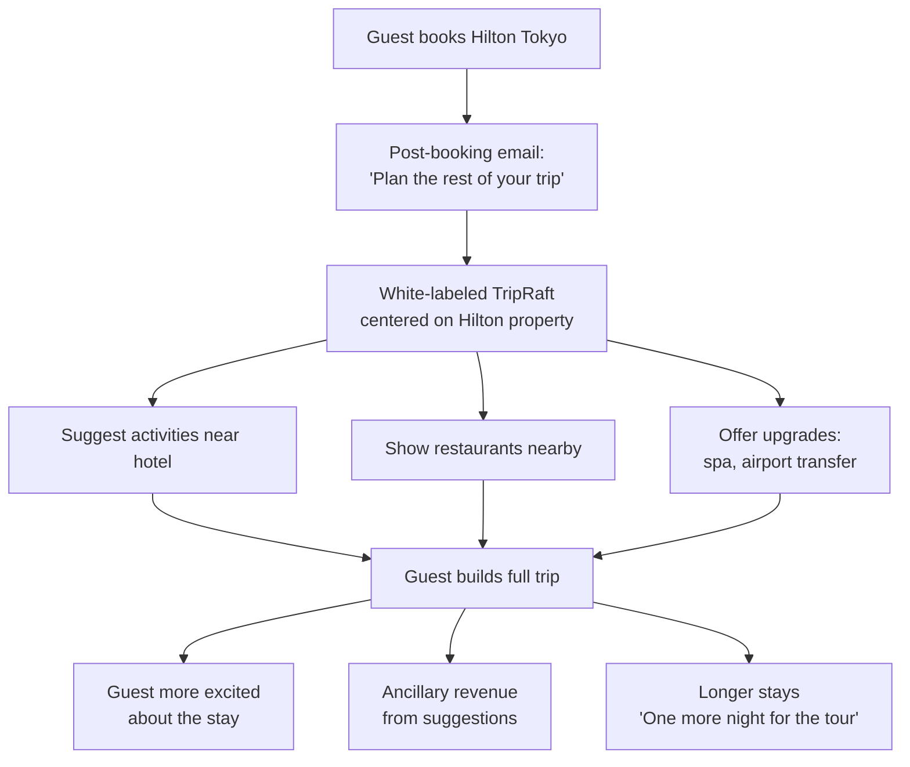
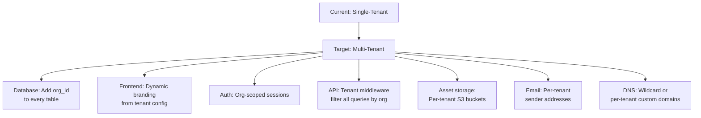
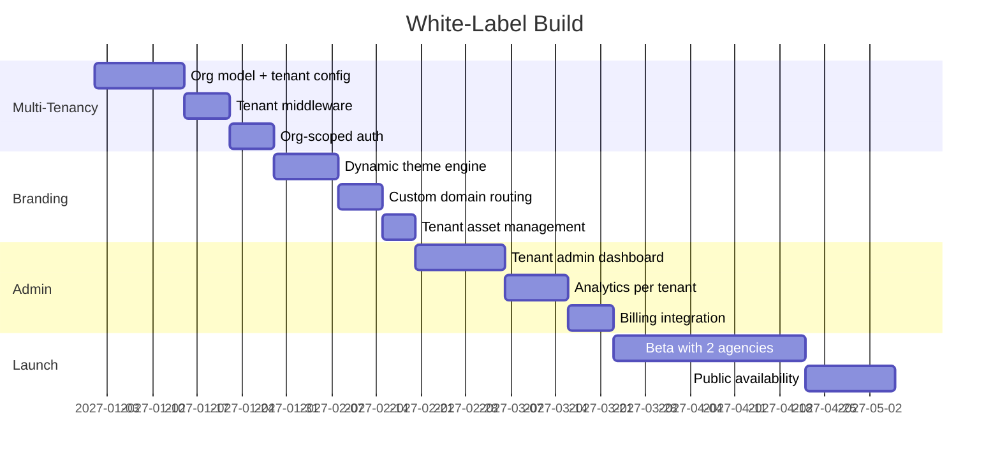

# B2B: White-Label Platform

## The Idea

Instead of only selling TripRaft directly to travelers, license the platform to businesses that want their own branded travel planning tool. They get the technology; we get recurring platform fees.

---

## Who Wants This



### Why They'd Pay Us Instead of Building It

Building a trip planning platform from scratch takes 12-18 months and $500K+ in development costs. We've already built it. They just need their logo on it.

---

## What They Get

```mermaid
flowchart TD
    A[White-Label Package] --> B[Core Platform]
    A --> C[Customization]
    A --> D[Data]
    A --> E[Support]
    
    B --> B1[Trip planning]
    B --> B2[Group collaboration]
    B --> B3[Expense tracking]
    B --> B4[Itinerary builder]
    B --> B5[Voting & polls]
    
    C --> C1[Custom branding<br/>Logo, colors, fonts]
    C --> C2[Custom domain<br/>plan.theirbrand.com]
    C --> C3[Custom place database<br/>Filter to their destinations]
    C --> C4[Custom features<br/>Toggle on/off]
    C --> C5[Custom email templates]
    
    D --> D1[Analytics dashboard<br/>How their users use it]
    D --> D2[Booking data<br/>What's being planned]
    D --> D3[User insights<br/>Demographics, preferences]
    
    E --> E1[Technical onboarding]
    E --> E2[Priority bug fixes]
    E --> E3[Quarterly feature updates]
```



---

## Architecture: Multi-Tenant White-Label



### Tenant Configuration

Each white-label client gets a configuration record:

```
{
  "tenant_id": "adventure-travel",
  "display_name": "Adventure Trip Planner",
  "domain": "plan.adventuretravel.com",
  "branding": {
    "logo_url": "https://cdn.../logo.png",
    "primary_color": "#FF6B35",
    "secondary_color": "#004E89",
    "font": "Inter"
  },
  "features": {
    "expense_tracking": true,
    "ai_chat": true,
    "booking_engine": false,
    "group_size_limit": 20
  },
  "places_filter": {
    "categories": ["adventure", "hiking", "diving", "climbing"],
    "countries": null  // all countries
  },
  "email_from": "trips@adventuretravel.com"
}
```

The React frontend reads tenant config at load time and applies branding. No code changes needed per tenant.

---

## Use Cases

### 1. Travel Agency



Value for agency: Professional-looking interactive itineraries instead of PDF attachments. Clients spend more time engaging with the plan, leading to more bookings.

### 2. Tourism Board



Value for tourism board: Interactive engagement tool instead of static content. Data on what tourists actually want to do.

### 3. Hotel Chain



Value for hotel chain: Increased ancillary revenue and guest engagement. Turns a room booking into a trip experience.

---

## Pricing

### Tiered Model

| Tier | Monthly Fee | Setup Fee | Best For |
|------|-----------|-----------|----------|
| Starter | $499/mo | $1,000 | Small agencies (< 100 trips/mo) |
| Growth | $1,499/mo | $2,500 | Mid-size agencies, small tourism boards |
| Enterprise | $4,999/mo | $10,000 | Large brands, hotel chains, national tourism |
| Custom | Negotiated | Negotiated | Airlines, major hospitality groups |

### What Each Tier Gets

| Feature | Starter | Growth | Enterprise |
|---------|---------|--------|-----------|
| Custom branding | Logo + colors | Full theme | Complete custom |
| Custom domain | Subdomain only | Custom domain | Multiple domains |
| Place database | Global (our data) | Filtered + custom | Full custom import |
| AI features | Basic chat | Full AI | Custom AI persona |
| User limit | 500/mo | 5,000/mo | Unlimited |
| Analytics | Basic | Advanced | Full + API access |
| Support | Email | Email + chat | Dedicated account manager |
| API access | No | Limited | Full |
| SLA | 99.5% | 99.9% | 99.95% |

### Revenue Potential

| Scenario | Clients | Avg MRR/Client | Total MRR | Annual |
|----------|---------|----------------|-----------|--------|
| Year 1 | 5 | $1,000 | $5,000 | $60,000 |
| Year 2 | 20 | $1,500 | $30,000 | $360,000 |
| Year 3 | 50 | $2,000 | $100,000 | $1,200,000 |

White-label is a slow-build revenue stream. Each client takes time to onboard, but once they're live, churn is extremely low (switching costs are high).

---

## Technical Implementation

### What Needs to Change



### Multi-Tenancy Strategy

Two options:

| Strategy | How | Pros | Cons |
|----------|-----|------|------|
| Shared database + org_id column | Single DB, all tenants | Simpler, cheaper | Risk of data leak, noisy neighbor |
| Database per tenant | Separate DB per client | Full isolation, easy backup | More infrastructure, more cost |

**Recommendation**: Start with shared database + strict org_id filtering. Move to per-tenant databases for enterprise clients who require it.

### Implementation Timeline



**Total: approximately 4-5 months** from start to public launch.
