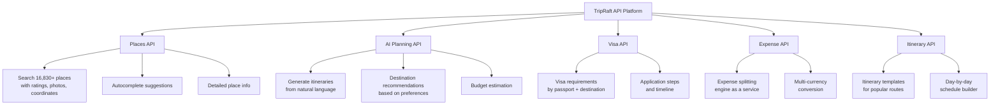
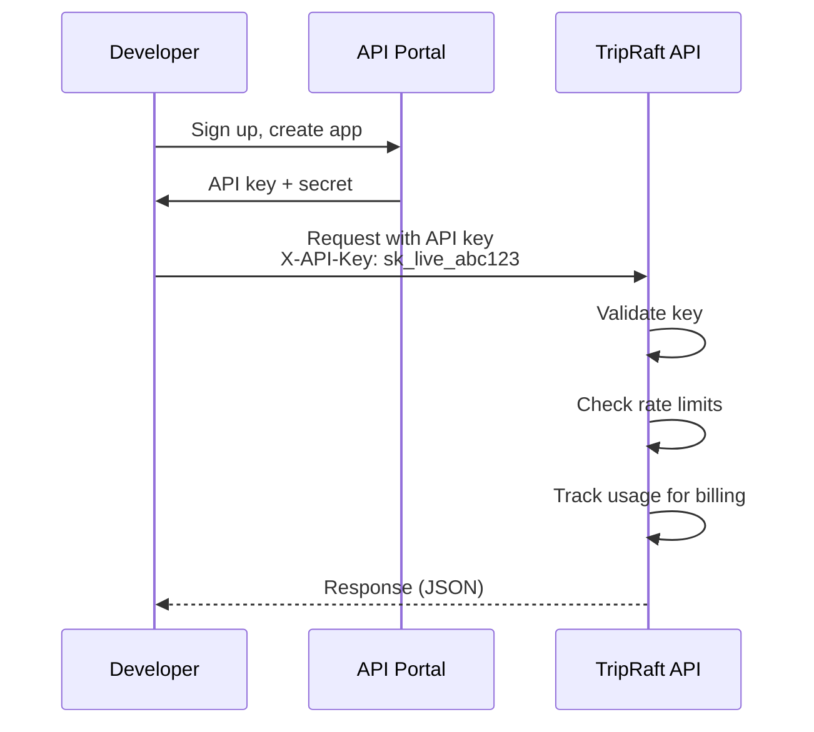
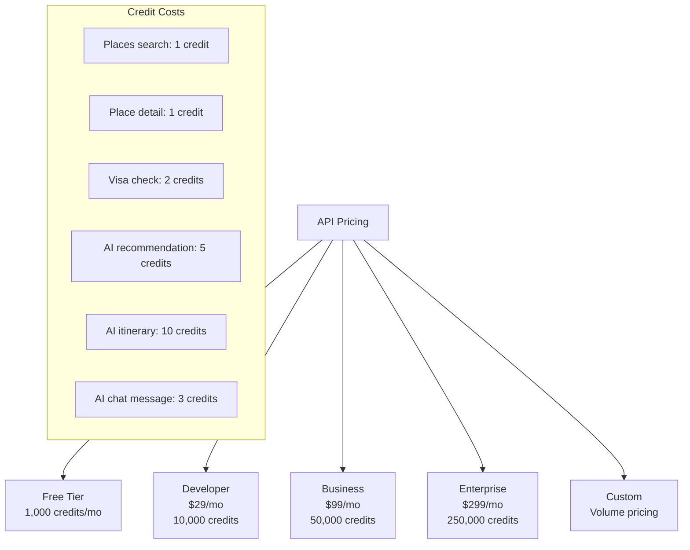
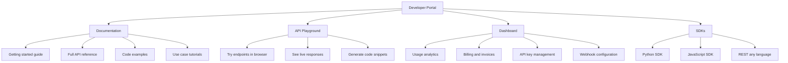
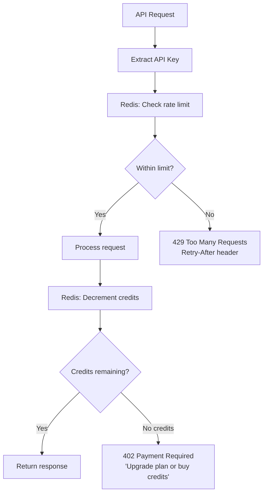
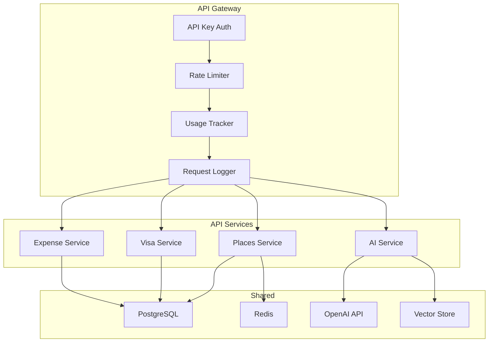
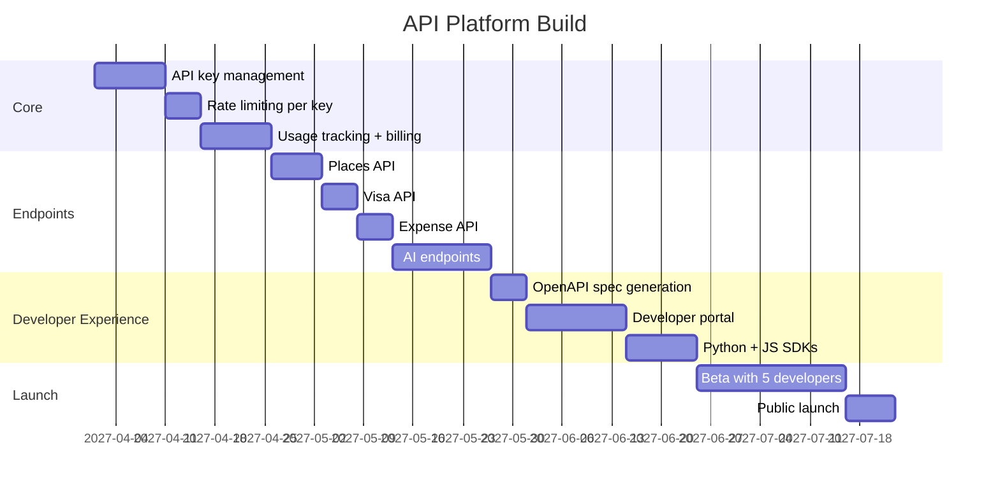
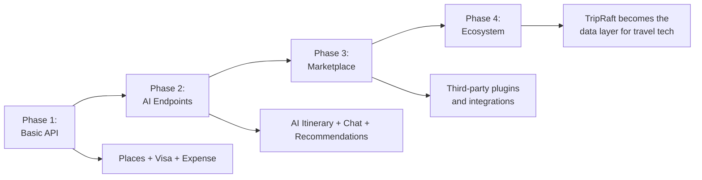

# B2B: API Platform

## What This Is

Expose TripRaft's data and AI capabilities as an API that other developers and businesses can integrate into their own products. If the white-label play is "rent our whole platform," the API play is "rent pieces of it."

---

## What We Can Expose



---

## Who'd Use This

| Customer | What They'd Use | Why |
|----------|----------------|-----|
| Travel bloggers/influencers | Places API + Itinerary templates | Embed trip plans in their content |
| Other travel apps | Visa API | Don't want to build visa database themselves |
| Event planning platforms | Group expense API | Add expense splitting to their product |
| Corporate tools | AI planning + booking API | Bolt travel onto existing HR tools |
| Chatbot builders | AI planning API | Add trip planning to their bot |
| Content websites | Places API | Dynamic destination content |

---

## API Design

### Authentication



### Endpoints

| Category | Endpoint | Method | Description |
|----------|----------|--------|-------------|
| **Places** | /v1/places/search | GET | Search places by keyword, location, category |
| | /v1/places/{id} | GET | Get place details |
| | /v1/places/autocomplete | GET | Typeahead suggestions |
| | /v1/places/nearby | GET | Places near coordinates |
| | /v1/places/popular | GET | Trending destinations |
| **AI** | /v1/ai/itinerary | POST | Generate itinerary from requirements |
| | /v1/ai/recommend | POST | Get personalized recommendations |
| | /v1/ai/chat | POST | Conversational trip planning |
| **Visa** | /v1/visa/check | GET | Requirements for passport→destination |
| | /v1/visa/requirements/{country} | GET | Full entry requirements |
| **Expenses** | /v1/expenses/split | POST | Calculate expense splits |
| | /v1/expenses/simplify | POST | Simplify debts in a group |
| | /v1/currency/convert | GET | Currency conversion |
| **Itinerary** | /v1/itinerary/templates | GET | Pre-built itinerary templates |
| | /v1/itinerary/optimize | POST | Optimize route/schedule |

### Response Format

```json
{
  "status": "success",
  "data": {
    "places": [
      {
        "id": "place_12345",
        "name": "Senso-ji Temple",
        "city": "Tokyo",
        "country": "Japan",
        "category": "temple",
        "rating": 4.7,
        "coordinates": {"lat": 35.7148, "lng": 139.7967},
        "photo_url": "https://cdn.tripraft.com/places/sensoji.jpg",
        "description": "Tokyo's oldest Buddhist temple...",
        "best_time": "Early morning (6-8 AM)",
        "avg_visit_duration": "1-2 hours",
        "admission_fee": "Free"
      }
    ]
  },
  "pagination": {
    "page": 1,
    "per_page": 20,
    "total": 156
  },
  "meta": {
    "request_id": "req_abc123",
    "credits_used": 1,
    "credits_remaining": 4999
  }
}
```

---

## Pricing

### Credit-Based Model



### Why Credits (Not Per-Call)

- AI calls cost us 10-100x more than database lookups
- Credits let us fairly price different endpoints
- Users can self-manage: spend credits on what they need
- Overage charges: $0.005 per credit over limit

### Comparison to Alternatives

| What Api | Their Price | Our Price | Our Advantage |
|----------|-----------|-----------|---------------|
| Google Places API | $32 per 1K calls | ~$3 per 1K calls (places) | 10x cheaper for basic place search |
| Amadeus API | $500/mo min for serious use | $99/mo for 50K credits | More accessible for small apps |
| ChatGPT for travel | Pay per token, build everything | $29/mo for ready-made travel AI | Pre-built, travel-specific |

---

## Developer Portal



### Documentation First

The API is only as good as its documentation. We need:

1. **OpenAPI/Swagger spec** -- auto-generated, interactive
2. **Quick-start guide** -- "Get your first result in 5 minutes"
3. **Language-specific examples** -- Python, JavaScript, cURL
4. **Rate limiting docs** -- What happens when you hit limits
5. **Error reference** -- Every error code explained
6. **Changelog** -- What changed in each API version

---

## Technical Implementation

### Rate Limiting per API Key



| Tier | Requests/min | Concurrent connections | Credits/month |
|------|-------------|----------------------|---------------|
| Free | 30 | 2 | 1,000 |
| Developer | 60 | 5 | 10,000 |
| Business | 120 | 20 | 50,000 |
| Enterprise | 300 | 50 | 250,000 |

### Infrastructure



The API platform shares the same backend services as the consumer app. The only new components are:
- API key management (new table + middleware)
- Usage tracking and billing (new service)
- Developer portal (new frontend, possibly built with Docusaurus)
- Rate limiting per API key (extend existing rate limiter)

---

## Revenue Projections

| Year | API Customers | Avg MRR/Customer | Monthly Revenue | Annual Revenue |
|------|--------------|------------------|-----------------|---------------|
| 1 | 20 | $50 | $1,000 | $12,000 |
| 2 | 100 | $80 | $8,000 | $96,000 |
| 3 | 300 | $100 | $30,000 | $360,000 |

API revenue is small initially but grows compounding. Each integration is sticky -- once a developer builds on your API, they rarely switch.

---

## Implementation Timeline



**Total: approximately 4 months** to public launch.

---

## Long-Term Vision



The end game: TripRaft's API becomes what Stripe is to payments or Twilio is to communications -- the infrastructure layer that other travel products build on. That's a long way off, but the API platform is how you start.
