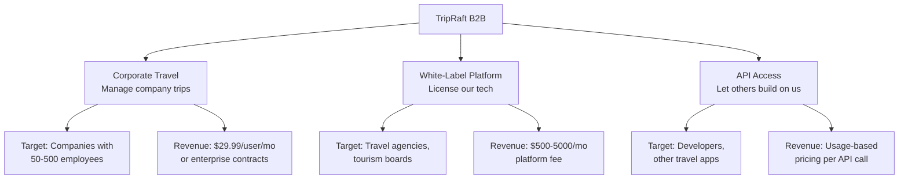

# B2B Future Plan -- Enterprise & Business Roadmap

This folder covers how TripRaft expands from a consumer app into business revenue streams. B2B is where the serious money is -- higher contract values, lower churn, and predictable revenue.

---

## Three B2B Plays

---

## Reading Order

| File | What It Covers |
|------|---------------|
| 01_CORPORATE_TRAVEL.md | Managing company trips with approval workflows and budgets |
| 02_WHITE_LABEL.md | Licensing TripRaft as a platform for agencies and brands |
| 03_API_PLATFORM.md | Exposing our data and AI through a developer API |
