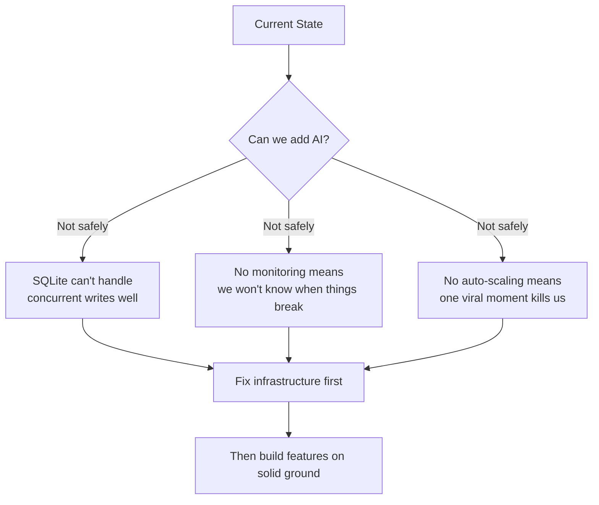
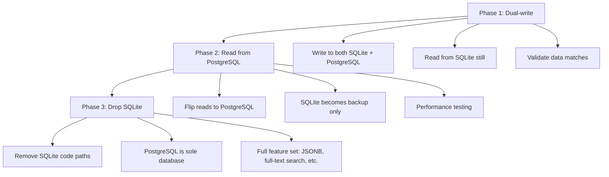
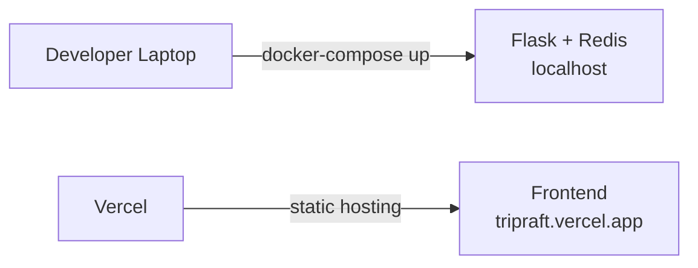
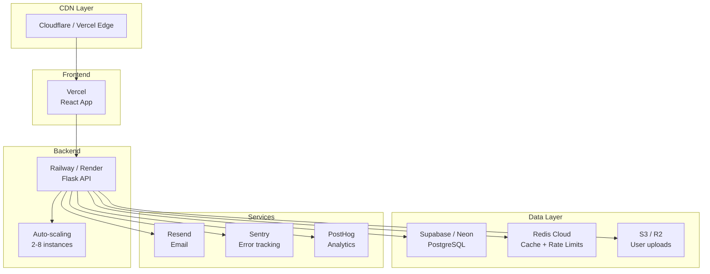
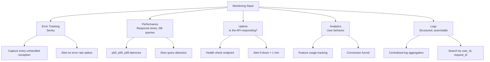
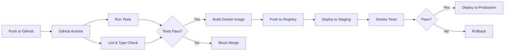
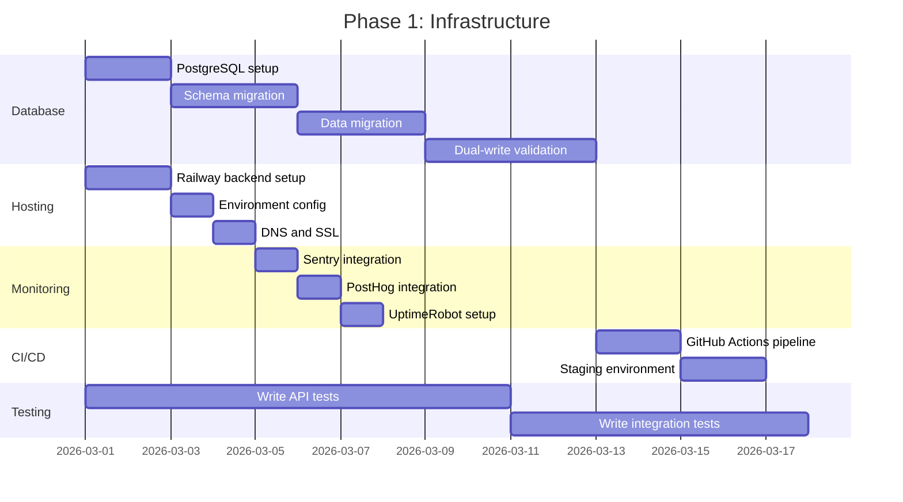

# Phase 1 -- Security & Infrastructure Upgrade

Before we add any new features, the platform needs to be able to handle real users at scale. This phase is about swapping out development-grade infrastructure for production-grade infrastructure.

---

## Why This Comes First

---

## Database Migration: SQLite to PostgreSQL

### Why

SQLite is great for development. It's a single file, no setup, instant. But it has hard limits:

- **No concurrent writes**: One write at a time. A group of 10 people all adding expenses simultaneously? Queued.
- **No user-level permissions**: Anyone with file access has full access.
- **No replication**: Can't have read replicas for performance.
- **File locking on NFS**: Breaks in some container environments.

### Migration Plan

### Schema Changes

The SQLAlchemy ORM we already use makes this relatively painless. The models don't change -- just the connection string.

But we'd want to take advantage of PostgreSQL features:

| Feature | SQLite | PostgreSQL | Benefit |
|---------|--------|------------|---------|
| JSONB columns | No | Yes | Store flexible data (preferences, metadata) |
| Full-text search | Basic | Built-in with ranking | Better place search |
| Array columns | No | Yes | Tags, categories without join tables |
| Concurrent writes | Limited | Unlimited | Multi-user real-time |
| Connection pooling | N/A | PgBouncer | Handle 1000+ connections |
| Replication | No | Built-in | Read replicas, backups |

### Travel Database

The `travel_data_complete.db` (16,830 places) also needs migration. Options:

1. **Migrate to PostgreSQL table**: Same DB, simpler architecture
2. **Move to Elasticsearch**: Better for fuzzy search and geo queries
3. **Keep as read-only SQLite**: It works fine for reads, low priority

Recommendation: Option 1 first (simplicity), Option 2 later when search volume justifies it.

### Estimated Effort

| Task | Time | Risk |
|------|------|------|
| Set up PostgreSQL (Supabase/Neon free tier) | 1 day | Low |
| Update SQLAlchemy connection config | 2 hours | Low |
| Run Alembic migrations on PostgreSQL | 1 day | Medium |
| Data migration script | 2 days | Medium |
| Dual-write testing | 3 days | Medium |
| Cutover and validation | 1 day | High |
| **Total** | **~8 days** | |

---

## Hosting & Deployment

### Current Setup

### Target Setup

### Platform Comparison

| Platform | Free Tier | Scaling | Cost at 10K MAU | Docker Support | Best For |
|----------|-----------|---------|-----------------|----------------|----------|
| Railway | $5/mo credit | Auto | ~$25/mo | Yes | Backend + DB |
| Render | 750 hrs/mo | Manual/Auto | ~$25/mo | Yes | Simple deploys |
| Fly.io | 3 shared VMs | Auto | ~$20/mo | Yes | Global edge |
| Heroku | None anymore | Manual | ~$50/mo | Via buildpacks | Ecosystem |

**Recommendation**: Railway for backend (Docker support, good free tier, easy PostgreSQL add-on) + Vercel for frontend (already configured).

---

## Monitoring & Observability

### What We Need to Track

### Tool Selection

| Need | Tool | Cost | Why |
|------|------|------|-----|
| Error tracking | Sentry | Free (5K events/mo) | Industry standard, amazing stack traces |
| Analytics | PostHog | Free (1M events/mo) | Open source, feature flags included |
| Uptime monitoring | UptimeRobot | Free (50 monitors) | Simple, reliable, SMS alerts |
| Log aggregation | Better Stack | Free (1GB/mo) | Beautiful UI, structured log support |
| Performance | Sentry Performance | Included | Same tool, one integration |

Total monitoring cost at launch: **$0/month**

---

## CI/CD Pipeline

We need:
1. **GitHub Actions workflow** for CI
2. **Automated tests** (currently minimal -- need to write them)
3. **Staging environment** (same as production but separate database)
4. **One-click rollback** (previous Docker image tag)

### Test Coverage Targets

| Layer | Current | Target | Priority |
|-------|---------|--------|----------|
| API routes | ~10% | 80% | High |
| Service layer | ~5% | 90% | High |
| Frontend components | 0% | 60% | Medium |
| Integration tests | 0% | 70% | Medium |
| E2E tests | 0% | 40% | Low (for now) |

---

## Security Hardening (Phase 2)

What we've done (Phase 0/1B) is the baseline. Production security adds:

| Feature | Status | Implementation |
|---------|--------|---------------|
| HTTPS everywhere | Handled by platform (Railway/Vercel) | Automatic |
| Content Security Policy | Not yet | Flask-Talisman middleware |
| SQL injection protection | Done (SQLAlchemy ORM) | Existing |
| XSS protection | Done (httpOnly cookies) | Existing |
| CSRF protection | Not yet | Flask-WTF or custom token |
| Secrets management | Environment variables | Move to vault if needed |
| Dependency scanning | Not yet | Dependabot or Snyk |
| Penetration testing | Not yet | After launch, periodic |

---

## Timeline

**Estimated total: 3-4 weeks** with one developer working on it alongside other tasks.
