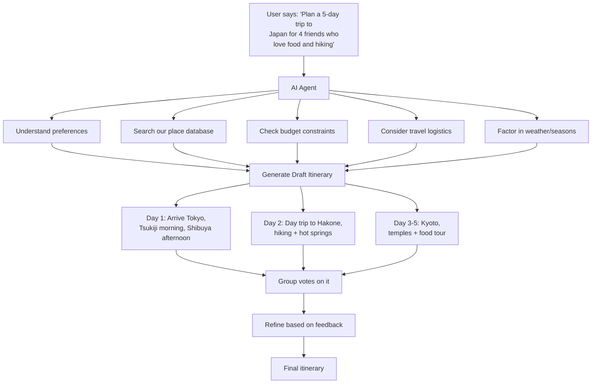
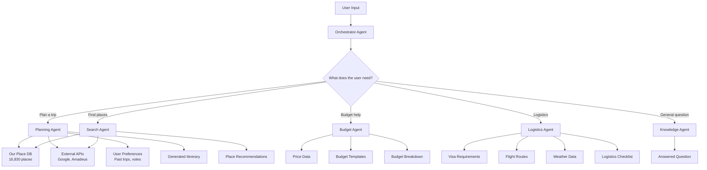
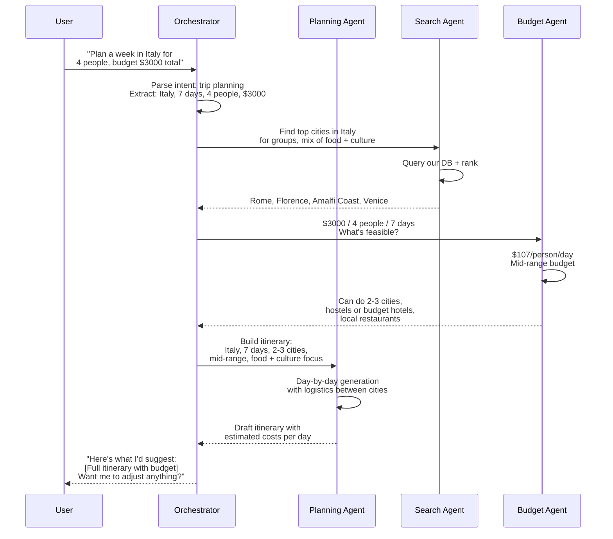
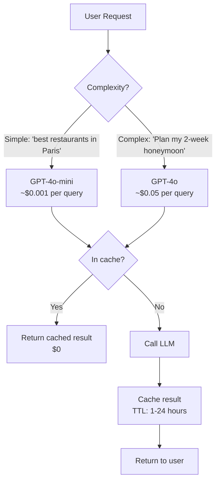
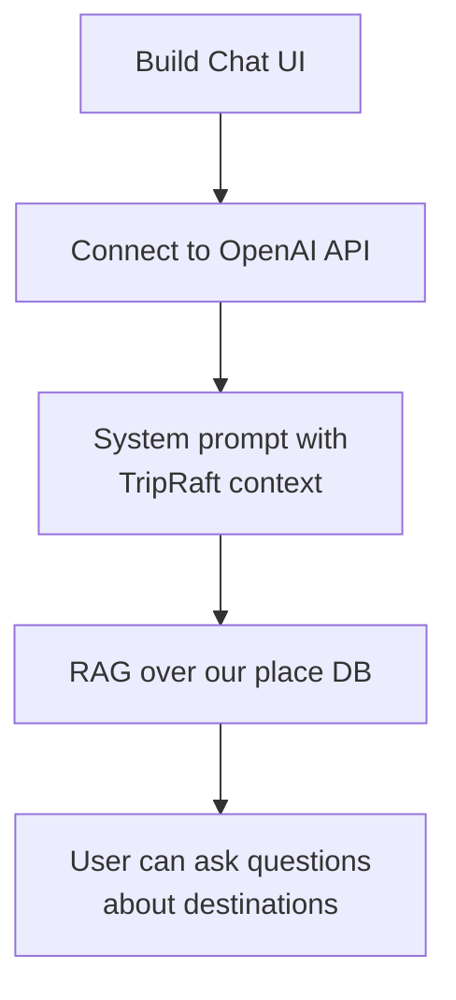
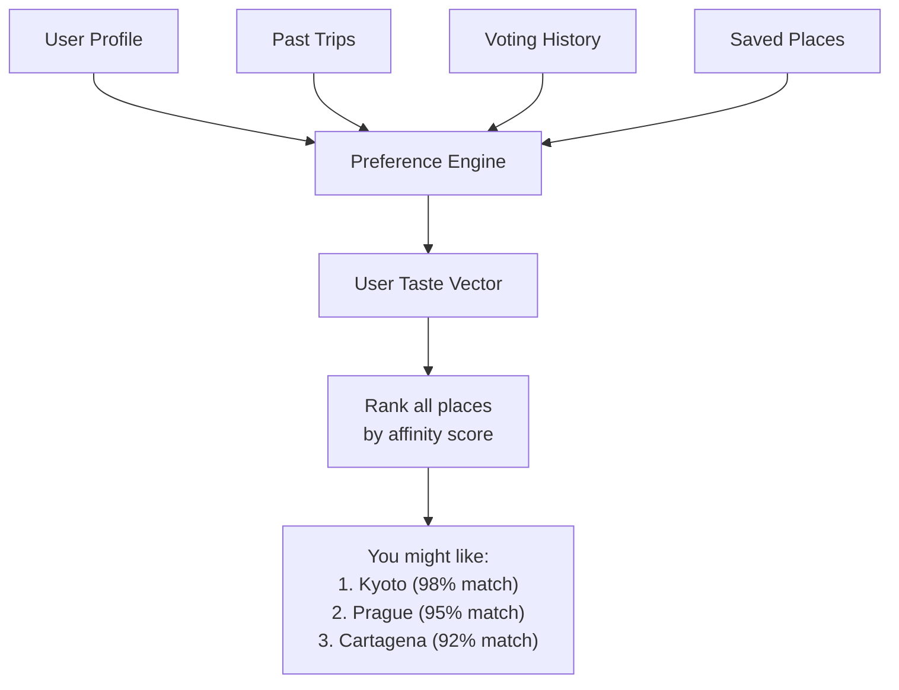
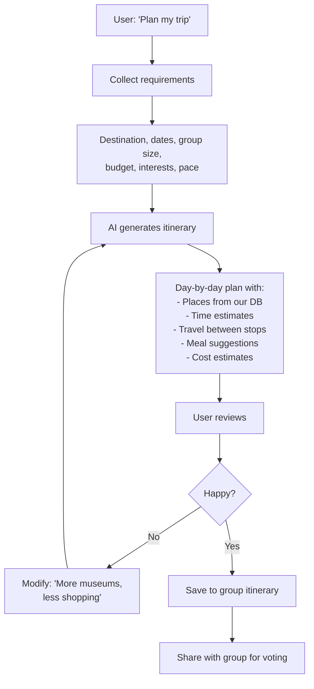
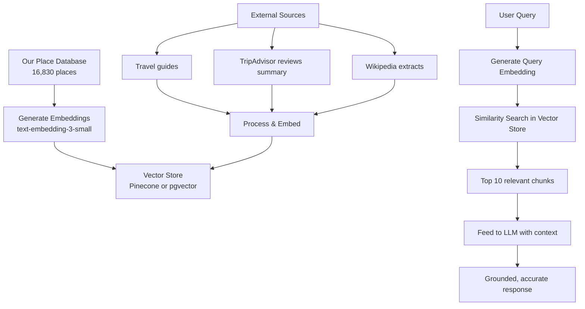
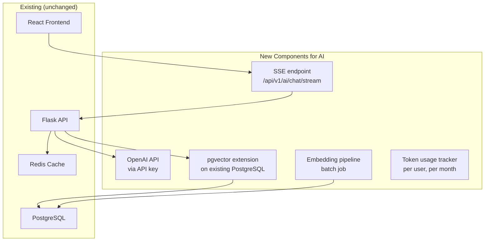

# Phase 2 -- AI Integration

This is where TripRaft stops being "a travel planning tool with group features" and becomes "an AI travel agent that happens to have a great group experience." The difference matters for positioning, retention, and eventually revenue.

---

## The Vision

---

## Architecture: Agentic AI

We're not just wrapping ChatGPT. We're building an agentic system where the AI has tools it can call, memory of past interactions, and the ability to reason through multi-step plans.

### Agent Types

| Agent | Responsibility | Tools Available | LLM |
|-------|---------------|----------------|-----|
| Orchestrator | Route requests, maintain conversation | All sub-agents | GPT-4o (reasoning) |
| Planning | Generate itineraries | Place DB, APIs, budget | GPT-4o |
| Search | Find places matching criteria | Place DB, Google Places | GPT-4o-mini (cheaper) |
| Budget | Cost estimation and optimization | Price data, templates | GPT-4o-mini |
| Logistics | Visa, weather, transport | Government APIs, weather API | GPT-4o-mini |
| Knowledge | Answer travel questions | RAG over travel knowledge base | GPT-4o-mini |

### Why Agentic (Not Just a Chat Wrapper)

A simple chat wrapper would give you a generic itinerary. Our agentic system:
- Uses our own data (16,830 real places with ratings)
- Respects budget constraints mathematically
- Accounts for travel time between locations
- Remembers group preferences from past trips
- Can be asked to modify ("swap day 3, we don't like museums")

---

## LLM Strategy

### Model Selection

| Use Case | Model | Cost per 1M tokens | Why |
|----------|-------|--------------------|----|
| Complex reasoning | GPT-4o | ~$5 input / $15 output | Best at multi-step planning |
| Simple tasks | GPT-4o-mini | ~$0.15 input / $0.60 output | 90% cheaper, good enough |
| Embeddings | text-embedding-3-small | $0.02 | For semantic search |
| Fallback | Claude 3.5 Sonnet | ~$3 input / $15 output | If OpenAI is down |

### Cost Control

Key cost-saving strategies:
1. **Semantic caching**: Similar questions get cached answers (embedding similarity > 0.95)
2. **Model routing**: Simple questions go to cheaper models
3. **Token budgets**: Each user tier gets monthly token limits
4. **Streaming**: Stream responses so users see progress (better UX, same cost)
5. **Prompt optimization**: Shorter, more efficient prompts without sacrificing quality

### Estimated AI Costs per User

| User Type | Queries/Month | Avg Cost/Query | Monthly AI Cost |
|-----------|---------------|----------------|-----------------|
| Casual | 5-10 | $0.005 | $0.03-0.05 |
| Active | 20-40 | $0.01 | $0.20-0.40 |
| Power | 80-100 | $0.02 | $1.60-2.00 |

At 10,000 MAU with typical distribution: **~$500-800/month in AI costs.**

---

## Implementation Phases

### Phase 2A: Basic AI Chat (4-6 weeks)

What this gives us:
- "What are the best beaches in Thailand?"
- "Compare Bali vs. Phuket for a group of 6"
- "What's the best time to visit Japan?"

Backend integration:
- New `/api/v1/ai/chat` endpoint
- Conversation history stored in DB
- Place database indexed with embeddings for RAG
- Rate limited per user tier

### Phase 2B: Smart Recommendations (4-6 weeks)

What this gives us:
- Personalized place recommendations
- "You liked X, you'll love Y"
- Group compatibility scoring ("3 of 4 members would enjoy this")
- Smart defaults in the planning flow

### Phase 2C: AI Itinerary Generation (6-8 weeks)

This is the flagship feature. The one that makes people say "wow" and share the app.

---

## Data Pipeline for AI

### Why RAG Matters

Without RAG, the AI hallucinates. It'll recommend restaurants that closed 3 years ago or hotels that don't exist. By grounding responses in our verified database, we get:

- Accurate place data (ratings, photos, coordinates)
- Links to real places in our app
- Consistent quality (our data is curated)
- No hallucinated businesses

---

## Group AI Features

| Feature | Description | Phase |
|---------|------------|-------|
| Group taste profile | Merge individual preferences into group consensus | 2B |
| Conflict detection | "Alice wants beaches but Bob wants mountains" | 2B |
| Compromise suggestions | "Here's a place with both: Cinque Terre" | 2B |
| Smart poll generation | AI suggests what to vote on based on disagreements | 2C |
| Budget optimizer | "If you drop day 4 in Paris, you can afford an extra day in Rome" | 2C |
| Re-planning | "It's going to rain Tuesday, here are indoor alternatives" | 3 |

---

## Technical Requirements

| Component | Technology | Purpose |
|-----------|-----------|---------|
| LLM API | OpenAI API (primary) | Text generation |
| Vector DB | pgvector (PostgreSQL extension) | Semantic search |
| Embeddings | text-embedding-3-small | Convert text to vectors |
| Prompt management | LangChain or custom | Template management, chain-of-thought |
| Streaming | Server-Sent Events (SSE) | Real-time response streaming |
| Conversation store | PostgreSQL table | Chat history per user/group |
| Token counter | tiktoken library | Track usage for billing |

### Infrastructure Additions

---

## Risks & Mitigations

| Risk | Impact | Mitigation |
|------|--------|------------|
| AI costs spiral | Burn money fast | Token budgets, model routing, caching |
| Hallucinations | Users get wrong info | RAG grounding, fact-checking layer |
| OpenAI downtime | AI features unavailable | Fallback to Claude, graceful degradation |
| Slow responses | Bad UX | Streaming, async generation, progress indicators |
| Prompt injection | Users manipulate AI | Input sanitization, system prompt hardening |
| Data privacy | User data in LLM context | No PII in prompts, anonymize before sending |

---

## Success Metrics

| Metric | Target | How to Measure |
|--------|--------|----------------|
| Chat engagement | 40% of active users try AI chat | PostHog events |
| Itinerary adoption | 25% of trips use AI-generated plans | DB query |
| Recommendation click-through | 15% CTR on suggestions | Frontend tracking |
| AI cost per user | < $0.50/month average | Token usage logs |
| Response time (streaming start) | < 2 seconds | API monitoring |
| User satisfaction with AI | > 4.0/5 rating | In-app feedback |
