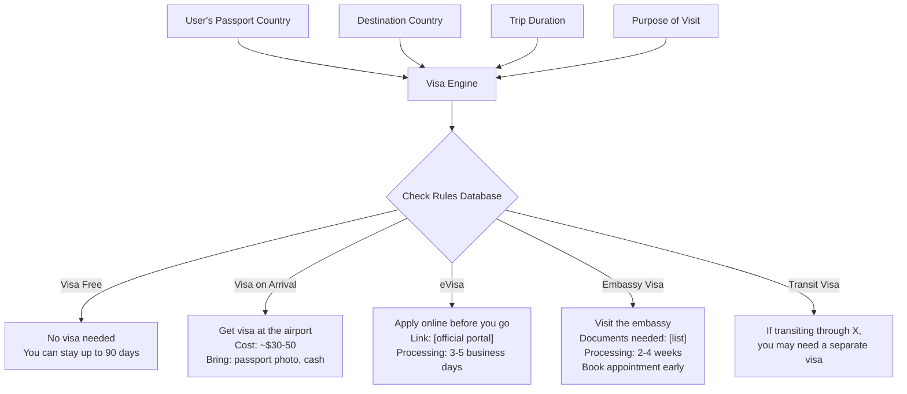
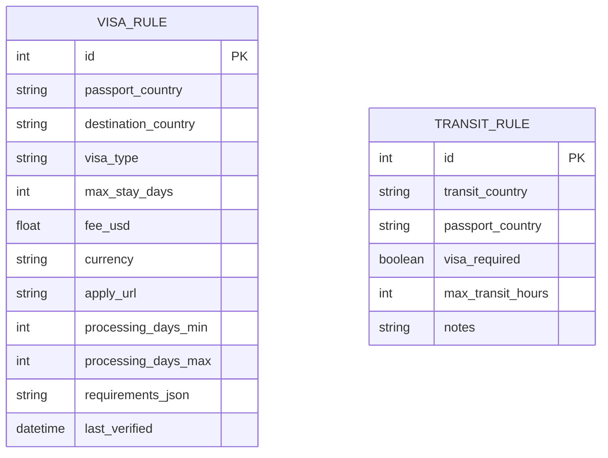
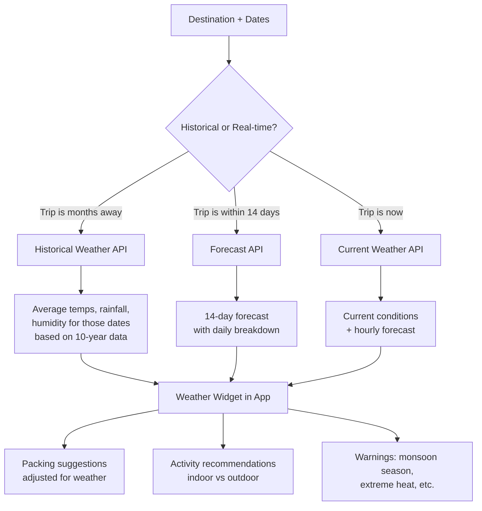
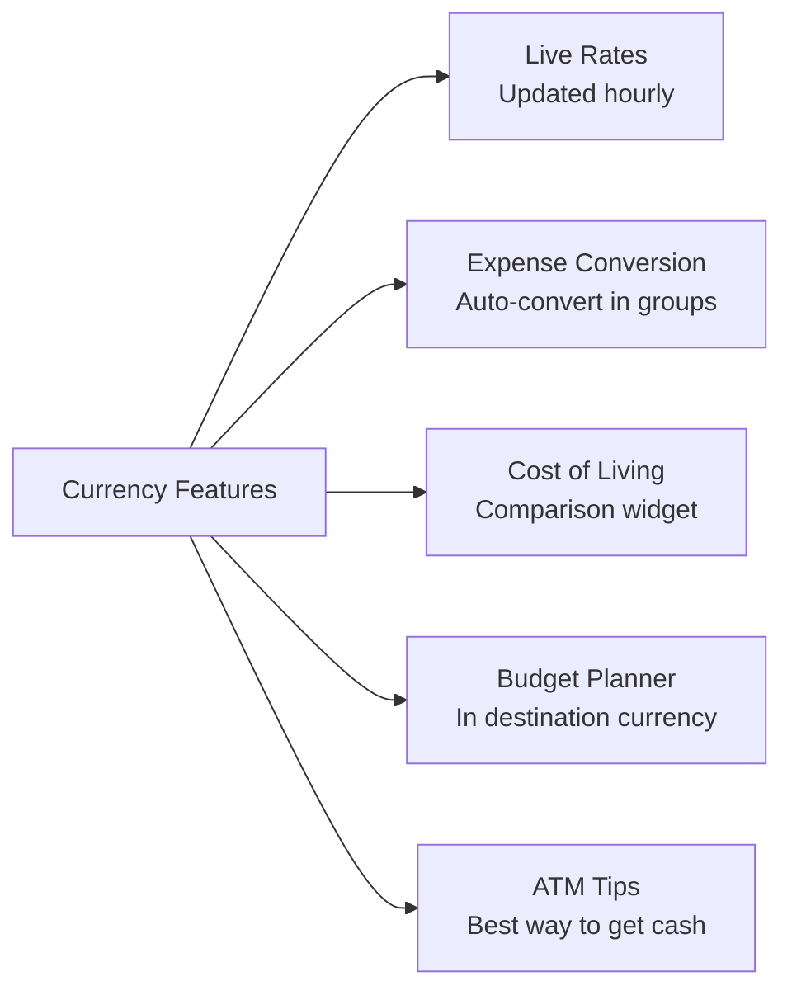
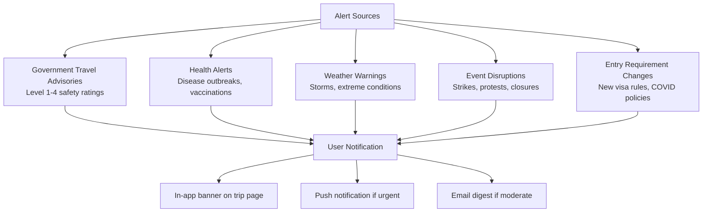
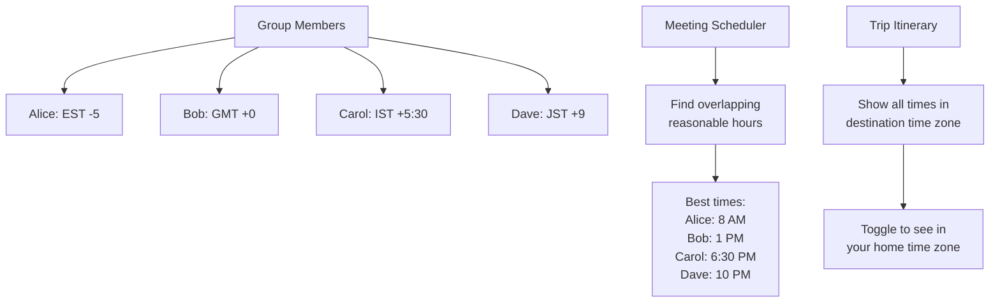
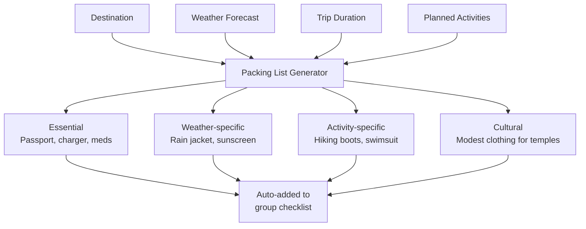
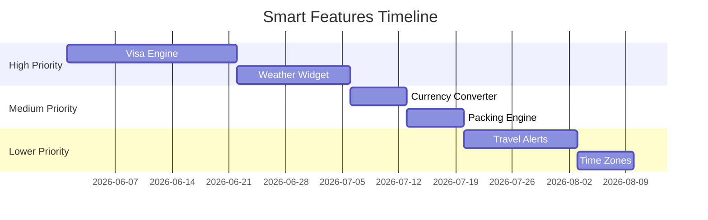

# Phase 2 -- Smart Features

These are the features that make the app feel smart without needing full AI. They use structured data, public APIs, and rules-based logic to give travelers information they'd otherwise have to Google separately.

---

## Feature Map

```mermaid
graph TD
    A[Smart Features] --> B[Visa Engine]
    A --> C[Weather Intelligence]
    A --> D[Currency Converter]
    A --> E[Travel Alerts]
    A --> F[Time Zone Manager]
    A --> G[Packing Suggestions]
    
    B --> B1[Do I need a visa?]
    B --> B2[How to apply?]
    B --> B3[Processing times]
    
    C --> C1[Best time to visit]
    C --> C2[Current conditions]
    C --> C3[Pack for weather]
    
    D --> D1[Live exchange rates]
    D --> D2[Cost of living comparison]
    D --> D3[Budget in local currency]
    
    E --> E1[Travel advisories]
    E --> E2[Health alerts]
    E --> E3[Event disruptions]
    
    F --> F1[Group spans time zones]
    F --> F2[Meeting scheduler]
    
    G --> G1[Based on destination + weather]
    G --> G2[Activity-specific gear]
```

---

## Visa Engine

This is the most requested feature in travel planning apps, and most competitors don't do it well.

### How It Works

### Data Sources

| Source | What It Provides | Update Frequency |
|--------|-----------------|------------------|
| Passport Index API | Visa requirements by nationality | Weekly |
| IATA TIMATIC | Airline-verified entry requirements | Real-time |
| Government portals | Official rules, fees, forms | Manual review monthly |
| Sherpa (API) | COVID + visa combined | Real-time |

### Database Design

### User Experience

When a group is planning a trip:
1. Each member sets their passport country in their profile (one time)
2. When a destination is selected, the visa widget automatically shows requirements for each member
3. If someone needs a visa, it shows next steps and timeline
4. The checklist auto-populates with visa tasks ("Apply for eVisa by Dec 15")

---

## Weather Intelligence

### Architecture

### API Options

| API | Free Tier | Data Quality | Historical Data |
|-----|-----------|-------------|-----------------|
| Open-Meteo | Unlimited | Good | Yes (40+ years) |
| WeatherAPI | 1M calls/mo | Good | Yes |
| Visual Crossing | 1K/day | Excellent | Yes (50+ years) |
| Tomorrow.io | 500/day | Very good | Limited |

**Recommendation**: Open-Meteo for historical + current (free, no API key needed) with WeatherAPI as backup.

### Best Time to Visit

For each destination in our database, pre-compute:

| Month | Avg Temp | Rain Days | Tourist Crowd | Price Level | Score |
|-------|----------|-----------|---------------|-------------|-------|
| Jan | 15C | 8 | Low | $$ | 7/10 |
| Feb | 16C | 6 | Low | $$ | 8/10 |
| ... | ... | ... | ... | ... | ... |
| Jul | 32C | 1 | Very High | $$$$ | 5/10 |

This becomes a powerful planning tool: "Visit in March for the best balance of weather and crowds."

---

## Currency Converter

### Features

### Cost of Living Comparison

This is the feature that makes people go "oh, nice." Show a side-by-side:

| Item | Home (NYC) | Destination (Bali) | Savings |
|------|-----------|-------------------|---------|
| Meal at restaurant | $25 | $5 | -80% |
| Coffee | $6 | $2 | -67% |
| Hotel night (mid-range) | $200 | $45 | -78% |
| Taxi (5 km) | $15 | $3 | -80% |
| Beer (domestic) | $8 | $2 | -75% |

Data sources: Numbeo API (free tier available), manual verification for popular destinations.

### Multi-Currency Expenses

In the expense engine, when a group is in a foreign country:
- Expenses can be logged in any currency
- Auto-converted to the group's base currency for balances
- Exchange rate at the time of expense is recorded
- Settlement can be in any currency

---

## Travel Alerts

### Alert Types

### Data Sources

| Source | API Available | Coverage | Reliability |
|--------|-------------|----------|-------------|
| US State Dept | Yes (free) | Global | High (conservative) |
| UK FCDO | Yes (free) | Global | High |
| WHO | RSS feeds | Health | Authoritative |
| GDACS | API | Natural disasters | Real-time |
| Flightradar24 | Paid API | Flight disruptions | Real-time |

### Implementation

For Phase 2, start simple:
1. Store user's upcoming trip destinations
2. Daily cron job checks government advisory APIs
3. If advisory level changes, notify affected users
4. Show advisory banner on trip page

No need to build complex alert routing initially. A daily check with email notification covers 90% of the value.

---

## Time Zone Manager

When a group spans multiple time zones (common for international friend groups):

### Use Cases
- Planning calls before the trip
- Coordinating arrival times
- "What time is our dinner reservation in my time zone?"

---

## Packing Suggestions

Generated based on:

Rules engine example:
- Destination has temples? Add "modest clothing" 
- Weather shows rain > 5 days? Add "rain jacket, waterproof bag"
- Activity includes hiking? Add "hiking boots, daypack, water bottle"
- Duration > 7 days? Add "laundry bag, travel detergent"
- International trip? Add "power adapter for [country]"

This is rules-based, not AI. Cheaper and just as effective for this use case.

---

## Implementation Priority

| Feature | Effort | User Value | Revenue Impact | Priority |
|---------|--------|-----------|---------------|----------|
| Visa Engine | 3 weeks | Very High | Medium (premium feature) | 1 |
| Weather Intelligence | 2 weeks | High | Low | 2 |
| Currency Converter | 1 week | Medium | Low | 3 |
| Packing Suggestions | 1 week | Medium | Low | 4 |
| Travel Alerts | 2 weeks | High | Medium (premium) | 5 |
| Time Zone Manager | 1 week | Low-Medium | Low | 6 |

### Implementation Order

**Total: ~10-12 weeks** for all smart features. But the visa engine alone (3 weeks) delivers probably 50% of the value.
