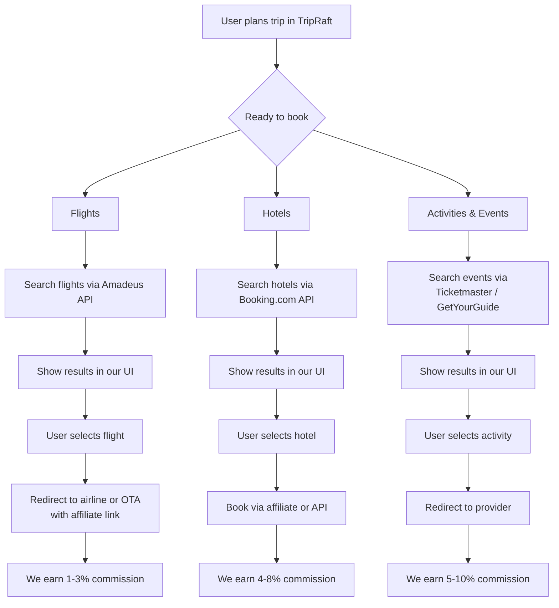
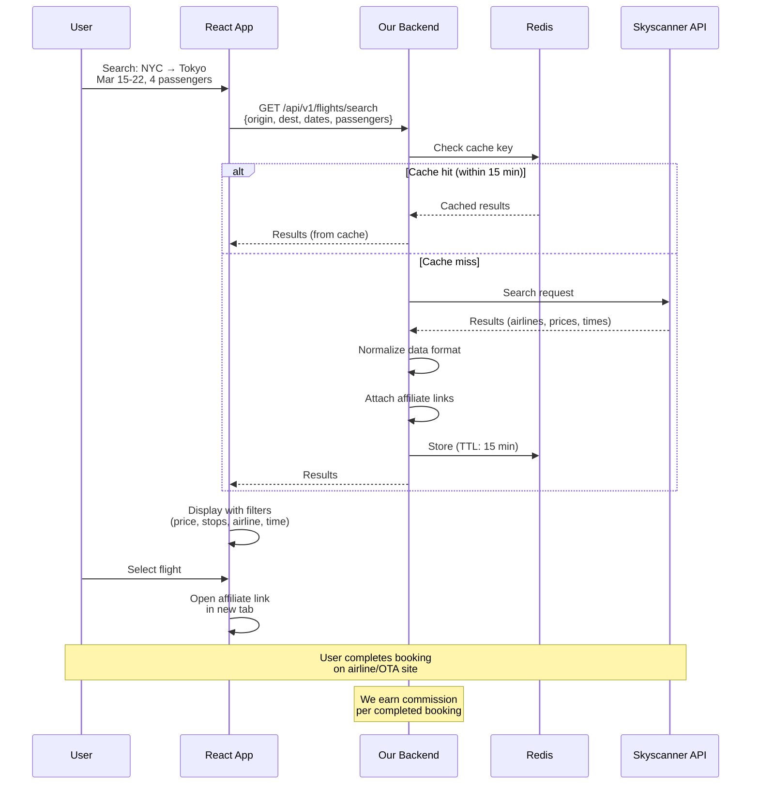
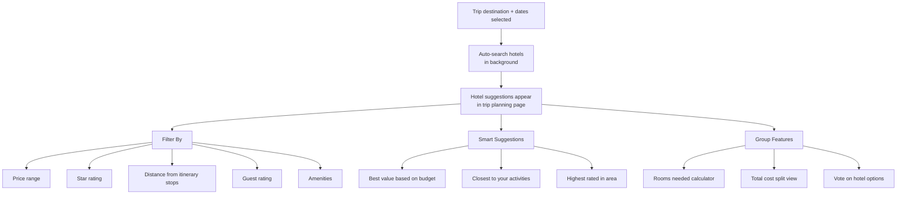
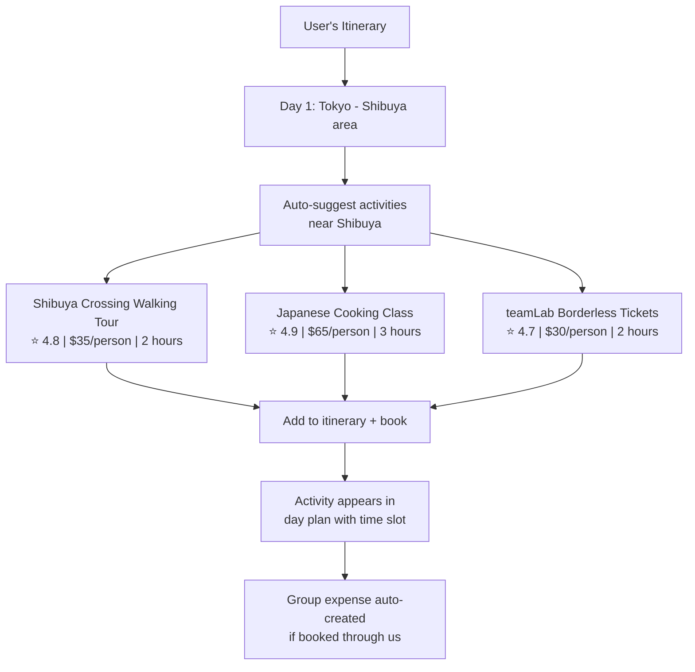
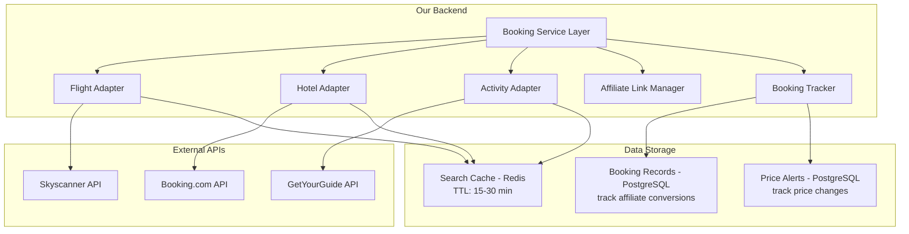
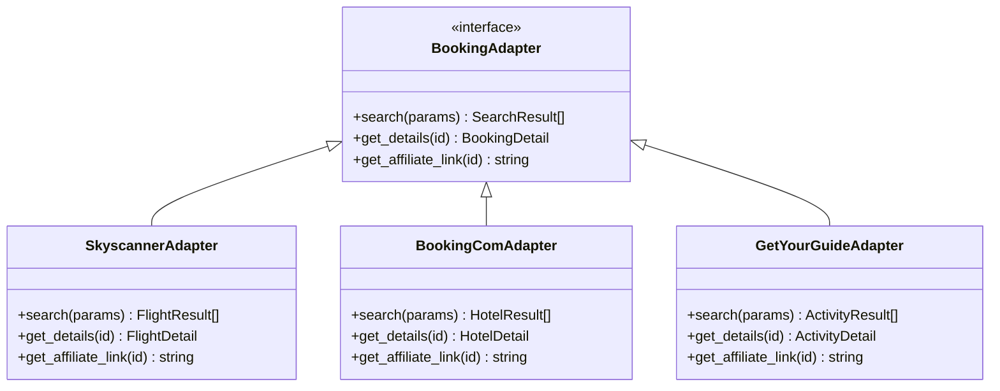
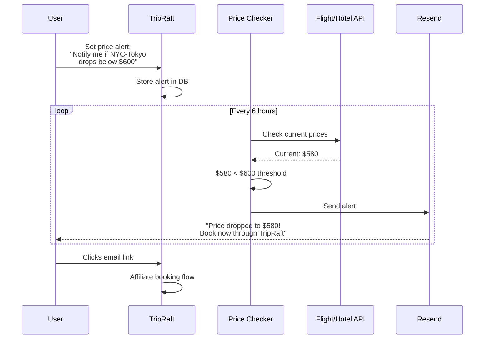
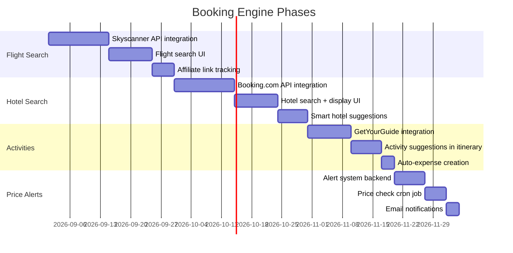

# Phase 3 -- Booking Engine

This is where TripRaft starts making money through transactions, not just subscriptions. Instead of planning a trip in our app and then leaving to book on Expedia, users book through us. We earn affiliate commissions or referral fees on every transaction.

---

## What We're Building

---

## Flight Integration

### API Options

| Provider | Type | Free Tier | Data Coverage | Integration Effort |
|----------|------|-----------|--------------|-------------------|
| Amadeus | Direct API | 500 calls/mo | Near-complete (global) | High (complex API) |
| Skyscanner | Affiliate API | Free (revenue share) | Global | Medium |
| Kiwi.com | Affiliate API | Free (revenue share) | Global + virtual interlining | Medium |
| Google Flights | No public API | N/A | N/A | N/A (scraping not viable) |
| Duffel | Direct API | Pay-per-search | Good (growing) | Medium |

**Recommendation**: Start with Skyscanner Affiliate API (free, revenue share model, easier integration), then add Amadeus for deeper control when volume justifies the cost.

### Flight Search Flow

### Revenue per Booking

| Route Type | Avg Booking Value | Commission Rate | Revenue per Booking |
|-----------|------------------|----------------|-------------------|
| Domestic short-haul | $200 | 1-2% | $2-4 |
| International economy | $800 | 1-3% | $8-24 |
| International business | $3,000 | 1-3% | $30-90 |
| Group (4 people) | $3,200 | 1-3% | $32-96 |

The group angle is our advantage. A group of 4 booking together = 4x the commission per search.

---

## Hotel Integration

### API Options

| Provider | Type | Commission | Coverage | Min Volume |
|----------|------|-----------|----------|------------|
| Booking.com Affiliate | Affiliate | 25-40% of their commission (~4-6%) | 28M+ listings | None |
| Hotels.com Affiliate | Affiliate | 4-6% | Large | None |
| Expedia Affiliate (EAN) | API | 4-8% | Very large | Apply |
| Agoda Affiliate | Affiliate | 5-7% | Asia-focused | None |
| Hostelworld | Affiliate | ~5% | Hostels/budget | None |

**Recommendation**: Booking.com Affiliate Program (largest inventory, no minimum volume, decent commission).

### Hotel Search UX

The key UX insight: don't make users leave the planning page. Hotels appear alongside the itinerary, not on a separate booking page. "You're visiting Shibuya on Day 2 -- here's a hotel 5 minutes away."

---

## Activities & Events

### API Options

| Provider | Type | Commission | Coverage |
|----------|------|-----------|----------|
| GetYourGuide | Affiliate | 8% | 60K+ activities globally |
| Viator (TripAdvisor) | Affiliate | 8% | 300K+ activities |
| Ticketmaster | API | Varies | Events, concerts, sports |
| Klook | Affiliate | 5-8% | Asia-focused |
| Musement | API | 8-10% | Europe tours |

**Recommendation**: GetYourGuide Partner API (good coverage, generous commission, easy integration).

### Activity Suggestions

The magic: booking an activity through TripRaft automatically creates an expense entry in the group's expense tracker. Less manual work.

---

## Integration Architecture

### Adapter Pattern

Each booking provider gets an adapter that normalizes the data:

This means we can swap providers without changing frontend code.

---

## Price Alerts

A feature that brings users back to the app:

Price alerts drive:
- **Engagement**: Users open the app regularly
- **Conversions**: Urgency drives bookings
- **Revenue**: Each alert-driven booking earns commission

---

## Revenue Projections

### Per-User Revenue (Annual)

| Scenario | Trips/Year | Bookings/Trip | Avg Commission | Annual Revenue/User |
|----------|-----------|---------------|----------------|-------------------|
| Light traveler | 1 | 2 (flight + hotel) | $15 | $30 |
| Regular traveler | 2 | 4 (flights + hotels + activities) | $20 | $160 |
| Frequent traveler | 4 | 6 (full booking per trip) | $25 | $600 |

### Platform Revenue by Scale

| MAU | Active Bookers (10%) | Avg Revenue/Booker | Monthly Revenue | Annual Revenue |
|-----|---------------------|-------------------|----------------|---------------|
| 1,000 | 100 | $15 | $1,500 | $18,000 |
| 10,000 | 1,000 | $15 | $15,000 | $180,000 |
| 50,000 | 5,000 | $18 | $90,000 | $1,080,000 |
| 100,000 | 10,000 | $20 | $200,000 | $2,400,000 |

These are conservative. The group angle means a single "booking decision" often converts 2-6 people at once.

---

## Implementation Timeline

**Total: approximately 14-16 weeks** for the complete booking engine.
