# Phase 4 -- Real-Time & Social Features

Right now, TripRaft is a "check back later" app. You add a place, your friend sees it next time they open the app. This phase makes it a "stay in the app" experience with real-time collaboration and social features.

---

## Why Real-Time Matters

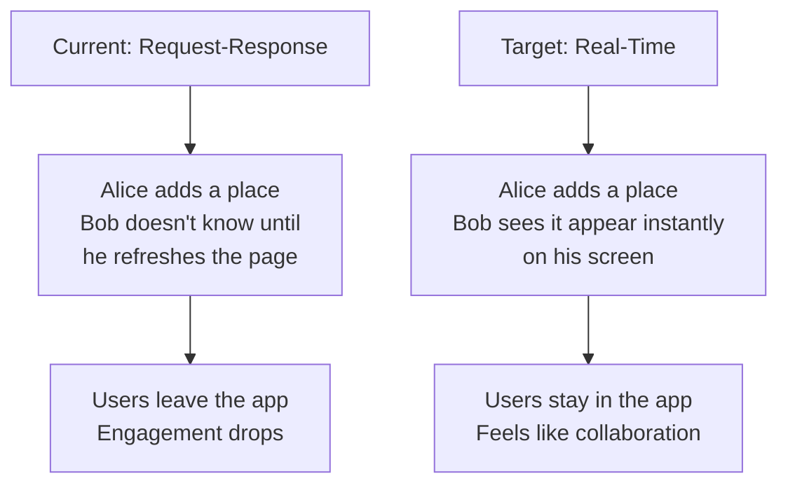

The difference between a planning tool and a collaboration platform is real-time. Google Docs didn't beat Word because it was better at formatting -- it won because two people could edit at the same time.

---

## WebSocket Architecture

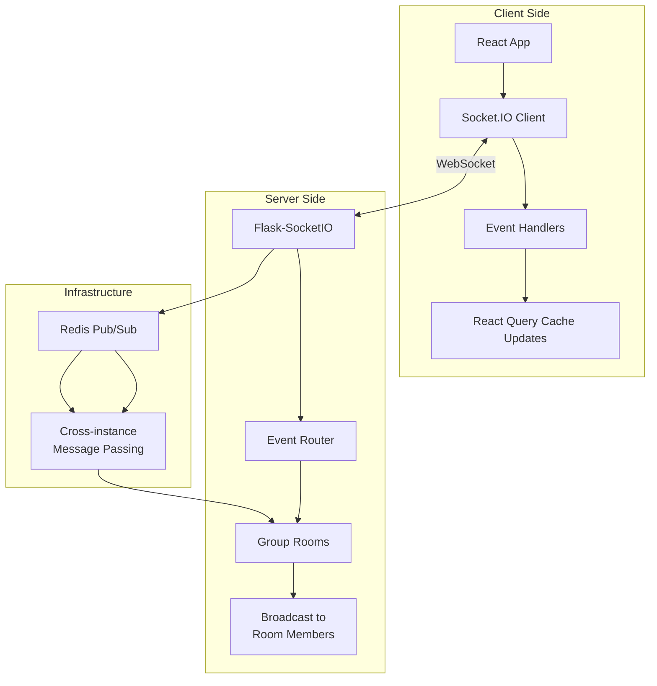

### Technology Choice

| Option | Pros | Cons | Verdict |
|--------|------|------|---------|
| Flask-SocketIO | Works with our Flask app, mature, easy | Requires eventlet/gevent | Best fit |
| FastAPI + WebSockets | Native async, fast | Requires rewriting all routes | Too much work |
| Separate Node.js WS server | Best WS performance | Two languages, two deploys | Overkill for now |
| Pusher (hosted) | Zero infrastructure | $49/mo at scale, vendor lock | Good fallback |

**Decision**: Flask-SocketIO with Redis as the message queue. It integrates directly with our existing Flask app and uses Redis (which we already have) for cross-instance communication.

### Room-Based Architecture

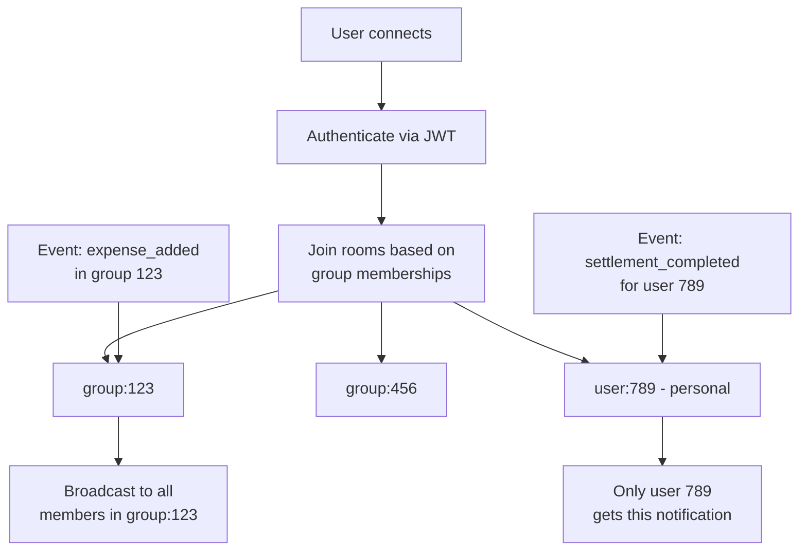

Each user joins rooms for:
- Every group they belong to
- Their personal notification channel
- Any active poll they can vote in

---

## Real-Time Events

### What Gets Broadcast

| Event | Room | Payload | UI Update |
|-------|------|---------|-----------|
| expense_added | group:{id} | New expense data | Add to expense list, update balances |
| expense_updated | group:{id} | Updated expense | Refresh expense in list |
| expense_deleted | group:{id} | Expense ID | Remove from list, update balances |
| settlement_created | group:{id} | Settlement data | Add to settlements, update balances |
| member_joined | group:{id} | New member info | Add to member list |
| member_left | group:{id} | Member ID | Remove from member list |
| place_added | group:{id} | Place data | Add to shared places |
| place_removed | group:{id} | Place ID | Remove from places |
| poll_created | group:{id} | Poll data | Show poll notification |
| vote_cast | group:{id} | Anonymous vote count | Update poll results |
| checklist_updated | group:{id} | Item status | Toggle checkbox |
| itinerary_changed | group:{id} | Changed day/slot | Refresh itinerary view |
| typing_indicator | group:{id} | User ID + feature | Show "Alice is editing..." |

### Event Flow

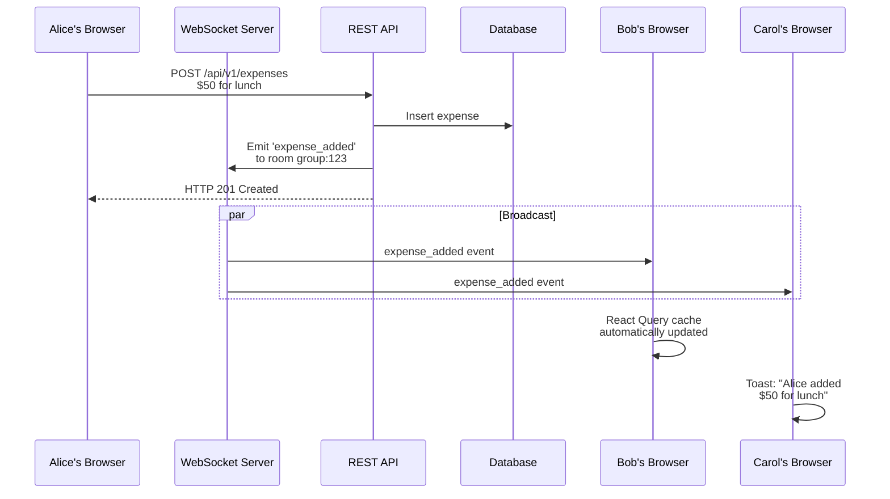

---

## Group Chat

### Why Chat (When WhatsApp Exists)

Fair question. Everyone already uses WhatsApp or iMessage for group travel chat. But our chat has context:

- Messages can reference places ("Has anyone been to this restaurant?" with the place card inline)
- Messages can reference expenses ("I just paid for dinner" with the expense attached)
- Messages can reference itinerary items ("Should we move this to Tuesday?")
- Trip-specific chat that doesn't get lost in your regular WhatsApp chats

### Chat Architecture

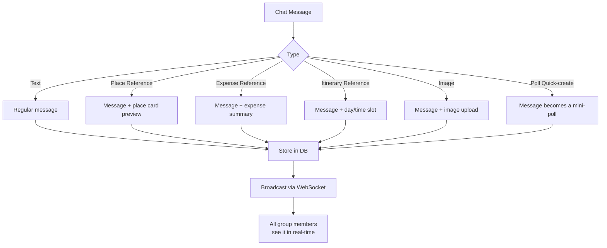

### Data Model

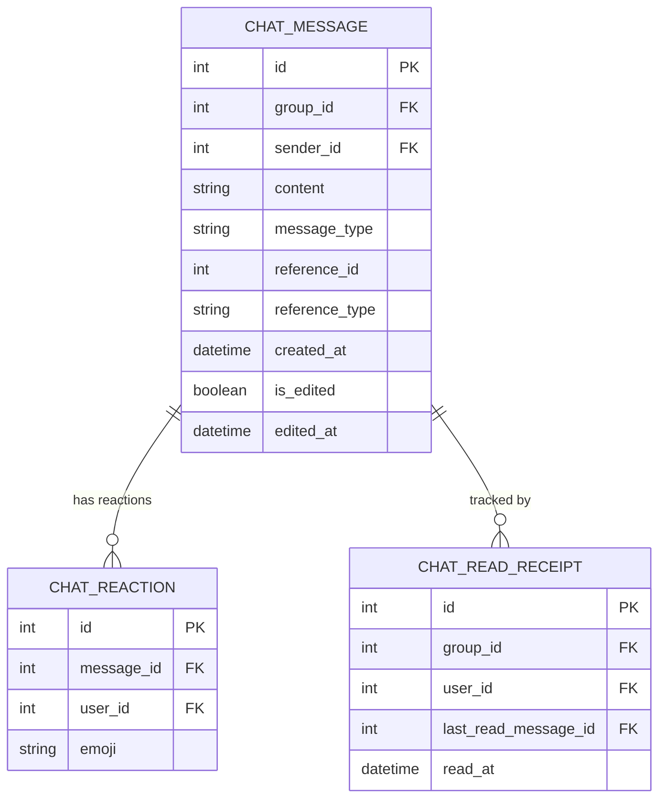

### Features

| Feature | Phase | Notes |
|---------|-------|-------|
| Text messages | 4A | Basic chat |
| Place/expense references | 4A | Context-aware chat |
| Image sharing | 4A | Upload to S3/R2 |
| Emoji reactions | 4A | Quick feedback |
| Read receipts | 4A | Unread count badge |
| Message search | 4B | Full-text search |
| @mentions | 4B | Notify specific members |
| Mini-polls in chat | 4B | Quick decisions |
| AI trip assistant in chat | 4C | Ask AI questions in group context |

---

## Live Collaboration: Itinerary Editing

The most complex real-time feature: multiple people editing the itinerary simultaneously.

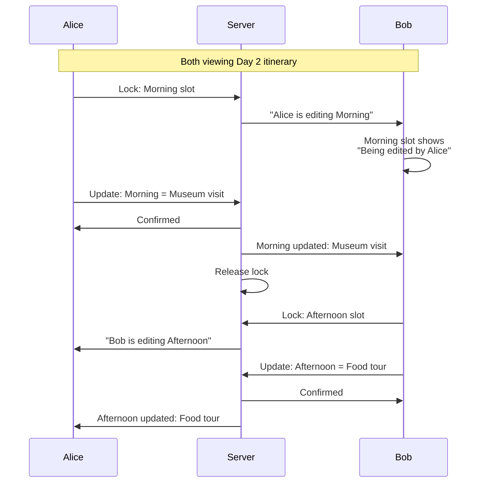

### Conflict Resolution Strategy

We use optimistic locking with slot-level granularity:

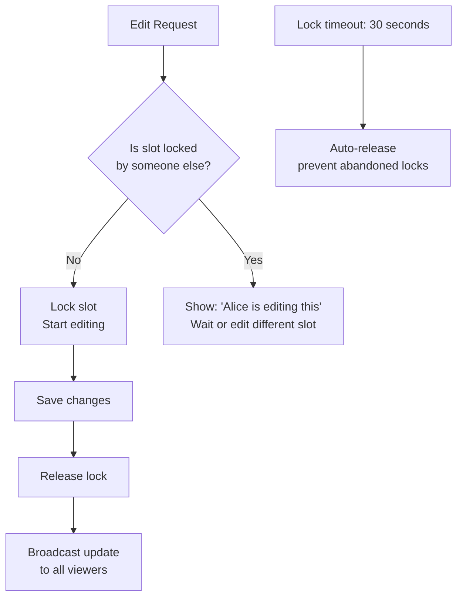

We're not building Google Docs-level operational transforms. The itinerary has natural slot boundaries (morning/afternoon/evening per day) that make simple locking practical.

---

## Push Notifications

### Channels

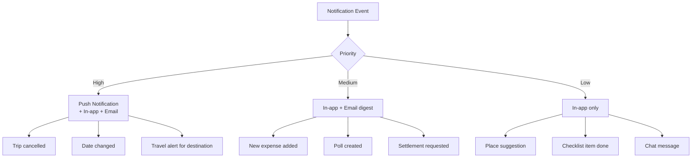

### Implementation

| Platform | Technology | Push Service |
|----------|-----------|-------------|
| Web | Service Worker + Push API | Web Push (free) |
| iOS (future) | APNs | Apple Push Notification Service |
| Android (future) | FCM | Firebase Cloud Messaging |

For web-only launch, the Push API combined with service workers handles it. No native app needed.

---

## Presence & Activity

Show who's online and what they're doing:

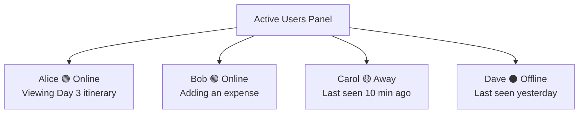

Implementation:
- Heartbeat every 30 seconds via WebSocket
- Status transitions: online → away (5 min) → offline (disconnect)
- Activity tracking: which page/feature the user is on
- Stored in Redis (ephemeral, no need for persistence)

---

## Implementation Timeline

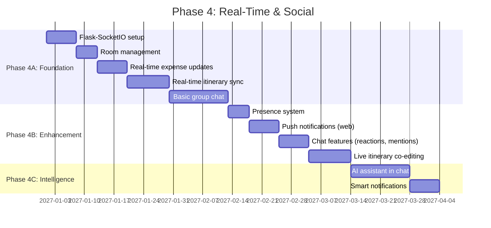

**Phase 4A total: ~6 weeks**
**Phase 4B total: ~4 weeks**
**Phase 4C total: ~3 weeks**

Phase 4A alone transforms the app from feel-slow to feel-alive. That's the critical milestone.

---

## Infrastructure Impact

| Resource | Current | After Phase 4 |
|----------|---------|--------------|
| WebSocket connections | 0 | 100-10,000 concurrent |
| Redis memory | ~30MB (cache) | ~100MB (cache + pub/sub + presence) |
| Server CPU | Low (REST only) | Medium (REST + WS + event routing) |
| Bandwidth | Low | Medium (WS keepalive + events) |
| Database writes | Low | Medium (chat messages) |

Redis Cloud free tier (30MB) will likely not be sufficient once chat + presence is active. Budget for $5-10/mo Redis upgrade.
