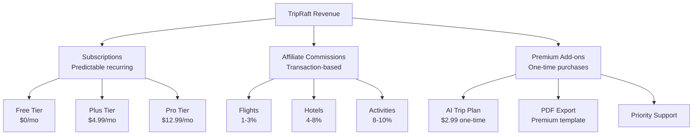
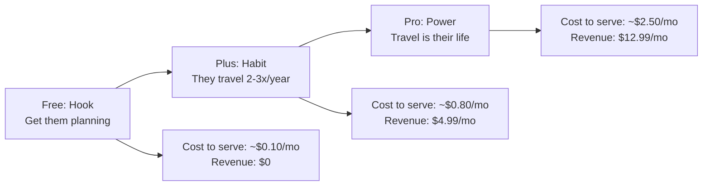
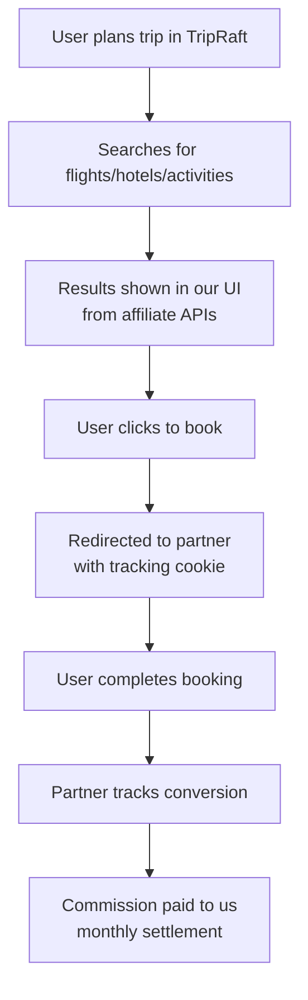
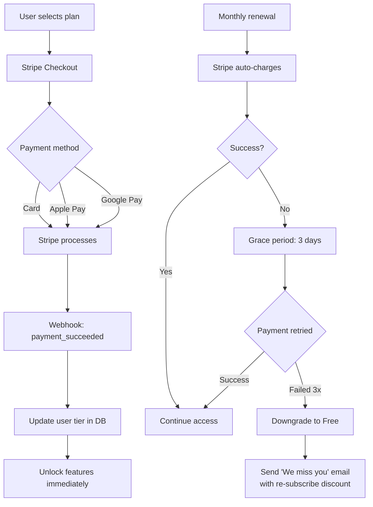
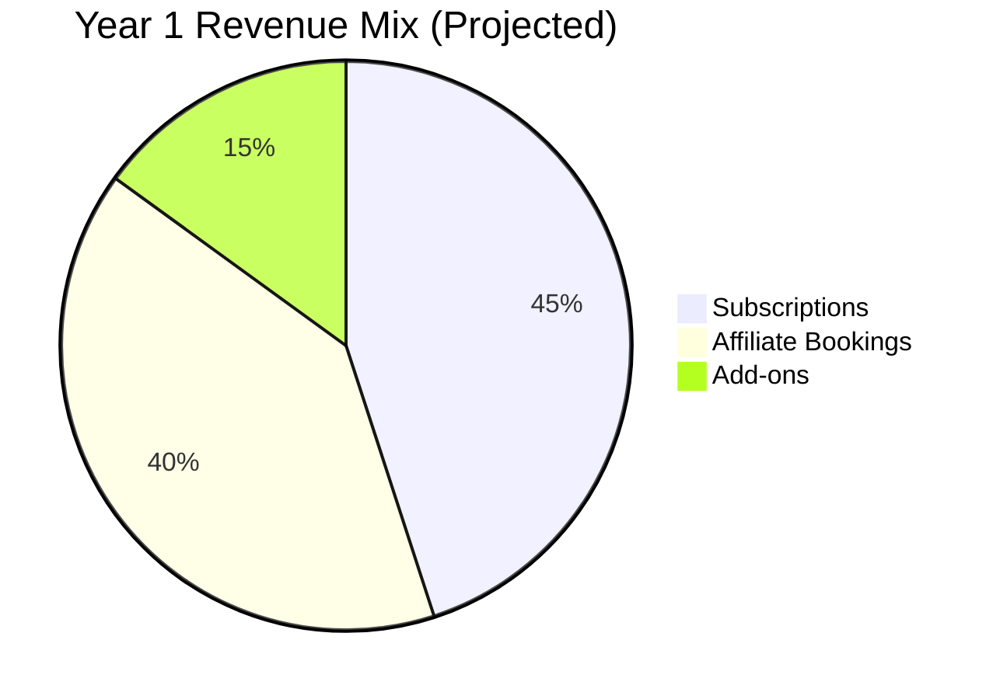
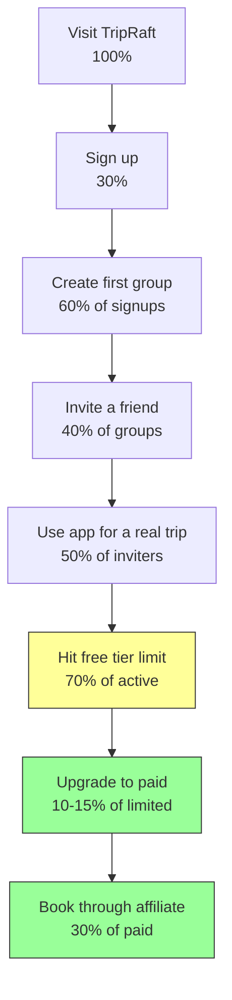

# B2C Monetization Strategy

How TripRaft makes money from individual consumers. Three revenue streams: subscription tiers, affiliate bookings, and premium add-ons.

---

## Revenue Model Overview

---

## Subscription Tiers

### Tier Comparison

| Feature | Free | Plus ($4.99/mo) | Pro ($12.99/mo) |
|---------|------|-----------------|-----------------|
| Trip groups | 2 active | 10 active | Unlimited |
| Group members | Up to 6 | Up to 15 | Up to 50 |
| Place search | Full access | Full access | Full access |
| Expense tracking | Basic | Full + analytics | Full + analytics + export |
| Polls & voting | Yes | Yes | Yes |
| AI chat questions | 10/month | 50/month | Unlimited |
| AI itinerary generation | 1/month | 5/month | Unlimited |
| Visa engine | Basic (visa type only) | Full (requirements, timeline) | Full + alerts |
| Weather | Current only | Historical + forecast | Full + best-time analysis |
| Price alerts | No | 3 active | Unlimited |
| PDF export | Basic | Styled templates | Custom branded |
| Booking affiliate | Yes | Yes + cashback | Yes + higher cashback |
| Priority support | No | Email | Email + chat |
| Ad-free | No | Yes | Yes |
| Storage (photos, docs) | 100 MB | 1 GB | 10 GB |

### Pricing Rationale

- **Free** exists to build the user base. The 2-group limit pushes frequent travelers to upgrade after their second trip.
- **Plus** at $4.99 is below the "think about it" threshold. Cheaper than one coffee per month. Targets the "I travel 2-3 times a year" crowd.
- **Pro** at $12.99 is for travel enthusiasts and content creators. Unlimited AI is the draw.

### Annual Discount

| Tier | Monthly | Annual (per month) | Savings |
|------|---------|-------------------|---------|
| Plus | $4.99 | $3.99/mo ($47.88/yr) | 20% |
| Pro | $12.99 | $9.99/mo ($119.88/yr) | 23% |

Annual plans improve retention (people forget to cancel) and cash flow.

---

## Affiliate Revenue

This is potentially the larger revenue stream. Travel is a high-value transaction category.

### How It Works

### Commission Breakdown

| Category | Partner | Commission Rate | Avg Transaction | Our Take |
|----------|---------|----------------|-----------------|----------|
| Flights | Skyscanner | 50% of CPC ($0.10-0.50) | $600 | $0.05-0.25 per click |
| Hotels | Booking.com | 25-40% of their commission | $150/night | $6-12 per booking |
| Activities | GetYourGuide | 8% | $50 | $4 per booking |
| Travel insurance | SafetyWing | 10% | $45/mo | $4.50 per signup |
| eSIM | Airalo | 15% | $10 | $1.50 per purchase |

### Plus/Pro Cashback Incentive

Give paying subscribers a reason to book through us:

| Tier | Cashback | Example |
|------|----------|---------|
| Free | 0% | Book a $150 hotel → we earn $8, you get $0 |
| Plus | 2% | Book a $150 hotel → we earn $8, you get $3 |
| Pro | 3% | Book a $150 hotel → we earn $8, you get $4.50 |

This makes the subscription pay for itself. "Your Plus subscription is $5/mo, but you saved $15 in cashback last month."

---

## Premium Add-ons (A La Carte)

For free users who don't want a subscription but want specific features:

| Add-on | Price | What You Get |
|--------|-------|-------------|
| AI Trip Plan | $2.99 | One AI-generated itinerary for a specific trip |
| Premium PDF Export | $1.99 | Beautifully designed trip booklet |
| Visa Report | $0.99 | Full visa requirements for a passport-destination pair |
| Extra AI Questions | $1.99/pack | 20 additional AI chat questions |
| Group Size Upgrade | $2.99/trip | Increase one group to 15 members |

These are impulse purchases. Low friction, low price, high perceived value.

---

## Payment Infrastructure

### Stripe Integration Details

| Component | Purpose |
|-----------|---------|
| Stripe Checkout | Hosted payment page (PCI compliant, no card data on our servers) |
| Stripe Customer Portal | Self-service subscription management |
| Stripe Webhooks | Real-time event handling (payment, cancellation, etc.) |
| Stripe Billing | Automatic invoicing and receipts |
| Stripe Tax | Automatic tax calculation |

Estimated Stripe fees: 2.9% + $0.30 per transaction.

---

## Revenue Projections

### Year 1 (Launch to 10K MAU)

| Metric | Conservative | Moderate | Optimistic |
|--------|-------------|----------|-----------|
| MAU (end of Y1) | 5,000 | 10,000 | 20,000 |
| Paid conversion rate | 3% | 5% | 8% |
| Paid users | 150 | 500 | 1,600 |
| Avg subscription revenue/user/mo | $6.50 | $7.00 | $7.50 |
| Monthly subscription revenue | $975 | $3,500 | $12,000 |
| Monthly affiliate revenue | $800 | $3,000 | $10,000 |
| Monthly add-on revenue | $300 | $1,000 | $3,000 |
| **Total monthly revenue** | **$2,075** | **$7,500** | **$25,000** |
| **Annual revenue** | **$24,900** | **$90,000** | **$300,000** |

### Year 2 (10K to 50K MAU)

| Metric | Conservative | Moderate | Optimistic |
|--------|-------------|----------|-----------|
| MAU (end of Y2) | 25,000 | 50,000 | 100,000 |
| Paid conversion rate | 5% | 7% | 10% |
| **Monthly revenue** | **$15,000** | **$50,000** | **$150,000** |
| **Annual revenue** | **$180,000** | **$600,000** | **$1,800,000** |

### Year 3 (Maturity)

| Metric | Conservative | Moderate | Optimistic |
|--------|-------------|----------|-----------|
| MAU | 75,000 | 150,000 | 300,000 |
| **Annual revenue** | **$500,000** | **$1,500,000** | **$5,000,000** |

---

## Key Metrics to Track

| Metric | Definition | Target |
|--------|-----------|--------|
| MRR | Monthly recurring revenue | Growing 15% MoM in Y1 |
| ARPU | Average revenue per user (all users) | $1.50-3.00/mo |
| ARPPU | Avg revenue per paying user | $8-15/mo |
| Conversion rate | Free → Paid | 5-8% |
| Churn rate | Monthly paid user cancellations | < 5% |
| LTV | Lifetime value of a paid user | > $100 |
| CAC | Cost to acquire a user | < $5 |
| LTV:CAC ratio | LTV divided by CAC | > 3:1 |
| Booking conversion | Users who book through affiliate | 10% of searchers |

---

## Conversion Funnel

The critical conversion point is the free tier limit. If the limits are too generous, nobody upgrades. If too restrictive, people leave. Our limit (2 groups, 6 members) is designed to let users complete one real trip, realize the value, and hit the wall on their second trip.

---

## Competition Pricing Comparison

| Product | Free Tier | Paid Tier | Our Advantage |
|---------|-----------|-----------|---------------|
| TripIt | Basic sync | $49/year | We're cheaper with more features |
| Wanderlog | Unlimited | $40/year (offline) | We include group features + booking |
| Splitwise | 5 groups | $40/year (Pro) | We include trip planning |
| Google Trips | Discontinued | N/A | We exist |
| TripRaft | 2 groups | $48-156/year | All-in-one: plan, vote, book, split |

Our positioning: "You'd need TripIt + Splitwise + Wanderlog to get what TripRaft does for $5/month."
