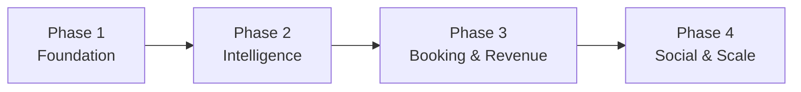

# B2C Future Plan -- Consumer Roadmap

This folder contains the phased roadmap for TripRaft as a consumer product. Each file covers a specific area of development, ordered roughly by priority and dependency.

---

## How to Read This

| File | Phase | What It Covers |
|------|-------|----------------|
| 01_SECURITY_AND_INFRASTRUCTURE.md | 1 | Database migration, hosting, monitoring |
| 02_AI_INTEGRATION.md | 2 | Agentic AI for itineraries, recommendations, chat |
| 03_SMART_FEATURES.md | 2 | Visa engine, weather, currency, travel alerts |
| 04_BOOKING_ENGINE.md | 3 | Flights, hotels, events -- how to integrate and monetize |
| 05_REAL_TIME_AND_SOCIAL.md | 4 | WebSocket updates, group chat, live collaboration |
| 06_MONETIZATION.md | 3-4 | Pricing tiers, affiliate revenue, premium features |

---

## What We Have vs. What We Need

| Area | Current State | Target State |
|------|--------------|--------------|
| Planning | Manual itinerary building | AI-generated itineraries |
| Data | 16,830 places (static) | Live data from multiple APIs |
| Booking | None | Flights, hotels, events |
| Communication | Email notifications | Real-time chat + push |
| Intelligence | Keyword search | Preference learning + recommendations |
| Revenue | $0 | Subscription + affiliate |
| Infrastructure | SQLite + single server | PostgreSQL + auto-scaling |

Everything in this folder is about closing those gaps.
