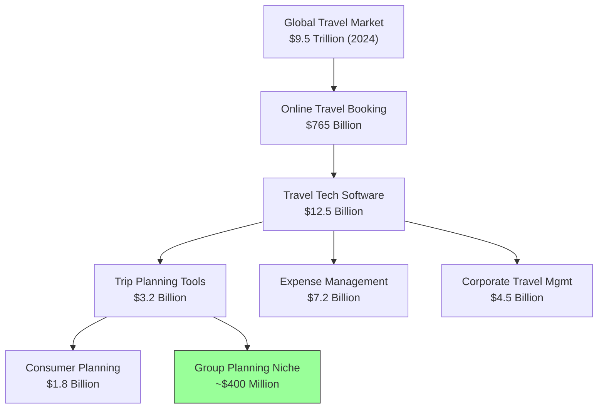
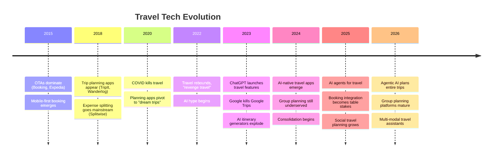
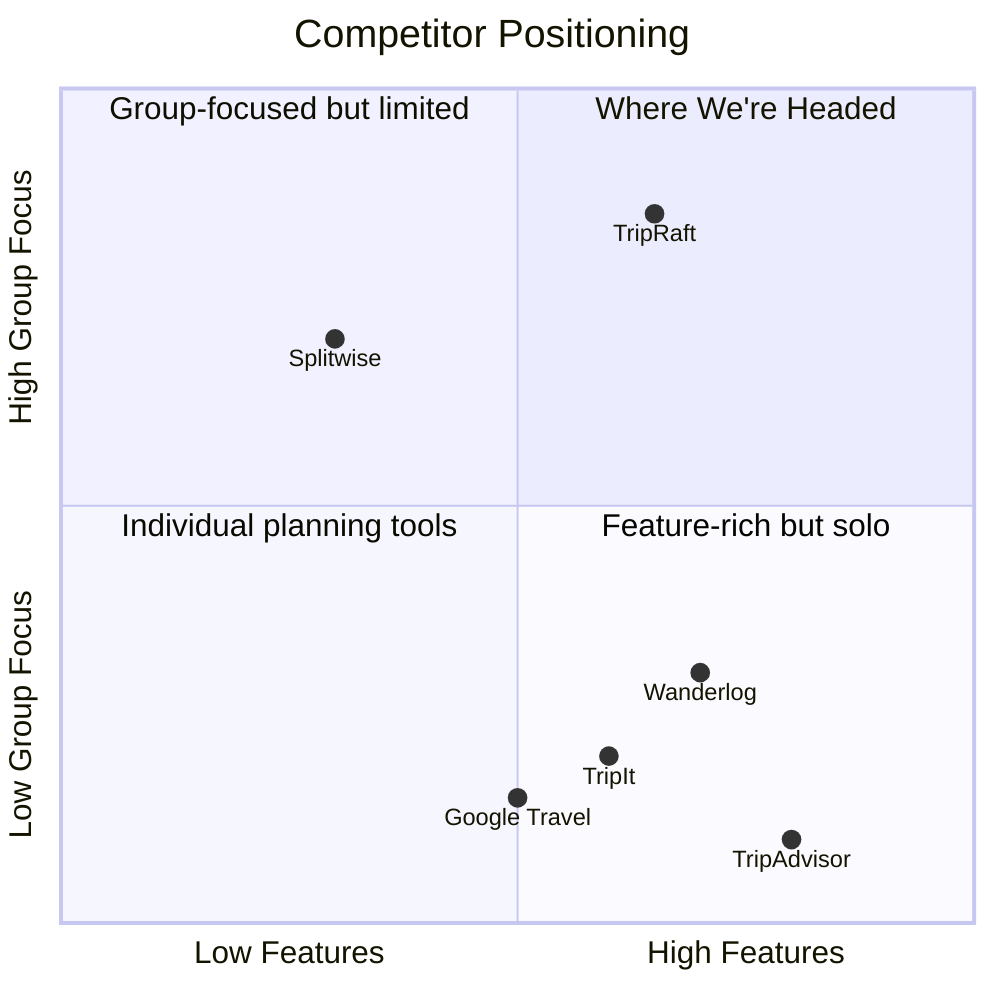
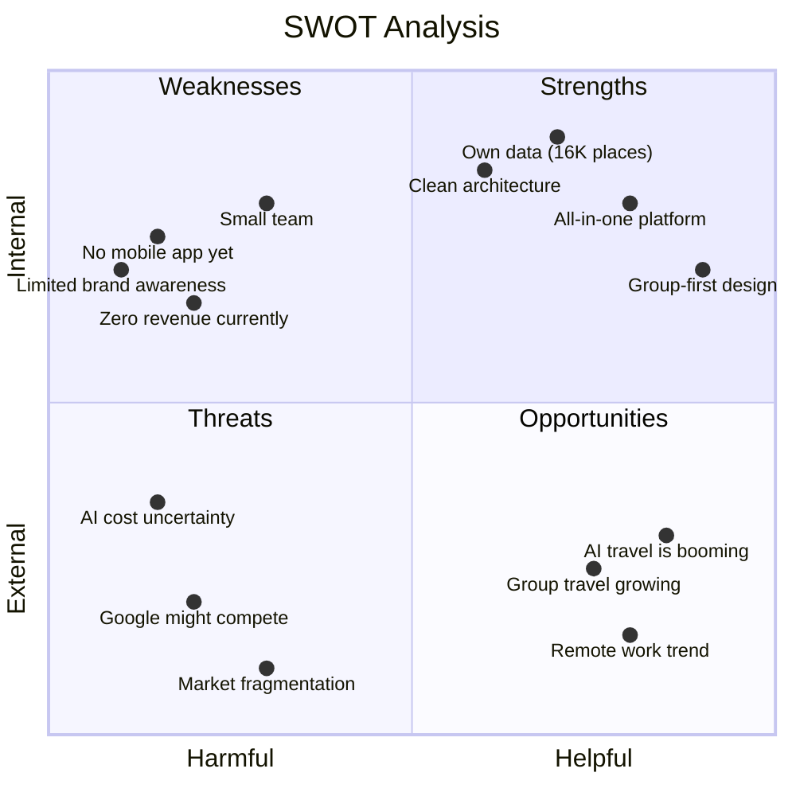
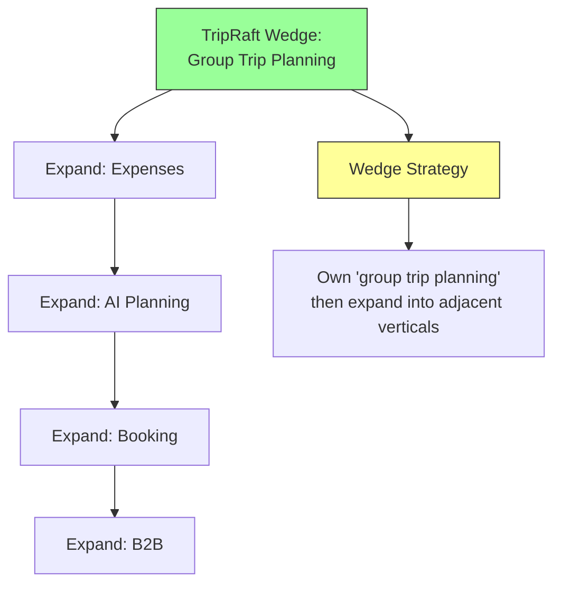

# Industry Research: Travel Tech Market Analysis

This isn't a deck for investors. This is an honest look at the market we're entering, who's already there, where the gaps are, and what our actual chances look like.

---

## Market Size

### The Numbers

Our addressable market:

| Market | Size (2024) | Growth Rate | Our Slice |
|--------|-------------|-------------|-----------|
| Trip planning tools (global) | $3.2B | 14% CAGR | Group planning: ~$400M |
| Travel expense management | $7.2B | 12% CAGR | Consumer expense splitting: ~$800M |
| AI-powered travel | ~$1.2B (2024) | 35% CAGR → $4.2B by 2030 | AI trip planning: growing fast |
| Corporate travel software | $4.5B | 10% CAGR | SMB segment: ~$1.2B |

### Key Insight

The total addressable market (TAM) doesn't matter much when you're starting out. What matters is the niche you can dominate first: **group trip planning with built-in expense splitting and AI**. That intersection is small enough to own and large enough to build a business on.

---

## Industry Trends

### What's Happening Right Now

### Trends That Help Us

| Trend | Why It Matters for TripRaft |
|-------|---------------------------|
| Group travel is growing | 68% of millennials prefer traveling with friends. Our entire product is built for this. |
| AI expectations | Users now expect AI features. We have a clear roadmap for agentic AI. |
| "Super app" fatigue | People don't want 5 apps for one trip. Our all-in-one approach resonates. |
| Remote work → travel | Distributed teams need group travel coordination. Our B2B play fits perfectly. |
| Experience over things | Experience economy growing 4x faster than goods. Trip planning tools benefit. |
| Personalization demand | Generic itineraries aren't enough anymore. Our AI + data combination wins here. |

### Trends That Threaten Us

| Trend | Risk Level | Our Defense |
|-------|-----------|-------------|
| Google re-enters trip planning | High | Move faster, go deeper on group features |
| OTAs add AI planning (Booking.com) | High | They're built for transactions, not collaboration |
| ChatGPT/Gemini become trip planners | Medium | They're generic; we have verified data + group tools |
| App fatigue ("just use WhatsApp + sheets") | Medium | Must prove the value immediately |
| Privacy concerns with AI | Low | Transparent data use, local processing where possible |

---

## Competitor Analysis

### Direct Competitors (Trip Planning)

### Detailed Comparison

| Feature | TripRaft | Wanderlog | TripIt | Splitwise | Hopper |
|---------|----------|-----------|--------|-----------|--------|
| Trip planning | Yes | Yes (best) | Basic | No | No |
| Group collaboration | Core feature | Basic sharing | Basic | No | No |
| Expense splitting | Built-in | No | No | Core feature | No |
| Voting/polls | Yes | No | No | No | No |
| AI features | Coming (Phase 2) | Limited | No | No | Price prediction |
| Booking | Coming (Phase 3) | Flight links | Flight sync | No | Core feature |
| Place database | 16K+ places | External (Google) | No | No | No |
| Offline access | No (yet) | Yes (paid) | Yes (paid) | No | No |
| Price | Free/Paid | Free/Paid ($40/yr) | Free/Paid ($49/yr) | Free/Paid ($40/yr) | Free |
| Revenue model | Sub + affiliate | Sub + affiliate | Sub | Sub | Fintech + affiliate |

### Indirect Competitors

| Competitor | What They Do | Overlap With Us |
|-----------|-------------|-----------------|
| WhatsApp/iMessage groups | Group trip chat | We replace the "planning" part of group chat |
| Google Sheets | Shared itinerary + budget | We provide structured alternatives |
| Pinterest | Save travel inspiration | We turn inspiration into actionable plans |
| Airbnb | Accommodation + experiences | We aggregate, they sell their own |
| Rome2Rio | Route planning | We do more than A-to-B routing |
| Kayak/Skyscanner | Price comparison | They search; we plan + search |

---

## SWOT Analysis

### Strengths
- Only platform combining planning + group collaboration + expense splitting
- Own place database (not dependent on Google Places API for core data)
- Clean, modern codebase (React + Flask, properly documented)
- Already functional MVP with real features
- Strong technical foundation (caching, validation, auth)

### Weaknesses
- Small team (moves slower than funded competitors)
- No mobile app (web only)
- No revenue yet (zero validation of willingness to pay)
- Limited place data compared to Google (16K vs. millions)
- AI features not yet built

### Opportunities
- AI in travel is the hottest thing right now
- No dominant player in "group trip planning"
- B2B corporate travel for SMBs is underserved
- White-label market for travel agencies is untapped
- Booking affiliate revenue requires no inventory risk

### Threats
- Google could re-launch Trips with AI and group features
- Booking.com / Expedia adding AI planning features
- ChatGPT + plugins becoming "good enough" for trip planning
- Funded competitor raising $10M+ and outbuilding us
- User acquisition costs in travel are high

---

## User Demographics

### Who Plans Group Trips

| Segment | Age | Income | Trip Frequency | Group Size | What They Value |
|---------|-----|--------|---------------|------------|-----------------|
| College friends | 22-28 | $40-70K | 1-2/year | 4-8 | Budget, fun, easy splitting |
| Young professionals | 28-35 | $70-120K | 2-3/year | 4-6 | Efficiency, quality, photos |
| Families | 30-50 | $80-150K | 1-2/year | 4-10 | Safety, kid-friendly, planning |
| Couples groups | 25-40 | $60-100K | 1-2/year | 4-8 | Romance, adventure, fairness |
| Corporate teams | 25-45 | $60-150K | 2-4/year | 6-20 | Budget compliance, logistics |

### Geographic Focus

| Region | Market Size | Competition Level | Our Priority |
|--------|-----------|------------------|-------------|
| United States | Largest | Very high | Primary market |
| Europe (EU + UK) | Large | Medium-high | Secondary market |
| India | Large, growing fast | Low-medium | Growth market |
| Southeast Asia | Growing | Low | Expansion market |
| Middle East | Growing high-spend | Low | Premium market |
| Latin America | Growing | Low | Future market |

**Launch priority**: US and English-speaking markets first. India as a fast-growth opportunity (massive group travel culture, cost-conscious, tech-savvy).

---

## What Successful Travel Startups Did Right

| Startup | What Worked | Lesson for Us |
|---------|-----------|---------------|
| Hopper | Price prediction with clear savings | Show users tangible value ("saved $X") |
| Splitwise | Made one thing (splitting) dead simple | Core feature must be frictionless |
| Wanderlog | SEO-driven content + planning tool | Content marketing drives free acquisition |
| Rome2Rio | Solved one specific problem (routing) | Own a niche before expanding |
| Airbnb | Trust through reviews, community | Social proof and community matter |
| Kayak | Aggregation + comparison | Don't compete with suppliers, aggregate them |

### What Failed Startups Got Wrong

| Startup | What Happened | Lesson |
|---------|-------------|--------|
| Google Trips | Killed by Google (product focus shifted) | Don't depend on one company's priority |
| Hitlist | Tried to do everything at once | Focus on one wedge, expand later |
| Tripping.com | Rental aggregation, lost to Airbnb | Don't compete head-on with dominant player |
| Gogobot | Social travel reviews, no differentiation | Must have a clear "why not TripAdvisor?" |
| Deem | Corporate travel, too enterprise-heavy | Don't over-build before validating demand |

---

## Our Strategic Position

The wedge strategy: Don't try to be Booking.com on day one. Be the best group trip planning tool. Once that's locked in, add expenses (keeping groups engaged), then AI (differentiation), then bookings (revenue), then B2B (scale).

Every feature we add should make the group planning experience better. If it doesn't serve that core, it shouldn't be a priority.
