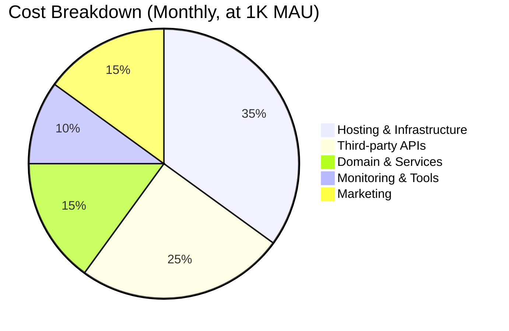
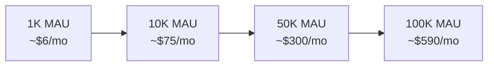
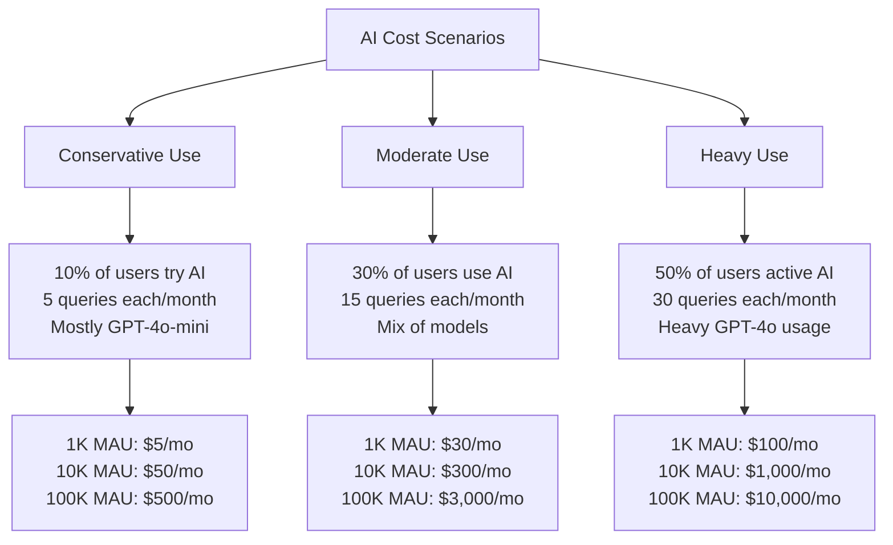
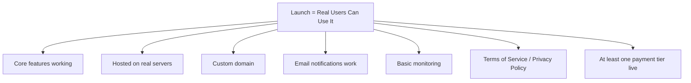
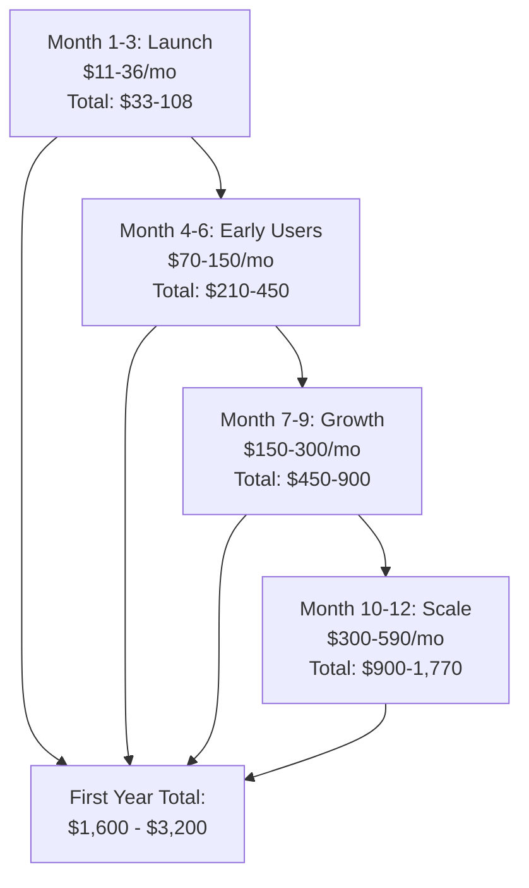
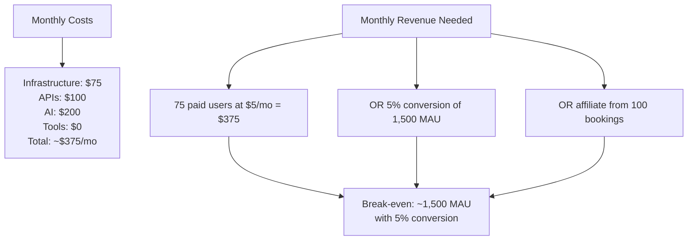

# Launch Cost Analysis

What it actually costs to take TripRaft from "works on my laptop" to "real users can use it." No fluff, just numbers.

---

## Cost Categories

---

## Infrastructure Costs

### At Launch (0-1,000 MAU)

| Service | Provider | Plan | Monthly Cost |
|---------|----------|------|-------------|
| Backend hosting | Railway | Starter | $5 |
| Frontend hosting | Vercel | Free (Hobby) | $0 |
| Database (PostgreSQL) | Supabase | Free (500MB) | $0 |
| Cache (Redis) | Redis Cloud | Free (30MB) | $0 |
| File storage | Cloudflare R2 | Free (10GB) | $0 |
| Domain | Cloudflare | Annual ($10/yr) | $0.83 |
| SSL | Included with platforms | - | $0 |
| **Total Infrastructure** | | | **$5.83/mo** |

That's not a typo. Modern platform free tiers are incredibly generous. At 1K users, you're basically free.

### At Growth (1,000-10,000 MAU)

| Service | Provider | Plan | Monthly Cost |
|---------|----------|------|-------------|
| Backend hosting | Railway | Pro (more resources) | $20 |
| Frontend hosting | Vercel | Pro | $20 |
| Database | Supabase | Pro (8GB) | $25 |
| Cache (Redis) | Redis Cloud | 250MB | $7 |
| File storage | Cloudflare R2 | Pay-as-you-go | $3 |
| CDN | Cloudflare | Free | $0 |
| **Total Infrastructure** | | | **$75/mo** |

### At Scale (10,000-100,000 MAU)

| Service | Provider | Plan | Monthly Cost |
|---------|----------|------|-------------|
| Backend hosting | Railway (or AWS ECS) | Auto-scaling | $100-250 |
| Frontend hosting | Vercel | Pro | $20 |
| Database | Supabase Pro or RDS | 32GB+ | $75-150 |
| Cache (Redis) | Redis Cloud | 1-5GB | $30-100 |
| File storage | Cloudflare R2 / S3 | 100GB+ | $10-30 |
| CDN | Cloudflare | Free/Pro | $0-20 |
| Load balancer | Included with platforms | - | $0-20 |
| **Total Infrastructure** | | | **$235-590/mo** |

---

## Third-Party API Costs

### Essential APIs

| API | What For | Free Tier | Cost at Scale |
|-----|---------|-----------|---------------|
| Resend (Email) | Invitations, notifications | 3,000 emails/mo | $20/mo (50K emails) |
| OpenAI | AI features | None (pay per use) | $50-800/mo (depending on usage) |
| Open-Meteo | Weather data | Unlimited | $0 |
| ExchangeRate API | Currency conversion | 1,500 calls/mo | $10/mo |
| Mapbox / Leaflet | Map tiles | 50K loads/mo (Mapbox) | $0 (Leaflet is free) |

### Booking Affiliate APIs (Revenue-Generating)

| API | Cost | Revenue | Net |
|-----|------|---------|-----|
| Skyscanner | Free | Earn per click/booking | Positive |
| Booking.com | Free | Earn per booking | Positive |
| GetYourGuide | Free | Earn per booking | Positive |

Affiliate APIs cost nothing -- they pay us. This is the beauty of the affiliate model.

### AI Cost Breakdown

This is the wildcard. AI costs depend entirely on usage patterns.

**Key insight**: Caching and model routing are critical. Without them, AI costs balloon fast. With aggressive caching (semantic similarity matching), we can reduce costs by 60-80%.

---

## Tools & Services

| Tool | Purpose | Free Tier | Paid Cost |
|------|---------|-----------|-----------|
| Sentry | Error tracking | 5K events/mo | $26/mo (50K events) |
| PostHog | Analytics | 1M events/mo | Free for most scales |
| UptimeRobot | Uptime monitoring | 50 monitors | $0 |
| Better Stack | Log aggregation | 1GB/mo | $0-24/mo |
| GitHub | Code hosting | Free (public/private) | $0 |
| GitHub Actions | CI/CD | 2,000 min/mo | $0 |
| Stripe | Payments | Pay per transaction | 2.9% + $0.30/txn |
| Figma | Design | Free tier | $0-15/mo |
| Linear/GitHub Issues | Task management | Free | $0 |

### Free Tier Total

At launch, tools cost: **$0/month** (all within free tiers)

---

## Human Costs (If Applicable)

If this is a solo project, human cost is your time. If you're hiring or contracting:

| Role | When Needed | Monthly Cost | Phase |
|------|------------|-------------|-------|
| Solo founder | Now | $0 (sweat equity) | All |
| Part-time designer | Phase 2 (AI UX) | $2,000-3,000 | Optional |
| Backend contractor | Phase 2-3 | $5,000-8,000 | If rushing |
| Marketing help | Post-launch | $1,000-2,000 | Growth |
| Customer support | At 5K+ users | $500-1,500 | Scale |

### Realistic Scenarios

**Scenario A: Solo founder, bootstrapped**
- Total monthly cost at launch: ~$6
- Total monthly cost at 10K MAU: ~$150 (infra + APIs)
- Total monthly cost at 100K MAU: ~$1,000 (infra + APIs + AI)
- Time: 6-12 months to feature complete

**Scenario B: Solo founder + occasional contractor**
- Additional: $2,000-5,000/month when contractor is active
- Time: 4-8 months to feature complete

**Scenario C: Small team (2-3 people)**  
- People cost: $10,000-20,000/month (if paid)
- Infrastructure: Same as above
- Time: 3-5 months to feature complete

---

## Total Cost to Launch (MVP → Production)

### What "Launch" Means

### The Bill

| Category | One-Time Costs | Monthly Costs (Month 1-3) | Monthly Costs (Month 4-12) |
|----------|---------------|--------------------------|---------------------------|
| Domain registration | $10 | - | - |
| Infrastructure | $0 | $6 | $20-75 |
| Email service | $0 | $0 | $0-20 |
| AI APIs | $0 | $5-30 | $50-300 |
| Monitoring | $0 | $0 | $0 |
| Stripe (if collecting payments) | $0 | 2.9%+$0.30/txn | 2.9%+$0.30/txn |
| Legal (ToS, Privacy) | $0-500 | - | - |
| **Total** | **$10-510** | **$11-36/mo** | **$70-395/mo** |

### First Year Cost Projection

**First year all-in cost (bootstrapped, solo): $1,600 - $3,200**

That's assuming organic growth to 10K MAU. If you're spending on marketing (ads, influencers), add $500-2,000/month.

---

## Break-Even Analysis

### When Revenue Covers Costs

| MAU | Est. Monthly Cost | Est. Monthly Revenue | Profit/Loss |
|-----|-------------------|---------------------|-------------|
| 500 | $30 | $50 (10 subs) | +$20 |
| 1,000 | $60 | $200 (25 subs + affiliate) | +$140 |
| 5,000 | $200 | $1,500 (150 subs + affiliate) | +$1,300 |
| 10,000 | $375 | $5,000 (350 subs + affiliate) | +$4,625 |
| 50,000 | $1,500 | $30,000+ | +$28,500 |

**Break-even is remarkably low** because:
1. No inventory cost (we don't hold hotel rooms or flight seats)
2. Infrastructure scales with free tiers
3. Marginal cost per user is tiny (cache hit = free)
4. Affiliate revenue has zero marginal cost

---

## Summary: What You Actually Need to Launch

| Item | Cost | Notes |
|------|------|-------|
| A domain name | $10/year | tripraft.com or similar |
| Railway account | $5/month | Backend hosting |
| Vercel account | Free | Frontend hosting |
| Supabase account | Free | PostgreSQL database |
| Redis Cloud account | Free | Caching |
| Resend account | Free | Email for invitations |
| Stripe account | Free (pay per txn) | Accept payments |
| OpenAI API key | Pay per use | For AI features when ready |
| Sentry account | Free | Error monitoring |
| Time and determination | Priceless | The actual bottleneck |

**Day one cost: $15.83** (domain + Railway). Everything else is free until you outgrow free tiers.

That's the honest answer. The barrier to launch isn't money -- it's finishing the product and getting it in front of people.
