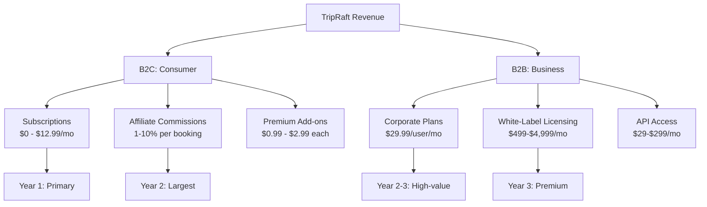
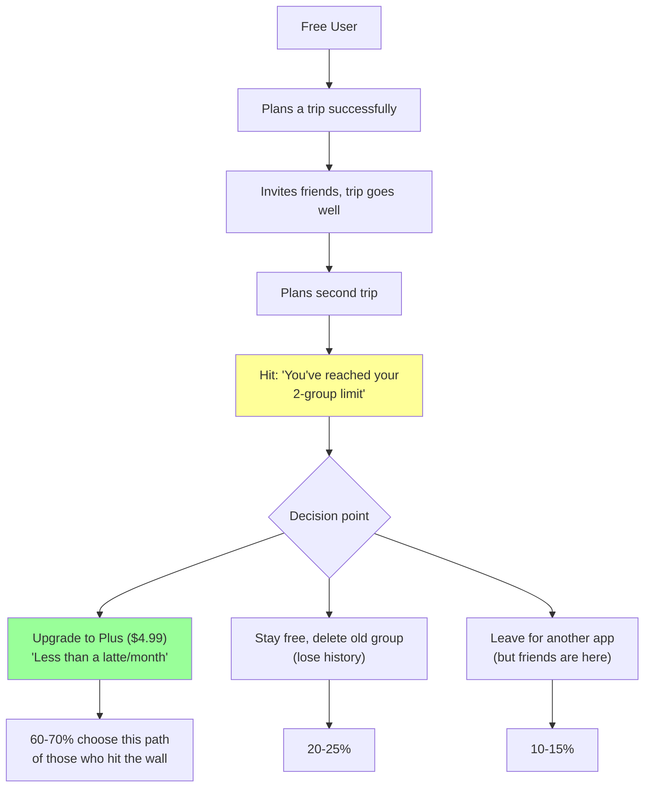
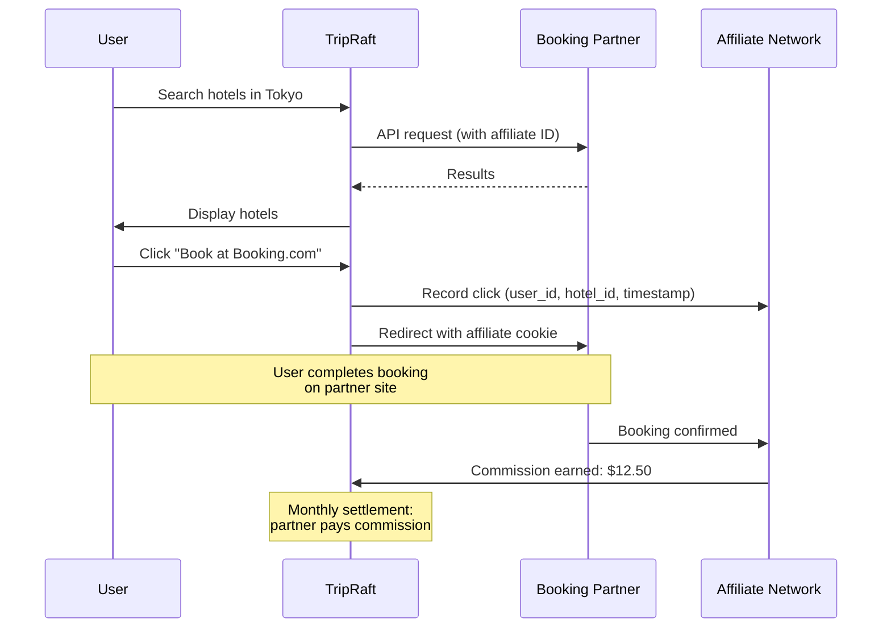
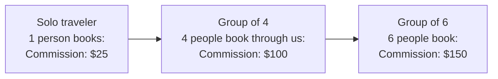
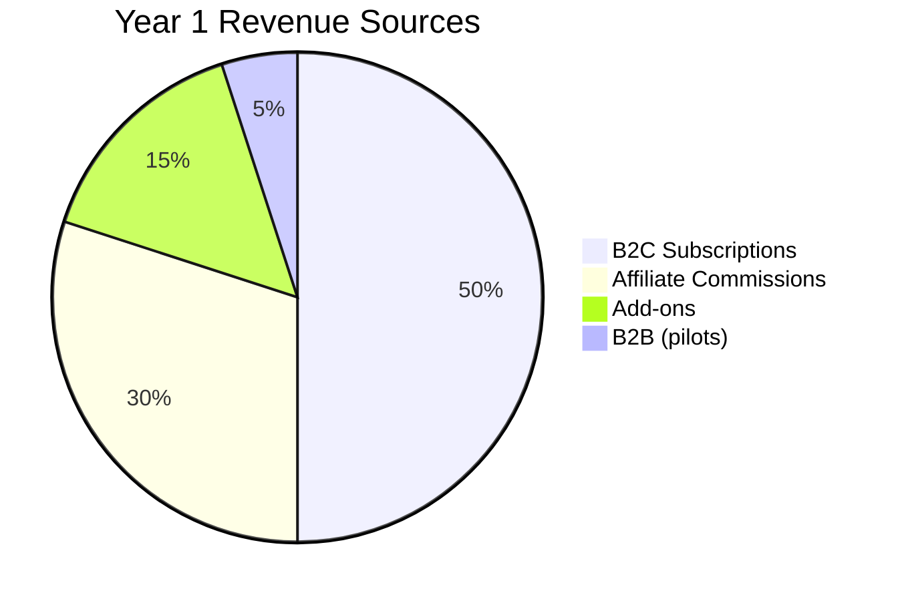
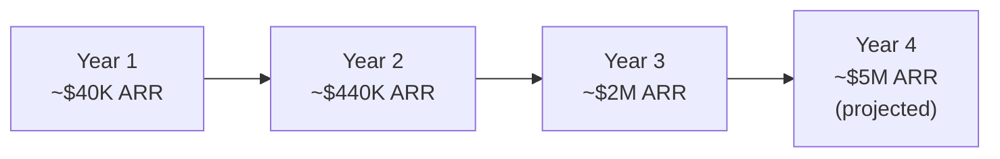
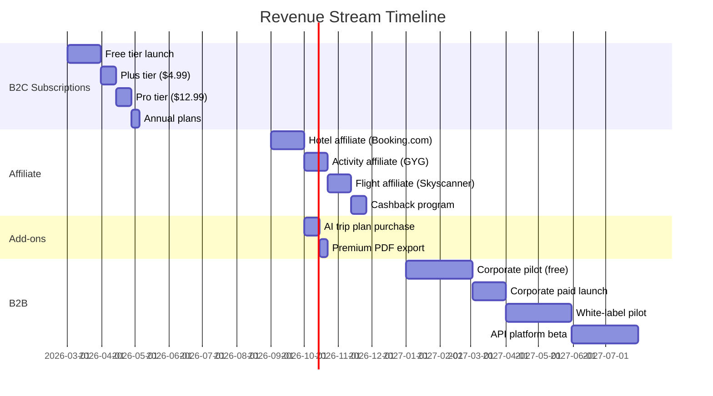
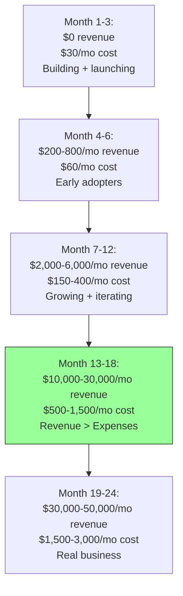

# Monetization Strategy

A consolidated view of how TripRaft makes money across B2C and B2B, with realistic projections, pricing psychology, and the roadmap to profitability.

---

## Revenue Streams at a Glance



---

## B2C Pricing Structure

### Subscription Tiers

| | Free | Plus ($4.99/mo) | Pro ($12.99/mo) |
|--|------|-----------------|-----------------|
| Trip groups | 2 | 10 | Unlimited |
| Members per group | 6 | 15 | 50 |
| AI queries/month | 10 | 50 | Unlimited |
| AI itineraries/month | 1 | 5 | Unlimited |
| Visa engine | Type only | Full details | Full + alerts |
| Price alerts | None | 3 active | Unlimited |
| PDF export | Basic | Styled | Custom branded |
| Booking cashback | None | 2% | 3% |
| Ads | Yes | No | No |
| Storage | 100 MB | 1 GB | 10 GB |

### Pricing Psychology



The 2-group limit is carefully chosen:
- First trip: Everything works perfectly (they fall in love with the product)
- Second trip: They already have muscle memory, friends are on the platform
- The upgrade ask comes when they're invested, not when they're evaluating

### Annual Plans

| Plan | Monthly | Annual (per month) | Annual Total | Savings |
|------|---------|-------------------|-------------|---------|
| Plus | $4.99 | $3.99 | $47.88 | 20% |
| Pro | $12.99 | $9.99 | $119.88 | 23% |

Annual plans are pushed subtly: "Save 20% with annual billing" on the pricing page, pre-selected annual toggle.

---

## Affiliate Revenue Model

### How Affiliate Works



### Commission Rates by Category

| Category | Partner | Our Commission | Avg Booking Value | Avg Commission |
|----------|---------|---------------|-------------------|---------------|
| Hotels | Booking.com | 4-6% | $150/night (avg 3 nights = $450) | $18-27 |
| Flights | Skyscanner | CPC model (~$0.15-0.50/click) | $600 avg | $0.15-0.50/search |
| Activities | GetYourGuide | 8% | $50/activity | $4 |
| Travel insurance | SafetyWing | 10% | $45/month | $4.50 |
| eSIM data | Airalo | 15% | $10 | $1.50 |
| Car rental | Rentalcars.com | 4-6% | $40/day (avg 5 days = $200) | $8-12 |

### Group Multiplier

This is our unfair advantage. Travel planning usually serves individuals. We serve groups.



A single group planning session can generate 4-6x the affiliate revenue of a solo planner. Most travel apps only convert one person per session.

### Cashback Program

Paying subscribers get a portion back, making the subscription "pay for itself":

| Tier | Cashback Rate | Example: $450 hotel booking |
|------|-------------|---------------------------|
| Free | 0% | We earn $22, user gets $0 |
| Plus ($5/mo) | 2% | We earn $13, user gets $9 |
| Pro ($13/mo) | 3% | We earn $8.50, user gets $13.50 |

For Pro users: "Your $13/month subscription just saved you $13.50 on one booking." The subscription pays for itself after a single hotel booking. That's a powerful retention argument.

---

## Premium Add-Ons

| Add-on | Price | Margin | Target Buyer |
|--------|-------|--------|-------------|
| AI Trip Plan | $2.99 | ~$2.50 (AI cost $0.05-0.50) | Free users who want one plan |
| Premium PDF | $1.99 | ~$1.95 | Users who want pretty exports |
| Visa Report | $0.99 | ~$0.95 | Travelers to visa-required countries |
| 20 Extra AI Questions | $1.99 | ~$1.50 | Free/Plus users who hit limits |
| Group Size Boost (to 15) | $2.99/trip | ~$2.95 | Free users with big friend groups |

Add-ons serve two purposes:
1. Revenue from free users who won't subscribe
2. "Taste" of premium features that drives eventual subscription

---

## B2B Revenue

### Corporate Travel

| Plan | Price | Target |
|------|-------|--------|
| Business | $29.99/user/mo | 10-50 employees |
| Enterprise | $15-25/user/mo (volume) | 50-500 employees |
| Enterprise Plus | Custom | 500+ employees |

### White-Label

| Tier | Monthly Fee | Target |
|------|-----------|--------|
| Starter | $499/mo | Small agencies |
| Growth | $1,499/mo | Mid-size agencies, tourism boards |
| Enterprise | $4,999/mo | Large brands |

### API Platform

| Tier | Monthly Fee | Credits |
|------|-----------|---------|
| Free | $0 | 1,000 |
| Developer | $29 | 10,000 |
| Business | $99 | 50,000 |
| Enterprise | $299 | 250,000 |

---

## Revenue Projections (Combined)

### Year 1: Consumer Focus



| Quarter | MAU | Paid Users | Sub Revenue | Affiliate | Add-ons | Total/mo |
|---------|-----|-----------|------------|-----------|---------|----------|
| Q1 | 500 | 15 | $90 | $50 | $30 | $170 |
| Q2 | 2,000 | 80 | $480 | $300 | $100 | $880 |
| Q3 | 5,000 | 250 | $1,500 | $1,000 | $300 | $2,800 |
| Q4 | 10,000 | 500 | $3,000 | $2,500 | $500 | $6,000 |
| **Year 1 Total** | | | | | | **~$40,000** |

### Year 2: Growth + B2B Launch

| Quarter | MAU | B2C Revenue/mo | B2B Revenue/mo | Total/mo |
|---------|-----|---------------|---------------|----------|
| Q1 | 15,000 | $8,000 | $1,000 | $9,000 |
| Q2 | 25,000 | $15,000 | $3,000 | $18,000 |
| Q3 | 35,000 | $25,000 | $8,000 | $33,000 |
| Q4 | 50,000 | $35,000 | $15,000 | $50,000 |
| **Year 2 Total** | | | | **~$440,000** |

### Year 3: Scale

| Quarter | MAU | B2C Revenue/mo | B2B Revenue/mo | Total/mo |
|---------|-----|---------------|---------------|----------|
| Q1 | 65,000 | $50,000 | $25,000 | $75,000 |
| Q2 | 85,000 | $65,000 | $40,000 | $105,000 |
| Q3 | 110,000 | $85,000 | $60,000 | $145,000 |
| Q4 | 150,000 | $110,000 | $80,000 | $190,000 |
| **Year 3 Total** | | | | **~$2,060,000** |



---

## Unit Economics

### B2C Unit Economics

| Metric | Value | Notes |
|--------|-------|-------|
| CAC (organic) | $2-5 | SEO, word of mouth, Product Hunt |
| CAC (paid) | $10-25 | Google Ads, social media |
| Average blended CAC | $8 | Mix of organic + paid |
| Free-to-paid conversion | 5% | 100 signups → 5 paid |
| ARPU (all users) | $2.50/mo | Including free |
| ARPPU (paying users) | $9.50/mo | Sub + affiliate + add-ons |
| Monthly churn (paid) | 4% | Industry avg for consumer subscriptions |
| Average paid lifetime | 25 months | 1/churn rate |
| LTV (paying user) | $237.50 | ARPPU × lifetime |
| LTV:CAC ratio | 29.7:1 (organic), 9.5:1 (paid) | Healthy above 3:1 |

### B2B Unit Economics

| Metric | Value |
|--------|-------|
| CAC | $500-2,000 per company |
| Average contract value | $3,000-30,000/year |
| Annual churn | 10-15% |
| LTV | $20,000-200,000 |
| LTV:CAC ratio | 10:1 - 100:1 |

B2B is absurdly profitable per customer, but slow to acquire. Each sales cycle is weeks to months.

---

## Payment Infrastructure

```mermaid
flowchart TD
    A[Stripe] --> B[Checkout<br/>Payment page]
    A --> C[Billing<br/>Recurring subscriptions]
    A --> D[Customer Portal<br/>Self-service management]
    A --> E[Connect<br/>Affiliate payouts]
    A --> F[Tax<br/>Automatic compliance]
    A --> G[Revenue Recognition<br/>Accounting]
    
    B --> H[Implementation:<br/>stripe.redirectToCheckout()]
    C --> I[Implementation:<br/>Webhook: invoice.paid]
    D --> J[Implementation:<br/>stripe.billingPortal.sessions.create()]
```

Stripe handles everything. No PCI compliance headaches, no payment infrastructure to build.

---

## Revenue Priorities by Phase



---

## The Path to Profitability



**Profitability milestone**: At roughly 3,000 paying users and moderate affiliate revenue (~Month 12-15), revenue consistently exceeds all infrastructure and API costs.

The beauty of this model: infrastructure costs grow logarithmically while revenue grows linearly-to-exponentially. The gap between cost and revenue widens as you scale.

---

## What Not to Do

| Temptation | Why It's Bad | What to Do Instead |
|------------|-------------|-------------------|
| Go free forever | No revenue validation | Launch paid tier early, even if nobody pays |
| Charge too much early | Kills adoption | Start cheap, raise prices as features grow |
| Complex pricing | Confuses users | Three tiers, simple feature gates |
| Ignore affiliate | Leaving money on the table | Build booking integration in Phase 3 |
| Skip B2B | Biggest revenue per customer | Start B2B pilots in year 2 |
| Burn on paid ads early | CAC too high with small product | Optimize organic first, paid ads after PMF |

The first dollar from a real customer is worth more than a thousand-page business plan. Ship, charge, learn, iterate.
