# TripRaft — Master Plan: The Complete AI Travel Platform

> **Version:** 1.0 | **Date:** February 9, 2026 | **Status:** Strategic Blueprint
> 
> This document captures EVERYTHING — current state, bugs, architecture, agentic AI strategy, file restructuring, worldwide support, monetization, and the full step-by-step execution plan.

---

## Table of Contents

1. [Executive Summary](#1-executive-summary)
2. [Current State — What Works and What's Broken](#2-current-state)
3. [File Structure Audit — Duplicates and Reorganization](#3-file-structure-audit)
4. [Architecture Flow — Complete System Diagram](#4-architecture-flow)
5. [Phase 0: Critical Fixes (Week 1-2)](#5-phase-0-critical-fixes)
6. [Phase 1: Foundation Cleanup and Infrastructure (Week 3-6)](#6-phase-1-foundation)
7. [Phase 2: Agentic AI — The Intelligence Layer (Week 7-14)](#7-phase-2-agentic-ai)
8. [Phase 3: Advanced Features — Worldwide Platform (Week 15-22)](#8-phase-3-advanced-features)
9. [Phase 4: Growth, Monetization, and Scale (Week 23-30)](#9-phase-4-growth)
10. [Tech Stack — Complete Reference](#10-tech-stack)
11. [Worldwide Support Strategy](#11-worldwide-support)
12. [Monetization Blueprint](#12-monetization)
13. [Competitive Advantage](#13-competitive-advantage)
14. [Complete Feature Matrix — Current vs Future](#14-feature-matrix)

---

## 1. Executive Summary

TripRaft is a functional MVP with 5 core modules:

| Module | What It Does | State |
|--------|-------------|-------|
| **Place Search** | Search 16,830+ places across 889 cities, 82 countries | Working |
| **Trip Planner** | Generate day-by-day itineraries (rule-based) | Working |
| **Expense Engine** | Split expenses, track balances, settle debts | Working (bugs) |
| **Group Planner** | Collaborative trip planning with polls, checklist, map | Working (bugs) |
| **Auth System** | JWT login/signup with token refresh | Working |

**The Goal:** Transform TripRaft from a CRUD app into the world's most advanced AI-powered trip planning platform where an **Agentic AI** handles everything — from planning to booking to expense tracking — for both solo travelers and groups, working worldwide.

**Key Problems Found:**
- 23 bugs and broken features identified
- 12 duplicate files/modules that need consolidation
- Map display for destination places is **broken** (wrong import)
- "Leave group" feature **does not exist**
- Budget edit UI is **incomplete** (button exists, no form)
- Notes auto-save **works** (confirmed)
- No AI/Chat capability exists yet
- No real-time updates (60s polling only)
- No payment integration
- Security vulnerabilities (20 issues found)
- Redis cache exists but **never initialized** (dead code)
- Rate limiter exists but **never attached** (dead code)

---

## 2. Current State — What Works and What's Broken

### Feature Status Matrix

```
FEATURE                          STATUS          NOTES
───────────────────────────────────────────────────────────────────
Place Search                     [WORKING]       16,830 places, autocomplete, filters
Trip Planner Generation          [WORKING]       Rule-based, no AI, 3 pacing modes
Trip Planner Map                 [WORKING]       Leaflet with numbered markers
Expense Create/Edit/Delete       [PARTIAL]       Syntax bug on line 268 of routes
Expense Group CRUD               [WORKING]       Create, join by code, manage members
Expense Settlements              [WORKING]       Create, delete, balances, simplified
Expense PDF Export               [WORKING]       Client-side jsPDF generation
Expense Invitations              [WORKING]       Send, accept, decline
Expense Analytics                [WORKING]       Charts and breakdowns
Group Create/List/Delete         [WORKING]       Full CRUD
Group Map + Saved Places         [WORKING]       Leaflet map with category markers
Group Destination Places         [BROKEN]        Wrong import (sql_places_service)
Group Notes Auto-Save            [WORKING]       1s debounce, contentEditable
Group Budget Display             [WORKING]       Shows budget
Group Budget Edit                [INCOMPLETE]    Button exists, no edit form/modal
Group Leave/Self-Remove          [MISSING]       No endpoint, no UI
Group Member Remove              [PARTIAL]       Owner-only, no self-leave
Group Polls                      [WORKING]       Create, vote, edit, delete
Group Checklist                  [WORKING]       Create, toggle, edit, delete
Group Invitations                [WORKING]       Create, accept, decline, resend, cancel
Group Events (Ticketmaster)      [WORKING]       Hardcoded API key (security issue)
Auth Login/Signup                [WORKING]       JWT tokens in localStorage
Auth Token Refresh               [WORKING]       Auto-refresh before expiry
Auth Inactivity Logout           [WORKING]       15-min timeout with warning
Password Reset                   [MISSING]       No flow exists
Email Verification               [MISSING]       No flow exists
Route Protection                 [BROKEN]        ProtectedRoute exists but unused
Redis Cache                      [DEAD CODE]     Never initialized
Rate Limiter                     [DEAD CODE]     Never attached to app
Real-time Updates                [MISSING]       60s polling only
AI Chat                          [MISSING]       No implementation
Push Notifications               [MISSING]       No implementation
Mobile App                       [MISSING]       Web-only, responsive
Payment/Billing                  [MISSING]       Pricing page exists, no Stripe
Offline Mode                     [MISSING]       No service worker
Multi-Currency                   [MISSING]       Single currency per group
```

### Backend Bugs (Critical)

| # | Bug | Location | Impact |
|---|-----|----------|--------|
| B1 | Syntax concatenation — decorator runs into return statement on same line | `expenses_sql_routes.py:268` | Group expense listing may fail |
| B2 | `SQLPlacesService` import — module does not exist | `optimized_routes.py:280` | Destination places on map BROKEN |
| B3 | Hardcoded `pateldeep.db` in health/metrics responses | `optimized_routes.py:82,402` | Wrong database name shown |
| B4 | Debug endpoint exposed — leaks user data | `invitations_sql_routes.py:69` | Security vulnerability |
| B5 | Hardcoded Ticketmaster API key | `events_service.py:17` | Key compromised if repo public |
| B6 | Hardcoded restaurant data (`rating: 4.5`, `Fine dining`) | `places_service.py:222` | Misleading fake data |
| B7 | CORS set to `origins="*"` | `app.py` | Any site can call our API |
| B8 | DEV_MODE auth bypass — hardcodes user ID=1 | `decorators.py` | Critical security bypass |
| B9 | 20+ `print()` statements instead of proper logging | Various | No structured observability |
| B10 | `get_config()` returns class, not instance | `settings.py:112` | Inconsistent but works |

### Frontend Bugs (Critical)

| # | Bug | Location | Impact |
|---|-----|----------|--------|
| F1 | `ProtectedRoute` imported but wraps ZERO routes | `App.jsx:6` | All pages publicly accessible |
| F2 | Hardcoded `localhost:5000` URL | `Analytics.jsx:31` | Breaks in production |
| F3 | Budget edit button has no form/modal behind it | `RightSidebar.jsx:115` | Feature incomplete |
| F4 | `placeSearchService.js` uses different env var | Component folder | Config mismatch |
| F5 | Three routes render same component | `App.jsx` | Confusing routing |
| F6 | `GroupPlannerContext` state never consumed | `GroupPlannerContext.jsx` | Dead infrastructure |
| F7 | Two parallel data-fetching hooks | `useExpenseData` vs `useExpenseQuery` | Maintenance confusion |
| F8 | `apiClient.js` never attaches auth headers | `apiClient.js` | Only safe for public endpoints |

---

## 3. File Structure Audit — Duplicates and Reorganization

### Current Duplicates

```
DUPLICATE                           FILES                                     FIX
───────────────────────────────────────────────────────────────────────────────────
Database connection (3 copies)      shared_db/connection.py                   Keep shared_db as single
                                    expense_engine/database/connection.py     source, import everywhere
                                    Group_planner/database/connection.py

User model (3-4 copies)            shared_db/models.py                       Single User model in
                                    expense_engine/database/models.py         shared_db/models.py
                                    Group_planner/database/models.py

Auth decorator (3 copies)          expense_engine/auth/decorators.py         Single decorator in
                                    Group_planner/routes/groups_routes.py     shared middleware
                                    Group_planner/routes/optimized_routes.py

Place search (3 engines)           place_search/services.py                  Consolidate into one
                                    Group_planner/services/places_service.py  search service with
                                    api/routes/locations.py                   different route wrappers

Config files (2)                   config.py (root)                          Delete root config.py,
                                    api/config/settings.py                    use settings.py only

Frontend service layers (2)        groupPlannerService.js (cache layer)      Merge into one service
                                    groupPlannerApi.js (direct API calls)     

Data fetching hooks (2)            useExpenseData.js (polling)               Migrate to React Query
                                    useExpenseQuery.js (React Query)          (useExpenseQuery) only

Routing aliases (3)                /group-planner                            Single canonical route
                                    /group-trip                               /group-planner/:groupId
                                    /trip-command

GroupPlanner exports (3 names)     GroupPlannerDashboard                      Single export name
                                    GroupPlanner
                                    GroupPlannerPage
```

### Proposed Clean File Structure

```
web/
├── backend/
│   ├── run.py                          # Entry point
│   ├── config.py                       # Single config (merge settings.py here)
│   ├── requirements.txt
│   ├── Dockerfile
│   │
│   ├── shared/                         # Renamed from shared_db — THE single source
│   │   ├── __init__.py
│   │   ├── database.py                 # Single DB engine + session factory
│   │   ├── models.py                   # User, UserSession (one copy)
│   │   ├── auth.py                     # Single @require_auth decorator
│   │   └── cache.py                    # Redis client (moved from cache/)
│   │
│   ├── api/                            # Locations + Place Search + Trip Planner
│   │   ├── __init__.py
│   │   ├── app.py                      # Flask app factory
│   │   ├── routes/
│   │   │   ├── locations.py            # Location search (countries/cities/states)
│   │   │   ├── places.py              # Unified place search (merge place_search/)
│   │   │   └── trip_planner.py        # Trip generation
│   │   └── middleware/
│   │       ├── rate_limiter.py
│   │       ├── request_logger.py
│   │       └── security_headers.py
│   │
│   ├── expenses/                       # Renamed from expense_engine
│   │   ├── __init__.py
│   │   ├── models.py                   # Expense, Group, Settlement, etc.
│   │   ├── routes/
│   │   │   ├── auth.py
│   │   │   ├── expenses.py
│   │   │   ├── groups.py
│   │   │   ├── settlements.py
│   │   │   └── invitations.py
│   │   └── services/
│   │       ├── auth_service.py
│   │       ├── expense_service.py
│   │       ├── group_service.py
│   │       ├── settlement_service.py
│   │       └── invitation_service.py
│   │
│   ├── groups/                          # Renamed from Group_planner
│   │   ├── __init__.py
│   │   ├── models.py                   # TravelGroup, GPPlace, Poll, etc.
│   │   ├── routes/
│   │   │   ├── groups.py
│   │   │   ├── places.py
│   │   │   ├── polls.py
│   │   │   ├── checklists.py
│   │   │   ├── invitations.py
│   │   │   └── destinations.py         # Renamed from optimized_routes
│   │   └── services/
│   │       ├── group_service.py
│   │       ├── place_service.py
│   │       ├── destination_service.py  # Renamed from places_service
│   │       ├── poll_service.py
│   │       ├── checklist_service.py
│   │       ├── invitation_service.py
│   │       └── events_service.py
│   │
│   ├── ai/                              # NEW — Agentic AI Layer
│   │   ├── __init__.py
│   │   ├── config.py                   # Model selection, API keys, limits
│   │   ├── llm_client.py              # Multi-provider (OpenAI, Anthropic, Google)
│   │   ├── orchestrator.py            # Master agent that routes to specialists
│   │   ├── tools.py                   # Function definitions for LLM tool calling
│   │   ├── prompt_templates.py        # Versioned prompts
│   │   ├── token_tracker.py           # Cost tracking per user
│   │   ├── routes.py                  # POST /api/v1/chat, SSE streaming
│   │   ├── agents/
│   │   │   ├── trip_agent.py          # AI itinerary generation
│   │   │   ├── search_agent.py        # Smart place discovery
│   │   │   ├── budget_agent.py        # Expense insights + optimization
│   │   │   ├── group_agent.py         # Group decision helper
│   │   │   ├── local_expert.py        # Cultural tips, visa, customs
│   │   │   └── booking_agent.py       # Flight/hotel search + booking
│   │   └── memory/
│   │       ├── conversation_store.py  # Redis-based chat history
│   │       ├── user_preferences.py    # Learned preferences per user
│   │       └── vector_store.py        # Embeddings for semantic search
│   │
│   ├── realtime/                        # NEW — WebSocket Layer
│   │   ├── __init__.py
│   │   ├── socketio_server.py
│   │   └── events.py
│   │
│   ├── billing/                         # NEW — Payment Layer
│   │   ├── __init__.py
│   │   ├── routes.py
│   │   ├── stripe_service.py
│   │   ├── plans.py
│   │   └── usage_tracker.py
│   │
│   └── workers/                         # NEW — Background Jobs
│       ├── __init__.py
│       ├── price_monitor.py
│       ├── notification_sender.py
│       └── data_sync.py
│
├── frontend/
│   ├── src/
│   │   ├── App.jsx
│   │   ├── main.jsx
│   │   ├── components/
│   │   │   ├── auth/
│   │   │   ├── expenses/
│   │   │   ├── groups/                 # Renamed from groupPlanner
│   │   │   ├── trips/                  # Renamed from tripPlanner
│   │   │   ├── places/                 # Renamed from placeSearch
│   │   │   ├── ai/                     # NEW — Chat widget, suggestions
│   │   │   │   ├── AiChat.jsx
│   │   │   │   ├── ChatMessage.jsx
│   │   │   │   └── SmartSuggestions.jsx
│   │   │   ├── common/
│   │   │   ├── layout/
│   │   │   └── pages/
│   │   ├── services/
│   │   │   ├── authService.js          # Renamed from sqlAuthService
│   │   │   ├── expenseApi.js
│   │   │   ├── groupApi.js             # Merged groupPlannerApi + groupPlannerService
│   │   │   ├── tripApi.js              # Renamed from tripPlannerService
│   │   │   ├── placeApi.js             # Moved from component folder
│   │   │   ├── aiService.js            # NEW — Chat + AI endpoints
│   │   │   ├── realtimeService.js      # NEW — WebSocket client
│   │   │   ├── billingService.js       # NEW — Stripe integration
│   │   │   └── pdfExportService.js
│   │   ├── hooks/
│   │   │   ├── useExpenses.js          # Single hook (merge useExpenseData + useExpenseQuery)
│   │   │   ├── useGroups.js
│   │   │   ├── useRealtime.js          # NEW
│   │   │   └── useAuth.js
│   │   ├── context/
│   │   │   └── AuthContext.jsx
│   │   ├── config/
│   │   │   └── constants.js
│   │   └── utils/
│   │       └── apiClient.js            # WITH auth header injection
```

---

## 4. Architecture Flow — Complete System Diagram

```mermaid
graph TB
    subgraph "USER INTERFACES"
        WEB[React Web App]
        PWA[Progressive Web App]
        MOBILE[Mobile App - Future]
        WHATSAPP[WhatsApp Bot - Future]
    end

    subgraph "FRONTEND LAYER"
        ROUTER[React Router v6]
        AUTH_CTX[Auth Context]
        RQ[React Query + Cache]
        WS_CLIENT[WebSocket Client]
        AI_WIDGET[AI Chat Widget]
        LEAFLET[Leaflet Maps]
    end

    subgraph "API GATEWAY"
        FLASK[Flask Application]
        CORS_MW[CORS Middleware]
        RATE_MW[Rate Limiter - Redis]
        AUTH_MW[JWT Auth Middleware]
        LOG_MW[Request Logger]
        SEC_MW[Security Headers]
    end

    subgraph "AGENTIC AI ENGINE"
        ORCH[Orchestrator Agent - Brain]
        TRIP_AI[Trip Planning Agent]
        SEARCH_AI[Search Agent]
        BUDGET_AI[Budget Agent]
        GROUP_AI[Group Decision Agent]
        LOCAL_AI[Local Expert Agent]
        BOOKING_AI[Booking Agent]
        TOOLS[Tool Layer - Function Calling]
        MEMORY[Memory - Redis + Vector DB]
    end

    subgraph "BUSINESS LOGIC"
        PLACES_SVC[Place Search Service]
        TRIP_SVC[Trip Planner Service]
        EXPENSE_SVC[Expense Service]
        GROUP_SVC[Group Planner Service]
        SETTLE_SVC[Settlement Service]
        INVITE_SVC[Invitation Service]
        BILLING_SVC[Billing Service]
    end

    subgraph "REAL-TIME LAYER"
        SOCKETIO[Flask-SocketIO]
        REDIS_PUB[Redis Pub/Sub]
        ROOMS[Room Management]
    end

    subgraph "DATA LAYER"
        PG[(PostgreSQL - Users, Groups, Expenses)]
        SQLITE[(SQLite - 16K Places Read-Only)]
        REDIS[(Redis - Cache + Sessions + Pub/Sub)]
        VECTOR[(Vector DB - Pinecone/Weaviate)]
        S3[File Storage - R2/S3]
    end

    subgraph "EXTERNAL APIS"
        OPENAI[OpenAI GPT-4o]
        ANTHROPIC[Anthropic Claude]
        GOOGLE_AI[Google Gemini]
        GPLACES[Google Places API]
        AMADEUS[Amadeus - Flights/Hotels]
        TICKETMASTER[Ticketmaster - Events]
        WEATHER[OpenWeather API]
        CURRENCY[Exchange Rate API]
        VISA[Visa Requirements API]
        STRIPE[Stripe - Payments]
        NOMINATIM[Nominatim - Geocoding]
    end

    WEB --> ROUTER
    PWA --> ROUTER
    ROUTER --> AUTH_CTX
    AUTH_CTX --> RQ
    RQ --> FLASK
    AI_WIDGET --> FLASK
    WS_CLIENT --> SOCKETIO

    FLASK --> CORS_MW --> RATE_MW --> AUTH_MW --> LOG_MW --> SEC_MW

    SEC_MW --> PLACES_SVC
    SEC_MW --> TRIP_SVC
    SEC_MW --> EXPENSE_SVC
    SEC_MW --> GROUP_SVC
    SEC_MW --> BILLING_SVC
    SEC_MW --> ORCH

    ORCH --> TRIP_AI
    ORCH --> SEARCH_AI
    ORCH --> BUDGET_AI
    ORCH --> GROUP_AI
    ORCH --> LOCAL_AI
    ORCH --> BOOKING_AI

    TRIP_AI --> TOOLS
    SEARCH_AI --> TOOLS
    BUDGET_AI --> TOOLS
    BOOKING_AI --> TOOLS
    
    TOOLS --> PLACES_SVC
    TOOLS --> TRIP_SVC
    TOOLS --> EXPENSE_SVC
    TOOLS --> GROUP_SVC

    ORCH --> MEMORY
    MEMORY --> REDIS
    MEMORY --> VECTOR

    EXPENSE_SVC --> SOCKETIO
    GROUP_SVC --> SOCKETIO
    SOCKETIO --> REDIS_PUB

    PLACES_SVC --> SQLITE
    PLACES_SVC --> GPLACES
    TRIP_SVC --> SQLITE
    EXPENSE_SVC --> PG
    GROUP_SVC --> PG
    SETTLE_SVC --> PG
    BILLING_SVC --> STRIPE

    ORCH --> OPENAI
    ORCH --> ANTHROPIC
    ORCH --> GOOGLE_AI

    TRIP_AI --> WEATHER
    TRIP_AI --> GPLACES
    BOOKING_AI --> AMADEUS
    LOCAL_AI --> VISA
    BUDGET_AI --> CURRENCY
    GROUP_SVC --> TICKETMASTER

    FLASK --> REDIS
    FLASK --> S3
```

### Agentic AI — How It Works End-to-End

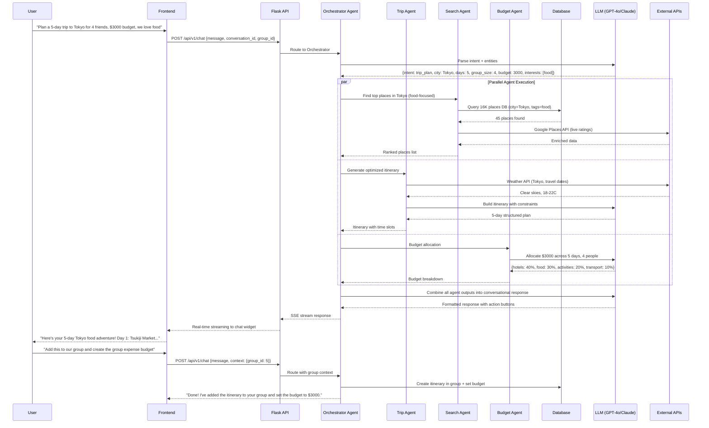

### Group Planner — Complete Feature Flow

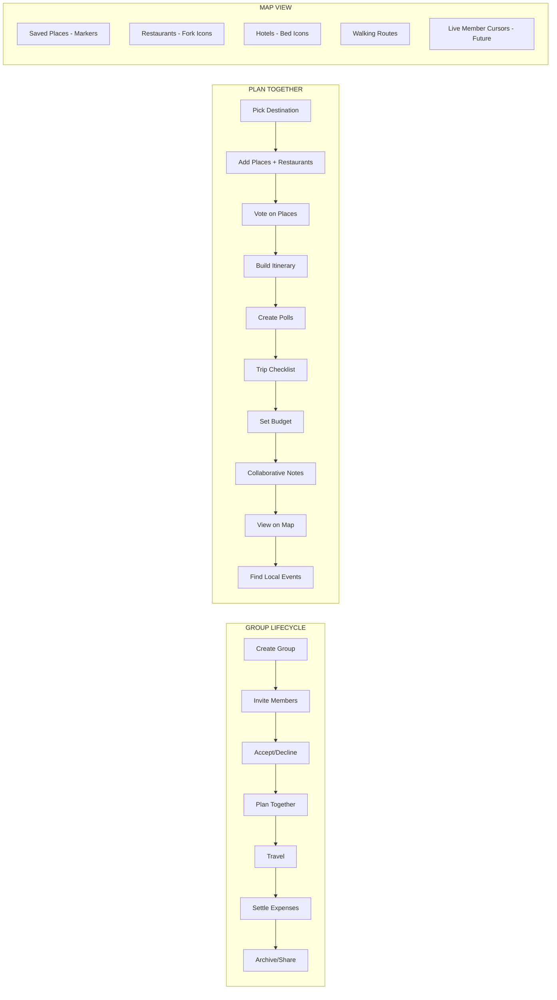

### Expense Engine — Complete Flow

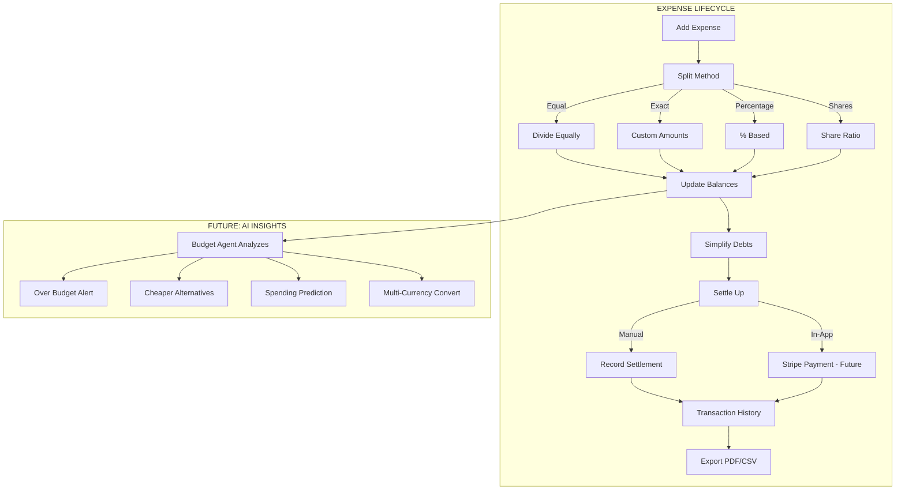

---

## 5. Phase 0: Critical Fixes (Week 1-2)

**Goal: Fix what's broken before building anything new.**

### 5.1 Backend Fixes

| # | Task | File | Effort |
|---|------|------|--------|
| 0.1 | Fix syntax concatenation bug (decorator on same line as return) | `expenses_sql_routes.py:268` | 30min |
| 0.2 | Fix `SQLPlacesService` import — change to `PlacesService` from `places_service` | `optimized_routes.py:280` | 30min |
| 0.3 | Add "leave group" endpoint to Group Planner | `groups_routes.py`, `group_service.py` | 4h |
| 0.4 | Remove debug endpoint | `invitations_sql_routes.py:69` | 15min |
| 0.5 | Remove hardcoded `pateldeep.db` references | `optimized_routes.py:82,402` | 15min |
| 0.6 | Move Ticketmaster API key to env var | `events_service.py:17` | 30min |
| 0.7 | Remove hardcoded fake restaurant data | `places_service.py:222` | 30min |
| 0.8 | Remove DEV_MODE auth bypass | `decorators.py` | 1h |
| 0.9 | Restrict CORS to actual domains | `app.py` | 30min |
| 0.10 | Require SECRET_KEY env var in production | `settings.py`, `Group_planner/app.py` | 1h |
| 0.11 | Initialize Redis in app.py | `app.py`, `redis_client.py` | 2h |
| 0.12 | Attach rate limiter to app with Redis storage | `rate_limiter.py`, `app.py` | 2h |

### 5.2 Frontend Fixes

| # | Task | File | Effort |
|---|------|------|--------|
| 0.13 | Apply `ProtectedRoute` to auth-required routes | `App.jsx` | 2h |
| 0.14 | Fix hardcoded `localhost:5000` in Analytics | `Analytics.jsx:31` | 15min |
| 0.15 | Build budget edit modal/form | `RightSidebar.jsx`, new `EditBudgetModal.jsx` | 4h |
| 0.16 | Add "Leave Group" button for non-owner members | `MembersPanel.jsx` | 3h |
| 0.17 | Fix `placeSearchService.js` env var to match rest of app | `placeSearchService.js` | 15min |
| 0.18 | Remove duplicate routes (`/group-trip`, `/trip-command`) | `App.jsx` | 30min |
| 0.19 | Clean up unused `GroupPlannerContext` or wire it properly | `GroupPlannerContext.jsx` | 2h |
| 0.20 | Move `placeSearchService.js` to `src/services/` | File move | 1h |

**Phase 0 Total: ~26 hours (2 weeks)**

---

## 6. Phase 1: Foundation Cleanup and Infrastructure (Week 3-6)

### 6.1 Consolidate Duplicate Code

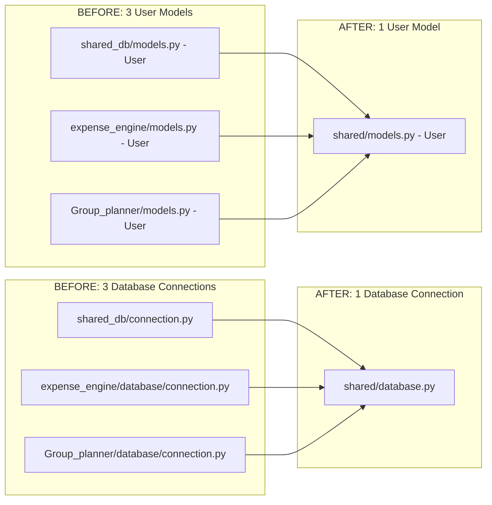

| # | Task | Effort |
|---|------|--------|
| 1.1 | Consolidate 3 DB connections into `shared/database.py` | 8h |
| 1.2 | Single User + UserSession model in `shared/models.py` | 4h |
| 1.3 | Single `@require_auth` decorator in `shared/auth.py` | 4h |
| 1.4 | Merge `useExpenseData.js` into `useExpenseQuery.js` (React Query only) | 8h |
| 1.5 | Merge `groupPlannerService.js` + `groupPlannerApi.js` into one | 4h |
| 1.6 | Delete unused root `config.py` | 15min |
| 1.7 | Rename `PlacesService` → `DestinationService` to avoid confusion with `PlaceService` | 2h |

### 6.2 Database Migration: SQLite → PostgreSQL

| # | Task | Effort |
|---|------|--------|
| 1.8 | Set up PostgreSQL (Neon/Supabase free tier) | 2h |
| 1.9 | Add Alembic migration management | 4h |
| 1.10 | Create initial migration from existing models | 4h |
| 1.11 | Migrate existing data (users, groups, expenses) | 8h |
| 1.12 | Keep `travel_data_complete.db` as read-only SQLite | 0h (no change) |

### 6.3 Activate Caching

| # | Task | Effort |
|---|------|--------|
| 1.13 | Cache location autocomplete (TTL: 5min) | 2h |
| 1.14 | Cache place search results (TTL: 5min) | 2h |
| 1.15 | Cache group data (TTL: 30s, bust on write) | 4h |
| 1.16 | Add cache headers for static travel data | 1h |

### 6.4 Security Hardening

| # | Task | Effort |
|---|------|--------|
| 1.17 | Move JWT tokens from localStorage to httpOnly cookies | 8h |
| 1.18 | Add security headers (CSP, HSTS, X-Frame-Options) via Flask-Talisman | 2h |
| 1.19 | Add input validation (marshmallow schemas) | 8h |
| 1.20 | Add role-based auth on group updates (owner vs member) | 4h |
| 1.21 | Fix email enumeration (same response for registered/unregistered) | 1h |

### 6.5 Deployment

| # | Task | Effort |
|---|------|--------|
| 1.22 | Dockerize backend + frontend | 8h |
| 1.23 | Set up CI/CD with GitHub Actions | 4h |
| 1.24 | Deploy: Vercel (frontend) + Railway (backend + PG + Redis) | 8h |
| 1.25 | Add Sentry error tracking | 4h |
| 1.26 | Replace `print()` with `structlog` | 4h |

**Phase 1 Total: ~102 hours (4 weeks)**

---

## 7. Phase 2: Agentic AI — The Intelligence Layer (Week 7-14)

### 7.1 AI Foundation

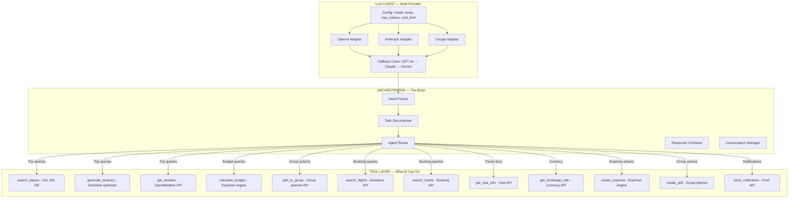

| # | Task | Effort |
|---|------|--------|
| 2.1 | Build multi-provider LLM client (`ai/llm_client.py`) | 16h |
| 2.2 | Define tool schemas for all existing APIs (`ai/tools.py`) | 8h |
| 2.3 | Build Orchestrator Agent with function calling | 16h |
| 2.4 | Create conversation memory store (Redis) | 8h |
| 2.5 | Build `POST /api/v1/chat` with SSE streaming | 8h |
| 2.6 | Token usage tracking + per-user cost limits | 4h |

### 7.2 Specialist Agents

| # | Task | Effort |
|---|------|--------|
| 2.7 | **Trip Planning Agent** — AI itinerary with weather, routing, clustering | 16h |
| 2.8 | **Search Agent** — Smart place discovery with personalization | 8h |
| 2.9 | **Budget Agent** — Expense analysis, predictions, alternatives | 12h |
| 2.10 | **Group Decision Agent** — Poll suggestions, conflict resolution | 8h |
| 2.11 | **Local Expert Agent** — Visa, customs, tips, phrasebook | 8h |

### 7.3 Frontend AI Integration

| # | Task | Effort |
|---|------|--------|
| 2.12 | Build floating chat widget (`AiChat.jsx`) | 16h |
| 2.13 | Streaming response rendering (markdown + action buttons) | 8h |
| 2.14 | Smart suggestions in Place Search page | 4h |
| 2.15 | Smart suggestions in Group Planner | 4h |
| 2.16 | Smart suggestions in Expense Manager | 4h |
| 2.17 | Voice input via Web Speech API | 4h |

### 7.4 AI-Powered Trip Planner Upgrade

| # | Task | Effort |
|---|------|--------|
| 2.18 | Replace rule-based generator with AI agent | 8h |
| 2.19 | Add interest tags to trip form (food, adventure, culture, etc.) | 4h |
| 2.20 | Add budget input to trip form | 2h |
| 2.21 | Route optimization (minimize travel between stops) | 8h |
| 2.22 | Restaurant recommendations between activities | 4h |
| 2.23 | Weather-adaptive planning (indoor on rainy days) | 4h |

**Phase 2 Total: ~176 hours (8 weeks)**

### What the AI Can Do After Phase 2

```
SOLO TRAVELER:
  "Plan a 5-day trip to Barcelona, I love architecture and seafood, $2000 budget"
  → AI generates optimized itinerary with Gaudi sites, seafood restaurants,
    beach time, budget breakdown, weather check, visa info, and packing tips.

GROUP TRAVEL:
  "Plan our group trip to Thailand, 6 people, 10 days, mix of beaches and temples"
  → AI creates itinerary, adds places to group, creates budget poll,
    suggests splitting into sub-groups for different activities, monitors 
    group voting and adjusts plan based on what gets voted up.

ONGOING ASSISTANCE:
  "We're spending too much on food, what should we do?"
  → Budget Agent analyzes group expenses, finds cheaper restaurants near
    tomorrow's planned attractions, adjusts remaining budget projections.

  "What do I need to know about visiting temples?"
  → Local Expert provides dress code, etiquette, best times, entry fees,
    and adds items to the group checklist automatically.
```

---

## 8. Phase 3: Advanced Features — Worldwide Platform (Week 15-22)

### 8.1 Real-Time Collaboration

| # | Task | Effort |
|---|------|--------|
| 3.1 | Flask-SocketIO server setup | 8h |
| 3.2 | Frontend WebSocket client (`realtimeService.js`) | 8h |
| 3.3 | Room management (group rooms, user rooms) | 4h |
| 3.4 | Broadcast: expense events, poll votes, place additions | 8h |
| 3.5 | Live presence indicators ("Rahul is viewing") | 4h |
| 3.6 | Typing indicators in notes section | 2h |
| 3.7 | React Query cache updates from WebSocket events | 8h |

### 8.2 Multi-Currency Support

| # | Task | Effort |
|---|------|--------|
| 3.8 | Store expenses in original currency + converted amount | 8h |
| 3.9 | Live exchange rate API integration | 4h |
| 3.10 | Currency picker per expense and per display | 4h |
| 3.11 | Auto-detect currency from group destination | 2h |

### 8.3 Payment Integration

| # | Task | Effort |
|---|------|--------|
| 3.12 | Stripe Checkout for subscriptions (billing module) | 16h |
| 3.13 | Webhook handler for payment events | 8h |
| 3.14 | Usage tracking + plan limit enforcement | 8h |
| 3.15 | Stripe Connect for in-app expense settlements | 16h |
| 3.16 | Frontend subscription management UI | 8h |

### 8.4 Push Notifications

| # | Task | Effort |
|---|------|--------|
| 3.17 | Web Push API + service worker registration | 8h |
| 3.18 | Notification triggers: expenses, polls, invitations, trip updates | 4h |
| 3.19 | Notification preferences UI | 4h |

### 8.5 Offline Mode (PWA)

| # | Task | Effort |
|---|------|--------|
| 3.20 | PWA manifest + service worker | 4h |
| 3.21 | IndexedDB offline data storage | 8h |
| 3.22 | Background sync on reconnect | 4h |

### 8.6 Receipt Scanning (OCR)

| # | Task | Effort |
|---|------|--------|
| 3.23 | Camera/upload UI for receipt photos | 4h |
| 3.24 | OCR integration (Google Vision API) | 8h |
| 3.25 | Auto-fill expense from scanned receipt | 4h |

### 8.7 Booking Agent (Flights + Hotels)

| # | Task | Effort |
|---|------|--------|
| 3.26 | Amadeus API integration (flight search) | 16h |
| 3.27 | Hotel search API integration | 12h |
| 3.28 | Price comparison display in group planner | 8h |
| 3.29 | Affiliate link tracking for revenue | 4h |

### 8.8 Map Enhancements

| # | Task | Effort |
|---|------|--------|
| 3.30 | Show ALL group places on map (places + restaurants + hotels) | 4h |
| 3.31 | Walking/driving routes between itinerary stops | 4h |
| 3.32 | Category filters on map (toggle places/restaurants/hotels) | 4h |
| 3.33 | Cluster markers when zoomed out | 2h |

**Phase 3 Total: ~224 hours (8 weeks)**

---

## 9. Phase 4: Growth, Monetization, and Scale (Week 23-30)

### 9.1 SEO Infrastructure

| # | Task | Effort |
|---|------|--------|
| 4.1 | SSR/SSG for place pages (Next.js migration or prerender) | 16h |
| 4.2 | Generate 889 city landing pages + 82 country pages | 8h |
| 4.3 | Structured data (JSON-LD) for all place pages | 4h |
| 4.4 | Sitemap generation (16,830+ URLs) | 2h |

### 9.2 Viral Features

| # | Task | Effort |
|---|------|--------|
| 4.5 | Public shareable itinerary URLs | 8h |
| 4.6 | Trip report generator (shareable post-trip summary) | 8h |
| 4.7 | Calendar export (.ICS) | 4h |
| 4.8 | CSV export for expenses | 4h |

### 9.3 User Engagement

| # | Task | Effort |
|---|------|--------|
| 4.9 | User reviews and ratings for places | 16h |
| 4.10 | Post-trip analytics (spending summary, places visited) | 8h |
| 4.11 | User preference learning (vector embeddings) | 16h |
| 4.12 | Proactive AI notifications (price drops, weather alerts) | 8h |

### 9.4 Travel Document Assistant

| # | Task | Effort |
|---|------|--------|
| 4.13 | Visa requirements API integration | 8h |
| 4.14 | Travel advisory data | 4h |
| 4.15 | Auto-generated document checklist per destination | 4h |
| 4.16 | Passport nationality → visa requirements | 4h |

### 9.5 Password Reset + Email Verification

| # | Task | Effort |
|---|------|--------|
| 4.17 | Forgot password flow (email link) | 8h |
| 4.18 | Email verification on signup | 4h |

### 9.6 Mobile App

| # | Task | Effort |
|---|------|--------|
| 4.19 | React Native shell with shared business logic | 40h |
| 4.20 | Camera integration for receipts | 8h |
| 4.21 | GPS-triggered suggestions ("You're near X") | 8h |

**Phase 4 Total: ~188 hours (8 weeks)**

---

## 10. Tech Stack — Complete Reference

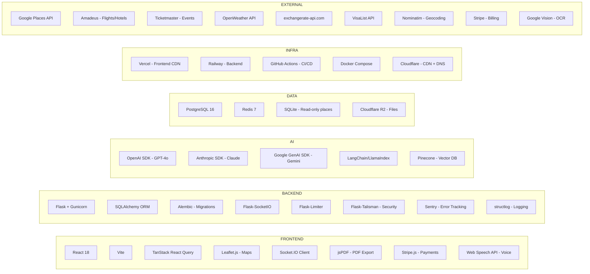

### Cost Per User Per Month

| Component | Cost |
|-----------|------|
| LLM API calls (~37 calls/user) | $0.61 |
| Hosting (amortized at 250 users) | $0.04 |
| Redis (amortized) | $0.04 |
| PostgreSQL (amortized) | $0.08 |
| Total per active user | **~$0.77** |
| Revenue (Plus tier) | **$4.99** |
| **Margin** | **84%** |

---

## 11. Worldwide Support Strategy

TripRaft must work for ANY traveler, ANY destination, worldwide. Not just India or the US.

### 11.1 Data Coverage

| Dimension | Current | Target |
|-----------|---------|--------|
| Places in database | 16,830 | 16,830 + live Google Places API |
| Countries covered | 82 | 195 (all countries via API) |
| Cities covered | 889 | 889 + any city via Google Places |
| Languages | English only | English + auto-translate (10 languages) |
| Currencies | Single per group | 180+ via exchange rate API |
| Visa data | None | All passport + destination combos |

### 11.2 How We Go Worldwide

```
OFFLINE DATABASE (16,830 places):
  → Pre-curated, high-quality, ranked
  → Used as first results (fast, free)
  
LIVE API ENRICHMENT (Google Places):
  → Fills gaps for cities/places not in DB
  → Real-time ratings, hours, photos
  → Auto-enriches our DB over time

VISA + TRAVEL ADVISORY:
  → User sets passport nationality in profile  
  → AI automatically checks visa requirements for any destination
  → Shows travel advisories and safety info

MULTI-LANGUAGE:
  → UI: React i18n for 10 languages initially
  → Content: AI translates tips, reviews, descriptions
  → OCR: Reads menus/signs in any language

MULTI-CURRENCY:
  → Every expense stores original currency + converted amount
  → Live exchange rates refreshed daily
  → Display in user's preferred currency

TIME ZONES:
  → Itinerary times shown in destination timezone
  → Reminders adjusted for traveler's current timezone

LOCAL CUSTOMS:
  → Local Expert agent knows etiquette for every country
  → Auto-adds relevant checklist items (adapter type, tipping culture, dress code)
```

### 11.3 Worldwide Map Support

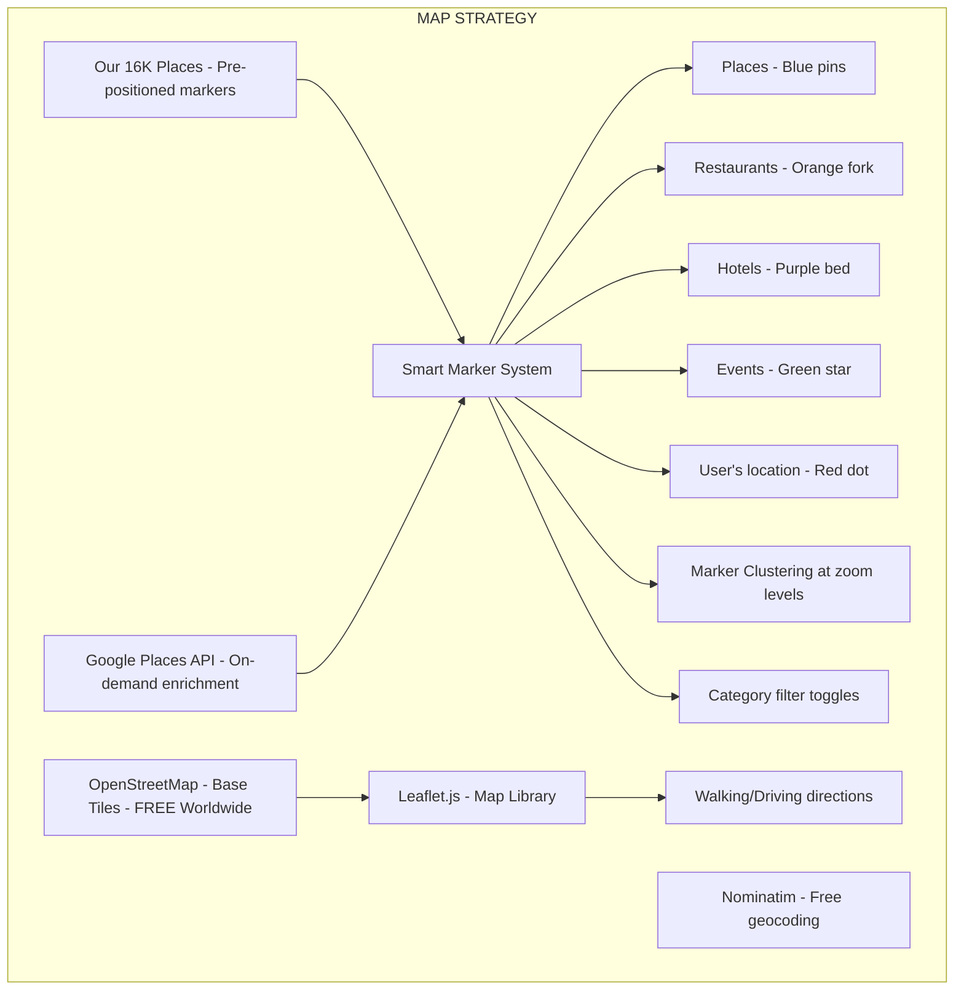

---

## 12. Monetization Blueprint

### 12.1 Tier Structure

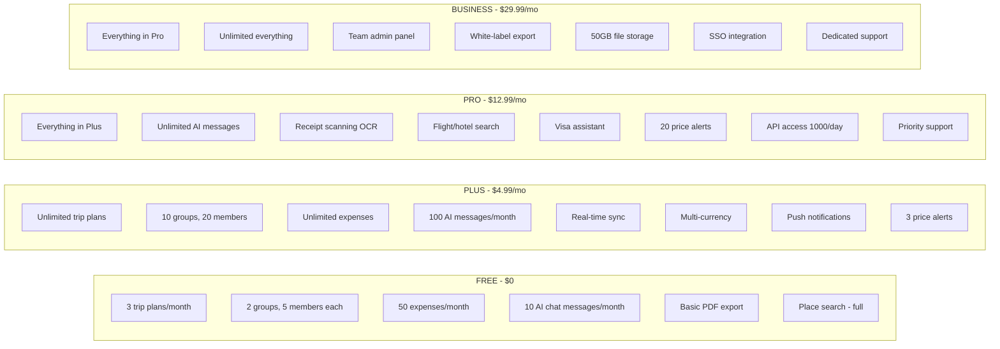

### 12.2 Revenue Streams

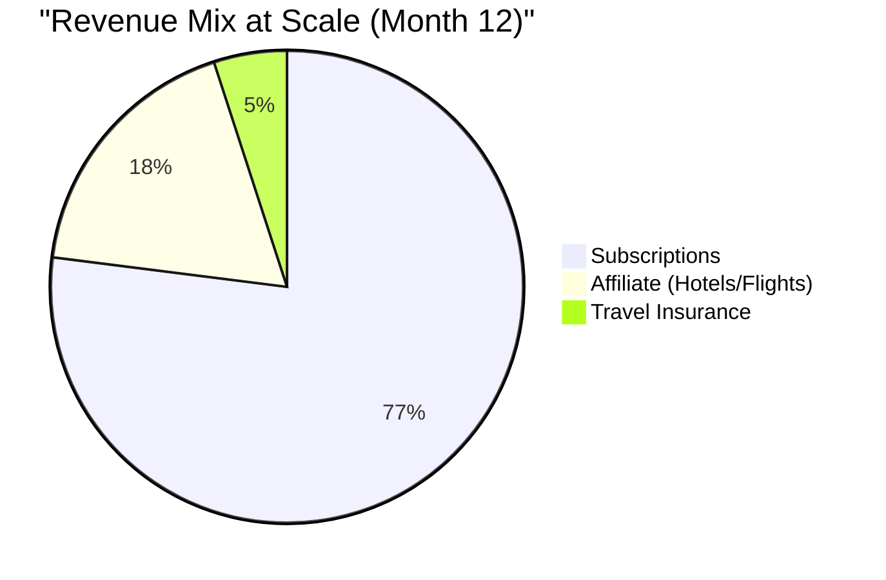

| Stream | How | Projected Month 12 |
|--------|-----|-------------------|
| Subscriptions | Stripe recurring billing | $10,000/mo |
| Affiliate | Booking.com, Hotels.com, GetYourGuide links | $3,000/mo |
| Travel Insurance | SafetyWing/World Nomads partnership | $500/mo |
| **Total MRR** | | **$13,500** |

### 12.3 Revenue Projections

| Metric | Month 3 | Month 6 | Month 12 | Month 24 |
|--------|---------|---------|----------|----------|
| Total users | 500 | 5,000 | 25,000 | 100,000 |
| Paid users (5%) | 25 | 250 | 1,250 | 5,000 |
| Avg revenue/paid | $5.50 | $6.50 | $8.00 | $10.00 |
| MRR | $137 | $1,625 | $10,000 | $50,000 |
| Costs | $55 | $275 | $1,365 | $5,000 |
| **Net Profit** | **$82** | **$1,350** | **$8,635** | **$45,000** |

---

## 13. Competitive Advantage

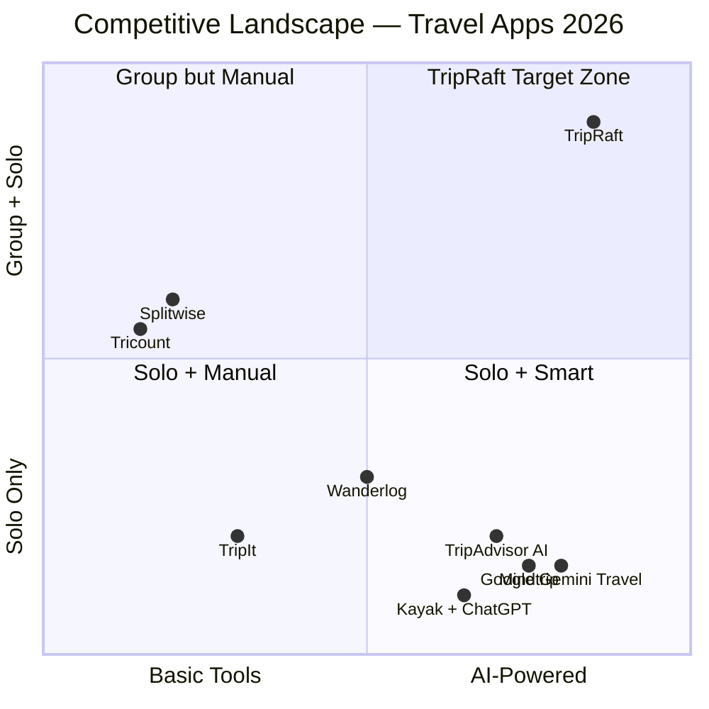

### Why TripRaft Wins

| Capability | Google/Gemini | Tripadvisor | Splitwise | Kayak | **TripRaft** |
|-----------|--------------|-------------|-----------|-------|-------------|
| AI trip planning | Yes | Yes | No | Yes | **Yes** |
| Group collaboration | No | No | Basic | No | **Full** |
| Real-time sync | No | No | Basic | No | **Yes** |
| Expense splitting | No | No | Yes | No | **Yes** |
| Voting/polls | No | No | No | No | **Yes** |
| Budget-aware AI | No | No | No | Price only | **Yes** |
| Flight + hotel search | No | Yes | No | Yes | **Yes** |
| Learns preferences | Limited | Limited | No | No | **Yes** |
| Map view | Maps | Static | No | No | **Interactive** |
| Post-trip insights | No | No | Basic | No | **AI-powered** |

**The edge: TripRaft is the ONLY platform where AI plans the trip, the group votes on it, expenses are split automatically, and the AI adapts based on actual spending. All in one place.**

---

## 14. Complete Feature Matrix — Current vs Future

### Phase 0 → Phase 4 Feature Evolution

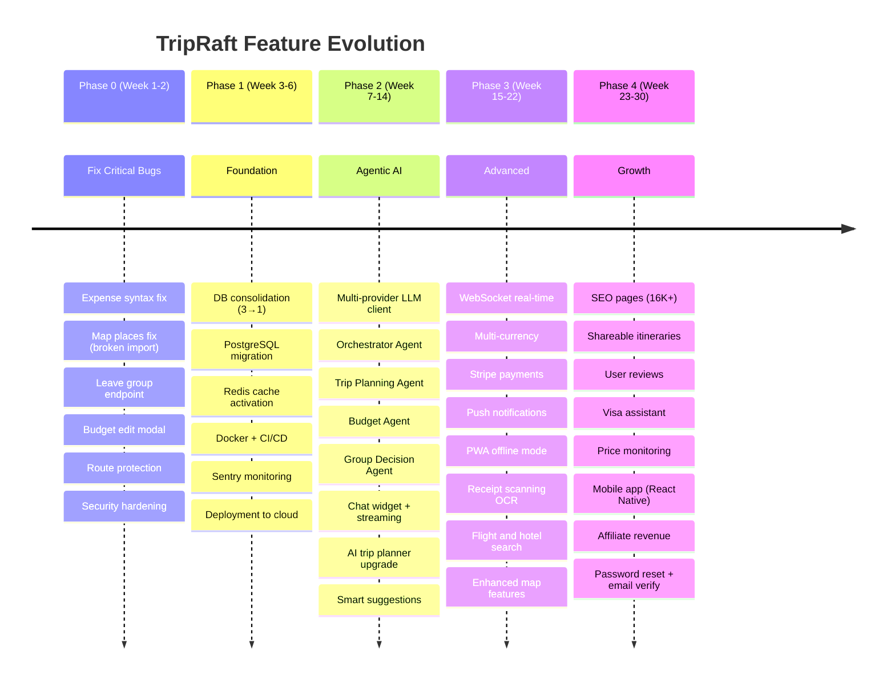

### Detailed Feature Matrix

```
CATEGORY              FEATURE                     NOW    P0    P1    P2    P3    P4
──────────────────────────────────────────────────────────────────────────────────

PLACES
                      Search 16K+ places           Y      Y     Y     Y     Y     Y
                      Autocomplete                 Y      Y     Y     Y     Y     Y
                      Place detail modal            Y      Y     Y     Y     Y     Y
                      Place photos                  Y      Y     Y     Y     Y     Y
                      AI place recommendations      -      -     -     Y     Y     Y
                      User reviews + ratings        -      -     -     -     -     Y
                      Live Google Places data        -      -     -     -     Y     Y

TRIP PLANNER
                      Rule-based itinerary          Y      Y     Y     -     -     -
                      AI-powered itinerary          -      -     -     Y     Y     Y
                      Natural language input         -      -     -     Y     Y     Y
                      Weather-aware planning         -      -     -     Y     Y     Y
                      Route optimization            -      -     -     Y     Y     Y
                      Restaurant suggestions         -      -     -     Y     Y     Y
                      Budget-aware planning          -      -     -     Y     Y     Y
                      Shareable itinerary           -      -     -     -     -     Y
                      Calendar export (.ICS)         -      -     -     -     -     Y

EXPENSES
                      Create/edit/delete             Y*     Y     Y     Y     Y     Y
                      Equal/exact/% split           Y      Y     Y     Y     Y     Y
                      Debt simplification           Y      Y     Y     Y     Y     Y
                      Settlements                   Y      Y     Y     Y     Y     Y
                      PDF export                    Y      Y     Y     Y     Y     Y
                      CSV export                    -      -     -     -     -     Y
                      Multi-currency                -      -     -     -     Y     Y
                      Receipt scanning (OCR)         -      -     -     -     Y     Y
                      AI spending insights          -      -     -     Y     Y     Y
                      In-app payment (Stripe)        -      -     -     -     Y     Y
                      Analytics/charts              Y      Y     Y     Y     Y     Y

GROUP PLANNER
                      Create/manage groups          Y      Y     Y     Y     Y     Y
                      Invite members                Y      Y     Y     Y     Y     Y
                      Leave group                   -      Y     Y     Y     Y     Y
                      Remove members                Y*     Y     Y     Y     Y     Y
                      Add/vote places               Y      Y     Y     Y     Y     Y
                      Map with saved places          Y      Y     Y     Y     Y     Y
                      Map destination places         -*     Y     Y     Y     Y     Y
                      Map restaurants                -*     Y     Y     Y     Y     Y
                      Polls                         Y      Y     Y     Y     Y     Y
                      Checklist                     Y      Y     Y     Y     Y     Y
                      Notes auto-save               Y      Y     Y     Y     Y     Y
                      Budget display                Y      Y     Y     Y     Y     Y
                      Budget edit                   -*     Y     Y     Y     Y     Y
                      Ticketmaster events           Y      Y     Y     Y     Y     Y
                      AI group decisions            -      -     -     Y     Y     Y
                      AI conflict resolution         -      -     -     Y     Y     Y

AI FEATURES
                      Chat interface                -      -     -     Y     Y     Y
                      Streaming responses           -      -     -     Y     Y     Y
                      Voice input                   -      -     -     Y     Y     Y
                      Smart suggestions             -      -     -     Y     Y     Y
                      Learning preferences          -      -     -     -     -     Y
                      Proactive notifications       -      -     -     -     -     Y
                      Post-trip insights            -      -     -     -     -     Y
                      Visa/document assistant        -      -     -     -     -     Y
                      Price monitoring              -      -     -     -     -     Y

REAL-TIME
                      60s polling                   Y      Y     Y     Y     -     -
                      WebSocket real-time           -      -     -     -     Y     Y
                      Live presence indicators       -      -     -     -     Y     Y
                      Typing indicators             -      -     -     -     Y     Y

INFRASTRUCTURE
                      SQLite database               Y      Y     -     -     -     -
                      PostgreSQL database           -      -     Y     Y     Y     Y
                      Redis cache (active)          -      -     Y     Y     Y     Y
                      Rate limiting (active)         -      Y     Y     Y     Y     Y
                      Docker deployment             -      -     Y     Y     Y     Y
                      CI/CD pipeline                -      -     Y     Y     Y     Y
                      Error tracking (Sentry)       -      -     Y     Y     Y     Y
                      Structured logging            -      -     Y     Y     Y     Y

SECURITY
                      JWT auth                      Y      Y     Y     Y     Y     Y
                      httpOnly cookies              -      -     Y     Y     Y     Y
                      CORS restricted               -      Y     Y     Y     Y     Y
                      Security headers              -      -     Y     Y     Y     Y
                      RBAC (owner/member)           -      Y     Y     Y     Y     Y
                      Input validation              -      -     Y     Y     Y     Y
                      Password reset                -      -     -     -     -     Y
                      Email verification            -      -     -     -     -     Y

PLATFORM
                      Responsive web                Y      Y     Y     Y     Y     Y
                      PWA (installable offline)      -      -     -     -     Y     Y
                      Push notifications            -      -     -     -     Y     Y
                      Mobile app                    -      -     -     -     -     Y

MONETIZATION
                      Pricing page (static)          Y      Y     Y     Y     Y     Y
                      Stripe subscriptions           -      -     -     -     Y     Y
                      Usage-based limits             -      -     -     -     Y     Y
                      Affiliate links               -      -     -     -     -     Y
                      Travel insurance               -      -     -     -     -     Y

Y = Working    Y* = Working with bugs    -* = Broken    - = Not built
```

---

## Complete Execution Timeline

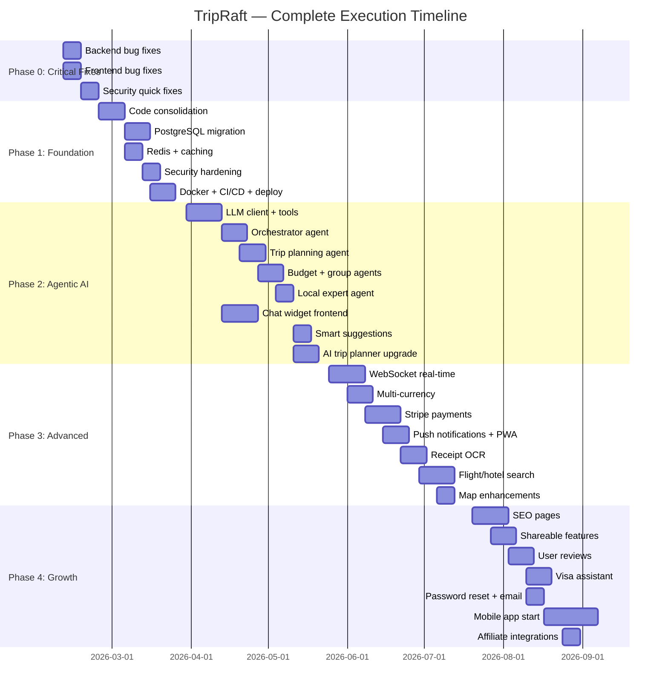

---

## Total Effort Summary

| Phase | Duration | Hours | Focus |
|-------|----------|-------|-------|
| Phase 0 | Week 1-2 | ~26h | Critical bug fixes |
| Phase 1 | Week 3-6 | ~102h | Foundation + infrastructure |
| Phase 2 | Week 7-14 | ~176h | Agentic AI |
| Phase 3 | Week 15-22 | ~224h | Advanced features |
| Phase 4 | Week 23-30 | ~188h | Growth + monetization |
| **TOTAL** | **30 weeks** | **~716h** | **Complete platform** |

---

## Where to Start Right Now

**If you have 1 week:** Phase 0 — fix the 12 critical bugs and broken features.

**If you have 1 month:** Phase 0 + Phase 1 — fix bugs, consolidate code, migrate to PostgreSQL, deploy.

**If you have 3 months:** Phase 0 + 1 + 2 — above + build the Agentic AI chat and smart trip planner.

**If you have 6 months:** All phases — you'll have the most advanced AI travel platform competing with Google Trips, Splitwise, and Wanderlog combined.

---

> **TripRaft's vision: One platform where AI plans your trip, your group votes on it, expenses split automatically, and the AI learns and adapts — for every traveler, every destination, worldwide.**
