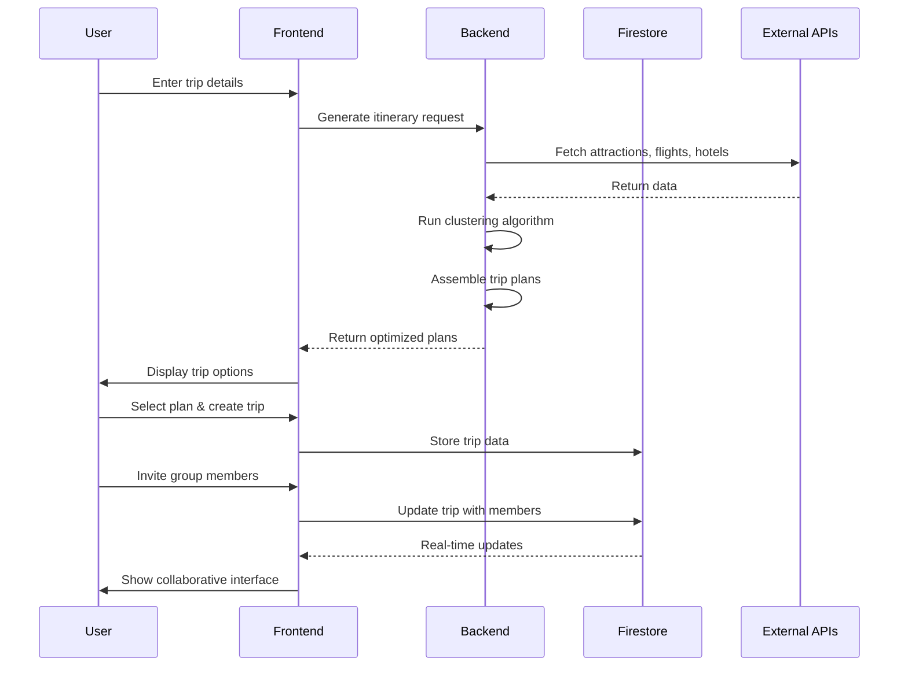
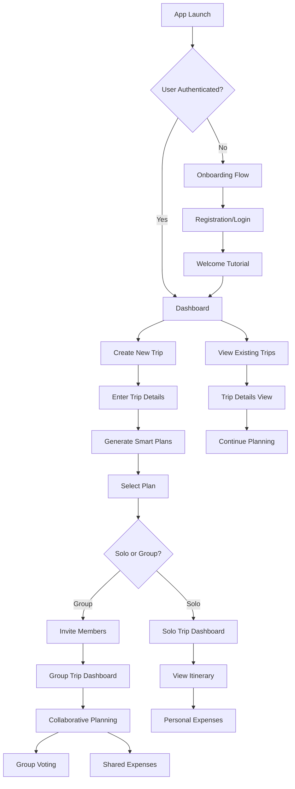
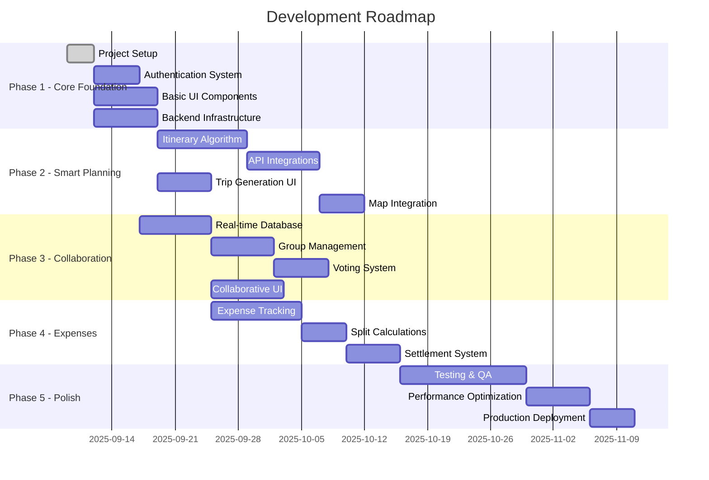
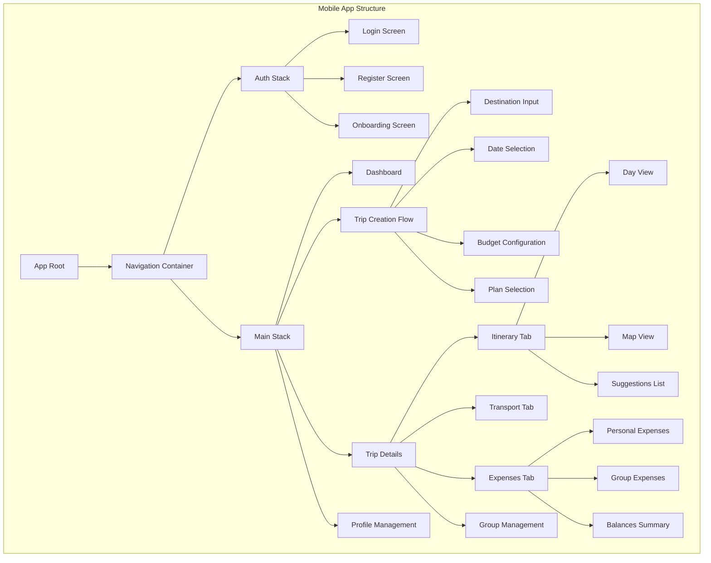
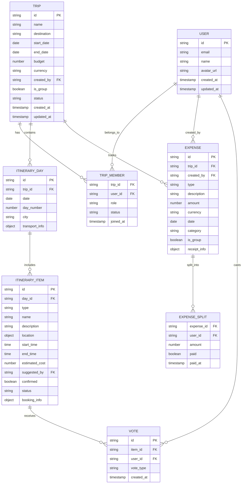
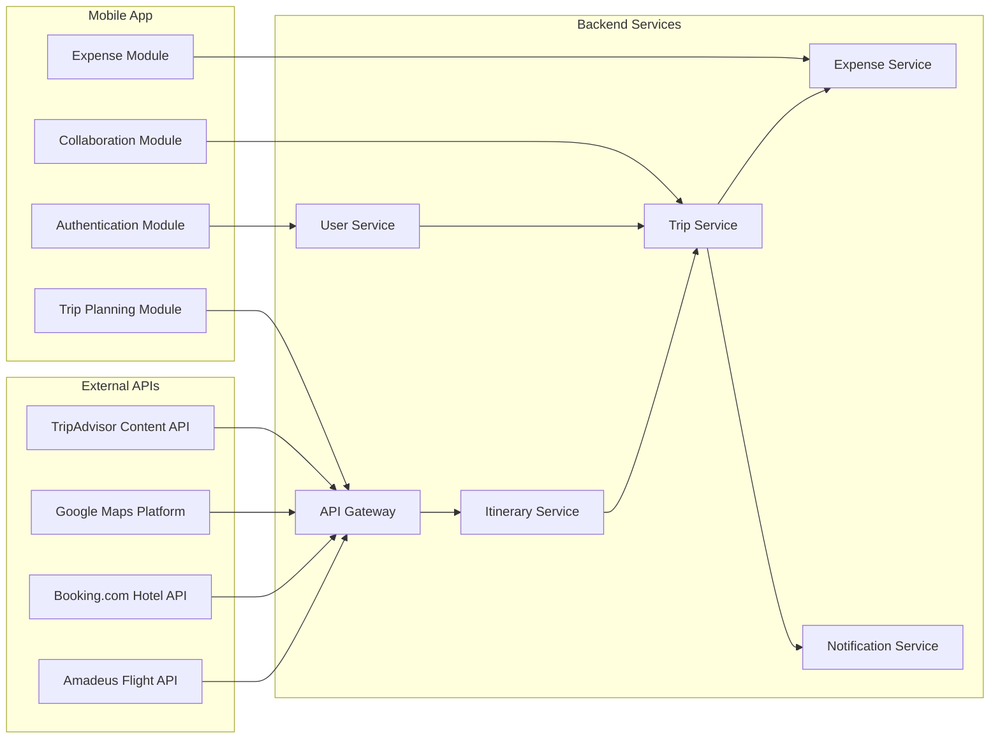
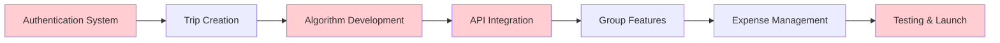

# Collaborative Trip Planner App - Project Architecture

## Complete Project Development Flowchart

```mermaid
flowchart TD
    START[Project Start - Sept 9, 2025] --> PHASE1[Phase 1: Foundation Setup]
    
    %% Phase 1 - Foundation (14 days)
    PHASE1 --> P1A[Day 1-3: Project Setup]
    P1A --> P1A1[Repository & Git Setup]
    P1A --> P1A2[React + Vite Web App]
    P1A --> P1A3[Node.js Backend Setup]
    P1A --> P1A4[Firebase Project Config]
    
    P1A --> P1B[Day 4-8: Authentication System]
    P1B --> P1B1[Firebase Auth Integration]
    P1B --> P1B2[Login/Register Pages]
    P1B --> P1B3[JWT Backend Auth]
    P1B --> P1B4[Auth Guards & Middleware]
    
    P1B --> P1C[Day 9-14: Core UI Components]
    P1C --> P1C1[Tailwind CSS Setup]
    P1C --> P1C2[Design System Components]
    P1C --> P1C3[Layout Components]
    P1C --> P1C4[Form Components]
    
    P1C --> PHASE2[Phase 2: Smart Trip Planning]
    
    %% Phase 2 - Smart Planning (21 days)
    PHASE2 --> P2A[Day 15-24: Algorithm Development]
    P2A --> P2A1[Clustering Algorithm Service]
    P2A --> P2A2[Plan Assembly Engine]
    P2A --> P2A3[Route Optimization Logic]
    P2A --> P2A4[Cost Calculation Engine]
    
    P2A --> P2B[Day 25-32: API Integrations]
    P2B --> P2B1[Amadeus Flight API]
    P2B --> P2B2[Booking.com Hotel API]
    P2B --> P2B3[Google Maps Places API]
    P2B --> P2B4[TripAdvisor Reviews API]
    
    P2B --> P2C[Day 33-38: Trip Creation UI]
    P2C --> P2C1[Destination Input Page]
    P2C --> P2C2[Date & Budget Selection]
    P2C --> P2C3[Plan Display Interface]
    P2C --> P2C4[Trip Selection & Creation]
    
    P2C --> P2D[Day 39-43: Map Integration]
    P2D --> P2D1[Leaflet.js Setup]
    P2D --> P2D2[Interactive Map Component]
    P2D --> P2D3[Route Visualization]
    P2D --> P2D4[Marker & Info Windows]
    
    P2D --> PHASE3[Phase 3: Real-time Collaboration]
    
    %% Phase 3 - Collaboration (21 days)
    PHASE3 --> P3A[Day 44-51: Group Management]
    P3A --> P3A1[Group Creation Logic]
    P3A --> P3A2[Email Invitation System]
    P3A --> P3A3[Member Management UI]
    P3A --> P3A4[Permission System]
    
    P3A --> P3B[Day 52-58: Voting System]
    P3B --> P3B1[Suggestion Creation]
    P3B --> P3B2[Real-time Voting Logic]
    P3B --> P3B3[Vote Count Updates]
    P3B --> P3B4[Decision Confirmation]
    
    P3B --> P3C[Day 59-64: Collaborative UI]
    P3C --> P3C1[Group Dashboard]
    P3C --> P3C2[Activity Feed]
    P3C --> P3C3[Real-time Updates UI]
    P3C --> P3C4[Notification System]
    
    P3C --> PHASE4[Phase 4: Expense Management]
    
    %% Phase 4 - Expenses (21 days)
    PHASE4 --> P4A[Day 65-74: Expense Tracking]
    P4A --> P4A1[Personal Expense System]
    P4A --> P4A2[Group Expense Logic]
    P4A --> P4A3[Receipt Upload Feature]
    P4A --> P4A4[Expense Categories]
    
    P4A --> P4B[Day 75-79: Split Calculations]
    P4B --> P4B1[Equal Split Algorithm]
    P4B --> P4B2[Custom Split Logic]
    P4B --> P4B3[Percentage Split System]
    P4B --> P4B4[Balance Calculations]
    
    P4B --> P4C[Day 80-85: Settlement System]
    P4C --> P4C1[Balance Summary UI]
    P4C --> P4C2[Settlement Suggestions]
    P4C --> P4C3[Payment Tracking]
    P4C --> P4C4[Export Functionality]
    
    P4C --> PHASE5[Phase 5: Testing & Launch]
    
    %% Phase 5 - Testing & Launch (22 days)
    PHASE5 --> P5A[Day 86-95: Comprehensive Testing]
    P5A --> P5A1[Unit Testing Suite]
    P5A --> P5A2[Integration Testing]
    P5A --> P5A3[E2E Testing - Cypress]
    P5A --> P5A4[Accessibility Testing]
    
    P5A --> P5B[Day 96-100: Performance & Security]
    P5B --> P5B1[Performance Optimization]
    P5B --> P5B2[Security Audit]
    P5B --> P5B3[Cross-browser Testing]
    P5B --> P5B4[Lighthouse Optimization]
    
    P5B --> P5C[Day 101-107: Production Deployment]
    P5C --> P5C1[Production Environment]
    P5C --> P5C2[CI/CD Pipeline]
    P5C --> P5C3[Monitoring Setup]
    P5C --> P5C4[Go-Live Preparation]
    
    P5C --> WEBLAUNCH[Web App Launch - Day 107]
    
    %% Future Mobile Phase
    WEBLAUNCH --> MOBILEPHASE[Future: Mobile Development]
    MOBILEPHASE --> M1[Mobile Planning & Architecture]
    MOBILEPHASE --> M2[React Native Implementation]
    MOBILEPHASE --> M3[Mobile-specific Features]
    MOBILEPHASE --> M4[App Store Deployment]
    
    %% Styling for phases
    classDef phase1 fill:#e1f5fe,stroke:#0277bd,stroke-width:2px
    classDef phase2 fill:#f3e5f5,stroke:#7b1fa2,stroke-width:2px
    classDef phase3 fill:#e8f5e8,stroke:#388e3c,stroke-width:2px
    classDef phase4 fill:#fff3e0,stroke:#f57c00,stroke-width:2px
    classDef phase5 fill:#fce4ec,stroke:#c2185b,stroke-width:2px
    classDef launch fill:#ffebee,stroke:#d32f2f,stroke-width:3px
    classDef future fill:#f5f5f5,stroke:#616161,stroke-width:2px
    
    class PHASE1,P1A,P1B,P1C,P1A1,P1A2,P1A3,P1A4,P1B1,P1B2,P1B3,P1B4,P1C1,P1C2,P1C3,P1C4 phase1
    class PHASE2,P2A,P2B,P2C,P2D,P2A1,P2A2,P2A3,P2A4,P2B1,P2B2,P2B3,P2B4,P2C1,P2C2,P2C3,P2C4,P2D1,P2D2,P2D3,P2D4 phase2
    class PHASE3,P3A,P3B,P3C,P3A1,P3A2,P3A3,P3A4,P3B1,P3B2,P3B3,P3B4,P3C1,P3C2,P3C3,P3C4 phase3
    class PHASE4,P4A,P4B,P4C,P4A1,P4A2,P4A3,P4A4,P4B1,P4B2,P4B3,P4B4,P4C1,P4C2,P4C3,P4C4 phase4
    class PHASE5,P5A,P5B,P5C,P5A1,P5A2,P5A3,P5A4,P5B1,P5B2,P5B3,P5B4,P5C1,P5C2,P5C3,P5C4 phase5
    class WEBLAUNCH launch
    class MOBILEPHASE,M1,M2,M3,M4 future
```

## Detailed Timeline & Resource Planning

### Phase 1: Foundation Setup (Days 1-14) - 2 Weeks
**Team Size**: 2-3 developers  
**Key Roles**: Full-stack developer, Frontend developer  

**Week 1 (Days 1-7)**:
- Days 1-3: Project scaffolding, repository setup, initial configurations
- Days 4-7: Firebase authentication, basic login/register functionality

**Week 2 (Days 8-14)**:
- Days 8-10: Backend authentication middleware, JWT implementation
- Days 11-14: Tailwind CSS setup, core UI components, design system

### Phase 2: Smart Trip Planning (Days 15-35) - 3 Weeks
**Team Size**: 3-4 developers  
**Key Roles**: Backend developer, Algorithm specialist, Frontend developer, API integration specialist  

**Week 3 (Days 15-21)**:
- Core itinerary generation algorithm development
- K-means clustering implementation for attractions

**Week 4 (Days 22-28)**:
- External API integrations (Amadeus, Booking.com, Google Maps)
- API rate limiting and caching implementation

**Week 5 (Days 29-35)**:
- Trip creation user interface
- Interactive map integration with Leaflet.js

### Phase 3: Real-time Collaboration (Days 36-56) - 3 Weeks
**Team Size**: 3-4 developers  
**Key Roles**: Real-time systems developer, Frontend developer, Backend developer  

**Week 6 (Days 36-42)**:
- Group management system
- Email invitation infrastructure

**Week 7 (Days 43-49)**:
- Real-time voting system with Firestore
- WebSocket integration for live updates

**Week 8 (Days 50-56)**:
- Collaborative UI components
- Push notification system

### Phase 4: Expense Management (Days 57-77) - 3 Weeks
**Team Size**: 2-3 developers  
**Key Roles**: Backend developer, Frontend developer, Financial logic specialist  

**Week 9 (Days 57-63)**:
- Personal and group expense tracking
- Receipt upload and processing

**Week 10 (Days 64-70)**:
- Expense splitting algorithms (equal, custom, percentage)
- Balance calculation engine

**Week 11 (Days 71-77)**:
- Settlement system and payment tracking
- Export functionality (PDF, CSV)

### Phase 5: Testing & Production Launch (Days 78-98) - 3 Weeks
**Team Size**: 4-5 people  
**Key Roles**: QA engineer, DevOps engineer, Security specialist, Performance engineer  

**Week 12 (Days 78-84)**:
- Comprehensive testing (unit, integration, E2E)
- Accessibility compliance (WCAG 2.1)

**Week 13 (Days 85-91)**:
- Performance optimization
- Security audit and penetration testing

**Week 14 (Days 92-98)**:
- Production deployment
- Monitoring and analytics setup
- Go-live preparation

## Resource Requirements by Phase

| Phase | Duration | Developers | Specialists | Key Technologies |
|-------|----------|------------|-------------|------------------|
| 1 | 14 days | 2-3 | - | React, Node.js, Firebase |
| 2 | 21 days | 3-4 | Algorithm Dev | External APIs, Maps |
| 3 | 21 days | 3-4 | Real-time Dev | Firestore, WebSockets |
| 4 | 21 days | 2-3 | Financial Logic | Payment Systems |
| 5 | 21 days | 3-4 | QA, DevOps, Security | Testing, Deployment |

**Total Web Development**: 98 days (≈ 14 weeks)  
**Estimated Launch**: December 16, 2025

## Data Flow Architecture

## User Journey Flowchart

## Feature Implementation Roadmap

## Component Architecture

## Database Schema Design

## API Architecture

## Technology Stack

### Frontend (Mobile)
- **Framework**: React Native 0.72+
- **Navigation**: React Navigation v6
- **State Management**: Redux Toolkit + RTK Query
- **UI Components**: NativeBase / React Native Elements
- **Maps**: react-native-maps
- **Animations**: React Native Reanimated v3
- **Storage**: AsyncStorage / MMKV

### Backend
- **Runtime**: Node.js 18+
- **Framework**: Express.js
- **Database**: Firebase Firestore
- **Authentication**: Firebase Auth
- **Cloud Platform**: Google Cloud Platform
- **API Documentation**: Swagger/OpenAPI
- **Testing**: Jest + Supertest

### DevOps & Tools
- **Version Control**: Git
- **CI/CD**: GitHub Actions
- **Code Quality**: ESLint + Prettier
- **Bundle Analyzer**: Metro Bundle Analyzer
- **Error Tracking**: Sentry
- **Analytics**: Firebase Analytics

### External Services
- **Flights**: Amadeus Self-Service API
- **Hotels**: Booking.com Partner Hub API
- **Maps**: Google Maps Platform
- **Reviews**: TripAdvisor Content API
- **Push Notifications**: Firebase Cloud Messaging

## Risk Assessment & Mitigation Strategy

### High-Risk Areas & Mitigation Plans

#### 1. External API Dependencies (Days 22-35)
**Risk**: API rate limits, service downtime, integration complexity  
**Mitigation**: 
- Implement robust caching layer
- Create fallback mechanisms
- Add retry logic with exponential backoff
- Buffer time: +3 days

#### 2. Real-time Collaboration (Days 43-56)
**Risk**: Firestore scaling, real-time synchronization issues  
**Mitigation**:
- Thorough testing with multiple concurrent users
- Implement optimistic UI updates
- Add conflict resolution mechanisms
- Buffer time: +2 days

#### 3. Algorithm Performance (Days 15-28)
**Risk**: Clustering algorithm inefficiency, slow response times  
**Mitigation**:
- Performance benchmarking early
- Algorithm optimization iterations
- Caching of computed results
- Buffer time: +2 days

### Critical Path Dependencies

## Budget Estimation

### Development Costs (Approximate)

| Phase | Duration | Team Size | Cost Estimate* |
|-------|----------|-----------|----------------|
| Phase 1 | 14 days | 2.5 devs | $17,500 |
| Phase 2 | 21 days | 3.5 devs | $36,750 |
| Phase 3 | 21 days | 3.5 devs | $36,750 |
| Phase 4 | 21 days | 2.5 devs | $26,250 |
| Phase 5 | 21 days | 4 devs | $42,000 |
| **Total** | **98 days** | **Avg 3.2** | **$159,250** |

*Based on $125/day per developer average

### Infrastructure Costs (Monthly)

| Service | Cost/Month | Annual Cost |
|---------|------------|-------------|
| Firebase (Blaze Plan) | $50-200 | $600-2,400 |
| Google Cloud Platform | $100-300 | $1,200-3,600 |
| External APIs | $200-500 | $2,400-6,000 |
| Domain & SSL | $20 | $240 |
| Monitoring Tools | $50 | $600 |
| **Total Infrastructure** | **$420-1,070** | **$5,040-12,840** |

## Success Metrics & KPIs

### Development Metrics
- [ ] Code coverage > 80%
- [ ] Performance: Page load < 3 seconds
- [ ] Accessibility: WCAG 2.1 AA compliance
- [ ] SEO: Lighthouse score > 90
- [ ] Security: Zero critical vulnerabilities

### Business Metrics (Post-Launch)
- [ ] User registration rate
- [ ] Trip completion rate
- [ ] Group collaboration adoption
- [ ] Expense tracking usage
- [ ] API booking conversion rate

## Quick Reference Timeline

**🚀 Project Start**: September 9, 2025  
**📅 Phase 1 Complete**: September 23, 2025 (Authentication & UI)  
**📅 Phase 2 Complete**: October 14, 2025 (Smart Planning)  
**📅 Phase 3 Complete**: November 4, 2025 (Collaboration)  
**📅 Phase 4 Complete**: November 25, 2025 (Expense Management)  
**🎉 Web Launch**: December 16, 2025 (98 days total)  

This comprehensive flowchart and timeline provide a complete roadmap for the 98-day web development cycle, with clear milestones, resource requirements, risk mitigation strategies, and budget planning.
