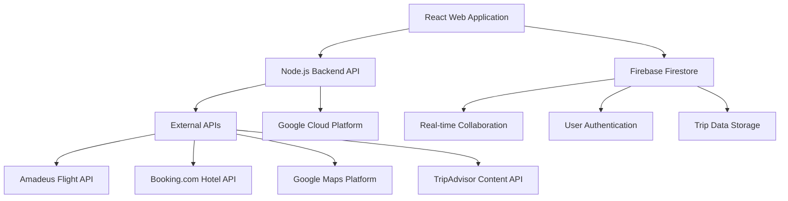

# Collaborative Trip Planner App

## Project Overview

A comprehensive mobile-first application that revolutionizes travel planning for both solo travelers and groups. The app combines intelligent itinerary generation with real-time collaborative features and integrated expense management.

### 🎯 Vision Statement
To become the indispensable tool for all independent travelers, transforming the planning process from a chore into a simple, enjoyable, and collaborative part of the travel experience itself.

### 🚀 Key Features
- **Smart Itinerary Generation**: AI-powered trip planning using clustering algorithms
- **Real-time Collaboration**: Group planning with voting and suggestion systems
- **Integrated Expense Tracking**: Splitwise-inspired expense management
- **Interactive Maps**: Route visualization and location optimization
- **Web-First Design**: Responsive web application with future mobile support

## 📋 Project Status

**Version**: 1.0  
**Status**: Planning Phase  
**Start Date**: September 9, 2025  
**Team**: Development Team  

## 📁 Documentation Structure

### Core Documentation
- [`PROJECT_ARCHITECTURE.md`](./PROJECT_ARCHITECTURE.md) - System architecture, technology stack, and component design
- [`PROJECT_STRUCTURE.md`](./PROJECT_STRUCTURE.md) - Complete project directory structure and naming conventions
- [`DEVELOPMENT_PHASES.md`](./DEVELOPMENT_PHASES.md) - 5-phase development roadmap with detailed timelines
- [`TECHNICAL_SPECIFICATIONS.md`](./TECHNICAL_SPECIFICATIONS.md) - Detailed technical requirements and API specifications
- [`USER_STORIES.md`](./USER_STORIES.md) - Complete user stories with acceptance criteria

### Quick Start Guides
- [`docs/DEVELOPMENT_SETUP.md`](./docs/DEVELOPMENT_SETUP.md) - Environment setup instructions
- [`docs/API_DOCUMENTATION.md`](./docs/API_DOCUMENTATION.md) - Backend API documentation
- [`docs/DEPLOYMENT_GUIDE.md`](./docs/DEPLOYMENT_GUIDE.md) - Production deployment instructions

## 🏗️ Architecture Overview



## 🛠️ Technology Stack

### Frontend (Web)
- **React 18+** - Modern React with hooks and concurrent features
- **Vite** - Fast build tool and development server
- **TypeScript** - Type safety and better development experience
- **Tailwind CSS** - Utility-first CSS framework
- **Redux Toolkit** - State management with RTK Query
- **React Router v6** - Client-side routing
- **Leaflet.js** - Interactive maps (or Google Maps)
- **Firebase SDK** - Real-time database and authentication

### Backend
- **Node.js 18+** - Server runtime
- **Express.js** - Web framework
- **Firebase Firestore** - NoSQL database
- **Google Cloud Platform** - Cloud infrastructure

### External Integrations
- **Amadeus Self-Service API** - Flight data
- **Booking.com Partner Hub** - Hotel bookings
- **Google Maps Platform** - Places and directions
- **TripAdvisor Content API** - Reviews and ratings

## 📊 Development Phases

### Phase 1: Foundation (Weeks 1-2)
- Project setup and configuration
- Authentication system
- Basic UI components with Tailwind CSS
- Backend API structure

### Phase 2: Smart Planning (Weeks 3-5)
- Itinerary generation algorithm
- External API integrations
- Trip creation flow
- Interactive web map visualization

### Phase 3: Collaboration (Weeks 6-8)
- Group trip functionality
- Real-time voting system
- Member management
- Web push notifications

### Phase 4: Expense Management (Weeks 9-11)
- Personal expense tracking
- Group expense splitting
- Balance calculations
- Settlement system

### Phase 5: Testing & Launch (Weeks 12-14)
- Comprehensive testing
- Performance optimization
- Security audit and accessibility
- Production deployment
- Mobile app planning

## 🎨 Key User Flows

### Solo Trip Planning
1. User inputs destination, dates, and budget
2. AI generates 2-3 optimized itinerary options
3. User selects preferred plan
4. Trip is created in solo mode
5. User can view itinerary, map, and track expenses

### Group Trip Collaboration
1. Trip organizer invites members via email
2. Members join and can suggest activities
3. Group votes on suggestions
4. Organizer confirms final itinerary
5. All members track shared expenses

### Expense Management
1. Add personal or group expenses
2. Split costs using various methods
3. Track who owes whom
4. Settle balances with payment tracking

## 🔧 Getting Started

### Prerequisites
- Node.js 18+ installed
- Web development environment
- Firebase project setup
- External API keys configured

### Development Setup
```bash
# Clone the repository
git clone https://github.com/your-org/travel-planner.git
cd travel-planner

# Install web app dependencies
cd web-app
npm install

# Install backend dependencies
cd ../backend
npm install

# Setup environment variables
cp .env.example .env
# Edit .env with your API keys and configuration

# Start development servers
npm run dev:backend
npm run dev:web
```

## 📈 Project Metrics & KPIs

### Technical Metrics
- App performance: < 3s launch time
- API response: < 2s for itinerary generation
- Real-time updates: < 1s propagation
- Test coverage: > 80%

### Business Metrics
- User engagement: Daily active users
- Trip completion rate: % of trips that get confirmed
- Collaboration effectiveness: Average group size and activity
- Revenue: Booking conversion rates

## 🤝 Contributing

### Development Workflow
1. Create feature branch from `develop`
2. Implement feature following technical specifications
3. Write tests and ensure coverage
4. Submit pull request for review
5. Merge after approval and testing

### Code Standards
- TypeScript for type safety
- ESLint + Prettier for code formatting
- Jest for testing
- Conventional commits for Git messages

## 📝 License

This project is licensed under the MIT License - see the [LICENSE](LICENSE) file for details.

## 🔗 Related Links

- [Project Architecture](./PROJECT_ARCHITECTURE.md)
- [Technical Specifications](./TECHNICAL_SPECIFICATIONS.md)
- [Development Phases](./DEVELOPMENT_PHASES.md)
- [User Stories](./USER_STORIES.md)

## 📞 Contact

For questions about this project, please contact the development team or create an issue in the repository.

---

**Note**: This is a comprehensive planning document for a large-scale travel planning application. The actual implementation should follow the phased approach outlined in the documentation with proper testing and quality assurance at each stage.
