# Development Phases & Implementation Strategy

## Phase 1: Foundation Setup (Weeks 1-2)

### Goals
- Establish development environment
- Set up core project structure
- Implement basic authentication
- Create foundational UI components

### Phase 1 Flowchart

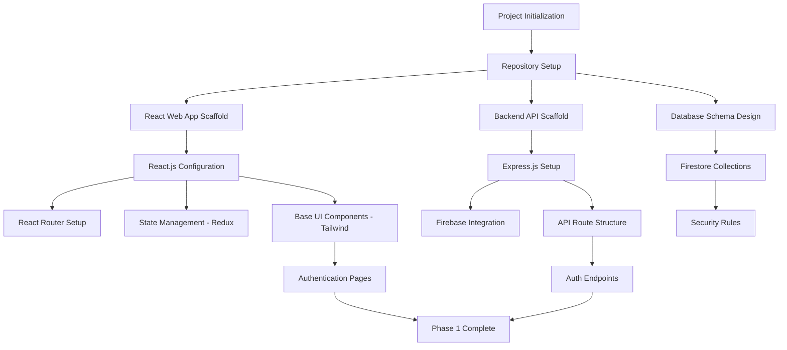

### Deliverables
- [ ] Project repository with proper structure
- [ ] React web application with routing
- [ ] Node.js backend with Express
- [ ] Firebase project configuration
- [ ] Basic authentication flow
- [ ] Core UI component library with Tailwind CSS
- [ ] Development environment documentation

## Phase 2: Smart Trip Planning (Weeks 3-5)

### Goals
- Implement itinerary generation algorithm
- Integrate external APIs
- Create trip creation user flow
- Build interactive web map visualization

### Phase 2 Flowchart

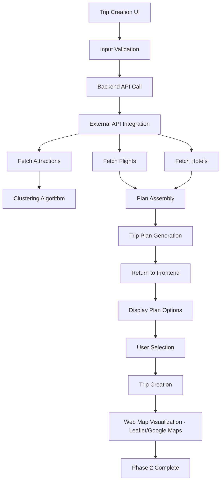

### Technical Implementation

#### Itinerary Generation Service

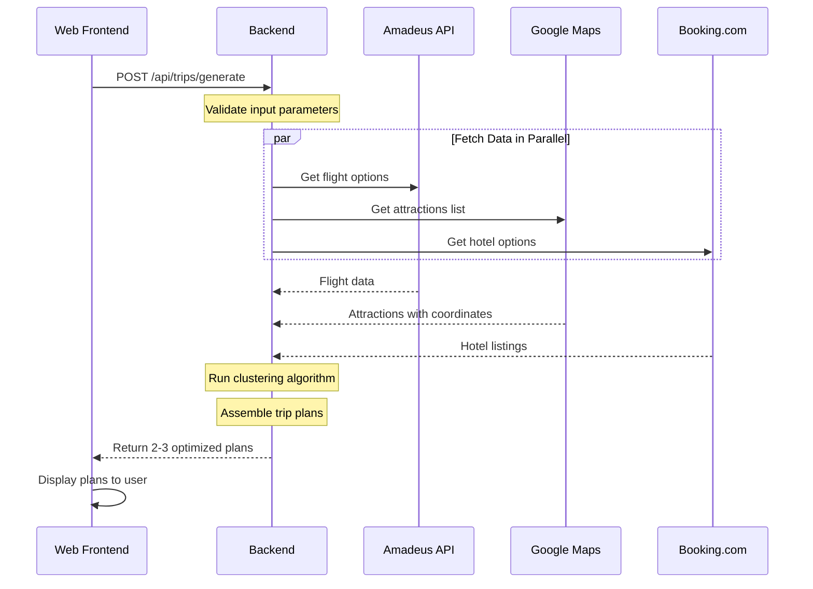

### Deliverables
- [ ] Trip creation flow (destination, dates, budget)
- [ ] Itinerary generation algorithm
- [ ] External API integrations (Amadeus, Google Maps, Booking.com)
- [ ] Clustering algorithm for attractions
- [ ] Plan selection interface
- [ ] Interactive web map with route display (Leaflet.js or Google Maps)
- [ ] Responsive web design for desktop and tablet
- [ ] Trip data model and storage

## Phase 3: Real-time Collaboration (Weeks 6-8)

### Goals
- Implement group trip functionality
- Build real-time voting system
- Create collaborative interfaces
- Add group management features

### Phase 3 Flowchart

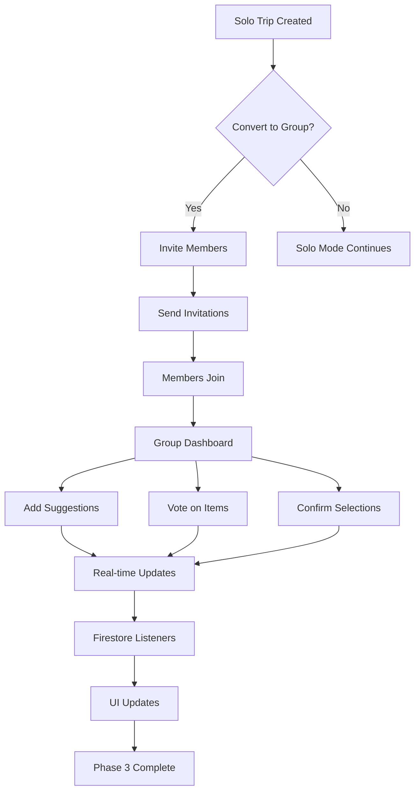

### Real-time Data Flow

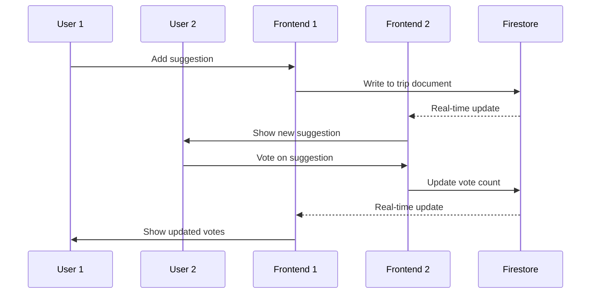

### Deliverables
- [ ] Group invitation system via email
- [ ] Real-time collaboration interface
- [ ] Voting mechanism for suggestions
- [ ] Group member management
- [ ] Conflict resolution for decisions
- [ ] Activity feed for group actions
- [ ] Web push notifications for group updates
- [ ] Responsive design for collaborative features

## Phase 4: Expense Management (Weeks 9-11)

### Goals
- Build expense tracking system
- Implement expense splitting logic
- Create settlement functionality
- Add receipt management

### Phase 4 Flowchart

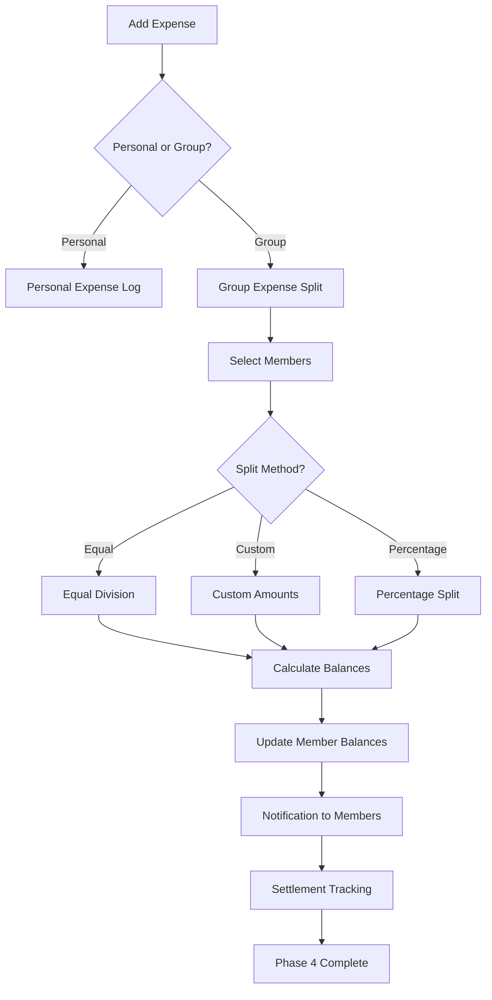

### Expense Calculation Logic

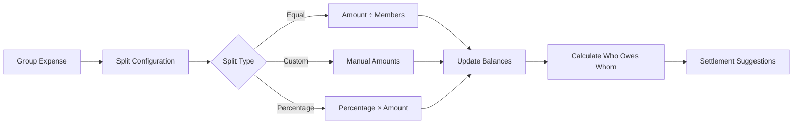

### Deliverables
- [ ] Personal expense tracking
- [ ] Group expense management
- [ ] Flexible splitting options
- [ ] Balance calculation engine
- [ ] Settlement recommendations
- [ ] Receipt photo upload with drag-and-drop
- [ ] Expense categorization with visual charts
- [ ] Export functionality (PDF, CSV)
- [ ] Responsive expense management interface

## Phase 5: Testing, Optimization & Mobile Planning (Weeks 12-14)

### Goals
- Comprehensive testing suite for web application
- Performance optimization for web platform
- Security audit and accessibility compliance
- Production deployment preparation
- Mobile app planning and architecture review

### Phase 5 Flowchart

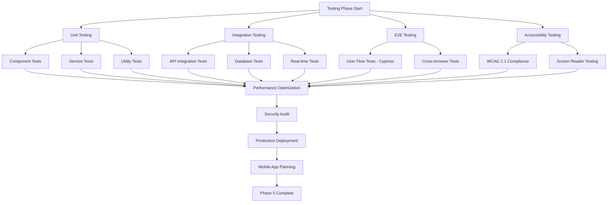

### Testing Strategy

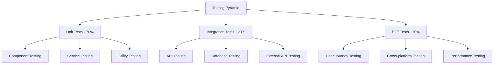

### Deliverables
- [ ] Complete test suite (Unit, Integration, E2E, Accessibility)
- [ ] Cross-browser compatibility (Chrome, Firefox, Safari, Edge)
- [ ] Performance optimization and lighthouse scores > 90
- [ ] Security vulnerability assessment
- [ ] WCAG 2.1 AA accessibility compliance
- [ ] Documentation completion
- [ ] Production deployment pipeline
- [ ] Monitoring and analytics setup
- [ ] Mobile app technical specification document
- [ ] React Native vs Flutter evaluation report

## Future Phase: Mobile App Development (Weeks 15-22)

### Goals (Future Implementation)
- Port web application to mobile platforms
- Implement mobile-specific features
- Add offline capabilities
- Optimize for mobile performance

### Mobile Development Approach
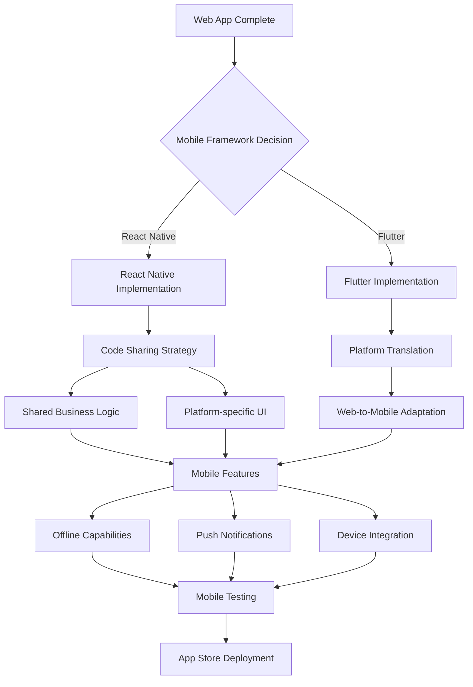

### Mobile-Specific Features to Add
- [ ] Offline trip viewing and basic editing
- [ ] Push notifications for group updates
- [ ] GPS integration for location tracking
- [ ] Camera integration for receipt capture
- [ ] Biometric authentication
- [ ] App store optimization
- [ ] Mobile payment integration

## Development Methodology

### Agile Sprint Structure
- **Sprint Duration**: 2 weeks
- **Sprint Planning**: Monday of Week 1
- **Daily Standups**: Every weekday
- **Sprint Review**: Friday of Week 2
- **Retrospective**: Following Sprint Review

### Definition of Done
- [ ] Feature implemented according to requirements
- [ ] Unit tests written and passing
- [ ] Integration tests passing
- [ ] Code reviewed by team member
- [ ] Documentation updated
- [ ] Accessibility guidelines followed
- [ ] Performance benchmarks met
- [ ] Security considerations addressed

### Risk Management

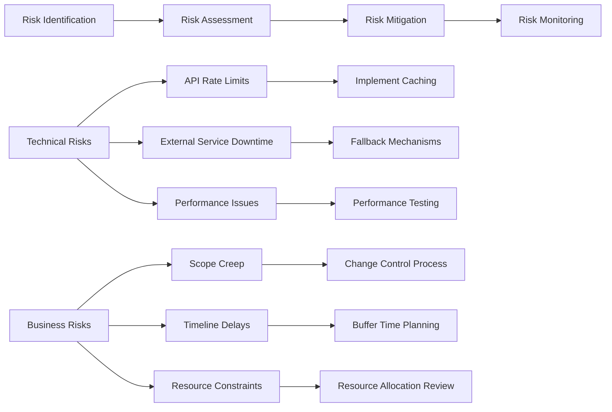

This phased approach ensures systematic development, proper testing, and manageable complexity throughout the project lifecycle.
