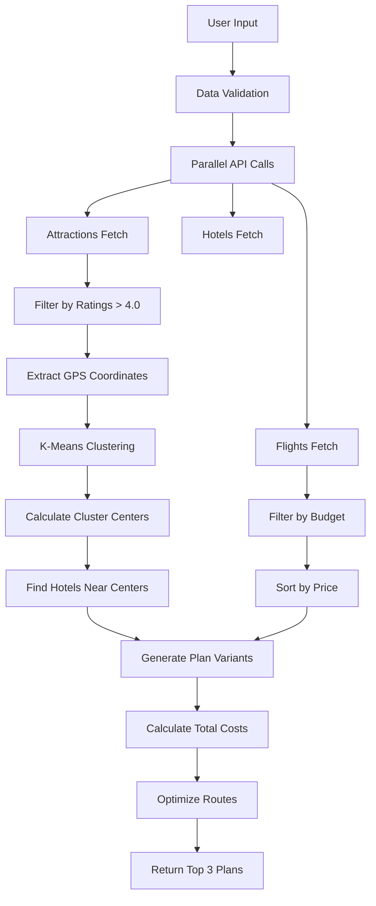
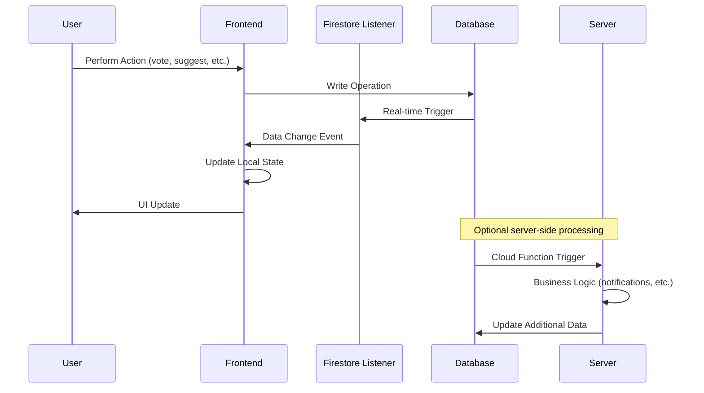

# Technical Specifications & Requirements

## System Requirements

### Performance Requirements
- **App Launch Time**: < 3 seconds cold start
- **Screen Transition Time**: < 500ms
- **API Response Time**: < 2 seconds for itinerary generation
- **Real-time Updates**: < 1 second propagation
- **Offline Capability**: Core features available offline
- **Memory Usage**: < 150MB on average device
- **Battery Optimization**: Minimal background processing

### Scalability Requirements
- **Concurrent Users**: Support 10,000+ simultaneous users
- **Database Operations**: 1000+ reads/writes per second
- **API Rate Limits**: Respect external API constraints
- **Storage**: Efficient data structure for large trip datasets
- **Geographic Distribution**: Multi-region deployment capability

## Detailed Algorithm Specifications

### Itinerary Generation Algorithm



### Clustering Algorithm Details

```typescript
interface Attraction {
  id: string;
  name: string;
  coordinates: {
    lat: number;
    lng: number;
  };
  rating: number;
  category: string;
  estimatedDuration: number; // in hours
}

interface ClusteringConfig {
  maxClustersPerDay: number;
  maxDistanceKm: number;
  maxDailyTravelTime: number; // in hours
  priorityCategories: string[];
}

class ItineraryClusteringService {
  generateClusters(
    attractions: Attraction[],
    tripDurationDays: number,
    config: ClusteringConfig
  ): AttractionCluster[] {
    // K-means clustering implementation
    // 1. Initialize cluster centers randomly
    // 2. Assign attractions to nearest cluster
    // 3. Recalculate cluster centers
    // 4. Repeat until convergence
    // 5. Validate cluster quality (distance, time constraints)
  }
}
```

### Real-time Collaboration Algorithm



## Database Schema Specifications

### Firestore Collection Structure

```typescript
// Users Collection
interface User {
  id: string;
  email: string;
  name: string;
  avatar_url?: string;
  preferences: {
    currency: string;
    language: string;
    timezone: string;
    travel_style: 'budget' | 'standard' | 'luxury';
  };
  created_at: Timestamp;
  updated_at: Timestamp;
}

// Trips Collection
interface Trip {
  id: string;
  name: string;
  destination: {
    city: string;
    country: string;
    coordinates: GeoPoint;
  };
  dates: {
    start_date: Timestamp;
    end_date: Timestamp;
  };
  budget: {
    amount: number;
    currency: string;
    category: 'budget' | 'standard' | 'luxury';
  };
  members: {
    [userId: string]: {
      role: 'owner' | 'admin' | 'member';
      status: 'pending' | 'accepted' | 'declined';
      joined_at: Timestamp;
    };
  };
  settings: {
    is_group: boolean;
    is_public: boolean;
    voting_enabled: boolean;
    expense_tracking: boolean;
  };
  status: 'planning' | 'confirmed' | 'active' | 'completed' | 'cancelled';
  created_by: string;
  created_at: Timestamp;
  updated_at: Timestamp;
}

// Itinerary Sub-collection
interface ItineraryDay {
  id: string;
  trip_id: string;
  date: Timestamp;
  day_number: number;
  city: string;
  items: ItineraryItem[];
  transport: {
    arrival?: FlightInfo;
    departure?: FlightInfo;
    local_transport?: TransportInfo[];
  };
}

interface ItineraryItem {
  id: string;
  type: 'attraction' | 'restaurant' | 'hotel' | 'transport' | 'activity';
  name: string;
  description: string;
  location: {
    address: string;
    coordinates: GeoPoint;
  };
  time: {
    start: Timestamp;
    end: Timestamp;
    estimated_duration: number;
  };
  cost: {
    estimated: number;
    actual?: number;
    currency: string;
  };
  booking: {
    url?: string;
    confirmation_code?: string;
    status: 'suggested' | 'confirmed' | 'booked';
  };
  collaboration: {
    suggested_by: string;
    votes: {
      [userId: string]: 'up' | 'down';
    };
    vote_count: {
      up: number;
      down: number;
    };
    comments: Comment[];
  };
  external_ids: {
    google_place_id?: string;
    booking_com_id?: string;
    tripadvisor_id?: string;
  };
}

// Expenses Collection
interface Expense {
  id: string;
  trip_id: string;
  created_by: string;
  type: 'personal' | 'group';
  category: 'food' | 'transport' | 'accommodation' | 'activities' | 'shopping' | 'other';
  amount: number;
  currency: string;
  description: string;
  date: Timestamp;
  receipt: {
    url?: string;
    text?: string; // OCR extracted text
  };
  splits?: {
    [userId: string]: {
      amount: number;
      paid: boolean;
      paid_at?: Timestamp;
    };
  };
  location?: GeoPoint;
  created_at: Timestamp;
}
```

### Firestore Security Rules

```javascript
rules_version = '2';
service cloud.firestore {
  match /databases/{database}/documents {
    // Users can only access their own data
    match /users/{userId} {
      allow read, write: if request.auth != null && request.auth.uid == userId;
    }
    
    // Trip access based on membership
    match /trips/{tripId} {
      allow read: if request.auth != null && 
        (request.auth.uid in resource.data.members ||
         resource.data.settings.is_public == true);
      
      allow write: if request.auth != null && 
        request.auth.uid in resource.data.members &&
        resource.data.members[request.auth.uid].role in ['owner', 'admin'];
      
      allow create: if request.auth != null &&
        request.auth.uid == resource.data.created_by;
    }
    
    // Itinerary access based on trip membership
    match /trips/{tripId}/itinerary/{dayId} {
      allow read, write: if request.auth != null &&
        exists(/databases/$(database)/documents/trips/$(tripId)) &&
        request.auth.uid in get(/databases/$(database)/documents/trips/$(tripId)).data.members;
    }
    
    // Expense access based on trip membership
    match /expenses/{expenseId} {
      allow read, write: if request.auth != null &&
        exists(/databases/$(database)/documents/trips/$(resource.data.trip_id)) &&
        request.auth.uid in get(/databases/$(database)/documents/trips/$(resource.data.trip_id)).data.members;
    }
  }
}
```

## API Specifications

### Backend API Endpoints

```typescript
// Trip Management API
interface TripAPI {
  // Generate smart itinerary
  POST('/api/trips/generate', {
    destination: string;
    start_date: string;
    end_date: string;
    budget: {
      amount: number;
      currency: string;
    };
    travelers: number;
    preferences?: {
      travel_style: string;
      interests: string[];
    };
  }): Promise<TripPlan[]>;

  // Create trip from selected plan
  POST('/api/trips', {
    plan_id: string;
    name: string;
    is_group: boolean;
  }): Promise<Trip>;

  // Get trip details
  GET('/api/trips/:tripId'): Promise<Trip>;

  // Update trip
  PATCH('/api/trips/:tripId', Partial<Trip>): Promise<Trip>;

  // Delete trip
  DELETE('/api/trips/:tripId'): Promise<void>;

  // Invite members to trip
  POST('/api/trips/:tripId/invitations', {
    emails: string[];
    message?: string;
  }): Promise<Invitation[]>;
}

// Itinerary Management API
interface ItineraryAPI {
  // Get itinerary for trip
  GET('/api/trips/:tripId/itinerary'): Promise<ItineraryDay[]>;

  // Add suggestion to itinerary
  POST('/api/trips/:tripId/itinerary/:dayId/items', {
    item: Partial<ItineraryItem>;
  }): Promise<ItineraryItem>;

  // Vote on itinerary item
  POST('/api/trips/:tripId/itinerary/items/:itemId/vote', {
    vote: 'up' | 'down';
  }): Promise<void>;

  // Confirm itinerary item
  POST('/api/trips/:tripId/itinerary/items/:itemId/confirm'): Promise<void>;
}

// Expense Management API
interface ExpenseAPI {
  // Get expenses for trip
  GET('/api/trips/:tripId/expenses'): Promise<Expense[]>;

  // Add expense
  POST('/api/trips/:tripId/expenses', {
    expense: Partial<Expense>;
  }): Promise<Expense>;

  // Update expense
  PATCH('/api/expenses/:expenseId', Partial<Expense>): Promise<Expense>;

  // Get balances summary
  GET('/api/trips/:tripId/balances'): Promise<BalanceSummary>;

  // Settle expense
  POST('/api/expenses/:expenseId/settle', {
    amount: number;
  }): Promise<void>;
}
```

### External API Integration Specifications

```typescript
// Amadeus Flight API Integration
interface AmadeusFlightService {
  searchFlights(params: {
    origin: string;
    destination: string;
    departure_date: string;
    return_date?: string;
    adults: number;
    max_price?: number;
  }): Promise<FlightOffer[]>;
}

// Booking.com Hotel API Integration
interface BookingHotelService {
  searchHotels(params: {
    destination_id: number;
    checkin_date: string;
    checkout_date: string;
    guests: number;
    max_price?: number;
    coordinates?: {
      lat: number;
      lng: number;
      radius_km: number;
    };
  }): Promise<HotelOffer[]>;
}

// Google Maps Platform Integration
interface GoogleMapsService {
  searchPlaces(params: {
    query: string;
    location?: string;
    radius?: number;
    type?: string;
    min_rating?: number;
  }): Promise<Place[]>;

  getDirections(params: {
    origin: string;
    destination: string;
    waypoints?: string[];
    mode: 'driving' | 'walking' | 'transit';
  }): Promise<DirectionsResult>;
}
```

## Security Specifications

### Authentication & Authorization
- **Firebase Authentication** for user management
- **JWT tokens** for API authentication
- **Role-based access control** for trip permissions
- **OAuth 2.0** for social login integration

### Data Protection
- **End-to-end encryption** for sensitive data
- **HTTPS/TLS 1.3** for all communications
- **Data anonymization** for analytics
- **GDPR compliance** for EU users

### API Security
- **Rate limiting** to prevent abuse
- **Input validation** on all endpoints
- **SQL injection prevention**
- **XSS protection**
- **CORS configuration**

### Mobile App Security
- **Certificate pinning** for API calls
- **Biometric authentication** option
- **Secure storage** for sensitive data
- **Code obfuscation** for production builds

This technical specification provides the detailed foundation for implementing the Collaborative Trip Planner App with enterprise-grade quality and scalability.
