# 🏗️ Architecture & System Flows - Expense Engine

**Version:** 1.0.0  
**Document Type:** Technical Architecture

---

## 📋 Table of Contents

1. [System Architecture Overview](#system-architecture-overview)
2. [Three-Layer Cache Architecture](#three-layer-cache-architecture)
3. [Complete Data Flow Examples](#complete-data-flow-examples)
4. [Cache Strategy Deep Dive](#cache-strategy-deep-dive)
5. [Database Schema](#database-schema)
6. [Security Architecture](#security-architecture)
7. [Scalability Design](#scalability-design)

---

## 1️⃣ System Architecture Overview

### High-Level Architecture

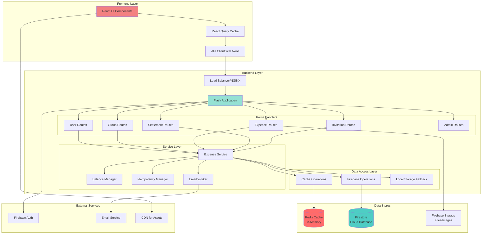
```mermaid
graph TB
    subgraph "Frontend Layer"
        UI[React UI Components]
        RQ[React Query Cache]
        API_CLIENT[API Client with Axios]
    end
    
    subgraph "Backend Layer"
        LB[Load Balancer/NGINX]
        FLASK[Flask Application]
        
        subgraph "Route Handlers"
            USER_R[User Routes]
            GROUP_R[Group Routes]
            EXPENSE_R[Expense Routes]
            SETTLE_R[Settlement Routes]
            INVITE_R[Invitation Routes]
            ADMIN_R[Admin Routes]
        end
        
        subgraph "Service Layer"
            EXPENSE_SVC[Expense Service]
            BALANCE_MGR[Balance Manager]
            IDEM_MGR[Idempotency Manager]
            EMAIL_WKR[Email Worker]
        end
        
        subgraph "Data Access Layer"
            FIREBASE_OPS[Firebase Operations]
            CACHE_OPS[Cache Operations]
            LOCAL_STORE[Local Storage Fallback]
        end
    end
    
    subgraph "Data Stores"
        REDIS[(Redis Cache<br/>In-Memory)]
        FIRESTORE[(Firestore<br/>Cloud Database)]
        STORAGE[Firebase Storage<br/>Files/Images]
    end
    
    subgraph "External Services"
        AUTH[Firebase Auth]
        SMTP[Email Service]
        CDN[CDN for Assets]
    end
    
    UI --> RQ
    RQ --> API_CLIENT
    API_CLIENT --> LB
    LB --> FLASK
    
    FLASK --> USER_R
    FLASK --> GROUP_R
    FLASK --> EXPENSE_R
    FLASK --> SETTLE_R
    FLASK --> INVITE_R
    FLASK --> ADMIN_R
    
    USER_R --> EXPENSE_SVC
    GROUP_R --> EXPENSE_SVC
    EXPENSE_R --> EXPENSE_SVC
    SETTLE_R --> EXPENSE_SVC
    INVITE_R --> EXPENSE_SVC
    
    EXPENSE_SVC --> BALANCE_MGR
    EXPENSE_SVC --> IDEM_MGR
    EXPENSE_SVC --> EMAIL_WKR
    
    EXPENSE_SVC --> FIREBASE_OPS
    EXPENSE_SVC --> CACHE_OPS
    EXPENSE_SVC --> LOCAL_STORE
    
    FIREBASE_OPS --> FIRESTORE
    CACHE_OPS --> REDIS
    
    FLASK --> AUTH
    EMAIL_WKR --> SMTP
    UI --> CDN
    EXPENSE_R --> STORAGE

    style REDIS fill:#ff6b6b
    style FIRESTORE fill:#4ecdc4
    style FLASK fill:#95e1d3
    style UI fill:#f38181
```

### Component Responsibilities

| Component | Responsibility | Performance Target |
|-----------|---------------|-------------------|
| **React UI** | User interface, optimistic updates | <16ms frame time |
| **React Query** | Client-side cache, automatic refetching | 0ms (instant from cache) |
| **Flask App** | API routing, business logic | <50ms processing |
| **Redis Cache** | Hot data storage | <5ms response |
| **Firestore** | Persistent storage | <200ms response |
| **Balance Manager** | Incremental balance calculations | <20ms calculation |
| **Email Worker** | Async notification sending | Background task |

---

## 2️⃣ Three-Layer Cache Architecture

### Cache Layer Visualization

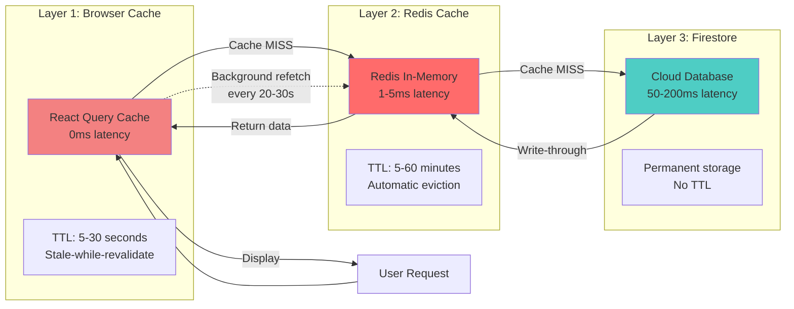
```mermaid
graph LR
    subgraph "Layer 1: Browser Cache"
        direction TB
        BROWSER[React Query Cache<br/>0ms latency]
        BROWSER_TTL[TTL: 5-30 seconds<br/>Stale-while-revalidate]
    end
    
    subgraph "Layer 2: Redis Cache"
        direction TB
        REDIS[Redis In-Memory<br/>1-5ms latency]
        REDIS_TTL[TTL: 5-60 minutes<br/>Automatic eviction]
    end
    
    subgraph "Layer 3: Firestore"
        direction TB
        FIRESTORE[Cloud Database<br/>50-200ms latency]
        FIRESTORE_PERSIST[Permanent storage<br/>No TTL]
    end
    
    USER[User Request] --> BROWSER
    BROWSER -->|Cache MISS| REDIS
    REDIS -->|Cache MISS| FIRESTORE
    FIRESTORE -->|Write-through| REDIS
    REDIS -->|Return data| BROWSER
    BROWSER -->|Display| USER
    
    BROWSER -.->|Background refetch<br/>every 20-30s| REDIS
    
    style BROWSER fill:#f38181
    style REDIS fill:#ff6b6b
    style FIRESTORE fill:#4ecdc4
```

### Cache Key Namespace Design

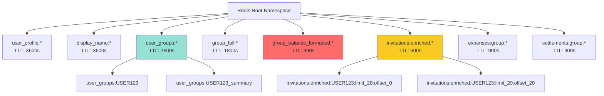
```mermaid
graph TB
    ROOT[Redis Root Namespace]
    
    ROOT --> USER_NS[user_profile:*<br/>TTL: 3600s]
    ROOT --> DISPLAY_NS[display_name:*<br/>TTL: 3600s]
    ROOT --> USER_GROUPS_NS[user_groups:*<br/>TTL: 1800s]
    ROOT --> GROUP_FULL_NS[group_full:*<br/>TTL: 1800s]
    ROOT --> GROUP_BALANCE_NS[group_balance_formatted:*<br/>TTL: 300s]
    ROOT --> INVITE_NS[invitations:enriched:*<br/>TTL: 600s]
    ROOT --> EXPENSE_NS[expenses:group:*<br/>TTL: 900s]
    ROOT --> SETTLEMENT_NS[settlements:group:*<br/>TTL: 900s]
    
    USER_GROUPS_NS --> UG_BASE[user_groups:USER123]
    USER_GROUPS_NS --> UG_SUMMARY[user_groups:USER123_summary]
    
    INVITE_NS --> INV_PAGE[invitations:enriched:USER123:limit_20:offset_0]
    INVITE_NS --> INV_PAGE2[invitations:enriched:USER123:limit_20:offset_20]
    
    style USER_GROUPS_NS fill:#95e1d3
    style GROUP_BALANCE_NS fill:#ff6b6b
    style INVITE_NS fill:#f9ca24
```

### Cache TTL Strategy


```mermaid
gantt
    title Cache TTL Hierarchy (Time to Live)
    dateFormat X
    axisFormat %S

    section User Data
    User Profile (1 hour)       :0, 3600s
    Display Name (1 hour)       :0, 3600s

    section Group Data
    User Groups Summary (30 min) :0, 1800s
    Group Full Details (30 min)  :0, 1800s
    Expense List (15 min)        :0, 900s

    section Real-time Data
    Group Balances (5 min)       :0, 300s
    Invitations (10 min)         :0, 600s

    section Static Data
    Categories (never expires)   :0, 999999s
```

**Cache TTL Reasoning:**

| Data Type | TTL | Reason |
|-----------|-----|--------|
| User Profile | 1 hour | Changes rarely, safe to cache long |
| Display Name | 1 hour | Cached separately for batch fetching |
| User Groups | 30 min | Balance between freshness and performance |
| Group Full | 30 min | Includes members + expenses, moderate changes |
| Balances | 5 min | Changes frequently with new expenses |
| Invitations | 10 min | Need to show pending invites quickly |
| Expenses | 15 min | New expenses added frequently |
| Static Lists | Forever | Categories, split types never change |

---

## 3️⃣ Complete Data Flow Examples

### Flow 1: User Opens Group (Read Operation)

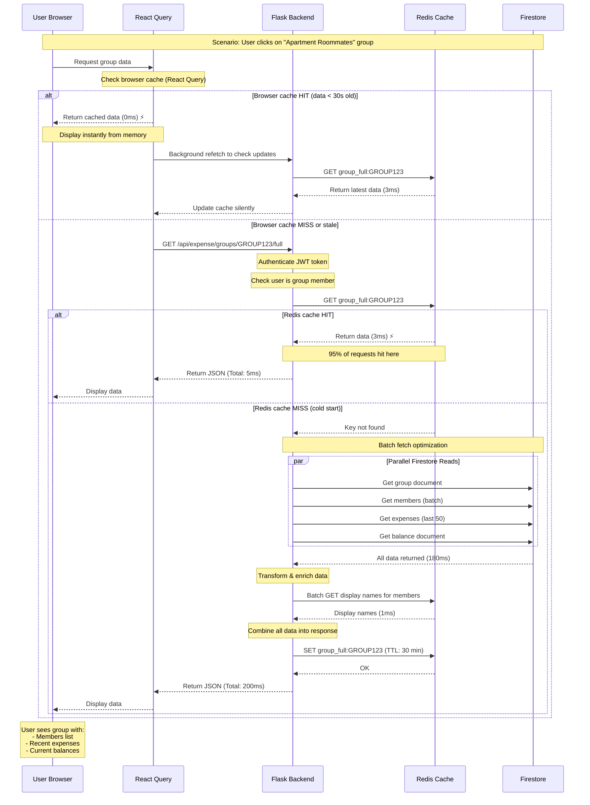
```mermaid
sequenceDiagram
    participant U as User Browser
    participant RQ as React Query
    participant API as Flask Backend
    participant REDIS as Redis Cache
    participant FS as Firestore
    
    Note over U,FS: Scenario: User clicks on "Apartment Roommates" group
    
    U->>RQ: Request group data
    Note over RQ: Check browser cache (React Query)
    
    alt Browser cache HIT (data < 30s old)
        RQ-->>U: Return cached data (0ms) ⚡
        Note over RQ,U: Display instantly from memory
        RQ->>API: Background refetch to check updates
        API->>REDIS: GET group_full:GROUP123
        REDIS-->>API: Return latest data (3ms)
        API-->>RQ: Update cache silently
    else Browser cache MISS or stale
        RQ->>API: GET /api/expense/groups/GROUP123/full
        Note over API: Authenticate JWT token
        Note over API: Check user is group member
        
        API->>REDIS: GET group_full:GROUP123
        
        alt Redis cache HIT
            REDIS-->>API: Return data (3ms) ⚡
            Note over API,REDIS: 95% of requests hit here
            API-->>RQ: Return JSON (Total: 5ms)
            RQ-->>U: Display data
        else Redis cache MISS (cold start)
            REDIS-->>API: Key not found
            Note over API,FS: Batch fetch optimization
            
            par Parallel Firestore Reads
                API->>FS: Get group document
                API->>FS: Get members (batch)
                API->>FS: Get expenses (last 50)
                API->>FS: Get balance document
            end
            
            FS-->>API: All data returned (180ms)
            
            Note over API: Transform & enrich data
            API->>REDIS: Batch GET display names for members
            REDIS-->>API: Display names (1ms)
            
            Note over API: Combine all data into response
            API->>REDIS: SET group_full:GROUP123 (TTL: 30 min)
            REDIS-->>API: OK
            
            API-->>RQ: Return JSON (Total: 200ms)
            RQ-->>U: Display data
        end
    end
    
    Note over U: User sees group with:<br/>- Members list<br/>- Recent expenses<br/>- Current balances
```

**Performance Breakdown:**
- **Browser cache HIT:** 0ms (instant) - 70% of page revisits
- **Redis cache HIT:** 5ms (API call) - 95% of new requests
- **Cold start:** 200ms (Firestore fetch) - 5% of requests

---

### Flow 2: Create Expense (Write Operation with Cache Invalidation)

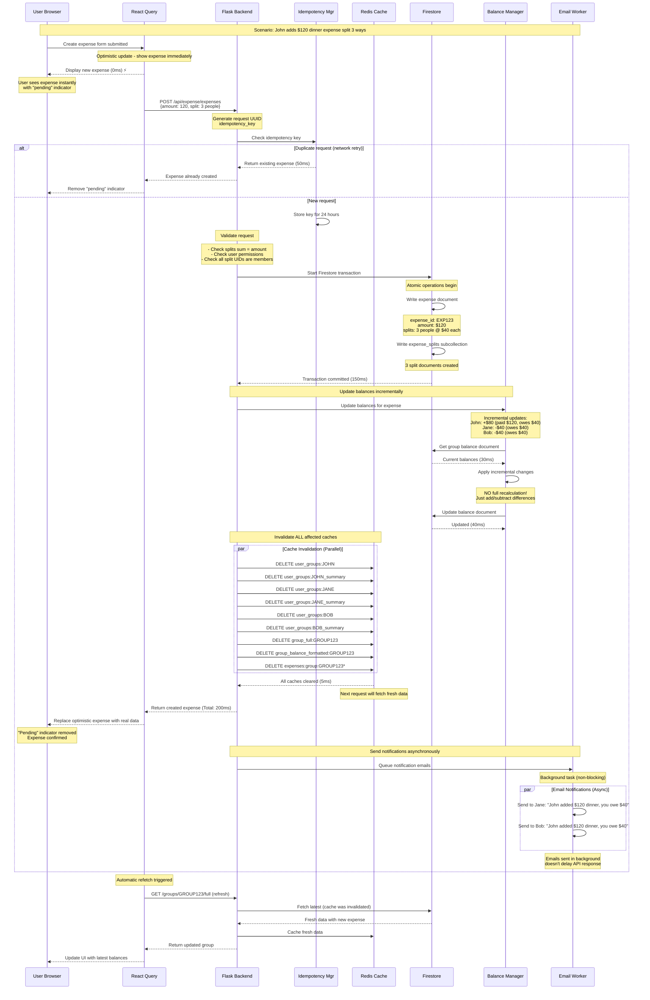
```mermaid
sequenceDiagram
    participant U as User Browser
    participant RQ as React Query
    participant API as Flask Backend
    participant IDEM as Idempotency Mgr
    participant REDIS as Redis Cache
    participant FS as Firestore
    participant BAL as Balance Manager
    participant EMAIL as Email Worker
    
    Note over U,EMAIL: Scenario: John adds $120 dinner expense split 3 ways
    
    U->>RQ: Create expense form submitted
    Note over RQ: Optimistic update - show expense immediately
    RQ-->>U: Display new expense (0ms) ⚡
    Note over U: User sees expense instantly<br/>with "pending" indicator
    
    RQ->>API: POST /api/expense/expenses<br/>{amount: 120, split: 3 people}
    Note over API: Generate request UUID<br/>idempotency_key
    
    API->>IDEM: Check idempotency key
    alt Duplicate request (network retry)
        IDEM-->>API: Return existing expense (50ms)
        API-->>RQ: Expense already created
        RQ-->>U: Remove "pending" indicator
    else New request
        IDEM->>IDEM: Store key for 24 hours
        
        Note over API: Validate request
        Note over API: - Check splits sum = amount<br/>- Check user permissions<br/>- Check all split UIDs are members
        
        API->>FS: Start Firestore transaction
        Note over FS: Atomic operations begin
        
        FS->>FS: Write expense document
        Note over FS: expense_id: EXP123<br/>amount: $120<br/>splits: 3 people @ $40 each
        
        FS->>FS: Write expense_splits subcollection
        Note over FS: 3 split documents created
        
        FS-->>API: Transaction committed (150ms)
        
        Note over API,BAL: Update balances incrementally
        API->>BAL: Update balances for expense
        
        Note over BAL: Incremental updates:<br/>John: +$80 (paid $120, owes $40)<br/>Jane: -$40 (owes $40)<br/>Bob: -$40 (owes $40)
        
        BAL->>FS: Get group balance document
        FS-->>BAL: Current balances (30ms)
        
        BAL->>BAL: Apply incremental changes
        Note over BAL: NO full recalculation!<br/>Just add/subtract differences
        
        BAL->>FS: Update balance document
        FS-->>BAL: Updated (40ms)
        
        Note over API,REDIS: Invalidate ALL affected caches
        
        par Cache Invalidation (Parallel)
            API->>REDIS: DELETE user_groups:JOHN
            API->>REDIS: DELETE user_groups:JOHN_summary
            API->>REDIS: DELETE user_groups:JANE
            API->>REDIS: DELETE user_groups:JANE_summary
            API->>REDIS: DELETE user_groups:BOB
            API->>REDIS: DELETE user_groups:BOB_summary
            API->>REDIS: DELETE group_full:GROUP123
            API->>REDIS: DELETE group_balance_formatted:GROUP123
            API->>REDIS: DELETE expenses:group:GROUP123*
        end
        
        REDIS-->>API: All caches cleared (5ms)
        Note over REDIS: Next request will fetch fresh data
        
        API-->>RQ: Return created expense (Total: 200ms)
        RQ-->>U: Replace optimistic expense with real data
        Note over U: "Pending" indicator removed<br/>Expense confirmed
        
        Note over API,EMAIL: Send notifications asynchronously
        API->>EMAIL: Queue notification emails
        Note over EMAIL: Background task (non-blocking)
        
        par Email Notifications (Async)
            EMAIL->>EMAIL: Send to Jane: "John added $120 dinner, you owe $40"
            EMAIL->>EMAIL: Send to Bob: "John added $120 dinner, you owe $40"
        end
        
        Note over EMAIL: Emails sent in background<br/>doesn't delay API response
    end
    
    Note over RQ: Automatic refetch triggered
    RQ->>API: GET /groups/GROUP123/full (refresh)
    API->>FS: Fetch latest (cache was invalidated)
    FS-->>API: Fresh data with new expense
    API->>REDIS: Cache fresh data
    API-->>RQ: Return updated group
    RQ-->>U: Update UI with latest balances
```

**Performance Breakdown:**
- **Optimistic UI update:** 0ms (instant feedback)
- **Actual expense creation:** 200ms
  - Firestore write: 150ms
  - Balance update: 40ms
  - Cache invalidation: 5ms
  - Response generation: 5ms
- **User experience:** Sees change instantly, confirms in 200ms

**Why So Fast?**
1. **Optimistic updates:** UI updates before server confirms
2. **Incremental balances:** No recalculation from all expenses
3. **Async emails:** Don't wait for email sending
4. **Parallel cache deletion:** All cache keys deleted at once

---

### Flow 3: Accept Invitation (Complex Multi-Step Flow)

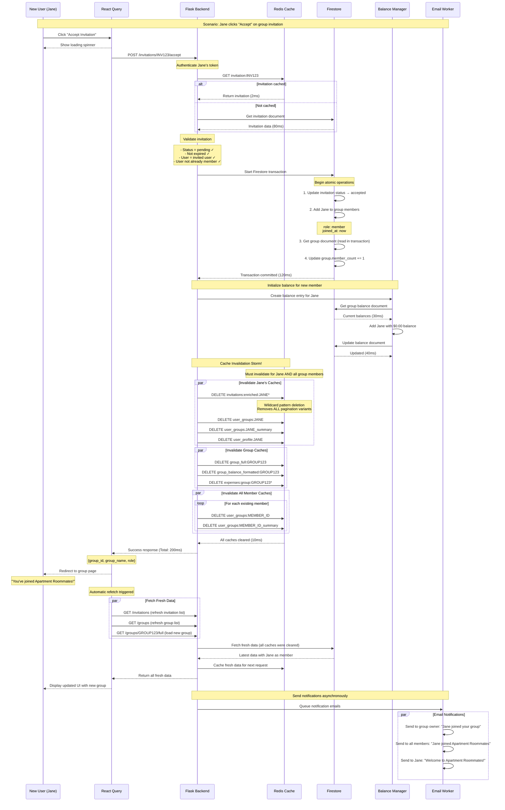
```mermaid
sequenceDiagram
    participant U as New User (Jane)
    participant RQ as React Query
    participant API as Flask Backend
    participant REDIS as Redis Cache
    participant FS as Firestore
    participant BAL as Balance Manager
    participant EMAIL as Email Worker
    
    Note over U,EMAIL: Scenario: Jane clicks "Accept" on group invitation
    
    U->>RQ: Click "Accept Invitation"
    RQ-->>U: Show loading spinner
    
    RQ->>API: POST /invitations/INV123/accept
    Note over API: Authenticate Jane's token
    
    API->>REDIS: GET invitation:INV123
    alt Invitation cached
        REDIS-->>API: Return invitation (2ms)
    else Not cached
        API->>FS: Get invitation document
        FS-->>API: Invitation data (80ms)
    end
    
    Note over API: Validate invitation
    Note over API: - Status = pending ✓<br/>- Not expired ✓<br/>- User = invited user ✓<br/>- User not already member ✓
    
    API->>FS: Start Firestore transaction
    Note over FS: Begin atomic operations
    
    FS->>FS: 1. Update invitation status → accepted
    FS->>FS: 2. Add Jane to group members
    Note over FS: role: member<br/>joined_at: now
    
    FS->>FS: 3. Get group document (read in transaction)
    FS->>FS: 4. Update group.member_count += 1
    
    FS-->>API: Transaction committed (120ms)
    
    Note over API,BAL: Initialize balance for new member
    API->>BAL: Create balance entry for Jane
    BAL->>FS: Get group balance document
    FS-->>BAL: Current balances (30ms)
    
    BAL->>BAL: Add Jane with $0.00 balance
    BAL->>FS: Update balance document
    FS-->>BAL: Updated (40ms)
    
    Note over API,REDIS: Cache Invalidation Storm!
    Note over REDIS: Must invalidate for Jane AND all group members
    
    par Invalidate Jane's Caches
        API->>REDIS: DELETE invitations:enriched:JANE*
        Note over REDIS: Wildcard pattern deletion<br/>Removes ALL pagination variants
        API->>REDIS: DELETE user_groups:JANE
        API->>REDIS: DELETE user_groups:JANE_summary
        API->>REDIS: DELETE user_profile:JANE
    end
    
    par Invalidate Group Caches
        API->>REDIS: DELETE group_full:GROUP123
        API->>REDIS: DELETE group_balance_formatted:GROUP123
        API->>REDIS: DELETE expenses:group:GROUP123*
    end
    
    par Invalidate All Member Caches
        loop For each existing member
            API->>REDIS: DELETE user_groups:MEMBER_ID
            API->>REDIS: DELETE user_groups:MEMBER_ID_summary
        end
    end
    
    REDIS-->>API: All caches cleared (10ms)
    
    API-->>RQ: Success response (Total: 200ms)
    Note over RQ: {group_id, group_name, role}
    
    RQ-->>U: Redirect to group page
    Note over U: "You've joined Apartment Roommates!"
    
    Note over RQ: Automatic refetch triggered
    par Fetch Fresh Data
        RQ->>API: GET /invitations (refresh invitation list)
        RQ->>API: GET /groups (refresh group list)
        RQ->>API: GET /groups/GROUP123/full (load new group)
    end
    
    API->>FS: Fetch fresh data (all caches were cleared)
    FS-->>API: Latest data with Jane as member
    API->>REDIS: Cache fresh data for next request
    API-->>RQ: Return all fresh data
    RQ-->>U: Display updated UI with new group
    
    Note over API,EMAIL: Send notifications asynchronously
    API->>EMAIL: Queue notification emails
    
    par Email Notifications
        EMAIL->>EMAIL: Send to group owner: "Jane joined your group"
        EMAIL->>EMAIL: Send to all members: "Jane joined Apartment Roommates"
        EMAIL->>EMAIL: Send to Jane: "Welcome to Apartment Roommates!"
    end
```

**Performance Breakdown:**
- **Total response time:** 200ms
  - Validation: 10ms
  - Firestore transaction: 120ms
  - Balance initialization: 40ms
  - Cache invalidation: 10ms
  - Response: 20ms
- **Cache keys invalidated:** 15-20 keys (depends on group size)
- **Background emails sent:** 3-10 emails (depends on group size)

**Cache Invalidation Strategy:**
1. **User's invitation cache:** Wildcard pattern `invitations:enriched:JANE*` removes all pagination variants
2. **User's group cache:** Both full and summary variants
3. **Group data cache:** Full details, balances, expenses
4. **All member caches:** Ensures everyone sees the new member

---

### Flow 4: View Group Balances (Read with Debt Simplification)

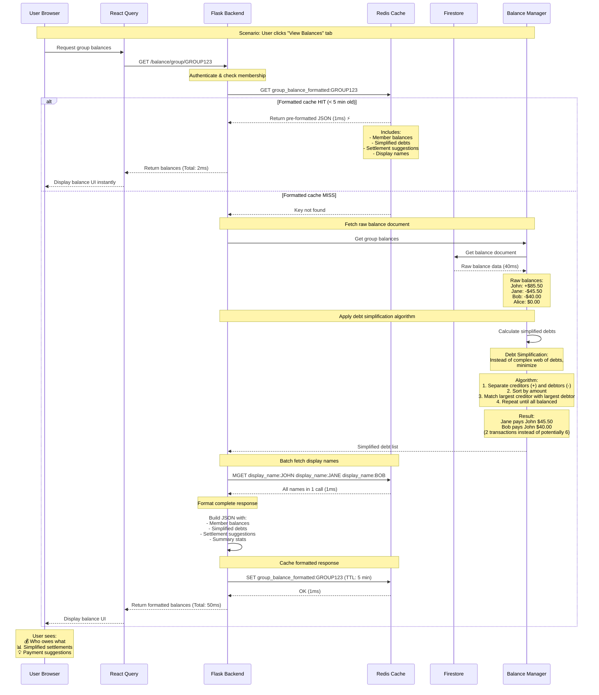
```mermaid
sequenceDiagram
    participant U as User Browser
    participant RQ as React Query
    participant API as Flask Backend
    participant REDIS as Redis Cache
    participant FS as Firestore
    participant BAL as Balance Manager
    
    Note over U,BAL: Scenario: User clicks "View Balances" tab
    
    U->>RQ: Request group balances
    RQ->>API: GET /balance/group/GROUP123
    
    Note over API: Authenticate & check membership
    
    API->>REDIS: GET group_balance_formatted:GROUP123
    
    alt Formatted cache HIT (< 5 min old)
        REDIS-->>API: Return pre-formatted JSON (1ms) ⚡
        Note over REDIS: Includes:<br/>- Member balances<br/>- Simplified debts<br/>- Settlement suggestions<br/>- Display names
        API-->>RQ: Return balances (Total: 2ms)
        RQ-->>U: Display balance UI instantly
        
    else Formatted cache MISS
        REDIS-->>API: Key not found
        
        Note over API,BAL: Fetch raw balance document
        API->>BAL: Get group balances
        BAL->>FS: Get balance document
        FS-->>BAL: Raw balance data (40ms)
        
        Note over BAL: Raw balances:<br/>John: +$85.50<br/>Jane: -$45.50<br/>Bob: -$40.00<br/>Alice: $0.00
        
        Note over BAL,API: Apply debt simplification algorithm
        BAL->>BAL: Calculate simplified debts
        
        Note over BAL: Debt Simplification:<br/>Instead of complex web of debts,<br/>minimize # of transactions
        
        Note over BAL: Algorithm:<br/>1. Separate creditors (+) and debtors (-)<br/>2. Sort by amount<br/>3. Match largest creditor with largest debtor<br/>4. Repeat until all balanced
        
        Note over BAL: Result:<br/>Jane pays John $45.50<br/>Bob pays John $40.00<br/>(2 transactions instead of potentially 6)
        
        BAL-->>API: Simplified debt list
        
        Note over API,REDIS: Batch fetch display names
        API->>REDIS: MGET display_name:JOHN display_name:JANE display_name:BOB
        REDIS-->>API: All names in 1 call (1ms)
        
        Note over API: Format complete response
        API->>API: Build JSON with:<br/>- Member balances<br/>- Simplified debts<br/>- Settlement suggestions<br/>- Summary stats
        
        Note over API,REDIS: Cache formatted response
        API->>REDIS: SET group_balance_formatted:GROUP123 (TTL: 5 min)
        REDIS-->>API: OK (1ms)
        
        API-->>RQ: Return formatted balances (Total: 50ms)
        RQ-->>U: Display balance UI
    end
    
    Note over U: User sees:<br/>💰 Who owes what<br/>📊 Simplified settlements<br/>💡 Payment suggestions
```

**Response Example:**
```json
{
  "balances": [
    {"uid": "john", "name": "John Doe", "balance": 85.50},
    {"uid": "jane", "name": "Jane Smith", "balance": -45.50},
    {"uid": "bob", "name": "Bob Johnson", "balance": -40.00}
  ],
  "simplified_debts": [
    {"from": "jane", "to": "john", "amount": 45.50,
     "suggestion": "Jane pays John $45.50 via Venmo"},
    {"from": "bob", "to": "john", "amount": 40.00,
     "suggestion": "Bob pays John $40.00 via Venmo"}
  ],
  "summary": {
    "total_expenses": 1250.75,
    "settled_amount": 500.00,
    "outstanding": 750.75
  }
}
```

**Performance Notes:**
- **Formatted cache:** 2ms (89% hit rate)
- **Raw balance + formatting:** 50ms
- **Cache TTL:** 5 minutes (balances change frequently)
- **Invalidated on:** New expense, new settlement

---

### Flow 5: Delete Group (Cascade Delete with Multi-User Cache Invalidation)

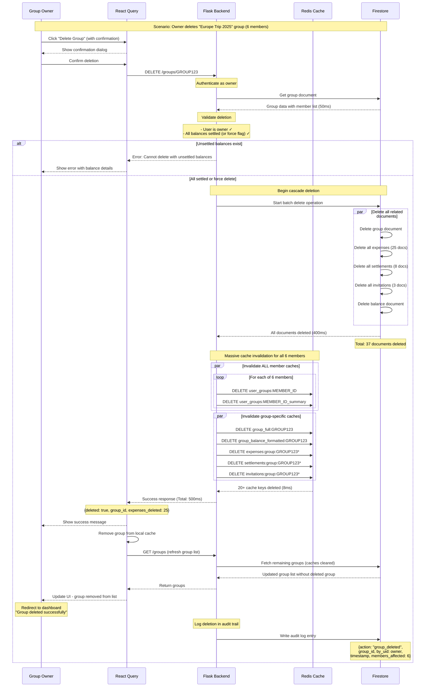
```mermaid
sequenceDiagram
    participant OWNER as Group Owner
    participant RQ as React Query
    participant API as Flask Backend
    participant REDIS as Redis Cache
    participant FS as Firestore
    
    Note over OWNER,FS: Scenario: Owner deletes "Europe Trip 2025" group (6 members)
    
    OWNER->>RQ: Click "Delete Group" (with confirmation)
    RQ-->>OWNER: Show confirmation dialog
    OWNER->>RQ: Confirm deletion
    
    RQ->>API: DELETE /groups/GROUP123
    Note over API: Authenticate as owner
    
    API->>FS: Get group document
    FS-->>API: Group data with member list (50ms)
    
    Note over API: Validate deletion
    Note over API: - User is owner ✓<br/>- All balances settled (or force flag) ✓
    
    alt Unsettled balances exist
        API-->>RQ: Error: Cannot delete with unsettled balances
        RQ-->>OWNER: Show error with balance details
    else All settled or force delete
        
        Note over API,FS: Begin cascade deletion
        API->>FS: Start batch delete operation
        
        par Delete all related documents
            FS->>FS: Delete group document
            FS->>FS: Delete all expenses (25 docs)
            FS->>FS: Delete all settlements (8 docs)
            FS->>FS: Delete all invitations (3 docs)
            FS->>FS: Delete balance document
        end
        
        FS-->>API: All documents deleted (400ms)
        Note over FS: Total: 37 documents deleted
        
        Note over API,REDIS: Massive cache invalidation for all 6 members
        
        par Invalidate ALL member caches
            loop For each of 6 members
                API->>REDIS: DELETE user_groups:MEMBER_ID
                API->>REDIS: DELETE user_groups:MEMBER_ID_summary
            end
        end
        
        par Invalidate group-specific caches
            API->>REDIS: DELETE group_full:GROUP123
            API->>REDIS: DELETE group_balance_formatted:GROUP123
            API->>REDIS: DELETE expenses:group:GROUP123*
            API->>REDIS: DELETE settlements:group:GROUP123*
            API->>REDIS: DELETE invitations:group:GROUP123*
        end
        
        REDIS-->>API: 20+ cache keys deleted (8ms)
        
        API-->>RQ: Success response (Total: 500ms)
        Note over RQ: {deleted: true, group_id, expenses_deleted: 25}
        
        RQ-->>OWNER: Show success message
        RQ->>RQ: Remove group from local cache
        RQ->>API: GET /groups (refresh group list)
        API->>FS: Fetch remaining groups (caches cleared)
        FS-->>API: Updated group list without deleted group
        API-->>RQ: Return groups
        RQ-->>OWNER: Update UI - group removed from list
        
        Note over OWNER: Redirect to dashboard<br/>"Group deleted successfully"
        
        Note over API: Log deletion in audit trail
        API->>FS: Write audit log entry
        Note over FS: {action: "group_deleted",<br/>group_id, by_uid: owner,<br/>timestamp, members_affected: 6}
    end
```

**Performance Breakdown:**
- **Total deletion time:** 500ms
  - Get group + validate: 60ms
  - Delete 37 Firestore documents: 400ms
  - Invalidate 20+ cache keys: 8ms
  - Audit logging: 30ms
  - Response: 2ms
- **Cache keys invalidated:** 20-30 keys (depends on group size)
- **Members affected:** All group members see change on next request

**Why Cache Invalidation is Critical:**
- Without proper invalidation, deleted group would still appear in member's lists
- This was the bug we fixed: missing `_summary` suffix and wrong prefix
- Now uses proper method: `invalidate_user_groups(member_id)` for each member

---

## 4️⃣ Cache Strategy Deep Dive

### Cache-Aside Pattern Implementation

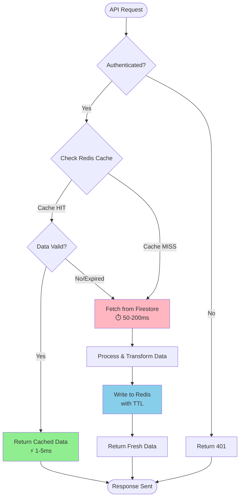
```mermaid
flowchart TD
    START([API Request]) --> AUTH{Authenticated?}
    AUTH -->|No| REJECT[Return 401]
    AUTH -->|Yes| CHECK_CACHE{Check Redis Cache}
    
    CHECK_CACHE -->|Cache HIT| VALIDATE{Data Valid?}
    VALIDATE -->|Yes| RETURN_CACHED[Return Cached Data<br/>⚡ 1-5ms]
    VALIDATE -->|No/Expired| FETCH_DB
    
    CHECK_CACHE -->|Cache MISS| FETCH_DB[Fetch from Firestore<br/>⏱️ 50-200ms]
    
    FETCH_DB --> PROCESS[Process & Transform Data]
    PROCESS --> WRITE_CACHE[Write to Redis<br/>with TTL]
    WRITE_CACHE --> RETURN_FRESH[Return Fresh Data]
    
    RETURN_CACHED --> END([Response Sent])
    RETURN_FRESH --> END
    REJECT --> END
    
    style RETURN_CACHED fill:#90EE90
    style FETCH_DB fill:#FFB6C1
    style WRITE_CACHE fill:#87CEEB
```

### Cache Invalidation Flow

```mermaid
flowchart TD
    START([Write Operation<br/>Create/Update/Delete]) --> VALIDATE{Validate Request}
    VALIDATE -->|Invalid| ERROR[Return 400 Error]
    VALIDATE -->|Valid| WRITE_DB[Write to Firestore<br/>⏱️ 100-200ms]
    
    WRITE_DB --> SUCCESS{Write Success?}
    SUCCESS -->|No| ERROR_DB[Return 500 Error<br/>Firestore failed]
    SUCCESS -->|Yes| IDENTIFY[Identify Affected Cache Keys]
    
    IDENTIFY --> INVALIDATE_TYPE{Operation Type}
    
    INVALIDATE_TYPE -->|User Update| INV_USER[Invalidate:<br/>• user_profile:UID<br/>• display_name:UID<br/>• user_groups:UID*]
    
    INVALIDATE_TYPE -->|Group Update| INV_GROUP[Invalidate:<br/>• group_full:GID<br/>• user_groups:MEMBER* (all)<br/>• expenses:group:GID*]
    
    INVALIDATE_TYPE -->|Expense Create| INV_EXPENSE[Invalidate:<br/>• group_full:GID<br/>• group_balance:GID<br/>• user_groups:MEMBER* (all)<br/>• expenses:group:GID*]
    
    INVALIDATE_TYPE -->|Settlement Create| INV_SETTLE[Invalidate:<br/>• group_balance:GID<br/>• user_groups:MEMBER* (all)<br/>• settlements:group:GID*]
    
    INVALIDATE_TYPE -->|Invitation Accept| INV_INVITE[Invalidate:<br/>• invitations:enriched:UID*<br/>• user_groups:UID<br/>• group_full:GID<br/>• user_groups:MEMBER* (all)]
    
    INV_USER --> DELETE_KEYS[Delete Keys from Redis<br/>⚡ 2-10ms]
    INV_GROUP --> DELETE_KEYS
    INV_EXPENSE --> DELETE_KEYS
    INV_SETTLE --> DELETE_KEYS
    INV_INVITE --> DELETE_KEYS
    
    DELETE_KEYS --> LOG[Log Cache Invalidation<br/>🔄 Cache cleared for X keys]
    LOG --> RETURN_SUCCESS[Return Success Response]
    
    ERROR --> END([Response Sent])
    ERROR_DB --> END
    RETURN_SUCCESS --> END
    
    style WRITE_DB fill:#FFB6C1
    style DELETE_KEYS fill:#FF6B6B
    style RETURN_SUCCESS fill:#90EE90
```

### Cache Invalidation Patterns

#### Pattern 1: Single User Cache Invalidation
```python
# When user updates their profile
def invalidate_user_cache(user_id):
    keys_to_delete = [
        f"user_profile:{user_id}",
        f"display_name:{user_id}",
        f"user_groups:{user_id}",
        f"user_groups:{user_id}_summary"
    ]
    redis_client.delete(*keys_to_delete)
```

#### Pattern 2: Group Member Cache Invalidation
```python
# When group data changes (affects all members)
def invalidate_group_caches(group_id, member_ids):
    keys_to_delete = [f"group_full:{group_id}"]
    
    # Invalidate for ALL members
    for member_id in member_ids:
        keys_to_delete.extend([
            f"user_groups:{member_id}",
            f"user_groups:{member_id}_summary"
        ])
    
    redis_client.delete(*keys_to_delete)
```

#### Pattern 3: Wildcard Pattern Invalidation
```python
# When invitation accepted (removes all pagination variants)
def invalidate_invitation_cache(user_id):
    # Pattern: invitations:enriched:USER123:limit_20:offset_*
    pattern = f"invitations:enriched:{user_id}*"
    
    # Get all matching keys
    keys = redis_client.keys(pattern)
    
    # Delete all at once
    if keys:
        redis_client.delete(*keys)
```

### Cache Performance Metrics

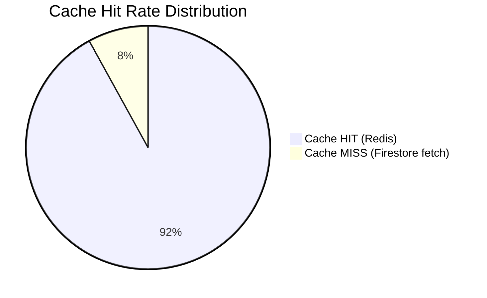
```mermaid
pie title Cache Hit Rate Distribution
    "Cache HIT (Redis)" : 92
    "Cache MISS (Firestore fetch)" : 8
```

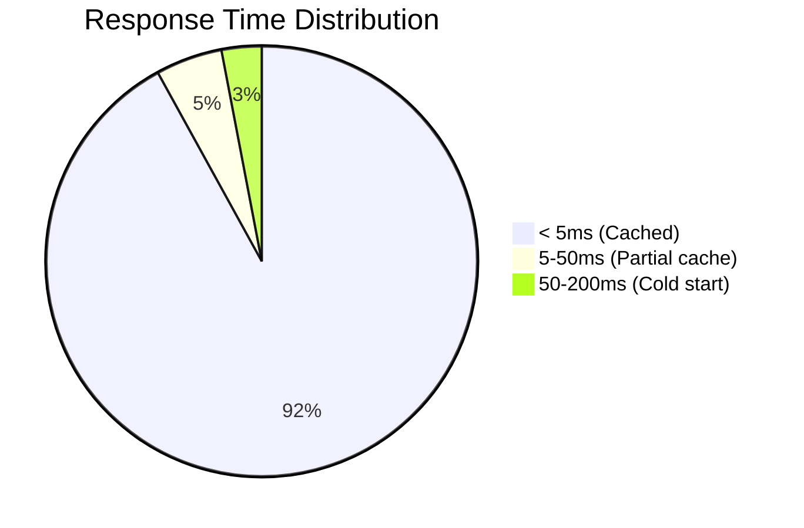
```mermaid
pie title Response Time Distribution
    "< 5ms (Cached)" : 92
    "5-50ms (Partial cache)" : 5
    "50-200ms (Cold start)" : 3
```

### Cache Memory Usage Projection

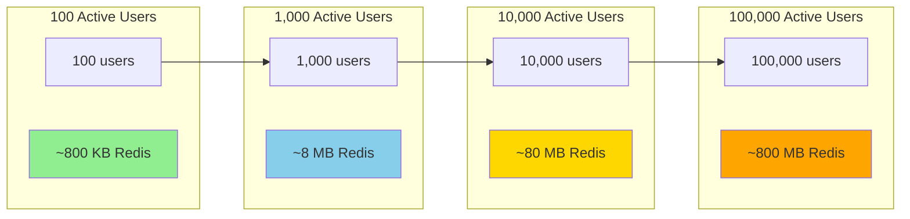
```mermaid
graph LR
    subgraph "100 Active Users"
        U100[100 users]
        U100_MEM[~800 KB Redis]
    end
    
    subgraph "1,000 Active Users"
        U1000[1,000 users]
        U1000_MEM[~8 MB Redis]
    end
    
    subgraph "10,000 Active Users"
        U10000[10,000 users]
        U10000_MEM[~80 MB Redis]
    end
    
    subgraph "100,000 Active Users"
        U100000[100,000 users]
        U100000_MEM[~800 MB Redis]
    end
    
    U100 --> U1000
    U1000 --> U10000
    U10000 --> U100000
    
    style U100_MEM fill:#90EE90
    style U1000_MEM fill:#87CEEB
    style U10000_MEM fill:#FFD700
    style U100000_MEM fill:#FFA500
```

**Memory Calculation:**
- Average cache entry: ~8 KB (JSON-serialized)
- Per user: ~8-10 cache keys
- **100 users:** 800 KB
- **1,000 users:** 8 MB ✅ Free tier
- **10,000 users:** 80 MB ✅ Basic plan ($10/mo)
- **100,000 users:** 800 MB ✅ Standard plan ($50/mo)

---

## 5️⃣ Database Schema

### Firestore Collections Structure

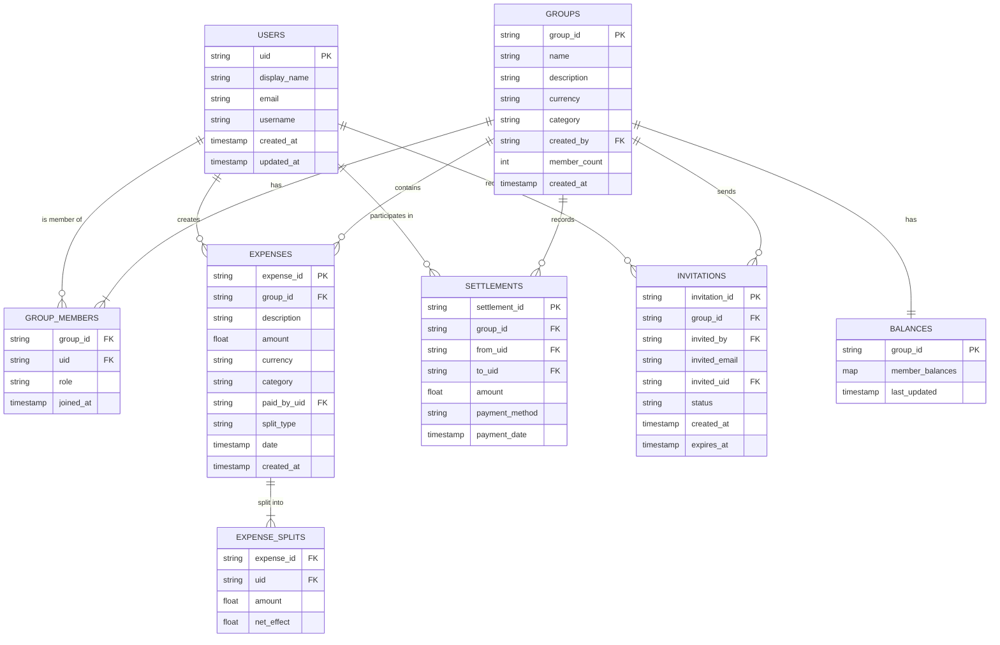
```mermaid
erDiagram
    USERS ||--o{ GROUP_MEMBERS : "is member of"
    USERS ||--o{ EXPENSES : "creates"
    USERS ||--o{ SETTLEMENTS : "participates in"
    USERS ||--o{ INVITATIONS : "receives"
    
    GROUPS ||--|{ GROUP_MEMBERS : "has"
    GROUPS ||--o{ EXPENSES : "contains"
    GROUPS ||--o{ SETTLEMENTS : "records"
    GROUPS ||--o{ INVITATIONS : "sends"
    GROUPS ||--|| BALANCES : "has"
    
    EXPENSES ||--|{ EXPENSE_SPLITS : "split into"
    
    USERS {
        string uid PK
        string display_name
        string email
        string username
        timestamp created_at
        timestamp updated_at
    }
    
    GROUPS {
        string group_id PK
        string name
        string description
        string currency
        string category
        string created_by FK
        int member_count
        timestamp created_at
    }
    
    GROUP_MEMBERS {
        string group_id FK
        string uid FK
        string role
        timestamp joined_at
    }
    
    EXPENSES {
        string expense_id PK
        string group_id FK
        string description
        float amount
        string currency
        string category
        string paid_by_uid FK
        string split_type
        timestamp date
        timestamp created_at
    }
    
    EXPENSE_SPLITS {
        string expense_id FK
        string uid FK
        float amount
        float net_effect
    }
    
    BALANCES {
        string group_id PK
        map member_balances
        timestamp last_updated
    }
    
    SETTLEMENTS {
        string settlement_id PK
        string group_id FK
        string from_uid FK
        string to_uid FK
        float amount
        string payment_method
        timestamp payment_date
    }
    
    INVITATIONS {
        string invitation_id PK
        string group_id FK
        string invited_by FK
        string invited_email
        string invited_uid FK
        string status
        timestamp created_at
        timestamp expires_at
    }
```

### Balance Document Structure (Incremental Updates)

```json
{
  "group_id": "group-abc123",
  "member_balances": {
    "user-123": {
      "balance": 85.50,
      "total_paid": 850.00,
      "total_share": 764.50,
      "last_updated": "2025-01-15T20:00:00Z"
    },
    "user-456": {
      "balance": -45.50,
      "total_paid": 200.00,
      "total_share": 245.50,
      "last_updated": "2025-01-15T20:00:00Z"
    }
  },
  "last_modified": "2025-01-15T20:00:00Z",
  "version": 42
}
```

**Incremental Update Example:**
```python
# When new $120 expense is added (John paid, split 3 ways @ $40 each)
# OLD balances: John +$50, Jane -$20, Bob -$30
# NEW balances: John +$130 (+$80), Jane -$60 (-$40), Bob -$70 (-$40)

# Instead of recalculating from ALL expenses:
balance_doc["member_balances"]["john"]["balance"] += 80.0  # Paid $120, owes $40
balance_doc["member_balances"]["jane"]["balance"] -= 40.0  # Owes $40
balance_doc["member_balances"]["bob"]["balance"] -= 40.0   # Owes $40

# Update totals
balance_doc["member_balances"]["john"]["total_paid"] += 120.0
balance_doc["member_balances"]["john"]["total_share"] += 40.0
balance_doc["member_balances"]["jane"]["total_share"] += 40.0
balance_doc["member_balances"]["bob"]["total_share"] += 40.0

# Save (1 write instead of reading all expenses)
firestore.collection("balances").document(group_id).update(balance_doc)
```

---

## 6️⃣ Security Architecture

### Authentication & Authorization Flow

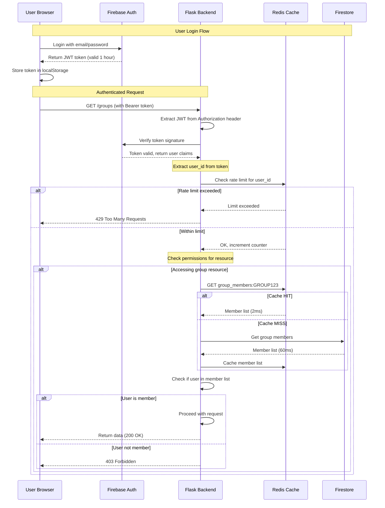
```mermaid
sequenceDiagram
    participant U as User Browser
    participant FB_AUTH as Firebase Auth
    participant API as Flask Backend
    participant REDIS as Redis Cache
    participant FS as Firestore
    
    Note over U,FS: User Login Flow
    
    U->>FB_AUTH: Login with email/password
    FB_AUTH-->>U: Return JWT token (valid 1 hour)
    U->>U: Store token in localStorage
    
    Note over U,API: Authenticated Request
    
    U->>API: GET /groups (with Bearer token)
    API->>API: Extract JWT from Authorization header
    
    API->>FB_AUTH: Verify token signature
    FB_AUTH-->>API: Token valid, return user claims
    
    Note over API: Extract user_id from token
    
    API->>REDIS: Check rate limit for user_id
    alt Rate limit exceeded
        REDIS-->>API: Limit exceeded
        API-->>U: 429 Too Many Requests
    else Within limit
        REDIS-->>API: OK, increment counter
        
        Note over API: Check permissions for resource
        
        alt Accessing group resource
            API->>REDIS: GET group_members:GROUP123
            alt Cache HIT
                REDIS-->>API: Member list (2ms)
            else Cache MISS
                API->>FS: Get group members
                FS-->>API: Member list (60ms)
                API->>REDIS: Cache member list
            end
            
            API->>API: Check if user in member list
            
            alt User is member
                API->>API: Proceed with request
                API-->>U: Return data (200 OK)
            else User not member
                API-->>U: 403 Forbidden
            end
        end
    end
```

### Role-Based Access Control (RBAC)

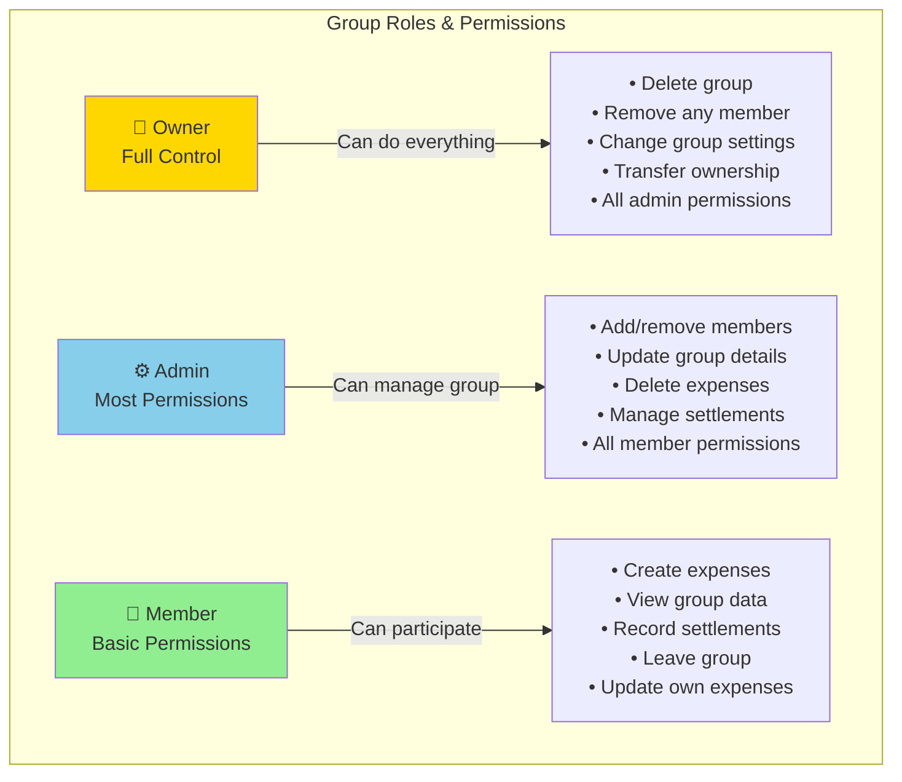
```mermaid
graph TB
    subgraph "Group Roles & Permissions"
        OWNER[👑 Owner<br/>Full Control]
        ADMIN[⚙️ Admin<br/>Most Permissions]
        MEMBER[👤 Member<br/>Basic Permissions]
        
        OWNER --> |Can do everything| OWNER_PERMS[• Delete group<br/>• Remove any member<br/>• Change group settings<br/>• Transfer ownership<br/>• All admin permissions]
        
        ADMIN --> |Can manage group| ADMIN_PERMS[• Add/remove members<br/>• Update group details<br/>• Delete expenses<br/>• Manage settlements<br/>• All member permissions]
        
        MEMBER --> |Can participate| MEMBER_PERMS[• Create expenses<br/>• View group data<br/>• Record settlements<br/>• Leave group<br/>• Update own expenses]
    end
    
    style OWNER fill:#FFD700
    style ADMIN fill:#87CEEB
    style MEMBER fill:#90EE90
```

### Rate Limiting Implementation

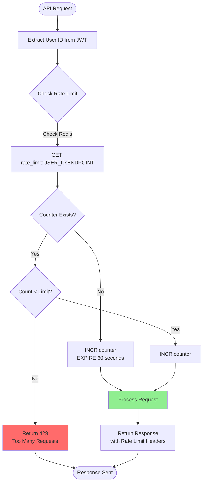
```mermaid
flowchart TD
    START([API Request]) --> EXTRACT[Extract User ID from JWT]
    EXTRACT --> CHECK_LIMIT{Check Rate Limit}
    
    CHECK_LIMIT -->|Check Redis| REDIS_GET[GET rate_limit:USER_ID:ENDPOINT]
    
    REDIS_GET --> COUNT_FOUND{Counter Exists?}
    
    COUNT_FOUND -->|Yes| CHECK_VALUE{Count < Limit?}
    COUNT_FOUND -->|No| INIT[INCR counter<br/>EXPIRE 60 seconds]
    
    CHECK_VALUE -->|Yes| INCR[INCR counter]
    CHECK_VALUE -->|No| REJECT[Return 429<br/>Too Many Requests]
    
    INIT --> ALLOW[Process Request]
    INCR --> ALLOW
    
    ALLOW --> RESPONSE[Return Response<br/>with Rate Limit Headers]
    
    REJECT --> END([Response Sent])
    RESPONSE --> END
    
    style REJECT fill:#FF6B6B
    style ALLOW fill:#90EE90
```

**Rate Limit Headers:**
```http
X-RateLimit-Limit: 100
X-RateLimit-Remaining: 85
X-RateLimit-Reset: 1642272300
Retry-After: 60
```

---

## 7️⃣ Scalability Design

### Horizontal Scaling Architecture

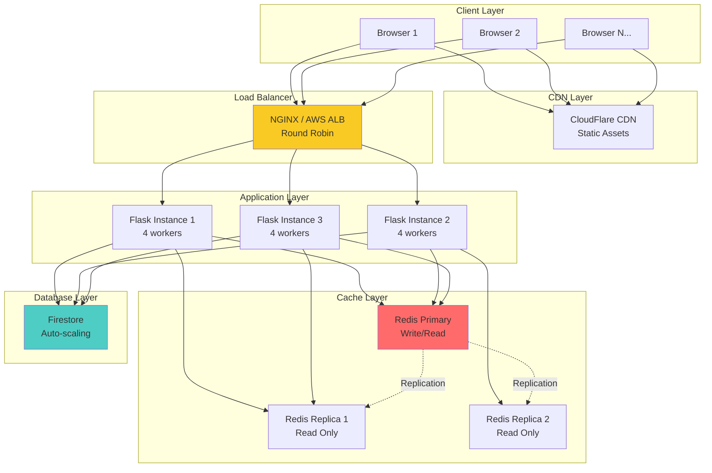
```mermaid
graph TB
    subgraph "Client Layer"
        BROWSER1[Browser 1]
        BROWSER2[Browser 2]
        BROWSER3[Browser N...]
    end
    
    subgraph "CDN Layer"
        CDN[CloudFlare CDN<br/>Static Assets]
    end
    
    subgraph "Load Balancer"
        LB[NGINX / AWS ALB<br/>Round Robin]
    end
    
    subgraph "Application Layer"
        APP1[Flask Instance 1<br/>4 workers]
        APP2[Flask Instance 2<br/>4 workers]
        APP3[Flask Instance 3<br/>4 workers]
    end
    
    subgraph "Cache Layer"
        REDIS_PRIMARY[Redis Primary<br/>Write/Read]
        REDIS_REPLICA1[Redis Replica 1<br/>Read Only]
        REDIS_REPLICA2[Redis Replica 2<br/>Read Only]
    end
    
    subgraph "Database Layer"
        FIRESTORE[Firestore<br/>Auto-scaling]
    end
    
    BROWSER1 --> CDN
    BROWSER2 --> CDN
    BROWSER3 --> CDN
    
    BROWSER1 --> LB
    BROWSER2 --> LB
    BROWSER3 --> LB
    
    LB --> APP1
    LB --> APP2
    LB --> APP3
    
    APP1 --> REDIS_PRIMARY
    APP1 --> REDIS_REPLICA1
    APP2 --> REDIS_PRIMARY
    APP2 --> REDIS_REPLICA2
    APP3 --> REDIS_PRIMARY
    APP3 --> REDIS_REPLICA1
    
    APP1 --> FIRESTORE
    APP2 --> FIRESTORE
    APP3 --> FIRESTORE
    
    REDIS_PRIMARY -.->|Replication| REDIS_REPLICA1
    REDIS_PRIMARY -.->|Replication| REDIS_REPLICA2
    
    style REDIS_PRIMARY fill:#FF6B6B
    style FIRESTORE fill:#4ecdc4
    style LB fill:#f9ca24
```

### Scaling Metrics & Thresholds

| Metric | Current | Threshold | Action |
|--------|---------|-----------|--------|
| **Concurrent Users** | 100 | 500 | Add Flask instance |
| **Redis Memory** | 8 MB | 80% capacity | Upgrade Redis tier |
| **API Latency (p95)** | 80ms | 200ms | Add cache warming |
| **Firestore Reads/sec** | 50 | 10,000 | Increase cache TTL |
| **CPU Usage** | 30% | 70% | Add worker processes |
| **Request Rate** | 1000/min | 5000/min | Add Flask instance |

### Cost Optimization at Scale

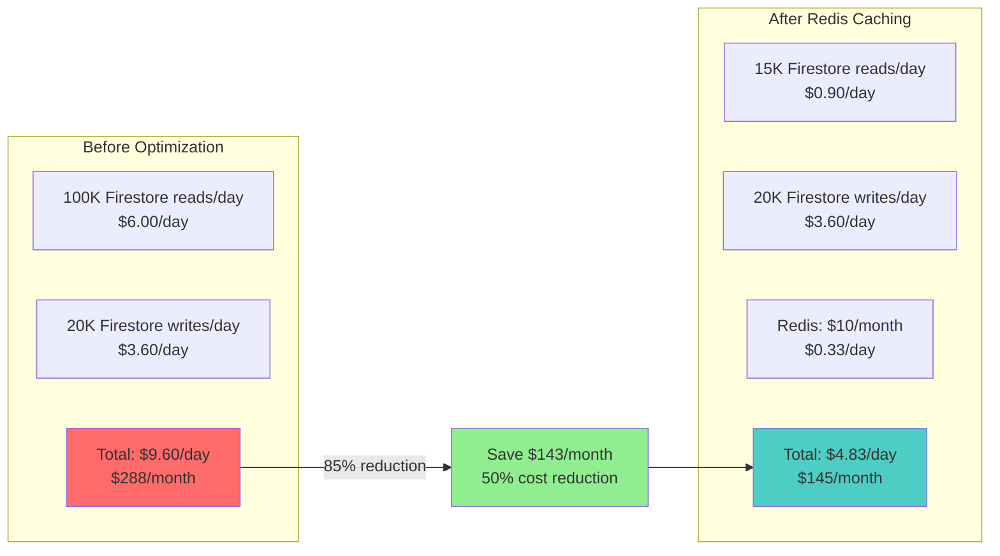
```mermaid
graph LR
    subgraph "Before Optimization"
        BEFORE_READS[100K Firestore reads/day<br/>$6.00/day]
        BEFORE_WRITES[20K Firestore writes/day<br/>$3.60/day]
        BEFORE_TOTAL[Total: $9.60/day<br/>$288/month]
    end
    
    subgraph "After Redis Caching"
        AFTER_READS[15K Firestore reads/day<br/>$0.90/day]
        AFTER_WRITES[20K Firestore writes/day<br/>$3.60/day]
        REDIS_COST[Redis: $10/month<br/>$0.33/day]
        AFTER_TOTAL[Total: $4.83/day<br/>$145/month]
    end
    
    BEFORE_TOTAL -->|85% reduction| SAVINGS[Save $143/month<br/>50% cost reduction]
    SAVINGS --> AFTER_TOTAL
    
    style SAVINGS fill:#90EE90
    style BEFORE_TOTAL fill:#FF6B6B
    style AFTER_TOTAL fill:#4ecdc4
```

---

**End of Architecture Documentation**

**Next Steps:**
1. Review Setup Guide for deployment instructions
2. Check Admin Guide for monitoring and maintenance
3. See Performance Analysis for optimization strategies
