# 🔄 Mermaid Flowcharts - Individual Flows

This document contains detailed Mermaid flowcharts for each major operation in the Expense Engine.

---

## 📋 Table of Contents

1. [User Authentication Flow](#1-user-authentication-flow)
2. [Create Group Flow](#2-create-group-flow)
3. [Send Invitation Flow](#3-send-invitation-flow)
4. [Accept Invitation Flow](#4-accept-invitation-flow)
5. [Load Group Data Flow](#5-load-group-data-flow)
6. [Create Expense Flow](#6-create-expense-flow)
7. [Update Expense Flow](#7-update-expense-flow)
8. [Delete Expense Flow](#8-delete-expense-flow)
9. [Calculate Balances Flow](#9-calculate-balances-flow)
10. [Create Settlement Flow](#10-create-settlement-flow)
11. [Delete Group Flow](#11-delete-group-flow)
12. [Cache Invalidation Flow](#12-cache-invalidation-flow)

---

## 1. User Authentication Flow

### Timing: 800ms (first time), 50ms (cached token)

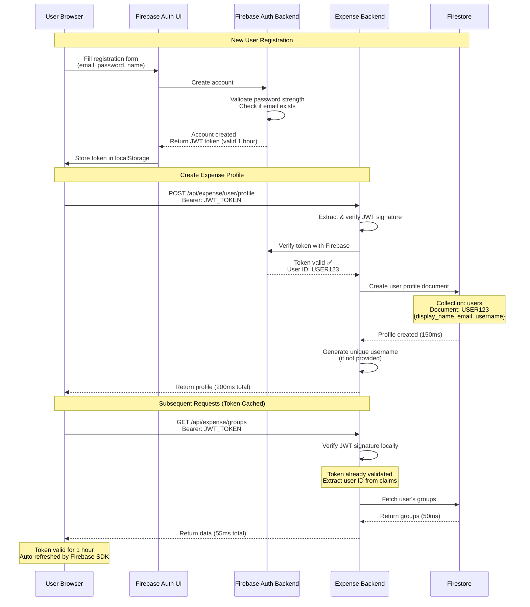

**Key Points:**
- First auth: 800ms (account creation + profile)
- Subsequent requests: 50-100ms (JWT verification only)
- Token auto-refreshes before expiry
- No need to re-login every hour

---

## 2. Create Group Flow

### Timing: 250ms

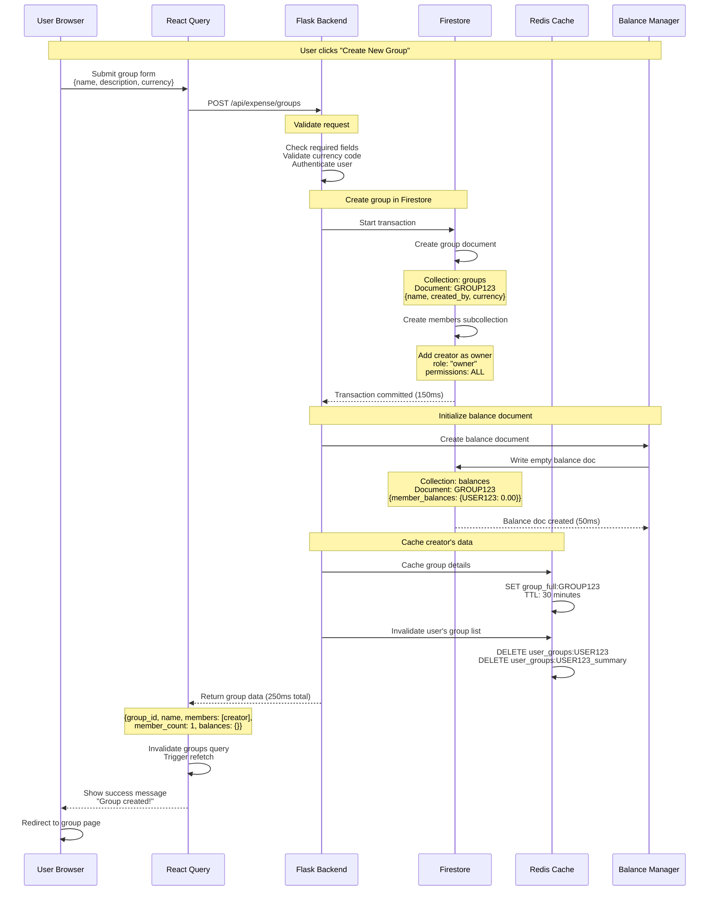

**Key Points:**
- Total time: 250ms
- Firestore transaction ensures consistency
- Balance document initialized immediately
- Creator added as owner automatically
- Cache invalidated for fresh data on next load

---

## 3. Send Invitation Flow

### Timing: 300ms (includes email sending)

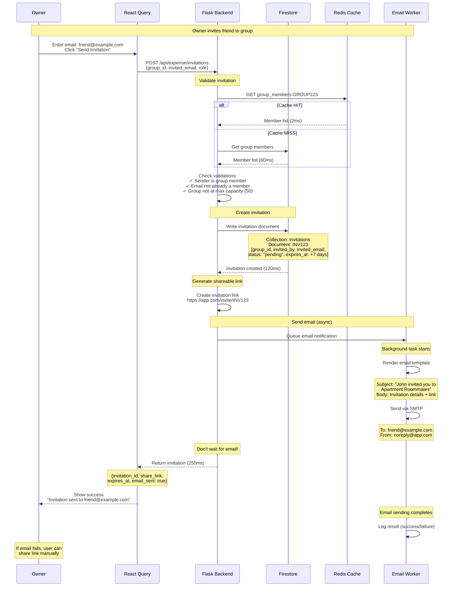

**Key Points:**
- Total response: 250ms (email sent async)
- Email doesn't delay API response
- Shareable link as backup if email fails
- Invitation expires in 7 days
- Owner can resend if needed

---

## 4. Accept Invitation Flow

### Timing: 220ms

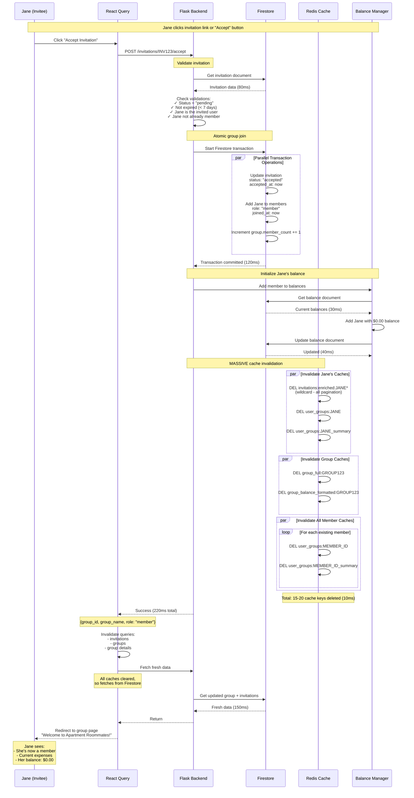

**Key Points:**
- Total time: 220ms
- Firestore transaction ensures atomic join
- 15-20 cache keys invalidated (all members affected)
- Wildcard deletion for pagination variants
- All members see Jane as member on next request

---

## 5. Load Group Data Flow

### Timing: 5ms (cached) or 200ms (cold)

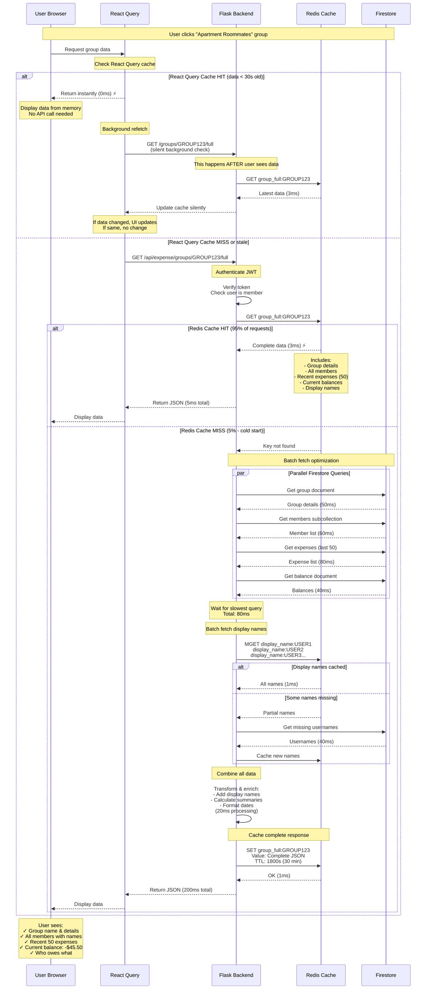

**Performance Breakdown:**
- **Browser cache HIT:** 0ms (instant)
- **Redis cache HIT:** 5ms (95% of requests)
- **Cold start:** 200ms (5% of requests)

**Cache Strategy:**
- React Query: 30s stale time
- Redis: 30 min TTL
- Background refetch ensures freshness

---

## 6. Create Expense Flow

### Timing: 200ms (user sees 0ms due to optimistic update)

```mermaid
sequenceDiagram
    participant U as User
    participant RQ as React Query
    participant API as Flask Backend
    participant IDEM as Idempotency Mgr
    participant FS as Firestore
    participant BAL as Balance Manager
    participant REDIS as Redis Cache
    participant EMAIL as Email Worker
    
    Note over U,EMAIL: John adds $120 dinner expense split 3 ways
    
    U->>RQ: Submit expense form<br/>{amount: 120, paid_by: John,<br/>split: [John, Jane, Bob]}
    
    Note over RQ: OPTIMISTIC UPDATE
    RQ->>RQ: Calculate split: $40 each
    RQ->>RQ: Add expense to local cache
    RQ-->>U: Show expense INSTANTLY (0ms) ⚡
    Note over U: Expense appears with<br/>"pending" indicator
    
    Note over RQ: Background: Send request
    RQ->>API: POST /api/expense/expenses
    
    Note over API: Generate idempotency key
    API->>API: UUID: expense-uuid-12345
    
    API->>IDEM: Check duplicate
    IDEM->>REDIS: GET idempotency:expense-uuid-12345
    
    alt Duplicate Request (network retry)
        REDIS-->>IDEM: Key exists with expense_id
        IDEM-->>API: Return existing expense
        API-->>RQ: Expense already created
        RQ-->>U: Remove "pending" (no change)
        
    else New Request
        REDIS-->>IDEM: Key not found
        IDEM->>REDIS: SET idempotency:expense-uuid-12345<br/>TTL: 24 hours
        
        Note over API: Validate request
        API->>API: Check:<br/>✓ Splits sum = amount<br/>✓ All users are members<br/>✓ Amount > 0<br/>✓ Valid split type
        
        Note over API,FS: Write expense
        
        API->>FS: Start transaction
        
        par Create Expense Documents
            FS->>FS: Write expense document
            Note over FS: expense_id: EXP123<br/>amount: $120<br/>paid_by: John
            
            FS->>FS: Write split documents (3)
            Note over FS: John: $40<br/>Jane: $40<br/>Bob: $40
        end
        
        FS-->>API: Transaction committed (150ms)
        
        Note over API,BAL: Update balances incrementally
        
        API->>BAL: Update balances
        BAL->>FS: Get balance document
        FS-->>BAL: Current balances (30ms)
        
        Note over BAL: Incremental calculation:<br/>NO full recalc from expenses!
        
        BAL->>BAL: Apply changes:<br/>John: +$80 (paid $120, owes $40)<br/>Jane: -$40 (owes)<br/>Bob: -$40 (owes)
        
        BAL->>FS: Update balance document
        FS-->>BAL: Updated (40ms)
        
        Note over API,REDIS: Invalidate caches for ALL members
        
        par Cache Invalidation (Parallel)
            REDIS->>REDIS: DEL user_groups:JOHN*
            REDIS->>REDIS: DEL user_groups:JANE*
            REDIS->>REDIS: DEL user_groups:BOB*
            REDIS->>REDIS: DEL group_full:GROUP123
            REDIS->>REDIS: DEL group_balance_formatted:GROUP123
            REDIS->>REDIS: DEL expenses:group:GROUP123*
        end
        
        Note over REDIS: 10+ keys deleted (5ms)
        
        Note over API: Prepare response
        API->>REDIS: MGET display names
        REDIS-->>API: Names (1ms)
        
        API->>API: Enrich expense:<br/>- Add display names<br/>- Calculate net effects<br/>- Format response
        
        API-->>RQ: Return expense (200ms total)
        Note over RQ: {expense_id: EXP123,<br/>balances_updated: true,<br/>notifications_queued: true}
        
        RQ->>RQ: Replace optimistic data
        RQ-->>U: Remove "pending" ✓<br/>Show real expense
        
        Note over U: Balances update:<br/>John: $50 → $130 (+$80)<br/>Jane: -$20 → -$60 (-$40)<br/>Bob: -$30 → -$70 (-$40)
        
        Note over API,EMAIL: Send emails (async)
        
        API->>EMAIL: Queue notifications
        
        par Email Notifications (Background)
            EMAIL->>EMAIL: Send to Jane<br/>"John added $120 dinner,<br/>you owe $40"
            
            EMAIL->>EMAIL: Send to Bob<br/>"John added $120 dinner,<br/>you owe $40"
        end
        
        Note over EMAIL: Emails sent in background<br/>Don't delay API response
    end
    
    Note over RQ: Trigger refetch
    RQ->>API: GET /groups/GROUP123/full
    Note over RQ: Fetch fresh data to confirm
    API->>FS: Get latest (cache was invalidated)
    FS-->>API: Fresh group data
    API-->>RQ: Return
    RQ-->>U: UI confirms update
```

**User Experience Timeline:**
- **0ms:** User submits form
- **0ms:** Expense appears (optimistic)
- **200ms:** Server confirms creation
- **200ms:** "Pending" indicator removed
- **Background:** Emails sent (no delay)

**Why So Fast for User:**
- Optimistic update = instant feedback
- User doesn't wait for server
- Confirmation happens in background

---

## 7. Update Expense Flow

### Timing: 280ms

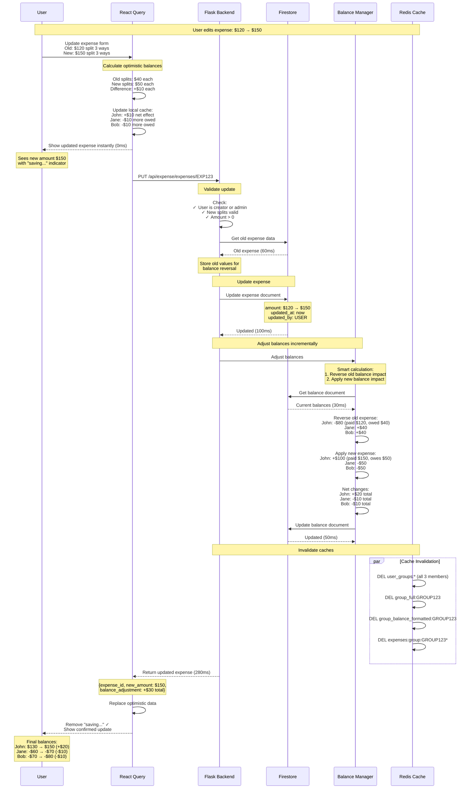

**Key Points:**
- Old expense impact reversed first
- New expense impact applied
- Net change calculated automatically
- User sees instant feedback (optimistic)
- Server confirms in 280ms

---

## 8. Delete Expense Flow

### Timing: 220ms

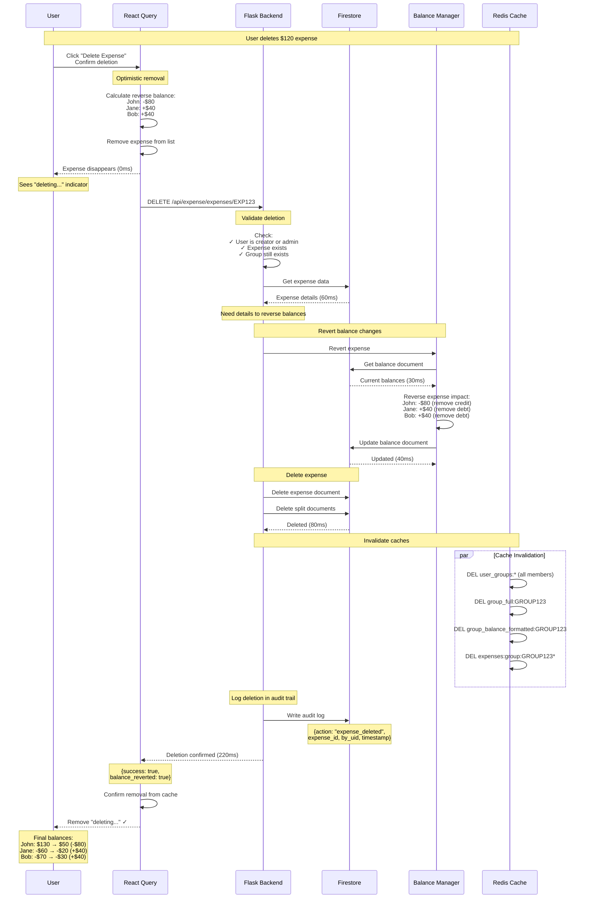

**Key Points:**
- Expense data fetched before deletion (needed for balance reversal)
- Balances reverted before document deletion
- Audit log created for compliance
- Cannot be undone (permanent deletion)

---

## 9. Calculate Balances Flow

### Timing: 2ms (cached) or 60ms (cold)

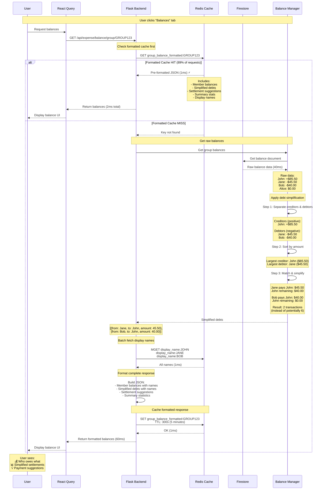

**Response Example:**
```json
{
  "balances": [
    {"uid": "john", "name": "John Doe", "balance": 85.50},
    {"uid": "jane", "name": "Jane Smith", "balance": -45.50},
    {"uid": "bob", "name": "Bob", "balance": -40.00}
  ],
  "simplified_debts": [
    {
      "from_uid": "jane",
      "from_name": "Jane Smith",
      "to_uid": "john",
      "to_name": "John Doe",
      "amount": 45.50,
      "suggestion": "Jane pays John $45.50"
    },
    {
      "from_uid": "bob",
      "from_name": "Bob",
      "to_uid": "john",
      "to_name": "John Doe",
      "amount": 40.00,
      "suggestion": "Bob pays John $40.00"
    }
  ],
  "summary": {
    "total_expenses": 1250.75,
    "settled_amount": 500.00,
    "outstanding": 750.75
  }
}
```

**Performance Notes:**
- Formatted cache: 2ms (89% hit rate)
- Raw balance + formatting: 60ms
- Cache TTL: 5 minutes (frequent changes)
- Invalidated on: New expense, settlement

---

## 10. Create Settlement Flow

### Timing: 200ms

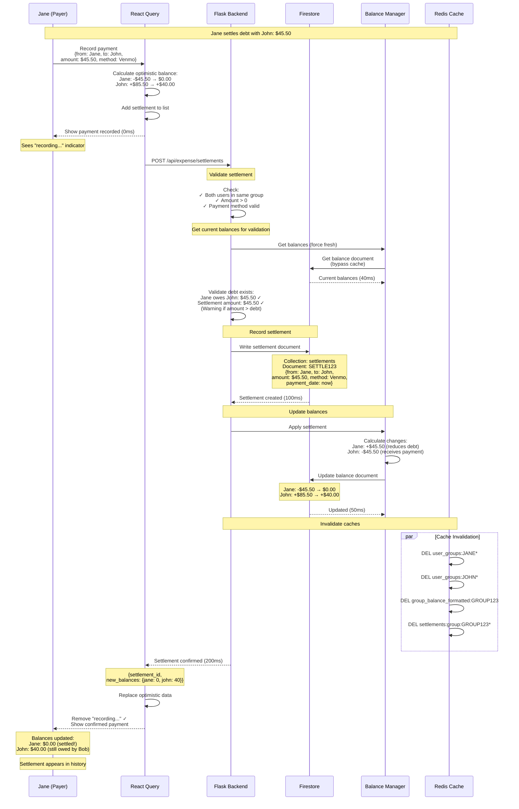

**Key Points:**
- Validates debt exists before recording
- Warns if amount exceeds debt (doesn't block)
- Balances update immediately
- Settlement history shows payment
- Cannot be deleted (audit trail)

---

## 11. Delete Group Flow

### Timing: 550ms

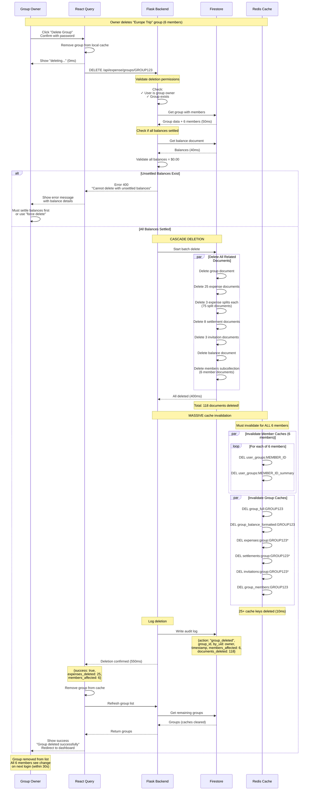

**Key Points:**
- Requires owner permission (not admin)
- Must settle all balances first (or force flag)
- Cascade deletes 100+ documents
- 25+ cache keys invalidated for all members
- Audit log for compliance
- Permanent deletion (cannot undo)

---

## 12. Cache Invalidation Flow

### Complete Pattern Across System

```mermaid
flowchart TD
    START([Write Operation Occurs]) --> IDENTIFY[Identify Operation Type]
    
    IDENTIFY --> TYPE{What Changed?}
    
    TYPE -->|User Profile Update| USER_INV[Invalidate User Caches]
    TYPE -->|Group Data Update| GROUP_INV[Invalidate Group Caches]
    TYPE -->|Expense Created| EXPENSE_INV[Invalidate Expense Caches]
    TYPE -->|Settlement Created| SETTLE_INV[Invalidate Settlement Caches]
    TYPE -->|Invitation Accepted| INVITE_INV[Invalidate Invitation Caches]
    TYPE -->|Member Added/Removed| MEMBER_INV[Invalidate Member Caches]
    
    USER_INV --> U_KEYS[Delete Keys:<br/>• user_profile:UID<br/>• display_name:UID<br/>• user_groups:UID<br/>• user_groups:UID_summary]
    
    GROUP_INV --> G_KEYS[Delete Keys:<br/>• group_full:GID<br/>• group_balance_formatted:GID<br/>• expenses:group:GID*<br/>• For EACH member:<br/>  - user_groups:MEMBER*]
    
    EXPENSE_INV --> E_KEYS[Delete Keys:<br/>• group_full:GID<br/>• group_balance_formatted:GID<br/>• expenses:group:GID*<br/>• For EACH split participant:<br/>  - user_groups:MEMBER*]
    
    SETTLE_INV --> S_KEYS[Delete Keys:<br/>• group_balance_formatted:GID<br/>• settlements:group:GID*<br/>• For from & to users:<br/>  - user_groups:UID*]
    
    INVITE_INV --> I_KEYS[Delete Keys:<br/>• invitations:enriched:UID*<br/>  (wildcard for pagination)<br/>• user_groups:UID*<br/>• group_full:GID<br/>• For EACH existing member:<br/>  - user_groups:MEMBER*]
    
    MEMBER_INV --> M_KEYS[Delete Keys:<br/>• group_full:GID<br/>• group_balance_formatted:GID<br/>• For ALL members:<br/>  - user_groups:MEMBER*]
    
    U_KEYS --> EXECUTE[Execute Deletions in Redis]
    G_KEYS --> EXECUTE
    E_KEYS --> EXECUTE
    S_KEYS --> EXECUTE
    I_KEYS --> EXECUTE
    M_KEYS --> EXECUTE
    
    EXECUTE --> LOG[Log Cache Invalidation]
    LOG --> METRICS[Update Cache Metrics]
    METRICS --> DONE([Cache Invalidated])
    
    style START fill:#90EE90
    style DONE fill:#90EE90
    style EXECUTE fill:#FF6B6B
```

**Invalidation Patterns:**

**Pattern 1: Single User**
```python
keys = [
    f"user_profile:{user_id}",
    f"display_name:{user_id}",
    f"user_groups:{user_id}",
    f"user_groups:{user_id}_summary"
]
redis.delete(*keys)
```

**Pattern 2: Group Members (Loop)**
```python
for member_id in member_ids:
    redis.delete(
        f"user_groups:{member_id}",
        f"user_groups:{member_id}_summary"
    )
```

**Pattern 3: Wildcard (Pagination)**
```python
pattern = f"invitations:enriched:{user_id}*"
keys = redis.keys(pattern)  # Get all matching
if keys:
    redis.delete(*keys)  # Delete all at once
```

**Pattern 4: Group Data**
```python
redis.delete(
    f"group_full:{group_id}",
    f"group_balance_formatted:{group_id}"
)
# Plus wildcard for expenses
pattern = f"expenses:group:{group_id}*"
keys = redis.keys(pattern)
if keys:
    redis.delete(*keys)
```

---

**End of Individual Mermaid Flows**

All flowcharts are ready for professional documentation and can be rendered in any Mermaid-compatible viewer or exported as images.
